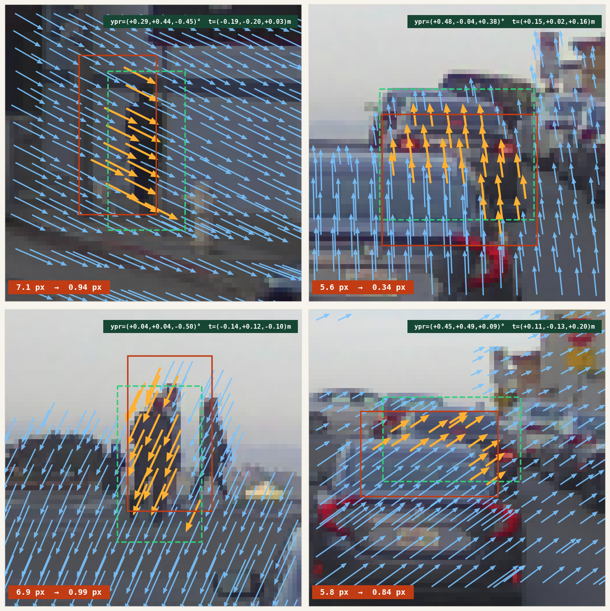

# LiDAR-to-Camera Calibration with Cross-Attention

<p align="center">
  
</p>

## Overview

A **1.62M-parameter cross-attention network** that corrects LiDAR-to-camera projection errors to **0.91 px** (sub-pixel accuracy, well below 4 px LiDAR beam spacing) on held-out objects. The model works as a **local evidence detector**—it outputs per-point 2D Gaussians that feed into standard bundle adjustment for global rig optimization.

### Key Results

**PandaSet (ps_v9_objsplit):**
- **0.91 px mean object error** on 500 held-out validation samples
- 1.62M parameters, 200 epochs, 87 minutes on 1× GPU
- Trained on 33,458 object crops from 103 scenes

**Cross-Dataset Joint Training (NuScenes + PandaSet + Waymo):**

| Dataset   | obj MSE | bg MSE |
|-----------|---------|--------|
| PandaSet  | 1.25 px | 3.16 px |
| Waymo     | 1.93 px | 4.35 px |
| NuScenes  | 2.32 px | 5.23 px |

→ One network handles three completely different sensor configurations.

## Architecture

```
Image (RGB 128×128)
    │
    └─ ConvNeXt-mini ──→ coarse_feat (16×16)
                     └─→ fine_feat (32×32)

LiDAR Points (N×3: U, V, Depth)
    │
    └─ PointMLP + Frustum Encoding ──→ query (N×D)
                                          │
                            ┌─────────────┴──────────────┐
                            │  CrossAttentionBlock (L1)  │
                            │  • Cross-Attn (pt→image)   │
                            │  • Self-Attn (pt→pt)       │
                            │  • OffsetHead → (Δu, Δv)   │
                            └─────────────┬──────────────┘
                                    warp UV
                            ┌─────────────┴──────────────┐
                            │  CrossAttentionBlock (L2)  │
                            └─────────────┬──────────────┘
                                          │
                                    ┌─────┴──────┐
                                    │  L3, L4... │
                                    └─────┬──────┘
                                          │
                            (tx, ty, log_σx, log_σy, ρ)
```

**Key design decisions:**
- **Frustum encoding**: Encodes local 3D geometric context (removal causes +0.81 NLL penalty)
- **Cross-attention first**: Points query image features based on their (U,V,D) position
- **Self-attention**: Enables independent correction for multiple objects (mean pooling fails)
- **Coarse-to-fine**: 4-layer decoder progressively refines predictions
- **Full 2D Gaussian output**: Mean (tx, ty) + covariance (σx, σy, ρ) for uncertainty

## Quick Start

### Setup

```bash
# Clone repository
git clone git@github-enterprise:tmc-autonomy/e2e_calib.git
cd e2e_calib

# Install dependencies
pip install torch torchvision numpy matplotlib flask
```

### Demo Server

```bash
python app.py
# → http://localhost:5001
```

Interactive WebUI with seed navigation, mode switching, and auto-play.

### Training

**Synthetic data (fast prototyping):**
```bash
# Single object
python train.py

# Multi-object
python train.py
```

**Real data (PandaSet, NuScenes, Waymo):**
```bash
# PandaSet
python train_pandaset.py

# NuScenes
python train_nuscenes.py

# Waymo
python train_waymo.py

# Latest PandaSet experiment (ps_v9)
python train_ps_v9.py
```

### Data Preparation

1. **Download datasets:**
   - [PandaSet](https://pandaset.org/)
   - [NuScenes](https://www.nuscenes.org/)
   - [Waymo Open Dataset](https://waymo.com/open/)

2. **Build cache (speeds up training 10×):**
```bash
# PandaSet
python scripts/data_preparation/build_ps_full.py

# NuScenes
python scripts/data_preparation/build_ns_full.py

# Waymo
python scripts/data_preparation/build_waymo_full.py
```

Cache files are saved to `.cache/` directory.

3. **Synthetic data cache (optional):**
```bash
python sim3d.py  # Generates synthetic training data on-the-fly
```

## Repository Structure

```
├── app.py                    # Flask demo server
├── config_grid_depth.py      # Experiment configuration
├── dataset.py                # Synthetic data generator
├── dataset_pandaset.py       # PandaSet loader
├── dataset_nuscenes.py       # NuScenes loader
├── dataset_waymo.py          # Waymo loader
├── model.py                  # CalibNet (main model)
├── model_depth.py            # CalibNetDepth (with frustum encoding)
├── sim3d.py                  # 3D geometry utilities + synthetic data
├── train.py                  # Training script (synthetic single object)
├── train_multi.py            # Training script (synthetic multi-object)
├── train_grid_depth.py       # Main training script (configurable)
├── train_pandaset.py         # PandaSet training
├── train_nuscenes.py         # NuScenes training
├── train_waymo.py            # Waymo training
├── train_ps_v9.py            # Latest PandaSet experiment
├── vis.py                    # Visualization utilities
├── docs/                     # GitHub Pages report
├── experiments/              # Experiment results (logs, checkpoints, configs)
├── scripts/
│   ├── data_preparation/     # Dataset building scripts
│   ├── training/             # Old training scripts (archived)
│   ├── visualization/        # Visualization scripts
│   └── evaluation/           # Evaluation scripts
├── models/archived/          # Old model checkpoints
└── static/                   # WebUI assets + technical reports
```

## Technical Report

Full technical report with architecture diagrams, ablations, and 48 validation samples:
→ **[Confluence: Sub-Pixel LiDAR-Camera Calibration](https://confluence.tri-ad.tech/spaces/LOOM/blog/2026/04/20/1613737831/Sub-Pixel+LiDAR-Camera+Calibration+with+Cross-Attention)**

Sections covered:
- **§01 Motivation** — Why this factoring beats end-to-end
- **§02 Problem Setup** — Crop-level evidence packets
- **§03 Method** — CalibNetDepth architecture + frustum encoding
- **§04 Results** — Sub-pixel on held-out objects
- **§05 Ablations** — Frustum encoding is load-bearing
- **§06 Analysis** — Where the generalization gap lives
- **§07 Samples** — 48 held-out validation crops
- **§08 Cross-dataset** — NuScenes + PandaSet + Waymo joint training
- **§09 Next work** — TMPOPC/TSS4 adaptation, LIVO, Gaussian Splatting

## Why This Design?

**Local evidence detector (not end-to-end calibration):**
- ✅ Small, fast model (cheap per-patch inference)
- ✅ Works with any sensor pair (LiDAR→camera, camera→camera, RADAR→camera)
- ✅ Plugs into existing bundle adjustment pipelines
- ✅ Robust to rig topology changes
- ✅ Output uncertainty enables principled BA weighting

**vs. End-to-end approaches:**
- ❌ E2E requires full rig + all frames → expensive, brittle
- ❌ E2E bakes in specific sensor topology → doesn't generalize
- ❌ E2E hard to debug (where did it fail?)

## Experiment Results

All experiments are saved to `experiments/{name}/`:
- `best_model.pt` — Best checkpoint (by validation loss)
- `train.log` — Training logs
- `config.py` — Experiment configuration
- `curves.png` — Learning curves

**Notable experiments:**
- `ps_v9_objsplit/` — PandaSet, object-level split, 0.91 px object error
- `all_v2/` — Joint NuScenes + PandaSet + Waymo training
- `ns_ps_v2/` — NuScenes + PandaSet joint training

## Citation

If you use this work, please cite:

```bibtex
@techreport{funaya2026subpixel,
  title={Sub-Pixel LiDAR-Camera Calibration with Cross-Attention},
  author={Funaya, Hiroyuki},
  institution={Toyota Motor Corporation - Autonomy},
  year={2026},
  url={https://confluence.tri-ad.tech/spaces/LOOM/blog/2026/04/20/1613737831/}
}
```

## Next Steps

1. **Adapt to internal rigs** (TMPOPC, TSS4)
2. **Close BA loop** with actual solver
3. **Extend to LiDAR motion-distortion correction**
4. **Compose with LIVO** → Gaussian Splat maps

## Contact

For questions or collaboration:
- Slack: `#loom` channel
- Email: hiroyuki.funaya@woven-planet.global

---

**License:** Internal use only (Toyota Motor Corporation - Autonomy)
