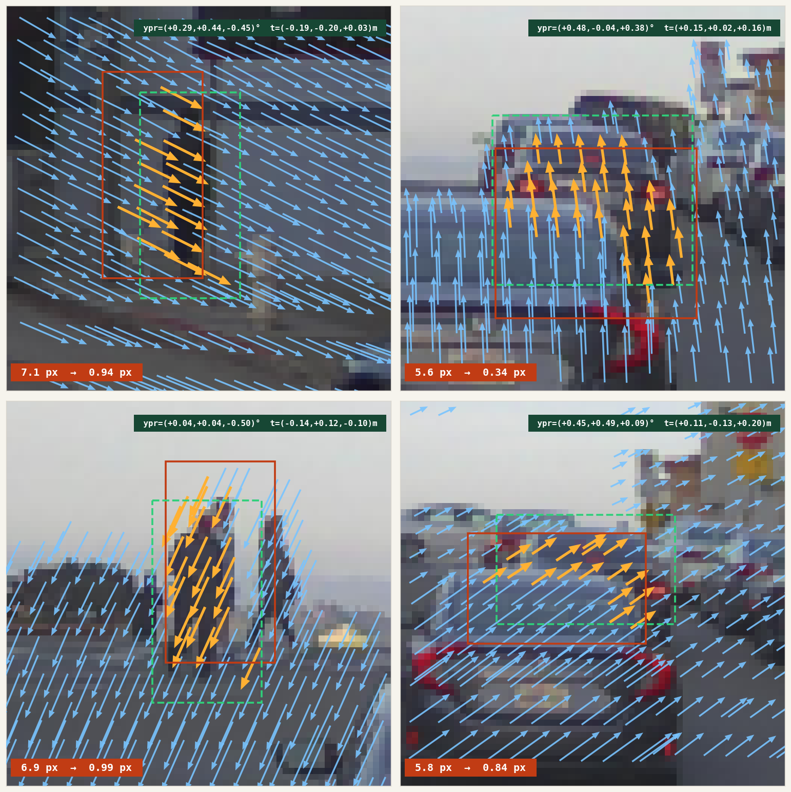

# e2e_calib — Cross-Attention LiDAR↔Camera Calibration

<p align="center">
  
</p>

A **local evidence detector** that maps LiDAR points onto the image plane. For each
point it emits a 2D Gaussian `(Δu, Δv, σu, σv, ρ)`, and those covariance-aware
residuals are fed into a Ceres-based bundle adjustment (BA) that solves for the
rigid correction.

> **Why this decomposition**: rather than regressing the full 6-DoF rigid pose
> end-to-end from a whole frame, we restrict learning to per-patch local
> evidence. That yields (1) a smaller/faster network, (2) independence from the
> rig configuration, (3) principled uncertainty propagation via BA, and (4) a
> debuggable pipeline where failures can be traced.

---

## Headline results

### ① Patch accuracy (ps_v9_objsplit)
| Metric | Value |
|---|---|
| Held-out **object** reproj MSE | **0.91 px** |
| Parameter count | 1.62 M |
| Training | PandaSet 103 scene / 33,458 crops / 200 ep / 87 min (1× GPU) |

### ② Joint training (NuScenes + PandaSet + Waymo)
| Dataset | obj MSE | bg MSE |
|---|---|---|
| PandaSet | 1.25 px | 3.16 px |
| Waymo | 1.93 px | 4.35 px |
| NuScenes | 2.32 px | 5.23 px |

→ A single network handles three different sensor rigs. Details in
[static/ns_ps_v2_report.html](static/ns_ps_v2_report.html) /
[static/ps_v9_report.html](static/ps_v9_report.html).

### ③ Multi-frame BA (scene 015, 10 frames)
Jointly optimizing a shared 6-DoF correction against a GT drift of
`ypr ‖ ‖=0.46°, t ‖ ‖=26.2 cm`:

| Setting | rot_err | t_err | reproj med |
|---|---|---|---|
| pinhole | 0.035° | **2.10 cm** | 0.75 px |
| KB `k₂=+0.01` | 0.029° | **1.56 cm** | 0.72 px ← best |
| fx −0.5 % | 0.018° | 17.7 cm | 4.17 px |
| fx −1.0 % | 0.031° | 33.5 cm | 7.96 px |

`k₂≈+0.01` minimizes the residual — a hint that PandaSet's nominal pinhole
model has a slight pincushion component.
See [experiments/all_v3_mc/ba_kb/summary.png](experiments/all_v3_mc/ba_kb/summary.png).

### ④ Deformable cross-attn (joint NS+PS+WM, 60k/1.5k, 200 ep)
| Block | val NLL | Notes |
|---|---|---|
| standard cross-attn | 2.074 | baseline |
| deformable SL | **1.568** | [experiments/vdef_sl/](experiments/vdef_sl/) |
| deformable ML | 1.573 | [experiments/vdef_ml/](experiments/vdef_ml/) |

Matches baseline speed on a bf16 native CUDA kernel (19.3 vs 19.5 ms/iter,
B=48 N=256).

---

## Architecture

```
Image (RGB 64×64 or 128×128)
    │
    └─ ConvNeXt-mini ──→ coarse_feat (16×16)
                     └─→ fine_feat   (32×32)

LiDAR Points (N × 3, [U, V, D])
    │
    └─ PointMLP + Frustum local encoder ──→ query (N × D)
                                              │
                       ┌──────────────────────┴──────────────────────┐
                       │  CrossAttentionBlockCov  (L1 … L4 cascade)  │
                       │   ├ (optional) image-side self-attn          │
                       │   ├ cross-attn  (pt → image)                 │
                       │   ├ self-attn   (pt → pt)                    │
                       │   └ OffsetHead → (Δu, Δv, log σu, log σv, ρ) │
                       └──────────────────────┬──────────────────────┘
                                       warp UV and recurse
                                              │
                        final output: (N × 5) per-point 2D Gaussian
```

Design highlights:
- The **frustum encoder** matters — removing it costs +0.81 NLL.
- **Cross-attn first, then self-attn** (self-first regresses noticeably).
- **Coarse→fine** cascade (`cross_coarse → cross_refine → cross_fine → cross_fine2`).
- Pixel coordinates normalized to `[0,1]` with a unified sinusoidal 2D PE.
- Every output carries a 2D covariance, so BA can consume Σ-weighted residuals.

---

## Quick start — from clone to a PNG in one minute

**Verified copy-paste flow** (tested against this repo):

```bash
# 1) clone + LFS pull (checkpoints are committed via LFS)
git clone git@github-enterprise:tmc-autonomy/loom-calibration.git
cd loom-calibration
git lfs install
git lfs pull --include "experiments/km_wv_wm_n4_img128_ml_dense_pe_dgx2_200ep_v2/best_model.pt"
#   Drop --include to fetch every experiment's best_model.pt (large).

# 2) dependencies
sudo apt install -y git-lfs
pip install torch torchvision flask matplotlib numpy pyceres clearml

# 3) grab the val cache from ClearML Dataset (woven_v3_tile, 6.7 GiB compressed)
#    First-time setup: log in to ClearML web (http://172.16.200.185:8002),
#      Profile → "Create new credentials" → paste the token into `clearml-init`.
#    Your `~/clearml.conf` should look roughly like this:
#      api {
#        web_server   = http://172.16.200.185:8002
#        api_server   = http://172.16.200.185:8003
#        files_server = http://172.16.200.185:8004
#        credentials { access_key = "..."  secret_key = "..." }
#      }
python -c "
from clearml import Dataset
p = Dataset.get(dataset_id='786a56a01d5a454a876352ecaf8c281f').get_local_copy()
print(p)   # ~/.clearml/cache/storage_manager/datasets/...
"
#   → symlink the printed path to data/woven_v3_tile
ln -s "<path printed above>" data/woven_v3_tile

# 4) one-liner inference + visualization
PYTHONPATH=. python -m scripts.inference.infer_pipeline \
    --exp km_wv_wm_n4_img128_ml_dense_pe_dgx2_200ep_v2 \
    --cache data/woven_v3_tile \
    --split val --idxs 17,100,1000 --top-k 100 \
    --out out/quickstart_demo
```

Expected output (measured on this repo):
```
load model: km_wv_wm_n4_img128_ml_dense_pe_dgx2_200ep_v2
build dataset: data/woven_v3_tile (val)
  len(ds)=7840, img_size=128
  idx=17:   N_valid=223  σ range 1.61-2.42px  err hyp→true=11.60  pred→true=2.33px
  idx=100:  N_valid=231  σ range 3.49-6.10px  err hyp→true=11.20  pred→true=6.40px
  idx=1000: N_valid=18   σ range 9.18-10.23px err hyp→true=17.71  pred→true=27.16px
done → out/quickstart_demo
```

The red→green visualizations land in
`out/quickstart_demo/idx{000017,000100,001000}.png`.
`hyp→true` is the perturbed input's error (px), `pred→true` is the model's
corrected error. `idx=17` going from **11.60 → 2.33 px** is the typical
success signal.

### Data caches (ClearML Dataset)

| Dataset (project=`e2e_calib/datasets`) | id | Purpose |
|---|---|---|
| `woven_v3_tile_v1` | `786a56a01d5a454a876352ecaf8c281f` | TSS4 fisheye val (used by the Quick start above) |
| `kamikado_raw` | `93880ccd96ab49e0aa53cda9002276f9` | Kamikado raw scene zips (used by "kamikado raw one-frame …" below) |
| `pandaset_v3_tiled` / `nuscenes_v3_tiled` / `waymo_v3_tiled` | (see `scripts/preprocessing/upload_tile_caches.py`) | Tile caches for joint training |

`Dataset.get(dataset_id=...).get_local_copy()` just unpacks into the ClearML
cache and returns a local path, so the second call is an instant cache hit.
To move the cache to a different disk, edit
`sdk.storage.cache.default_base_dir` in `~/clearml.conf`.

> **Pulling a trained model from ClearML** (experiments not on LFS):
> ```python
> from clearml import Task
> t = Task.get_task(task_id='7e6f442a118042188609a115f139f61d')
> ckpt = t.artifacts['best_model.pt'].get_local_copy()   # → local path
> ```

---

### Inference (one path, shared with training)

Inference goes through **`scripts/inference/infer_calib.py` only**, and that
module calls the same code the trainer uses: the dataset constructor
(`PandaSetCalibDatasetFull(insts=...)`), `forward_calib`, and `ba_solve` via
`predict_pose` in `datasets/train_cnd2_ddp.py`. There is no separate inference
re-implementation to drift out of sync.

| | training | inference |
|---|---|---|
| pose handed to the dataset | correct | the (wrong) one to correct |
| perturbation | injected inside the dataset | none (`fixed_pert=0`) |
| what the model sees | perturbed projection | perturbed projection |

```bash
# correct the pose in calib.json
PYTHONPATH=. python scripts/inference/infer_calib.py <EXP> \
    --image frame.png --points points.txt --calib calib.json
# evaluate: calib.json holds the TRUE pose; perturb it outside, then correct
PYTHONPATH=. python scripts/inference/infer_calib.py <EXP> \
    --image frame.png --points points.txt --calib calib.json \
    --pert-rot-deg 0.5 --pert-t-m 0.2
```

```python
from scripts.inference.infer_calib import (load_model, build_inst, make_dataset,
                                           infer, apply_delta)
model, cfg = load_model('ps_s2_noleak')
inst  = build_inst(img=rgb_uint8, pts=pts_xyzi, K=K, T_cam_lidar=T)
delta, H, n_windows = infer(model, make_dataset(cfg, [inst]))
T_corrected = apply_delta(T, delta)        # = E(delta) @ T
```

- `delta = (ωx, ωy, ωz [deg], tx, ty, tz [m])`, `E` is `P' = R(ω)·P + t`
  (`ba_torch._apply_extrinsic`).
- points: LiDAR frame `x y z [intensity]` as txt (default; curl-friendly),
  npy, or bin (float32 N×4 / N×5).
- calib: `{"K": 3x3, "T_cam_lidar": 4x4, "dist": [k1..k4]}` or a kamikado
  `calib.calib`.
- Evaluate in pose space (`pose_error`: geodesic angle + camera-centre
  distance), not by comparing delta components.

Regression tests: `tests/test_inference.py` (path correctness, model-free +
NLL replay + smoke) and `tests/test_infer_pandaset.py` (inference vs training
path on PandaSet val).

### Calibration API

```bash
E2E_EXP=ps_s2_noleak PYTHONPATH=. python -m uvicorn \
    services.calib_api.server:app --host 0.0.0.0 --port 5002
# http://localhost:5002/calibrate  (upload page)
curl -X POST localhost:5002/api/calibrate_frame \
     -F image=@frame.png -F points=@points.txt -F calib=@calib.json
curl -X POST localhost:5002/api/eval_frame \
     -F image=@frame.png -F points=@points.txt -F calib=@calib.json \
     -F 'rot_deg=[0.3,-0.2,0.4]' -F 't_m=[0.05,-0.1,0.15]'
```

`/api/calibrate_frame` returns `delta`, `T_cam_lidar_corrected`, and the 1σ of
each component from the GN information matrix. `/api/eval_frame` treats the
uploaded calib as the true pose, perturbs it outside the dataset with the same
formula the dataset uses during training (`perturb_T`), and returns the error
before and after correction.

### Training

```bash
# Real-data DDP training (the main path lately; configs/<NAME>.py is the CFG itself)
PYTHONPATH=. torchrun --nproc_per_node 8 \
    scripts/training/train_ps_v3_ddp.py --cfg <NAME>

# Legacy synthetic runs (sanity check only)
python scripts/training/train_64.py
python scripts/training/train_sim3d.py
```

Results are written to `experiments/<name>/{best_model.pt, train.log, config.py, vis_ep*/}`.

### Building the data cache yourself

```bash
python scripts/data_preparation/build_ps_full.py     # PandaSet → v3 tiled cache
python scripts/data_preparation/build_ns_full.py     # NuScenes
python scripts/data_preparation/build_waymo_full.py  # Waymo
```

The repo already ships with `data/woven_v3_tile` committed, so
**you do not need to build the caches just to run inference**.

---

## Repository layout

```
.
├── app.py                           # Flask demo server
├── train{,_multi,_cov,_depth,_grid_depth}.py   # synthetic-data entrypoints (see CLAUDE.md quickstart)
├── vis{,_cov,_depth}.py                        # matching visualizers
├── ba_{singleframe,multiframe,kb_multiframe}.py  # active BA entrypoints
├── models/                          # PyTorch nn.Module package
│   ├── model.py                     # CalibNet
│   ├── model_cov.py                 # CalibNetCov (covariance)
│   ├── model_depth.py               # CalibNetDepth (frustum + deform)
│   ├── model_deform.py              # deformable cross-attn block
│   └── model_no_sa.py               # ablation: no self-attn
├── datasets/                        # data loaders (package)
│   ├── synthetic.py, sim3d.py
│   ├── pandaset.py, nuscenes.py, waymo.py
├── configs/                         # experiment configs (package)
│   └── grid_depth.py
├── ops/                             # MSDeformAttn bf16 CUDA kernel
├── scripts/
│   ├── ba/                          # less-active BA entrypoints
│   ├── training/                    # real-data training scripts
│   ├── visualization/               # visualization utilities
│   ├── data_preparation/            # cache / map builders
│   └── eval/                        # eval / verify / bench
├── docs/                            # GitHub Pages reports
│   ├── index.html                   # technical overview (01)
│   ├── report.html                  # bilingual experiment writeup (02)
│   ├── ba_report.html               # multi-frame BA sweep (03)
│   ├── deform_report.html           # deformable cross-attn (04)
│   ├── images/                      # report figures
│   └── assets/                      # additional generated visualizations
├── static/                          # WebUI + legacy technical reports
├── experiments/                     # experiment results (checkpoint + log + config)
└── legacy/                          # older files kept for reference
```

### Old flat layout → package layout migration

| before (< 2026-04-23) | after |
|---|---|
| `model_*.py` (root) | `models/model_*.py` |
| `dataset*.py` (root) | `datasets/{synthetic,sim3d,pandaset,nuscenes,waymo}.py` |
| `config_grid_depth.py` | `configs/grid_depth.py` |
| `train_pandaset.py` etc. (root) | `scripts/training/*.py` |
| `vis_*.py` (root) | `scripts/visualization/*.py` |
| `build_*.py` (root) | `scripts/data_preparation/*.py` |
| `ba_global.py`, `icp_scan_residual.py`, etc. | `scripts/ba/*.py` |

Imports use package paths, e.g. `from models.model_depth import CalibNetDepth`.
Every `scripts/**/*.py` prepends a `sys.path.insert(0, repo_root)` bootstrap
automatically, so imports resolve no matter where you invoke the script from.

---

## Reports

| # | Path | What |
|---|---|---|
| 01 | [docs/index.html](docs/index.html) | technical overview (based on ps_v9_objsplit) |
| 02 | [docs/report.html](docs/report.html) | bilingual experiment writeup (synthetic → real data) |
| 03 | [docs/ba_report.html](docs/ba_report.html) | multi-frame BA + fx/KB sensitivity sweep |
| 04 | [docs/deform_report.html](docs/deform_report.html) | deformable cross-attn (val_nll −0.5) |
| 05 | [docs/cross_frame_report.html](docs/cross_frame_report.html) | cross-frame residual (dual projection, PoC 0.60 px) |

---

## Notable experiments

Committed to LFS, so `git lfs pull` is enough to run inference on any of these:

| Path | What |
|---|---|
| `experiments/km_wv_wm_n4_img128_ml_dense_pe_dgx2_200ep_v2/` | **main model**: kamikado + woven + waymo joint, n=4 ML deformable + dense PE, 200 ep on dgx2 |
| `experiments/km_wv_wm_tss4_n4_img128_grid16_50ep_dgx3_16gpu_warm/` | warm-started from the main model with 80 % TSS4 for 50 ep (TSS4 fisheye recovery) |
| `experiments/tss4_iter1baked_n4_img128_30ep_os16_dgx2_16gpu_warm/` | TSS4 iter1 cache baked + os16 warm start |
| `experiments/ps_full_n4_img128_parity_dgx4_100ep/` | PandaSet single-dataset parity baseline (DGX4 100 ep) |
| `experiments/ps_v9_objsplit/` | (legacy) PandaSet object-split best model (0.91 px) |
| `experiments/all_v3_mc/ba_kb/` | (legacy) 12-point fx×KB sweep, t=1.56 cm at k₂=+0.01 |
| `experiments/vdef_{sl,ml}/` | (legacy) deformable cross-attn (val NLL 1.57) |

---

## Environment

- PyTorch 2.x + CUDA — fp16 autocast is required. On sm_70 bf16 falls back to
  fp32-emulated math, which shifts the Δuv distribution away from training.
  `infer_pipeline.infer_one` is pinned to fp16.
- Tested on RTX 5080 / 5090 / V100 / A100 / DGX2.
- `git-lfs` (needed to pull checkpoints).
- `pyceres` (Python bindings for Ceres Solver) is required for BA.
- `clearml` is only needed to inspect training scalars/visualizations and to
  fetch experiments that aren't on LFS.

```bash
sudo apt install git-lfs
pip install torch torchvision flask matplotlib numpy pyceres clearml
```
