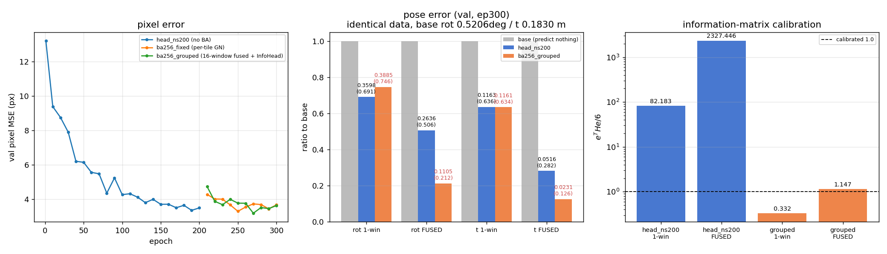
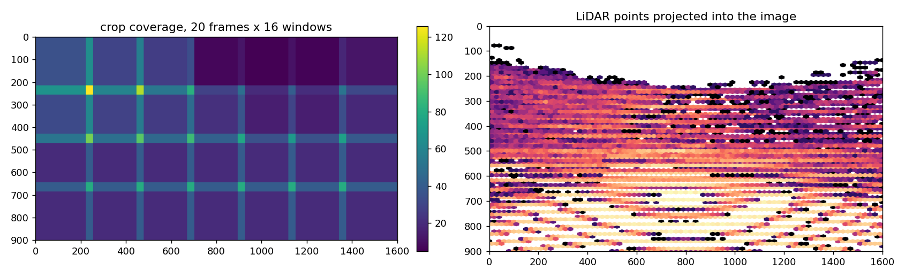

# 2026-08-28 — 共有δ・複数窓融合の BA と InfoHead 接続



nuScenes（`ns_v3_notile`, 404 フレーム）で E2E の GN ポーズ loss が効かなかった件。
理屈ではなく、コードに 5 個のバグがあった。

## 見つかった順

| # | バグ | 場所 | 影響 |
|---|---|---|---|
| 1 | `pts_cam_orig` が world 座標 | `pandaset_full.py:1580` | ポーズ target が壊れる |
| 2 | `img_size` が 128 ハードコード（実際 256） | `train_cnd2_ddp.py:79` | μ と σ が 2 倍 |
| 3 | 窓ごとに別々の δ（融合できない） | `pandaset_full.py` `__getitem__` | 1 タイル GN しか組めない |
| 4 | **`InfoHead2x2` の `out[1]` を捨てていた** | `train_cnd2_ddp.py:517` | 情報行列が一度も学習されない |
| 5 | グループ化で `N` 未更新 | `train_cnd2_ddp.py` | einsum クラッシュ |

### 1. `pts_cam_orig` が world

キャッシュは 1 フレームにつき LiDAR スイープを world で 1 本だけ持ち、投影する側がその場で
カメラ座標に変換する（`pts_cam_off = pts_c @ R_inv.T + t_inv`）。BA 用の出口だけがその変換を
していなかった。`_ba_pose_loss` には `(pts, duv, K)` しか渡らず `R_gt`/`cam_pos` は入らないので、
world 座標を渡された時点で変換する情報が存在しない。

`Z > 0.5` のガードが world z（高さ, p50 0.53 m）を 54% 通し、残りを `cholesky_ex` が
「6-DoF 不可観測タイル」として黙って落としていたので、クラッシュせず破棄率も出なかった。

```python
# before
pts_cam_orig = pts_sel.astype(np.float32)          # comment said "cam-frame" but WORLD
# after
pts_cam_orig = ((pts_sel - cp) @ _Rgt).astype(np.float32)
```

検証（1 フレーム・6 窓・共通 δ `|ypr| 0.5315°` / `|t| 0.2835 m`、出荷される
`pts_cam_orig / duv_orig / K_orig` をそのまま `solve_pose` に入れる）:

| | Z>0.5 通過 | 復元できた窓 | rot 最悪 | t 最悪 |
|---|---|---|---|---|
| WORLD（修正前） | 54.0% | 2 / 6（4 つ nan） | 0.5669° | 2.4626 m |
| CAMERA（修正後） | 100.0% | 6 / 6 | 0.0002° | 0.0001 m |

`systest2.py` に **S9** として恒久ステージ化（`S9_zguard` / `S9_rot` / `S9_t` / `S9_fused`）。
`frac_pd`（GN が落としたタイルの割合）も毎ステップ必ず print するようにした。黙って落とす
機構がこのバグを隠していた。

### 4. InfoHead が GN に届いていない

`use_info_head=True` でモデルは `(per_pt, W)` を返すが、`_ba_pose_loss` は `out[1]` を捨てて
`per_pt[..., 2:5]`（別ヘッドの log_sx/log_sy/rho）から W を作り直していた。

チェックポイントを見ると全学習を通じて:

```
info_head.mlp.4.weight   absmax 0.000e+00   std 0.000e+00
info_head.mlp.4.bias     absmax 0.000e+00   std 0.000e+00
```

`nn.init.zeros_` のまま。1 ステップも勾配を受けていない。出力は定数 `W ≈ 0.5·I`。

```python
# W_head は local px^-2、GN は原画素 px なので s2o^-2 でスケール
W = W_head / (s2o * s2o).view(B, 1, 1, 1)
```

### 3. 共有 δ と融合

`share_pert`: 1 フレームの全 `oversample` 窓が同じ δ を持つ。
`_ba_pose_loss(group=oversample)`: それらの点を連結して **1 回の GN**、1 個のポーズ loss。

同じ δ の 1 タイル BA loss は、点ごとの loss がすでに学習している残差の重み付き線形汎関数
でしかない（`delta_pred − delta_gt` は `μ − duv` の線形射影）。独立な信号にならない。

## 結果（val 40 フレーム × 16 窓, ep300）

**1-win** = 256×256 クロップ 1 枚（約 240 点）で GN → ポーズ 1 個、640 個。
**FUSED** = 同フレームの 16 窓を連結（約 3800 点）で GN 1 回 → ポーズ 1 個、40 個。
`share_pert` で 16 窓が同じ δ を持つので同一のポーズ問題として足せる。

評価は `EVALSEED` + `num_workers=0` で固定し、両チェックポイントが**同一のフレーム・
クロップ・δ** を見る（base が完全一致することで確認: max diff 0.00e+00）。
これをやる前は評価ごとに摂動を引き直しており、640 個中 1 個の「最悪値」を別サンプル同士で
比べていた。

base: rot 0.5206° / t 0.1830 m

| | `head_ns200`（BAなし） | `ba256_grouped` |
|---|---|---|
| `info_head.mlp[-1]` absmax | 0.000e+00 | 1.474e-01 |
| rot 1-win p50 / p90 / 最悪 | 0.3598 / 0.5980 / 0.9834° | 0.3885 / 0.6926 / **1.9913°** |
| t 1-win p50 / p90 / 最悪 | 0.1163 / 0.2469 / 0.4777 m | 0.1161 / 0.2307 / 0.4449 m |
| **rot FUSED p50 / p90 / 最悪** | 0.2636 / 0.4751 / 0.8441° | **0.1105 / 0.2108 / 0.3197°** |
| **t FUSED p50 / p90 / 最悪** | 0.0516 / 0.0900 / 0.1154 m | **0.0231 / 0.0603 / 0.0905 m** |
| eᵀHe/6 1-win | 82.183 | **0.332** |
| eᵀHe/6 FUSED | 2327.446 | **1.147** |
| ピクセル val | 3.36 px | 3.639 px (ep270 は 3.195) |

### 1 窓の回転は悪化している（外れ値ではない）

640 窓のペア比較:

| | 1-win rot | 1-win t | FUSED rot | FUSED t |
|---|---|---|---|---|
| grouped の方が悪い割合 | **56.6%** | 47.0% | 12.5% | 15.0% |
| ペア差 p50 | **+0.0236°** | −0.0048 m | **−0.1335°** | **−0.0193 m** |
| ペア差 最大 | +1.8732° | +0.2425 m | +0.1120° | +0.0362 m |

上位 5 件の悪化: 0.118→1.991, 0.436→1.659, 0.485→1.467, 0.460→1.423, 0.589→1.356 (deg)。
尾を切っても残る（head 基準の下位 50% だけで p50 0.2607 → 0.2861）。
1 窓の回転は融合ポーズと引き換えに全体的に悪くなっている。

学習中（train, 融合後, `frac_pd=1.00`）:
```
step 25  loss=-10.164  rot_err=0.045° t_err=0.007m  frac_pd=1.00  logdetH=50.2
```

ピクセル val は 3.195（ep270）〜3.639（ep300）で `head_ns200` の 3.36 を挟んで振れている。

## 再現

```bash
# データ検証（S1-S9）
WDIR=$W TAG=fix_ba TM=0.2 python systest2.py

# 学習
python datasets/train_cnd2_ddp.py --name ba256_grouped --cache ns_v3_notile \
  --resume-ckpt experiments/head_ns200/last_model.pt --start-epoch 200 \
  --epochs 300 --eval-every 10 --batch-size 8 --img-size 256 --grid-n 16 \
  --oversample 16 --workers 4 --val-fraction 0.1 --n-iter 4 \
  --rot-deg 0.5 --t-m 0.20 --min-crop-px 256 --max-crop-px 256 \
  --use-info-head --share-pert \
  --ba-loss --ba-iter 4 --ba-damping 1e-3 --ba-weight 0.5 --ba-loss-type nll --clearml

# ポーズ評価（1窓 vs 融合、InfoHead の W を使用）
CKPT=experiments/ba256_grouped/last_model.pt TAG=ba256_grouped python pose_val.py
```

図の生成: `mkfig.py` → `docs/_figs/2026-08-28_grouped_ba.png`

---

## 追記: クロップ生成側のバグ（同日、上記の学習の後に発見）

「16 窓は画像全体をカバーしているのに、なぜグリッドの方が悪いのか」を測っていて出てきたもの。
上の `ba256_*` の学習はすべてこれらを**含んだ状態**で回っている。



| # | バグ | 実測 |
|---|---|---|
| 6 | `u0` にクリップが無い（`v0` にはある） | クロップの **12.0%** が画像外（u0 min −324 / max 1458、正しくは 0..1344） |
| 7 | `min_crop_px == max_crop_px` でも深度分岐が cs を 768 まで広げる | 「256 のみ」指定なのに **42.0%** が 256px でない（p90 628, max 759） |
| 8 | ピボットが画像下端に来ない | `v0` 最大 559（上限 644）。v=815〜899 の **85 行が一度もカバーされない**。frame0 では v>772 の点が 621 個（19.5%、`z_cam` p50 5.4 m の直前路面） |
| 9 | 0 点のグリッドセルが `max_tries` を使い切り、`__getitem__` が**フレームごと再抽選** | `ds[0..4]` の 5 フレームを取るのに `_load_inst` が **22 回**（0, 225, 59, 3, 46, 298, ...） |
| 10 | δ をグリッドのジッタ抽選**後**に引いていた | grid 評価と random 評価で δ が **0/10 一致**。`0.1026°` vs `0.5583°` は別の摂動同士の比較で無効だった |

### 直した内容

- `u0` を `v0` と同様にクリップ
- `min_crop_px == max_crop_px` なら深度分岐を無効化して cs 固定
- `crop_grid`: `ceil(IW/cs) × ceil(IH/cs)` の決定的グリッド。画像サイズ・クロップサイズに追従
- グリッド原点をフレームごとにジッタ（間隔 224px / クロップ 256px の 32px スラック内なのでカバー率 100% を維持、かつ毎フレーム違う窓）
- `_plan_grid`: **LiDAR が `min_pts` 以上あるセルだけ**を窓に割り当てる（空セルは選ばない）
- 窓インデックスを呼び出し側から渡し、再試行でグリッドセルが飛ばないようにする
- δ をフレーム番号だけをキーにした独立 RNG で引く（クロップモードに依存しない）
- `grid_frac`: フレーム単位でグリッド（融合）とランダムピボット（単窓）を混ぜる
- `_ba_pose_loss` が両レジームを分けて処理し、損失を加重平均

### 修正後の実測

| | 修正前 | 修正後 |
|---|---|---|
| `u0` 範囲外 | 12.0% | 0.0% |
| `cs != 256`（256 指定時） | 42.0% | 0.0% |
| `v0` 最大 / 上限 644 | 559 | 644 |
| 画像カバー率（28 窓） | 80.4% | 100.0% |
| LiDAR 点セルの未カバー | 10.7% | 0.0% |
| 0 点の窓 | 7.1% | 0.0% |
| 8 点未満の窓 | 14.8% | 2.1% |
| フレーム再抽選（`ds[0..4]`） | 22 ロード | 5 ロード |
| grid/random で δ 一致 | 0/10 | 10/10 |

### 同一 δ・同一フレームでの再測定（`n_iter=4`, 40 フレーム × 28 窓）

base（軸別 p50）: ωx 0.2108° / ωy 0.2150° / ωz 0.2765°、tx 0.0910 / ty 0.1150 / tz 0.0572 m

| 融合ポーズ | GRID rot | RANDOM rot | GRID t | RANDOM t | eᵀHe/6 (GRID) |
|---|---|---|---|---|---|
| `head_ns200` | 0.4204° | 0.2579° | 0.0612 m | 0.0707 m | 14732.067 |
| `ba256_grouped` | 0.5108° | **0.1411°** | 0.0784 m | 0.0418 m | 17.443 |
| `ba256_mix400` | **0.2146°** | 0.2351° | **0.0196 m** | **0.0341 m** | **1.094** |

`ba256_grouped` の 0.1026° は、測定を直すと **0.1411°** になった（別の δ・別のフレームを比べていた分）。

### 未解決

- `ba256_mix400` は 400 エポックで `va_mse` 13.0 → 7.15 止まり。`head_ns200` は 200 エポックで 13.2 → 3.36。**ロスが下がりきっていない。**
- グリッドの回帰ターゲットは random より大きい（`|gt|` p50 18.183 vs 13.914 px、>50px が 3.06% vs 0.36%）。画像端の窓ほど摂動による画素変位が大きい。
- `ba256_grouped` と `ba256_mix400` の比較は交絡している（クロップサイズ 42%/0%、`u0` 12%/0%、窓数 16/28、分布 random/mix の 4 点が同時に違う）。`ba256_rnd400`（修正後コード・`grid_frac 0.0`・28 窓）を対照として実行中。
