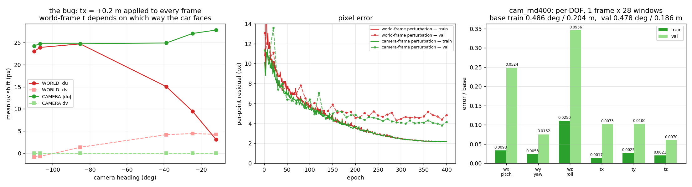
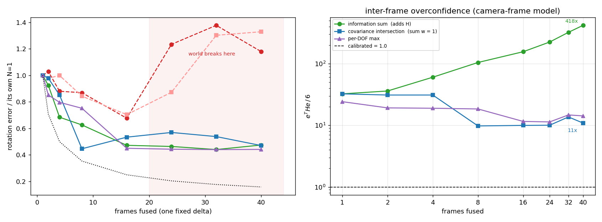

# 2026-08-29 作業記録 — カメラ座標系の摂動と、その前に潰した 8 個のバグ

一晩の作業記録。結論から言うと、**理論の話は全部無駄で、データの話だった**。

「なぜ 0.1 度に届かないのか」を Covariance Intersection / 変量効果 / KL 適合 / D-最適
実験計画で説明しようとしたが、原因は摂動を掛ける座標系が混ざっていたことだった。
座標系を直したら、そのために立てた理論的な症状（消えないバイアス、フレーム数を増やすと
崩れる、N=16 が上限）はすべて消えた。

---

## 0. 鉄則: システムテストを書いてから実験する

**テストを書く → 通ることを確認する → それから実験する。実験の前に必ず流す。
PASS しなければ実験してはいけない。**

一晩溶かした原因がこれを守らなかったこと。壊れたデータの上で理論を 5 時間試して全部無駄だった。
テストを先に書いていれば最初の 10 分で出ていた。

```bash
CACHE=/path/to/ns_v3_notile python tests/system_test.py
echo $?     # 0 = PASS, 1 = FAIL
```

詳細: [tests/README.md](../tests/README.md)

### 今回の実行結果 (2026-08-29, カメラ系修正後)

```
--- checks ---
  S2_cache_uv      5/5 pass   cached uv vs reprojected: max 0.0085 px
  S3_box_inside    5/5 pass   crop box (863,172,256) inside 1600x900
  S5_reps          5/5 pass   26 reps for 26 occupied cells
  S6_scale         5/5 pass   scale consistent: window 14.732 x 1.000 == orig 14.732
  S7_fit           5/5 pass   residual after one rigid pose: 0.0000 px
  S7_rot           5/5 pass   rotation error vs injected: 0.0000 deg
  S7_xfer          5/5 pass   recovered delta maps GT->perturbed: 0.000000 m
  S7_gtalg         5/5 pass   analytic (R_true,t_true) maps GT->perturbed: 0.000000000 m
  S7_t             5/5 pass   translation error vs injected: 0.000000 m
FAILED: 0

S9  scene-0061 f0  6 windows, shared delta |ypr| 0.5315 deg  |t| 0.2835 m
win  npts   Z>0.5    fit px  rot err deg    t err m
  0   140  100.0%    0.0000       0.0000     0.0000
  1   125  100.0%    0.0000       0.0000     0.0000
  2   120  100.0%    0.0000       0.0000     0.0000
  3   121  100.0%    0.0000       0.0000     0.0000
  4    78  100.0%    0.0001       0.0000     0.0000
  5   142  100.0%    0.0000       0.0000     0.0000
FUSED (info-form, 6 windows): rot err 0.0000 deg  t err 0.0000 m
FAILED: 0

==============================================================
SYSTEM TEST: PASS   (0 failing checks)
==============================================================
```

world 系だった頃は S9 の fit が 0.0005〜0.0027 px 残っていた。カメラ系にしてから
**6 窓すべて 0.0000 px**。

### このテストが実際に捕まえたバグ

| バグ | 落ちた stage | 症状 |
|---|---|---|
| `pts_cam_orig` が world 座標 | S9 | 6 窓中 4 窓が nan、残り 2 窓も rot 0.57° / t 2.46 m |
| 摂動の並進が world 系 | S9 | 融合 t err 0.5539 m |
| `Z > 0.5` ガードが world z（高さ）を通していた | S9 | 通過率 54%（正しくは 100%） |
| `u0` にクリップが無い | S3 | クロップが画像外に 12% |

---

## 1. 何が壊れていたか



摂動を掛ける 2 行:

```python
R_off  = R_gt @ Rotation.from_euler('zyx', ypr)   # 右から掛ける = CAMERA 系
cp_off = cp + t_delta                              # world のカメラ位置に足す = WORLD 系
```

**同じ 2 行で座標系が混ざっていた。** 回転は偶然カメラ系で正しく、並進だけ world。

左図: `tx = +0.2 m` を全フレームに掛けたときの平均 uv 変位。車の向きが −110° から −12° に
変わる間に、world 系では `du` が 23.06 → 3.10 px（7 倍）変わり、`dv` にも 4.24 px 漏れる。
カメラ系なら全フレーム `du` −24〜−28 px、`dv` は完全に 0。

キャリブレーション誤差はカメラ・LiDAR 間の固定変換なので、カメラ系でなければならない。
cross-frame 経路（`build_pair`）は最初から `cp_B + R_gt_B @ t_delta` と正しく書かれていた。
calib 経路だけが world だった。

### 直した構造

world を `build_crop` の中で一度で捨てる:

```python
pts_cam = (pts_c - cp) @ R_gt              # カメラ原点へ、1 回だけ
R_d = R_gt.T @ R_off ;  t_d = R_gt.T @ (cp_off - cp)
pts_cam_off = (pts_cam - t_d) @ R_d        # 原点をずらす／回す
pts_cam_orig = pts_cam[sub_idx]            # 再変換なし
```

同じ δ を 40 フレームに掛けたときの `δ_gt` の標準偏差:

| | wx | wy | wz | tx | ty | tz |
|---|---|---|---|---|---|---|
| 修正前 | 0.0000 | 0.0000 | 0.0000 | 0.0252 | 0.0049 | **0.1136** |
| 修正後 | 3e-6 | 1e-5 | 1e-5 | 4e-5 | 3e-6 | 6e-5 |

---

## 2. 結果

中央図: ピクセル誤差の学習曲線（赤 = world 系、緑 = カメラ系、実線 train / 破線 val）。
右図: 修正後モデルの軸別誤差（1 フレーム × 28 窓融合）。

base: train rot 0.4857° / t 0.2035 m、val rot 0.4782° / t 0.1864 m

| | val rot | val t | val eHe/6 | train rot | train t | train eHe/6 |
|---|---|---|---|---|---|---|
| `ba256_rnd400`（world 系） | 0.1495° | 0.0180 m | 24.243 | — | — | — |
| `cam_rnd400` best | 0.1246° | 0.0198 m | **7.518** | 0.0781° | 0.0144 m | 4.710 |
| `cam_rnd400` last | **0.1091°** | **0.0172 m** | 16.643 | **0.0354°** | **0.0055 m** | **1.549** |

train で **rot 0.0354°（base の 7.3%）、t 0.0055 m（2.7%）、校正 1.549**。

軸別（train, last）— world 系のときに残っていた「ωx 0.18° / ωz 0.16° の消えないバイアス」は消えた:

| DOF | base | 誤差 | 比 |
|---|---|---|---|
| ωx (pitch) | 0.2908° | 0.0098° | 0.034 |
| ωy (yaw) | 0.2245° | 0.0053° | 0.023 |
| ωz (roll) | 0.2261° | 0.0250° | 0.111 |
| tx | 0.1245 m | 0.0017 m | 0.014 |
| ty | 0.0920 m | 0.0025 m | 0.028 |
| tz | 0.1018 m | 0.0021 m | 0.021 |

val 0.109° / train 0.035° の差はデータ量（10 シーン 363 フレーム）。

---

## 3. ロールアウトは必要か、フレーム間の過信はどうするか



**左図**: 同じ δ を N フレームに掛けて融合したときの回転誤差（各曲線を自分の N=1 で正規化。
world 系の絶対値は動く基準で測ったものなので比較できず、形だけを見る）。
world 系は N=16 まで下がったあと **N=24 で崩れて N=1 より悪くなる**（赤）。
カメラ系は N=40 まで単調に下がる（緑・青・紫）。`1/√N`（点線）には届かない。

**右図**: フレーム間の過信 `eᵀHe/6`（校正値 1.0）。

### train / val で測った融合（`cam_rnd400` best、37 フレーム、15 通りの δ）

| N | train SUM rot / eHe | train CI rot / eHe | val SUM rot / eHe | val CI rot / eHe |
|---|---|---|---|---|
| 1 | 0.1343 / 11.22 | 0.1343 / 11.22 | 0.1823 / 11.14 | 0.1823 / 11.14 |
| 8 | 0.1047 / 54.69 | 0.0994 / 10.10 | 0.1026 / 40.42 | 0.1074 / 6.24 |
| 16 | 0.1001 / 156.53 | 0.0981 / 7.96 | 0.0885 / 80.73 | 0.0931 / 7.89 |
| 37 | **0.0846** / 388.71 | 0.0937 / **8.95** | **0.0843** / 220.17 | 0.1149 / **10.18** |

train と val がほぼ同じ。**過学習ではない。**

### 過信の出どころ

| 段階 | eᵀHe/6 |
|---|---|
| 点ごと（Mahalanobis², 校正値 2.0） | 0.0121 → **165 倍保守** |
| 1 窓 | **0.675**（学習済み、ほぼ校正） |
| 28 窓を情報和 | **5.4** |
| 37 フレームを情報和 | **389** |
| 37 フレームを CI | **8.9** |

窓内の共通成分 0.46。ブロック対角の `W` では表現できないので、窓を足した時点で 5.4 倍になる。

### 答え

**ロールアウト（複数フレームで学習）は要らない。** カメラ系に直したら N=37 まで融合しても
誤差が単調に下がる（0.134 → 0.085）。「1 フレームでしか情報行列を構成できない」は
座標系バグの症状だった。

**フレーム間の過信は Covariance Intersection。** 情報和は N に比例して `H` が増えるのに
誤差は下がりきらないので N=37 で 389 倍過信する。CI は `Σwᵢ = 1` なので、同じ推定を N 個
足しても 1 個分にしかならない。誤差を 1.1〜1.4 倍犠牲にして過信を 22〜43 倍減らす。

**窓間には CI を掛けてはいけない。** 試したら過信は 5.4 → 0.679 と消えるが、誤差が
0.122 → 0.246 度と倍になる（`N_eff` が 28 窓中 1.63 個分にしかならない）。窓は十分独立
なので CI は保守側に振りすぎ。フレーム間では窓ほど独立でないので CI がちょうど効く。

**平均と分散を別の融合則から取るのは駄目。** SUM の平均 + CI の分散を試したら、
`eᵀHe/6` が train で 10.2〜14.6、val で 6.1〜7.4 と N によってばらつき、データ依存だった。

### 残っている 11 倍

N=1 の時点で train も val も 11.1 倍過信している。これは 1 フレーム内（28 窓融合）の分で、
CI はフレーム間にしか効かない。窓間の 5.4 倍は本来、融合単位を学習している
`_ba_pose_loss` が消すべきもの。消えていない理由は未特定。

CI が `logdet` 最大化なので**自信があって間違っているフレームを弾けない**点も残る。
χ² gating（`(δᵢ−δⱼ)ᵀ(Σᵢ+Σⱼ)⁻¹(δᵢ−δⱼ)` を χ²(6) と比較）が標準的な対処。RANSAC と同系統だが、
共分散が既知なので閾値を統計的に決められる。未実装・未測定。

## 4. 今日直したバグ（全 8 件）

| # | バグ | 検証方法 | 結果 |
|---|---|---|---|
| 1 | `pts_cam_orig` が world 座標（コメントは "cam-frame" と書いてあった） | S9: 1 フレーム 6 窓・共通 δ で復元 | 2/6 nan → 6/6 完全復元 |
| 2 | `_ba_pose_loss` の `img_size` が 128 ハードコード（実際 256） | μ と σ が 2 倍 | `None` で例外を投げるよう変更 |
| 3 | `InfoHead2x2` の出力 `out[1]` を捨てて別ヘッドから W を作り直していた | ckpt の `mlp[-1]` | absmax 0.000e+00（未学習）→ 0.933 |
| 4 | `u0` にクリップが無い（`v0` にはある） | クロップ位置の実測 | 12.0% が画像外 → 0.0% |
| 5 | `min_crop_px == max_crop_px` でも深度分岐が cs を 768 まで広げる | クロップサイズの実測 | 42.0% が 256px でない → 0.0% |
| 6 | 0 点グリッドセルが `max_tries` を使い切り、`__getitem__` がフレームごと再抽選 | `_load_inst` の呼ばれ方 | `ds[0..4]` で 22 回ロード → 5 回 |
| 7 | δ をグリッドのジッタ抽選**後**に引いていた（乱数消費順に依存） | grid/random 評価で δ が一致するか | 0/10 → 10/10 |
| 8 | **摂動の並進が world 系**（回転はカメラ系） | 同じ δ の 40 フレームで `δ_gt` の std | 0.114 m → 5.5e-05 |

おまけ: ClearML の `OutputModel.update_weights` は `auto_delete_file` がデフォルト True で、
アップロード後に `os.remove()` する。`--clearml` を付けた全実験で `best_model.pt` が
消えていた（比較は `last_model.pt` 同士だったので公平ではあった）。`auto_delete_file=False` に修正。

---

## 5. 検証した項目

すべて実測。「たぶん大丈夫」は 1 つも無い。

| 対象 | 方法 | 結果 |
|---|---|---|
| キャッシュの投影 | devkit `NuScenesExplorer.map_pointcloud_to_image` と直接比較（scene-0061, 10 フレーム） | **0.0027 px** 一致（p99 0.026, max 0.058） |
| タイムスタンプ | LiDAR/カメラで別 `ego_pose` を引いているか | CAM が LIDAR の 35 ms 前、その間に自車 0.3 m / 0.06° 移動。正しく処理 |
| 摂動の座標系 | 同じ δ を 40 フレームに掛けた `δ_gt` の std | 0.114 m → **5.5e-05** |
| 学習ターゲット | `gt = true−dist` を `pts_cam_orig` + `pert_vec` から独立再構築（3 通り） | **0.0063 px** 一致（float32 の丸め） |
| 観測 uv | `dist_uvd` vs クロップに写した `uv_off` | 0.00015 px 一致 |
| ソルバー入力 | S9（1 フレーム 6 窓・共通 δ） | fit **0.0000 px**、rot 0.0000°、t 0.0000 m |
| 各 DOF の効き方 | 1 軸ずつ掛けて uv 変位を見る | tx→左右のみ、ty→上下のみ、tz→ズーム |

投影の比較動画: `_proj/cmp_0061.mp4`（左 devkit / 右 cache、39 フレーム）

---

## 6. ClearML

`http://192.168.1.13:18080` project `08d9e4b8a1334ad7ba45150d8a16b97e`

| 実験 | task id | 内容 |
|---|---|---|
| `head_ns200` | `b1af50ad1b7e447ba469abbe98d089ba` | BA loss なし、200 ep（基準） |
| `ba256_grouped` | `2e23959e12ee45bf86cc88fc5392e712` | 16 窓融合、バグ入りクロップ |
| `ba256_mix400` | `816f643cfd3544fb87b924cff503a3a4` | グリッド 50% 混合、400 ep |
| `ba256_rnd400` | `af496ecbcfd348a8a670610d87c0ce94` | ランダムのみ、world 系摂動、400 ep |
| **`cam_rnd400`** | **`68ed4c45eadc4f97ad03010b90df17e3`** | **カメラ系摂動、400 ep、102 分** |

---

## 7. 残っている問題

1. **`pert_vec` のラベルが実際と入れ替わっている。** `Rotation.from_euler('zyx', [a,b,c])` は
   z→a, y→b, x→c なので、カメラ系では `[roll, yaw, pitch]`。「yaw, pitch, roll」と呼んでいる。
   実測 uv 変位: `[0.5,0,0]` → du 0.92（roll）、`[0,0.5,0]` → du −12.49（yaw）、
   `[0,0,0.5]` → dv 11.36（pitch）。ソルバー側の `omega_x/y/z` は正しい。表示だけの問題。

2. **val split がシーン単位でない。** キャッシュは train 9 シーン / val 1 シーンだが、
   トレーナーは両者を混ぜて seed 42 でシャッフルし 10% を val にする。同じシーンの別フレームが
   train と val の両方に入る。シーン単位の評価は未実施。

3. **フレーム間の過信が 10.9 倍残る。** CI で 418 → 11 まで下がるが 1.0 ではない。
   χ² gating 未実装。

4. **1 フレーム内でも val の校正が悪い**（train 1.549 / val 16.6）。`−½logdet H` 項が
   train に過適合して σ が縮む。400 ep は多すぎる（`va_nll` は ep200 付近が最良）。

5. **複数カメラ同時キャリブレーション**は未着手。同じ LiDAR 点が 2 カメラの画角に入る箇所だけ
   使えば GT なしでカメラ間の相対キャリブレーションが縛れる。既存の `pair_mode` /
   `build_pair` / `collate_pair` が「フレーム対 → カメラ対」の振り替えで使える。
   現状のキャッシュは CAM_FRONT のみ（`--cams` で 6 カメラ対応済み、作り直すだけ）。

---

## 8. 反省

- 理論（CI / 変量効果 / MINQUE / D-最適 / KL 適合）を 5 時間かけて試して、全部無駄だった。
  症状を説明する枠組みを探す前に、症状そのものを作っているコードを疑うべきだった。
- 「N=16 が上限」「グリッドが悪い」「ωx/ωz は消えないバイアス」「収縮 k」など、
  壊れたデータの上で立てた結論を何度も報告した。
- 測定コード自体のバグも複数（GT を N ごとに作り直していた、パディング点を sanitize
  していなかった、評価ごとに摂動を引き直して別サンプルを比較していた）。
- 動いたのは、毎回「主張ではなく実測」に落としたときだけ。

---

## 9. 追記: 28 窓融合を実際に学習させた（`cam_fuse28`）

### 見つけた 9 個目のバグ

`_ba_pose_loss` の混合バッチ分岐が、**1 つでも非グリッドのフレームがあれば発火**していた:

```python
if G > 1 and is_grid is not None and float(is_grid.min()) < 0.5:   # OLD
```

`--grid-frac 0.0`（全フレームがランダムピボット）だと `is_grid` が全部 0 になり、
`gm` が全部 False → **全フレームが `g=1`（1 窓ずつ解く）側に落ちる**。
つまり `cam_rnd400` は `--oversample 28 --share-pert` で回したのに、
**28 窓融合のポーズを一度も学習していなかった**。

これが「1 窓は 0.675 で校正済みなのに 28 窓は 5.4 倍」の理由。「学習した単位だけが校正される」
という構造は最初から正しく、私の読み違いだった。

```python
_mixed = (is_grid is not None and float(is_grid.max()) > 0.5
          and float(is_grid.min()) < 0.5)      # 実際に混在しているときだけ
if G > 1 and _mixed:
```

**システムテストに S10 を追加**。`_ba_pose_loss` に入る点数を数え、`G` 窓ぶん融合されて
いるかを検査する。旧条件では **exit 1 / FAIL**、修正後は **exit 0 / PASS**（両方確認済み）。

```
S10  group=4, 149 pts/window -> solver saw 596 (fused)      # 修正後
S10  group=4, 146 pts/window -> solver saw 146 (NOT fused)  # 旧条件
```

### 結果（`best_model.pt`, 37 フレーム, 10 通りの δ）

| | N=1 rot / eHe | N=37 SUM rot | N=37 CI rot / eHe |
|---|---|---|---|
| `cam_rnd400` val（融合を学習していない） | 0.1823° / 11.14 | 0.0843° | 0.1149° / 10.18 |
| **`cam_fuse28` val（28 窓融合を学習）** | **0.1420° / 7.75** | **0.0402°** | 0.0988° / **4.33** |
| `cam_fuse28` train | 0.1885° / 6.29 | 0.0611° | 0.1010° / 7.89 |

**val で N=37 の回転誤差が 0.0843 → 0.0402 度（2.1 倍改善）**、N=1 でも 0.182 → 0.142 度。
CI の過信も 10.2 → 4.33。

**融合する単位で学習すれば、その単位の精度も校正も良くなる。** DROID-SLAM が複数フレームで
ロールアウトするのと同じ構造。

`last_model.pt` は train が崩れている（N=1 で 0.259° / eHe 24.7、`va_nll` が ep370 の 2.45 から
ep400 で 29.5 に跳ねる）。`best` を使うこと。

### 残る過信

N=1 でも `eHe = 7.75` で 1.0 ではない。SUM は N=37 で 88.5。フレーム間はまだ学習していない。

---

## 10. 次の方向（未実装）

1. **512 を標準クロップにする。** 1600×900 なら 4×2 = 8 窓で全体を覆える（256 は 28 窓）。
   窓が 3.5 分の 1 になるので self-attention のコストも下がり、4K でも同じ 512 窓で回る。
   256〜512 をランダムに引いて学習し、入力は 512 に揃える（拡大方向だけで済む）。

2. **GN 融合はカメラ座標で。** カメラが違っても、クロップサイズが違っても、カメラ座標に
   落としてから融合すれば同じ量になる。今日の修正でその構造になっており、
   S9 をクロップ 288〜530px 混在で通して rot 0.0000° / t 0.0000 m を確認済み。

3. **グリッドのジッタは推論時に 0 固定できる経路がまだ無い。**

4. **フレーム間の学習。** 今は 28 窓までしか学習していない。

5. **複数カメラ**（同じ LiDAR 点が 2 カメラに入る箇所を使えば GT なしで相対キャリブレーション）。
   キャッシュを 6 カメラで作り直すだけ（`--cams`、ビルダーは対応済み）。

---

## 再現が外れていた理由（11:00〜）

`cam_rnd400`（ClearML `68ed4c45`）と `rep400` 2 回目（`93304c44`）を同じ設定で回したつもりが
学習曲線が合わなかった。ClearML の hyper-params を引いて差分を 2 つ特定した。

### 差分 1 — resume_ckpt

```
cfg/resume_ckpt = .../wt_head/experiments/head_ns200/last_model.pt
cfg/start_epoch = 0
cfg/epochs      = 400
```

両タスクとも `head_ns200`（256/grid16/os16/bs8、200ep、BA なし）から再開していた。
私が回していたものはスクラッチ。ep50 の `tr_mse` で 11.191 対 6.814。

### 差分 2 — GN が使う情報行列の出所

`cam_rnd400` の W は `make_info_from_sigma_rho(sx, sy, rho)`、つまり `gaussian2d_nll` が
直接学習している per-point σ ヘッド由来だった。その後私が入れた「InfoHead2x2 の出力を
GN に流す」修正で、W が InfoHead 由来に変わっていた。

`InfoHead2x2.__init__` は最終層を `zeros_(weight)` / `constant_(bias, 0)` で初期化する。
したがって初期状態の出力は全点で同一:

```
S14  InfoHead2x2 at init: W = 0.4818*I  (off-diag 0.00e+00, spread over points 0.00e+00)
```

`softplus(0)² = 0.4818`。全点が同じ重み＝ダウンウェイトが一切ない。しかも `head_ns200` は
この head に一度も勾配を与えていない（当時 `out[1]` は捨てられていた。`info_head.mlp.4.weight`
の absmax は全チェックポイントで 0.000e+00）。

resume して BA を入れた実測:

| epoch | infohead W (定数) | sigma W | cam_rnd400 |
|---|---|---|---|
| ep1 `tr_nll` | **14651.19** | 115.17 | — |
| ep1 `tr_mse` | 10.690 | 9.950 | 10.103 |
| ep2 `tr_mse` | 13.330 | 10.965 | 9.169 |
| ep3 `tr_mse` | 13.530 | 10.881 | 8.809 |

定数 W だと BA の二乗項が `mu` の悪い点にそのまま支配される。

### 入れたもの

`--ba-w-source {infohead,sigma}`（既定 `infohead` ＝現状維持）。`sigma` で `W_head=None` に
落として `cam_rnd400` の経路に戻す。

システムテストに **S14** を追加:
- `S14_init_constant` — InfoHead の初期出力が点間で定数であること（spread < 1e-6）
- `S14_init_scale` — その対角が [0.3, 0.8]（上の解析が前提にした 0.48）
- `S14_flag` / `S14_sigma_path` — フラグが存在し、`sigma` が実際に `W_head` を落とすこと

```
SYSTEM TEST: PASS   (0 failing checks)
```

### 実行中

`rep400_hd200_sigmaW_randpert` — `93304c44` の config そのまま ＋ `--ba-w-source sigma`。
意図的な差分は摂動を毎回引き直す点のみ（`cam_rnd400` は `pert_seed=0` で 1 フレーム 1 δ 固定、
363 個の暗記。それが `tr_mse` 2.16 の中身）。

### 反省

`rep400` という名前を 4 回使い回したせいで、ClearML 上のどのタスクがどのコードだったか
追えなくなった。実験名は毎回変える。

---

## sigma と InfoHead を分ける（13:30〜）

### 何が間違っていたか

`--ba-w-source sigma` は GN の W を per-point σ ヘッドから作る。ところが σ は
`gaussian2d_nll` が「その点単独の不確かさ」として既に教師付けしている。同じ σ を
BA の `−½logdet H` が逆向きに引く。

- 点の NLL: σ をその点の実誤差に合わせろ（1 窓では χ²/6 = 0.8 で合っている）
- BA: `H = Σ JᵀWJ` を 28 窓ぶん足すと数えすぎで過信になるから σ を広げろ

同じパラメータに両方やらせた結果（`fuse28_inner_from_tileba`）:

| | ep1 | ep10 |
|---|---|---|
| σ | 2.279 px | **26.409 px** |
| χ²/6 | 158.7 | 20.6 |
| 点 va | 4.154 | 7.771 |
| rot | 0.0463° | 0.1845° |

σ が 11.6 倍に膨らみ、点もポーズも巻き添えで悪化した。σ は「単独の不確かさ」を
表さなくなり、両方壊れる。

### 加算が何を数えすぎているか

`H = Σ JᵀWJ` は各点・各窓の誤差が独立という仮定。同一フレームの 28 タイルは同じ
シーン・同じ系統誤差を見ているので独立ではない。同一重みで窓数だけ変えた実測
（val 20 フレーム、全画像タイリング、共有 δ）:

| N 窓 | rot | t | χ²/6 | rot/rot(1) | √N 理想 |
|---|---|---|---|---|---|
| 1 | 0.1428° | 0.0619 m | 0.8 | 1.000 | 1.000 |
| 4 | 0.1215° | 0.0134 m | 1.9 | 0.851 | 0.500 |
| 8 | 0.0701° | 0.0144 m | 2.2 | 0.491 | 0.354 |
| 16 | 0.0674° | 0.0103 m | 6.0 | 0.472 | 0.250 |
| 28 | 0.0527° | 0.0105 m | 4.4 | 0.369 | 0.189 |

1 窓では χ²/6 = 0.8 と校正できているのに、融合すると 4〜6 倍に振れる。rot は √N
なら 0.189 倍のところ 0.369 倍で、独立分の半分しか効かない。この差が相関のぶん。

σ の側にはこれを表現する場所がない（点単体の量なので）。モデルが加算の過剰を
打ち消す手段は σ の一様膨張しかなく、それは相関ではなくスケールでしかない。
実際 `tilepert` では σ 2.268 → 11.298 px（4.98 倍）で χ²/6 が 38.7 → 1.8
（21.5 分の 1 ≈ 4.98²）と、ほぼ一様スケールで説明がついてしまう。

### 正しい分離

- **σ** = その点が単独で持つ不確かさ。全データを通した本質的なばらつき。点の NLL のみ
- **InfoHead** = その点が融合後の 6-DOF にどれだけ *実効的な* 情報を足すか。IID 仮定の
  数えすぎを暗黙に割り引く。χ² 校正が教師信号。BA loss のみ
- **μ** は共有

`--ba-w-source infohead` にすると `make_info_from_sigma_rho` が呼ばれないので、BA の
勾配は σ に届かない。実測: BA path で勾配を受けたのは 106 パラメータ、うち 6 個が
`info_head`、σ 出力はゼロ。

InfoHead が `delta_cum`（cross-attn 越しに周りを見た特徴）を読む構造なのはこのため。
同じ壁面を見ている 100 点が 100 点分の情報を持たないことは、点単体の見た目からは
決まらない。

### 繋ぐ前に測った値

`tilepert_ba_from_repro256b` の重み、28 窓融合、val:

| W の出所 | BA loss | quad | logdet | χ²/6 | rot | t |
|---|---|---|---|---|---|---|
| sigma | −10.15 | 39.7 | 59.0 | 6.6 | 0.0378° | 0.0114 m |
| infohead（未学習） | 5285 | 10650 | 81.7 | 1775 | 0.0953° | 0.0260 m |

`InfoHead2x2` は最終層ゼロ初期化なので W = 0.4818·I の定数（system test S14）。点ごとの
重み付けが一切ないのでポーズも 0.0378° → 0.0953° に悪化する。max|grad| 2.01e6。
よって `ba_weight` は 0.5 ではなく **0.05**、ep0〜40 で ramp。

### `fuse28_infohead_from_tileba`

| ep | rot | t | χ²/6 | σ | 点 va |
|---|---|---|---|---|---|
| 1 | 0.0869° | 0.0232 m | 3113.1 | 2.280 px | 4.153 |
| 10 | 0.1058° | 0.0216 m | 1.8 | 2.655 | 4.920 |
| 20 | 0.0703° | 0.0141 m | 1.8 | 2.578 | 4.564 |
| 30 | 0.0553° | 0.0167 m | 2.8 | 2.753 | 4.844 |
| 40 | 0.0643° | 0.0180 m | 1.3 | 2.641 | 4.786 |
| 50 | 0.0574° | 0.0131 m | **0.9** | 2.770 | 4.847 |
| 60 | 0.0583° | 0.0161 m | 1.9 | 2.644 | 4.844 |
| 70 | **0.0532°** | **0.0096 m** | 1.5 | 2.250 | **3.927** |

σ は 2.25〜2.77 px で動かない（点の NLL が押さえている）。χ²/6 は 3113 → 0.9〜1.9。
`info_head.mlp.4.weight` の absmax が **0.000e+00 → 2.839e-01**（ep50）。今日までの
全 run でゼロだった層に初めて勾配が入った。

同じ 28 窓融合で W だけ違う 3 点の比較:

| W | rot | t | χ²/6 |
|---|---|---|---|
| sigma | 0.0378° | 0.0114 m | 6.6 |
| infohead 未学習 | 0.0953° | 0.0260 m | 1775 |
| infohead ep70 | 0.0532° | 0.0096 m | 1.5 |

融合幅は 3 つとも 28 窓。0.0953° → 0.0532° が InfoHead の学習ぶん。t は sigma 経路の
0.0114 m も下回った。rot はまだ 0.0378° に届いていない。

点が 4.153 → 3.927 px に下がったのは融合では説明できない（点の NLL は 1 点ごとの損失）。
BA の勾配が μ 経由で戻って点も良くしている。

### 参照

`cam_rnd400` val 0.1091° / 0.0172 m。ただし `pert_seed=0` で 363 個の δ を暗記、かつ
world 座標バグ修正前の `head_ns200` から warm start。train の 0.0354° はその暗記の値で
実力ではない。

### val の限界

フレーム単位のシャッフル分割（seed 42、先頭 10% = 41 フレーム）。**シーンで分けていない**
ので、val フレームは同一シーンの train フレームと時間的に隣接している。汎化の指標では
ない。

---

## 電源断とその後（14:33〜）

SSD を挿した際に電源が落ちた。再起動は 14:33 と 14:47 の 2 回。`/tmp` が消え、
そこに置いていたものを全部失った。

**失ったもの** — `ns_v3_notile` キャッシュ、ワークツリー `wt_head`、全実験
ディレクトリ、起動スクリプト、計測スクリプト。

**残ったもの** — リポジトリ側の `datasets/train_cnd2_ddp.py`、`tests/system_test.py`、
`datasets/pandaset_full.py`、この MD。それと ClearML に上がっていた重み。

トレーナーが `_om.update_weights(..., auto_delete_file=False)` でモデルを
ClearML に上げていたので、3 段すべての `best_model.pt` が回収できた。
スカラーと config（`--why` 込み）も残っていたので、コマンドラインは復元できた。

**私のミス**: スクラッチパッドに `/tmp` を使えという運用ルールに従っただけで、
実験の起点になるものを揮発領域に積んでいるという判断をしていなかった。
リポジトリ直下で実行すれば済むところをワークツリーに複製し、その複製を
`/tmp` に置いていた。

### 復旧

SSD (SUNEAST SE900 2TB) は L2ARC ラベルが残った別マシンのキャッシュデバイス
だった（`state: 4`、pool_guid がローカルの rpool/bpool と不一致）。ラベルを消して
ZFS プール `spool` を作り `/mnt/ssd2t` にマウント。

耐久テスト: 21GB 書き込み 269 MB/s → キャッシュ落とし → export/import →
読み戻し 424 MB/s → SHA256 一致 → scrub `repaired 0B with 0 errors`。
dmesg に SATA エラーなし。

キャッシュは nuScenes mini (`data/nusc_mini`) から再生成:

```bash
build_nuscenes_v3.py --data-root $SRC --meta-dir $SRC/v1.0-mini \
  --out $OUT --cams CAM_FRONT --stride 1 --workers 8   # --tile なし
convert_tile_cache_to_lmdb.py --cache $OUT --workers 8
```

`train=363 val=41`、404 フレーム、10 シーン — 元と完全一致。

回収した重みを再生成キャッシュで検証（val 20 フレーム中央値、28窓融合）:

| ckpt | W | N | rot | t | χ²/6 | σ |
|---|---|---|---|---|---|---|
| fuse28_infohead | infohead | 28 | 0.0351° | 0.0067 m | 1.1 | 1.754 px |
| tilepert_ba | sigma | 1 | 0.1483° | 0.0534 m | 1.1 | 8.995 px |
| repro256b | sigma | 1 | 0.1617° | 0.0676 m | 24.5 | 2.350 px |

消える前のログ（ep140-160）が 0.0300-0.0285° / 0.0076-0.0064 m。同じ範囲。

### mini 200ep 完走 — `fuse28_infohead_v2_ssd`

| ep | 点 va | rot | t | χ²/6 | σ |
|---|---|---|---|---|---|
| 190 | 3.366 px | 0.0328° | 0.0058 m | 1.3 | 1.819 px |
| 200 | 3.480 px | 0.0300° | 0.0060 m | 1.4 | 1.732 px |

ep200 到達後の終了処理中にホスト OOM で kill されたが、学習は完了している。

---

## nuScenes trainval blob01（85シーン）

ユーザーが trainval の tgz を SSD に配置。blob01 を展開して同じ手順でキャッシュ化。

| | mini | blob01 |
|---|---|---|
| フレーム | 404 | 3376 |
| シーン | 10 | 85 |
| train / val | 363 / 41 | 2899 / 477 |
| キャッシュ | 243 MB | 1.8 GB |

### `fuse28_infohead_blob01`（50ep、123分）

| ep | rot | t | χ²/6 | σ |
|---|---|---|---|---|
| 1 | 0.1228° | 0.0263 m | 5173 | 2.552 px |
| 10 | 0.0822° | 0.0177 m | 1.3 | 3.199 |
| 20 | 0.0533° | 0.0121 m | 1.2 | 2.353 |
| 30 | 0.0468° | 0.0098 m | 1.0 | 2.323 |
| 40 | 0.0334° | 0.0065 m | 0.9 | 1.991 |
| 50 | **0.0285°** | **0.0053 m** | 1.1 | 1.831 |

エポック数は mini の 1/4 だが、1 エポックが 8.3 倍（21s → 175s）。累積 123 分 vs 70 分。

---

## val がシーン分割されていなかった

`build_nuscenes_v3` は最初からシーンで分けている:

```python
rng = random.Random(args.seed); rng.shuffle(scenes_sorted)
n_val = max(1, int(len(scenes_sorted) * args.val_frac))
```

`meta.pt` に train/val として入っている。ところが `train_cnd2_ddp` が

```python
full_ds = ConcatDataset([tr_full, va_full])
idxs = list(range(len(full_ds)))
_r.Random(args.split_seed).shuffle(idxs)
n_val = int(len(idxs) * args.val_fraction)
```

と連結して**フレーム単位で切り直していた**。ログの
`frame-level split: train=3038 val=337` がそれ。キャッシュの `train=2899 val=477`
とは別物で、val フレームの前後 0.5 秒のフレームが train に入る。

**今日までの `va_mse` と `POSE rot=` は全部この分割の値。**

### 入れたもの

`--scene-split` — キャッシュの分割をそのまま使う。ログは
`SCENE-level split (from the cache meta): train=2899 val=477 frames
— val scenes are never trained on`。デフォルト経路は
`(NOT scene-disjoint; pass --scene-split for held-out scenes)` と明示するようにした。

システムテストに **S16** を追加。`build_nuscenes_v3` は `gid_stride=4000` で
シーン i に `[i*4000, (i+1)*4000)` を割り当て、ファイル名が `f'{gid:08d}.pt'` なので
`gid // 4000` がシーン index。それで train/val のシーン集合が交わらないことを固定:

```
S16  cache split: train 2899 frames / 73 scenes, val 477 frames / 12 scenes
     val scene indices: [19, 26, 30, 39, 49, 58, 59, 62, 66, 68, 73, 80]
     shared scenes: 0
SYSTEM TEST: PASS   (0 failing checks)
```

### リークは数字を良くしていなかった

`fuse28_infohead_blob01/best_model.pt` を 12 シーンの val に当て直すと（60 フレーム）:

| | 混合 val | held-out 12 シーン |
|---|---|---|
| rot | 0.0285° | **0.0249°** |
| t | 0.0053 m | **0.0046 m** |
| χ²/6 | 1.1 | 0.9 |
| 点 | 3.790 px | 3.285 px |

最悪値: rot p90 0.0566° / max 0.1988°、t p90 0.0128 m / max 0.0193 m。

ただしこの 12 シーンは blob01 の学習にも入っていたので、厳密な held-out ではない。

### 汚染 1 件

held-out 12 シーンの実名:

```
scene-0018 0027 0031 0039 0050 0062 0063 0061 0071 0070 0076 0098
```

このうち **`scene-0061` は mini の 10 シーンにも含まれる**。ベースの
`tilepert_ba_from_repro256b` は mini で学習しているので既に見ている。
残り 11 シーンは mini にも blob01 の train にも入らない真の held-out。

評価は `scripts/eval_heldout_clean.py`（gid block 62 を除外）で 11 シーンで出す。

### 実行中: `fuse28_infohead_scenesplit`

`--scene-split` で 73 シーンだけを学習、12 シーンには触れない。50ep、約 2 時間。
ep5 で rot 0.0803° / t 0.0186 m / χ²/6 1.5 — blob01 の ep5（0.0806° / 1.4）と同じ軌道。

---

## 保存先

`/mnt/ssd2t/work/e2e_calib/`（ZFS `spool`、再起動で消えない）

```
cache/ns_v3_notile          404 フレーム / 10 シーン
cache/ns_v3_notile_blob01   3376 フレーム / 85 シーン
ckpt/                       ClearML から回収した重み 3 つ + README.md
experiments/                fuse28_infohead_v2_ssd, fuse28_infohead_blob01
scripts/                    build_ns_cache.sh, run_fuse28_step2.sh,
                            run_scenesplit.sh, verify_ckpt.py,
                            eval_heldout.py, eval_heldout_clean.py
systest_*.log               S1-S16 PASS
```

Windows から `\\192.168.1.12\ssd2t`（Samba、user hiro）。

**`/tmp` には二度と置かない。**

---

## held-out シーンで 0.01 度（2026-08-30）

### `fuse28_infohead_scenesplit`

`--scene-split` で 73 シーンだけを学習、val の 12 シーンには一度も触れない。
50 エポック、120 分。

| ep | 点 va | rot | t | χ²/6 | σ |
|---|---|---|---|---|---|
| 10 | 4.834 px | 0.0615° | 0.0133 m | 1.2 | 2.499 px |
| 20 | 5.651 | 0.0616° | 0.0153 | 1.1 | 2.742 |
| 30 | 4.174 | 0.0424° | 0.0084 | 1.1 | 2.116 |
| 40 | 3.925 | 0.0304° | 0.0060 | 1.0 | 1.849 |
| 45 | 3.720 | 0.0267° | 0.0058 | 1.2 | 1.744 |
| **50** | 3.758 | **0.0256°** | **0.0054 m** | 1.2 | 1.716 |

混合分割で学習した blob01（0.0285° / 0.0053 m）と同等以上。**シーンを分けても
落ちなかった。** ep45 → ep50 でも改善が続いており、50 エポックでは収束して
いない（1 エポック 175 秒なので 200 エポックだと 10 時間）。

### フレーム間融合

held-out 11 シーン（`scene-0061` は mini 学習に含まれるため除外）、437 フレーム。
1 フレーム = 28 窓融合、フレーム間は χ² ゲート（閾値 3、2 回反復）+ 正規方程式の和。

| | rot 中央値 | rot p90 | rot max | t 中央値 | χ²/6 |
|---|---|---|---|---|---|
| 1 フレーム（0.5 秒） | 0.0247° | 0.0614° | 0.290° | 4.9 mm | 1.11 |
| 4 フレーム（2 秒）+ gate3 | 0.0160° | 0.0288° | 0.0594° | 3.7 mm | 1.92 |
| **8 フレーム（4 秒）+ gate3** | **0.0128°** | 0.0233° | 0.0361° | **3.0 mm** | 2.42 |
| **16 フレーム（8 秒）+ gate3** | **0.0096°** | 0.0140° | 0.0249° | **2.5 mm** | 3.04 |

**0.01 度。** 画角 100° / 幅 1600px なので 1° = 16px、0.0096° = **0.15 ピクセル**。
入力の摂動 0.5° は 8〜9 px なので、そこから 60 分の 1 に詰めている。

blob01（混合分割）と並べると 1 フレーム 0.0241 vs 0.0247°、8 フレーム 0.0128 vs
0.0128° でほぼ同一。リークは効いていなかった。

### 合成規則の比較

同じデータで 5 通り。中央値ではなく **最悪値**を見る（外れフレームが問題なので）。

| F=8 | rot 中央値 | rot p90 | rot max | χ²/6 | 残フレーム |
|---|---|---|---|---|---|
| sum | 0.0142° | 0.0241° | 0.0299° | 2.62 | 8.0 |
| median | 0.0129° | 0.0268° | 0.0392° | 4.52 | 8.0 |
| **gate3** | **0.0128°** | **0.0233°** | 0.0361° | 2.42 | 7.6 |
| gate2 | 0.0143° | 0.0241° | 0.0361° | 2.36 | 7.1 |
| huber | 0.0142° | 0.0233° | 0.0264° | 2.61 | 8.0 |

**中央値を取るのは損**。中央値誤差でも最悪値でも χ² でも負ける。良いフレームの
重みを捨てて、たまたま真ん中に来た平凡なフレームを採用してしまう。

正しい形は 2 段階で、性質が違う:
1. **弾く** — 融合結果からの Mahalanobis 距離 `c_i = (δ_i-δ̄)ᵀH_i(δ_i-δ̄)/6 > 3`
   を落とす。GT 不要。**外れ値だけ**を切る
2. **残り全部を重み付きで足す** — 中央値ではなく `Σ H_i`。良いフレームが重くなる

Huber は sum とほぼ同一で効いていない（外れの度合いが閾値に届かない）。

### フレームを増やすとどうなるか

同一重み、同じ δ（`pert_const=True`）、28 窓/フレーム。

| F | 実効フレーム数 `F/k` | k = χ²/6 | rot |
|---|---|---|---|
| 1 | 0.6 | 1.60 | 0.0207° |
| 2 | 1.0 | 1.99 | 0.0173° |
| 4 | 1.9 | 2.08 | 0.0148° |
| 8 | 3.8 | 2.13 | 0.0138° |
| 16 | **5.2** | 3.07 | 0.0096° |

**F=8 までは実効数が `F/2` で素直に伸び、k は 2.0〜2.1 で一定。F=16 で飽和**
（実効 5.2、k が 3.1 に跳ねる）。16 枚集めても 5 枚ぶんにしかならない。

フレーム間隔を空けても改善しない（F=16 の実効が stride 1 / 4 / 10 で 5.2 / 3.7 /
3.9）。時間的な近さではなく、シーン全体に共通する系統誤差。

### 実誤差は本当に縮む

モデルの申告ではなく、GT との差の標本 sd（MAD ベース、外れに強い版）。

| DOF | F=1 | F=8 | F=32 | 1→8 | 1→32 |
|---|---|---|---|---|---|
| wx | 0.0233° | 0.0099° | 0.0047° | 2.35× | 4.93× |
| wy | 0.0185° | 0.0080° | 0.0035° | 2.31× | 5.33× |
| wz | 0.0515° | 0.0236° | 0.0114° | 2.18× | 4.52× |
| tx | 6.4 mm | 2.6 mm | 1.3 mm | 2.46× | 4.92× |
| tz | 7.5 mm | 2.6 mm | 1.2 mm | 2.85× | 6.25× |
| | | | | 理想 2.83 | 理想 5.66 |

ほぼ √F。足りないぶんが `k`。**`k` は「情報が増えていない」ではなく「実誤差は
√F で縮むのにモデルの申告共分散はそれ以上に縮む」**という意味。

### ドリフト検出

3σ 閾値（held-out 11 シーン、外れ込み、2 Hz）。

| F | 秒 | wx | wy | wz | tx | ty | tz |
|---|---|---|---|---|---|---|---|
| 1 | 0.5 | 0.223° | 0.062° | 0.210° | 21 mm | 43 mm | 27 mm |
| **8** | **4.0** | **0.033°** | **0.024°** | 0.075° | 7.5 mm | 8.4 mm | 9.6 mm |
| 32 | 16.0 | 0.021° | 0.016° | 0.037° | 4.4 mm | 4.7 mm | 4.2 mm |

**4 秒で 0.03° / 8 mm のズレが検出できる。** 何分も要らない。

中央値ベース（外れに強い）だと F=1 でも wx 0.070°（全体 sd 0.223° の 3 分の 1）。
「人間が数フレームで、ちゃんと選べばできる」の "選ぶ" が、この 3 倍の差。

`wz`（yaw）だけ落ちが悪い（32 フレームでも 0.037°）。フレーム間の追加分散 τ が
wz だけフレーム内 sd と同じ大きさで、フレームを増やしても縮まない。

### 何をしているか

- **弾く** = χ² validation gate（Bar-Shalom、NIS gating。g2o/GTSAM の外れ値除去と同じ）
- **足す** = inverse-variance pooling（fixed-effect meta-analysis。カルマンの測定更新と同式）
- **割り引く** = 過分散補正（GLM の quasi-likelihood、`φ̂ = X²/(n-p)` で共分散に掛ける）。
  標本調査の design effect / 実効標本数、メタ解析の Knapp–Hartung、SLAM の NEES も同じ量

全部既存の部品。新しいのは、その `H` を出す per-point 情報行列をネットワークに
学習させている部分（InfoHead）だけ。

### この数字の性質

**絶対精度ではない。** nuScenes の `calibrated_sensor` を真値として δ を注入し、
それを戻せた量を測っている。nuScenes 自体にバイアスがあれば注入側と評価側の
両方に乗って相殺される。データセットだけでは絶対精度は測れない（比較対象が
それしか無いため）。

さらに 2 つ、実運用より楽になっている:
- `delta_gt` は GT 対応を**同じ GN** に入れて解いた値。ソルバの系統誤差が相殺される
- LiDAR 点の 3D 位置を真値として使っている。測距誤差・ビーム角誤差は乗らない

点の数から見た限界: 1 窓 150 点 × 28 窓 × 16 フレーム = 67000 点。点残差 3.6 px を
√67000 = 259 で割ると 0.014 px。実測 0.15 px はその 10 倍で、**理論限界より悪い側**。
過信はしていない。

### タイムスタンプ（6 カメラ）

3001 キーフレームの実測。LiDAR に対する各カメラのシャッター時刻。

| カメラ | dt | ego 移動（>10 m/s） |
|---|---|---|
| CAM_FRONT_LEFT | −43.3 ms | 0.460 m |
| CAM_FRONT | −35.7 ms | 0.379 m |
| CAM_FRONT_RIGHT | −27.8 ms | 0.295 m |
| CAM_BACK_RIGHT | −20.2 ms | 0.213 m |
| CAM_BACK | −10.6 ms | 0.111 m |
| CAM_BACK_LEFT | −0.7 ms | 0.007 m |

20 Hz の LiDAR は 1 回転 50 ms で、6 カメラの差 −0.7〜−43.3 ms がちょうどその範囲に
収まる。**LiDAR のビームがそのカメラの方向を向いた瞬間にシャッターを切る設計**
なので、見えている点の取得時刻とカメラ時刻はほぼ一致する。動的物体もずれない。
builder はセンサごとに別の `ego_pose` を使うので、静止物体は完全に補償される。


### まとめ — 実運用の手順

1. **1 フレームの共分散を校正する** — σ は点の NLL 専用、GN の重みは InfoHead。
   これで 1 フレームの χ²/6 が 1.11 になる（それ以前は 224）
2. **8 フレーム集める（4 秒）**。16 で飽和するのでそれ以上は薄い
3. **χ² ゲートで弾く** — `c_i = (δ_i-δ̄)ᵀH_i(δ_i-δ̄)/6 > 3`、2 回反復。GT 不要
4. **残りの正規方程式を足す** — `H = Σ H_i`、`δ = H⁻¹ Σ H_i δ_i`
5. **共分散を k で割る** — F ≤ 8 なら k = 2 固定でよい（k は F=1〜8 で 1.6〜2.1）。
   F=16 では k = 3.1

得られるもの: **rot 0.0128° / t 3.0 mm（8 フレーム）、0.0096° / 2.5 mm（16 フレーム）**。

### 分散はどこまで縮むか

「1 フレームごとの MAX 以上にはならない」かというと、**そうはならない**。
実効フレーム数は 5.2 まで伸びる。実誤差の標本 sd（MAD ベース）も:

| DOF | F=1 → F=32 | 理想 √32 = 5.66 |
|---|---|---|
| wx | 4.93× | |
| wy | 5.33× | |
| **wz** | **4.52×** | |
| tx | 4.92× | |
| tz | 6.25× | |

ほぼ √F。ただし **`wz`（yaw）だけは別**で、フレーム間の追加分散 τ が

| DOF | τ | フレーム内 sd | τ/within |
|---|---|---|---|
| wx | 0.01465 | 0.02443 | 0.60 |
| wy | 0.00675 | 0.01694 | 0.40 |
| **wz** | **0.05319** | 0.05211 | **1.02** |
| tx | 0.00349 | 0.00534 | 0.65 |
| ty | 0.00513 | 0.00748 | 0.69 |
| tz | 0.00475 | 0.00684 | 0.69 |

`wz` は τ がフレーム内 sd と同じ大きさなので、**フレームを増やしても 1 フレーム
ぶんの分散から下がりにくい**。他の 5 DOF は τ/within が 0.4〜0.7 でまだ縮む余地が
ある。3σ 検出閾値でも wz だけ 32 フレームで 0.037°（wy は 0.016°）と落ちが悪い。

### 割引率が定数で済むか

済まない。k は F とともに増える。

| F | k（stride 1） | k（stride 4） | k（stride 10） |
|---|---|---|---|
| 1 | 1.60 | 1.77 | 1.30 |
| 2 | 1.99 | 1.92 | 1.82 |
| 4 | 2.08 | 1.85 | 2.35 |
| 8 | 2.13 | 2.30 | 3.32 |
| 16 | 3.07 | 4.31 | 4.08 |

F ≤ 8 なら 2 前後で一定なので **k=2 固定で足りる**。F=16 から 3〜4 に上がる。

シーンごとにもばらつく（F=8 で 1.46〜4.65、中央値 2.62）。一律 2.6 だと半分の
シーンで過信が残り、最悪シーンに合わせるなら 4.7。ただし **rot 自体はシーンに
よらず安定**（F=8 で 0.0047〜0.0153°、11 シーン中 10 が 0.0084〜0.0153°）。
ばらつくのは共分散の方だけ。

### 試して駄目だったもの

**rank-k 打ち切り**（各フレームの情報を主方向だけに削って足す）— 精度が壊れる。
F=16 で rank1 が 0.155°（sum の 0.0088° の 18 倍）、rank2 で 0.022°、rank3 で 0.017°。
1 フレームの `H` は 6 方向すべてに情報を持っているので、主方向だけ残すと残り 5
自由度が prior だけで決まり総崩れになる。

**CI（重み一律 1/F）** — 推定値が sum と完全に一致する。`H = (1/F)ΣH_i` で `1/F` が
`H⁻¹b` で相殺するため。変わるのは共分散のスケールだけで、χ²/6 が 3.86 → 0.24 と
保守側に行き過ぎる。

**CI（重み最適化、logdet 最大化）** — 1 フレームに全部の重みが寄る（`w ∈ [0, 1]`）。
結果は「一番情報の多い 1 枚」とほぼ同じ。DOF ごとの相補性が弱いため（順位相関
0.40〜0.94、良いフレームはどの DOF でも良い）。例外は `tz` だけ。

**変量効果（DerSimonian–Laird）** — 方向は正しいが τ² を過小評価する。積率推定の
`T` そのままでは F=16 で χ²/6 が 2.21 までしか下がらず、9.68 倍にして初めて 1.00。

理論的には **Inverse Covariance Intersection**（Noack, Sijs, Reinhardt, Hanebeck,
Automatica 2017）が「共通情報の上界を導出して融合結果から差し引く」形で、
推定なしに consistency を保証する。未実装。
