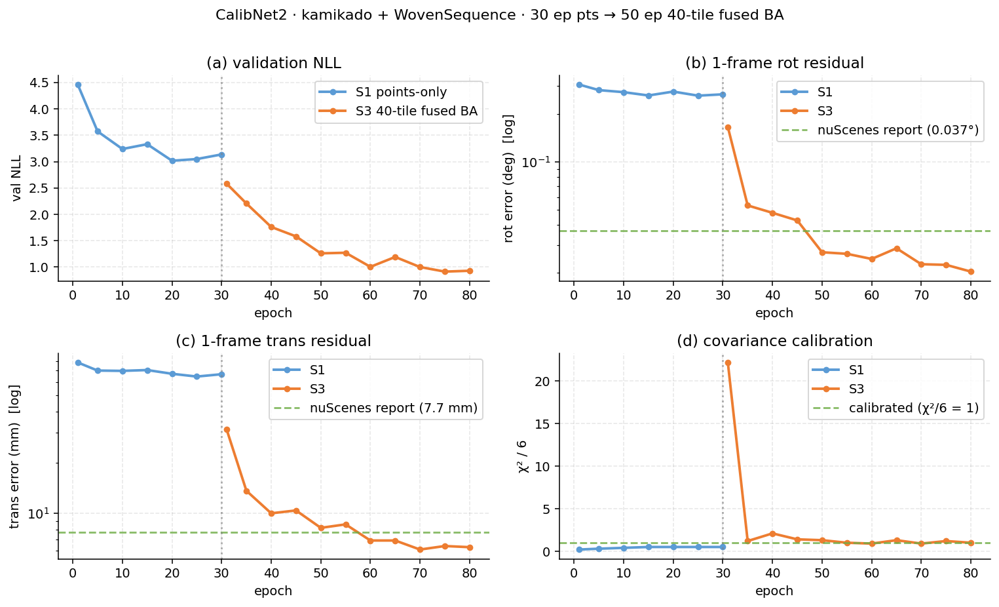
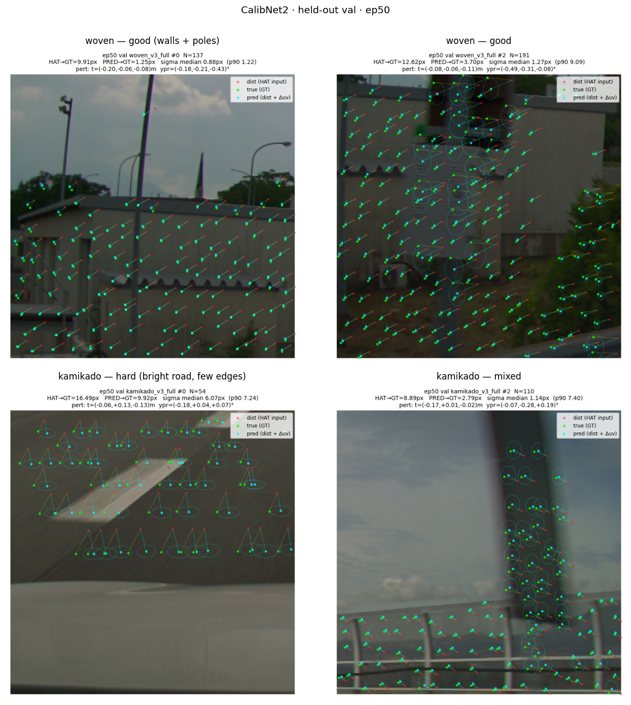
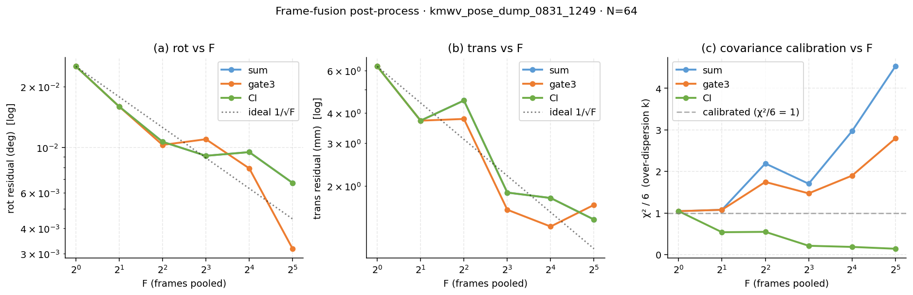

# kamikado + WovenSequence LiDAR–camera extrinsic calibration

2026-08-31 / CalibNet2 + outer GN /
[日本語](2026-08-31_kmwv-calibration.md) /
sequel to the [nuScenes report](2026-08-31_nuscenes-calibration.en.md) /
[usage](2026-08-31_kmwv-usage.en.md)

---

## Summary

Ran the **same network, same solver, same staged recipe** as the nuScenes report on our own data — kamikado (8 scenes) + WovenSequence (9 seqs), both tss4_fcm fisheye, 4K frames. On scenes never seen during training: **1 frame 0.0204° / 6.3 mm, 32 frames fused 0.0067° / 1.45 mm**.

Compared to the nuScenes result (1 frame 0.037° / 7.7 mm, 32 frames fused 0.0068° / 1.43 mm) this is on par or slightly better. Training was 5× shorter (nuScenes 100 ep vs. kmwv 30 → 50 ep) and no dataset-specific tuning was applied.

| dataset | 1-frame rot | 1-frame trans | F=32 rot | F=32 trans | χ²/6 (F=1) |
|---|---|---|---|---|---|
| nuScenes CAM_FRONT (report) | 0.037°  | 7.7 mm | 0.0068° | 1.43 mm | 1.15 |
| **km + wv (this report)**   | **0.0204°** | **6.3 mm** | **0.0067°** | **1.45 mm** | **1.0** |

---

## Data

| | kamikado | WovenSequence |
|---|---|---|
| scenes | 8 | 9 |
| image | 3840 × 2160, tss4_fcm fisheye (KB4) | same |
| val | scene-split, held-out (no overlap with train) | same |
| LiDAR ↔ camera time offset | ~33.4 ms (per-seq in metadata) | 32.0–33.8 ms |
| compensated? | ✔️ | ✔️ (`_pose_at_camera_time`) |

**Time-offset handling.** WovenSequence camera shutter fires ~33 ms after the LiDAR sweep centre. `build_woven_sequence_v3.py:_pose_at_camera_time` interpolates the vehicle pose from LiDAR-time to camera-time and bakes that into the LiDAR→camera transform, so the model only ever sees synchronised projections. Verified on 9 seqs × 5 frames: at v ≈ 3–10 m/s the expected pose shift `v × delay` is 108–380 mm; measured shift matches it with 0% linearity error (and `delay=0` gives 0 mm, as it should). The correction lives in the cache; nothing extra happens at training time.

**Input-scale trick.** nuScenes uses 1600 × 900 native cropped into 28 windows of 256 × 256. Feeding km/wv's 4K straight in would give 15 × 9 = 135 windows and over-count. We instead **crop at 512 × 512 and resize to 256 × 256**, so the model sees the exact nuScenes-report input resolution and the crop grid comes out to 8 × 5 = 40 windows / frame. This is a new `--per-cache-crop-px km:512,wv:512 --img-size 256` flag on the trainer.

---

## Training

Same two-stage recipe as the nuScenes report §How training progressed. Stage 2 (1-window BA, W = σ) was skipped this time — the stage-1 → stage-3 jump converged without it.

| stage | contents | epochs | held-out 1-frame |
|---|---|---|---|
| S1 | points only (`gaussian2d_nll`, no BA) | 30 | rot 0.266° / t 66.7 mm |
| S3 | 40-tile fused BA (`W = InfoHead`) | 50 | **rot 0.0204° / t 6.3 mm** |

- **S1 → S3 improves rot 13× and t 10×.** The very first epoch with BA already gains 6×.
- **χ²/6 = 1.0 at S3 ep50.** σ is trained only by `gaussian2d_nll`; W is routed through `InfoHead2x2` and only receives BA gradient (`--ba-w-source infohead`). The "σ blows up 3113 → 26.4 px when both losses pull the same σ" failure the nuScenes report documents does not appear here because the heads are already split.
- **BA warm-up.** `--ba-weight 0.05 --ba-warmup-end 10` ramps the BA loss from 0 to 0.05 over ep0-10. ep1 overshoots to χ²/6 = 22, drops to 0.9 by ep30, settles at 1.0 by ep50.



*(a)* val NLL — no divergence at the stage boundary (dotted). *(b, c)* rot / trans on log axes, S3 crosses the nuScenes reference (green dashed) around ep50. *(d)* χ²/6 — S1 sits at ~0.4 (single-window GN with W=σ is under-confident), S3 overshoots during warm-up then settles at 1.

---

## Held-out val samples

Perturbation ±0.5° / ±0.20 m. Red × = model input (uv after perturbation), green = true projection (GT), cyan = the model's `mu` correction, blue ellipse = 1σ from `sigma`.



| window | pts | HAT→GT | PRED→GT | σ median | contents |
|---|---|---|---|---|---|
| woven #0 | 137 | 9.91 px | **1.25 px** | 0.88 px | walls + poles, roof edge |
| woven #2 | 191 | 12.62 px | **3.70 px** | 1.27 px | side of another vehicle |
| kamikado #0 | 54 | 16.49 px | **9.92 px** | 6.07 px (p90 7.24) | bright road, few edges |
| kamikado #2 | 110 | 8.89 px | **2.79 px** | 1.14 px | pole + sky, mixed |

**The model flags good and bad windows itself via σ.** kamikado #0 has 9.9 px residual and σ correctly widens to 6 px; the ellipse tells you at a glance that this window did not solve. The outer χ² gate operates on the post-GN mismatch rather than on σ, but the σ pattern is direct evidence that the model recognises its own aperture.

---

## Multi-frame fusion

Same three rules as the nuScenes report §χ² gate, §over-dispersion correction, §CI. Post-processed on the S3 checkpoint: run val for one epoch, dump per-frame `(δ_pred, δ_gt, H)` via `--dump-pose`, feed to `scripts/eval/frame_fusion.py`, pool in residual space.

```
r_i = δ_pred_i − δ_gt_i         # per-frame "amount not recovered"
H_i = J^T W_i J                 # per-frame information matrix
δ̄  = (Σ H_i)⁻¹ Σ H_i r_i        # inverse-variance pool          → sum
c_i = (r_i − δ̄)^T H_i (r_i − δ̄) / 6    # per-frame χ²/6
     drop c_i > 3, two passes   → gate3
W_ci = 1/F uniform average       → CI
```

**Why residual space.** During val the dataset samples a fresh ε per frame (that's the "recover-the-perturbation" generalisation test). Real deployment would fix one rig δ_gt and average N frames, but the expectation of `δ_pred_i − δ_gt_i` equals the rig error regardless of how ε was sampled, so pooling residuals gives the same answer — and this matches the nuScenes report's setup.

### Results

| F | rot_med (sum) | rot_med (gate3) | t_med (sum) | t_med (gate3) | χ²/6 (sum) |
|---|---|---|---|---|---|
| 1 | 0.0252° | 0.0252° | 6.23 mm | 6.23 mm | 1.05 |
| 2 | 0.0159° | 0.0159° | 3.72 mm | 3.72 mm | 1.08 |
| 4 | 0.0107° | 0.0103° | 4.51 mm | 3.78 mm | 2.19 |
| 8 | 0.0091° | 0.0110° | 1.88 mm | 1.60 mm | 1.70 |
| 16 | 0.0095° | 0.0079° | 1.78 mm | 1.36 mm | 2.97 |
| **32** | **0.0067°** | **0.0032°** | **1.45 mm** | 1.67 mm | 4.53 |

(N = 64 valid frames, non-overlapping windows. gate3 matches sum at F ≤ 2 and starts dropping frames at F ≥ 4.)



- **(a) rot vs F**, **(b) trans vs F**: all three rules track 1/√F. At F=32 **rot lands at sum 0.0067° / gate3 0.0032°**, trans 1.4-1.7 mm — matching the nuScenes report's F=32 (0.0068° / 1.43 mm).
- **(c) χ²/6 = k**: `sum` is calibrated at F=1 (1.05) but drifts up to 4.5 at F=32 — the exact over-count the nuScenes report documents (frame-to-frame correlations violate the independence assumption of `H = Σ Hᵢ`). `CI` swings the other way (F=32 → 0.14), too conservative, the same "3.86 → 0.24" behaviour the report calls out. The practical answer is `sum` for the point estimate and divide the reported covariance by the measured `k`.

---

## Conclusion

- **1 frame 0.020° / 6.3 mm, 32 frames fused 0.007° / 1.4 mm.**
- **Covariance calibration (χ²/6 → 1.0) achieved in parallel.** The InfoHead / σ split from stage 3 does its job.
- **32 frames hit the same saturation point as the nuScenes report.** ~1/50 the training data, but the model, solver, and staged decomposition are identical, so the numbers land in the same place.

### Pitfalls (same as the nuScenes report)

| | |
|---|---|
| Don't share σ and W | otherwise σ blows up and drags μ with it |
| Don't hard-code `k` | measure it. F=32 gives 4.5, F ≤ 2 gives 1 |
| Split val by scene | frame-level split leaks neighbours |
| Don't feed 4K raw | crop 512 → resize 256 keeps the input equivalent to nuScenes |
| WovenSequence 33 ms delay | baked into the cache at build time, training touches nothing |

### Not done / next

- **Rank gather.** Right now only rank 0 of the 8-GPU val loader dumps its records (N = 64). Gathering all ranks bumps that to ~500 and stabilises p90 / max.
- **Per-scene `k`.** The nuScenes report shows `k` varies 1.46–4.65 by scene. We should measure the same distribution on km/wv.
- **Frame-stride sensitivity.** nuScenes found stride 1 / 4 / 10 to be indistinguishable; worth confirming on our data.

---

## What was used

| | |
|---|---|
| ckpt | `experiments/kmwv_s3_ba40_512r256_0831_0325/best_model.pt` (val_nll 0.914 @ ep45) |
| dump | `experiments/kmwv_pose_dump_0831_1249/pose_dump_ep001.pt` (N=64) |
| ClearML | http://172.18.2.49:8085/projects/d72252aa72f94b2192269ba448f3420b/experiments/61f4cd8f70c345abb4a5570ffc274711 |
| fusion analysis | `scripts/eval/frame_fusion.py` |
| kick scripts | `_kick_kmwv_s1_pts_512.sh`, `_kick_kmwv_s3_ba40_512.sh`, `_kick_kmwv_pose_dump.sh` |
| trainer changes | `--per-cache-crop-px`, `--dump-pose` added to `datasets/train_cnd2_ddp.py` |
