# nuScenes LiDAR–camera extrinsic calibration

2026-08-31 / CalibNet2 + outer GN /
[日本語](2026-08-31_nuscenes-calibration.md)

---

## Summary

Learned the LiDAR ↔ camera extrinsic parameters on nuScenes. On scenes never seen
during training: **0.037°/7.7 mm for a single frame, 0.007°/1.4 mm fusing 30
frames** (0.11 px in image terms). One network handles all 6 cameras.

Three points matter in practice.

**1. No iteration needed.** The iteration is entirely internal to the network
(4 weight-shared blocks); the outer Gauss-Newton is solved just once. No worry
about the convergence point depending on how good the initial value is.

**2. Can run online.** Few samples are needed; inference for one frame is just
28 crops of 256×256. Using a common backbone such as DINOv3 lets it share
features with detection.

**3. You can draw a line that says "this is enough."** ← the most important point

A handful of frames already gets decent accuracy, and a few dozen frames
approach machine precision. Beyond that, **you can observe whether enough
information has been captured in each of the 6-DOF directions**, so you can
state numerically how confident you are that all axes fall within 0.01° and
1 cm. Whether to collect more frames or to stop is a decision made from
numbers, not gut feeling.

However, the covariance obtained by simply summing `H = Σ Hᵢ` is
**overconfident** (F=32 gives χ²/6 = 3.16, i.e. the reported sd is 1/1.8 of
the actual value). You need to measure χ² and look at the covariance divided
by the overdispersion coefficient `k`, and `k` differs per dataset (1.46–4.65
per scene), so you only find out by running it. The pattern is: measure χ²
sequentially, update `k`, and stop once a threshold is crossed.

### Pitfalls

| | |
|---|---|
| Don't make σ and W the same | If the point NLL and BA pull the same σ in opposite directions, σ balloons from 2.3 to 26.4 px and both the points and the pose break |
| Don't fix `k` to a constant | Derive it from the data. A fixed value ends up either overconfident or too conservative |
| Split val by scene | Splitting by frame lets adjacent frames leak into train |
| Not absolute accuracy | Tracking accuracy for a perturbation applied against the dataset's `calibrated_sensor` as ground truth |

### What's needed

| | |
|---|---|
| Data volume | 100 scenes / a few thousand frames is enough. Unlike detection, there is no tail |
| Collection | Drive for a few minutes, gather about 30 frames. Spacing frames out over time beats capturing them back-to-back |
| Prerequisite | LiDAR ↔ vehicle body already fixed. That part is handled separately, via hand-eye or SMORE + IMU |

---

## Background

Self-driving cars use LiDAR and cameras together. The two sensors are mounted
in different places, so computing where a 3D point measured by LiDAR lands in
the image requires **the relative position and orientation between the two
sensors (extrinsic parameters, 6-DOF)**. This is extrinsic calibration.

If this is off, everything downstream is off.

- Paint LiDAR points with image color or semantic labels → the wrong object's color gets attached
- Fuse camera and LiDAR for 3D detection → the same car appears doubled
- Reconstruct with Gaussian Splatting → the outlines blur

nuScenes has a 100° field of view at 1600 px width, so **1° = 16 px**. A 0.1°
error is 1.6 px, 0.5° is 8–9 px — enough to miss a pedestrian's whole outline
at 10 m.

### There are two ways to do extrinsic calibration

**Method 1: derive it from trajectories (hand-eye)**

A vehicle-body reference point like REAR_AXLE can't be observed from outside.
Assuming rigid-body motion, you solve for the relative pose from the
difference between the trajectories each sensor traces. This is also how
LiDAR-only and camera-only calibration works.

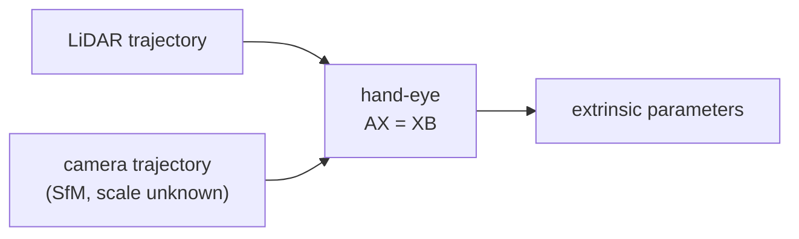

The problem is on the camera side. **Monocular has no scale**, so you have to
solve SfM, and its accuracy sets the ceiling. LiDAR measures distance
directly, so its scale is fixed, which makes it the easier side to work with.

**Method 2: fix LiDAR as the reference and align the camera to it**

If LiDAR is available, it's more reliable to first calibrate LiDAR from its
trajectory, and **then align the camera to LiDAR**.

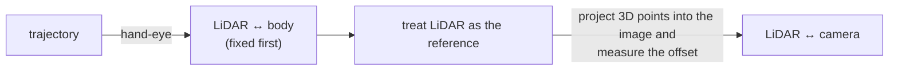

**This report covers the second half of Method 2.** Assuming LiDAR is
correct, it derives the camera's relative position and orientation as seen
from LiDAR. Because LiDAR directly gives 3D points, there is no scale
ambiguity to begin with, and it can be solved even from a single frame.

### The relationship to REAR_AXLE or IMU is not strictly required

There is no need to accurately determine the positional relationship to the
vehicle-body reference point (REAR_AXLE). **It's not observable in the first
place**, and it isn't needed either.

Same for IMU. What IMU provides is a second-derivative physical quantity, so
even if the extrinsic is somewhat off, **it gets absorbed during fusion**.

Only two things are actually needed.

| | |
|---|---|
| Camera and LiDAR are consistent with each other | ← what this report addresses |
| Camera and LiDAR trajectories can be obtained | Local motion can be obtained from images. For LiDAR, a point-cloud registration method like SMORE gets it accurately |

A local trajectory is enough, so there's no need to bring in a global
reference point.

### It needs to be correctable while driving

Extrinsic parameters aren't something you set once at the factory and forget.
Vibration, temperature, accidents, and part replacement all cause drift. It
needs to **detect and fix the drift on its own while driving**. Classical
target-based methods (checkerboards etc.) only work in the factory, so a
method that works from driving data alone is needed.

---

## Principle

**There is a ground-truth parameter. Just apply arbitrary perturbations and
learn how to undo them.**

Given one set of LiDAR-camera extrinsic parameters, you can inject any amount
of offset into it. Since the injected offset is known, you can generate
unlimited supervision. No manual labels are needed. All the network does is
"look at the offset projection and the image, and say how much it's off, per
point."

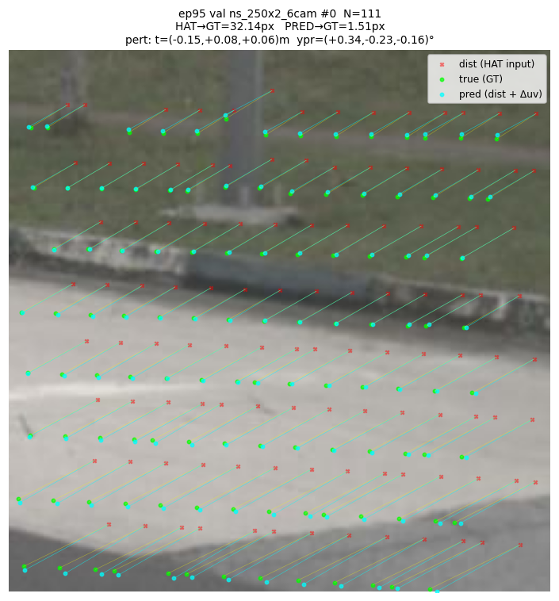

A val figure from training (unedited). Red × is the projection offset by
0.5°/0.20 m, green is where the LiDAR point actually lands, cyan is the
position recovered by the network's `mu`. The line is that movement.
**A 32.14 px offset is recovered down to 1.51 px.**

The input is just this one image and the LiDAR points. Neither the pose nor
known correspondences are given. The network extracts patterns from curbs and
poles, and detects the overall offset by integrating across the whole window
with self-attention and cross-attention. 28 of these windows are bundled
together and a single GN solves for the 6-DOF.

### Windows that succeed, windows that don't, and σ

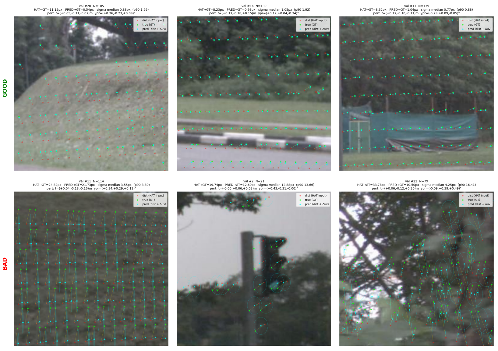

6 val windows using the same trained weights. `HAT→GT` is the perturbation
magnitude, `PRED→GT` is the residual after recovery, `sigma median` is the
uncertainty the network reports. The cyan ellipse is 1σ.

| | points | perturbation | residual | **σ median** | content |
|---|---|---|---|---|---|
| GOOD #20 | 105 | 11.15 px | **0.54 px** | 0.88 px | slope and grass |
| GOOD #14 | 139 | 8.23 px | **0.93 px** | 1.05 px | guardrail and grass |
| GOOD #17 | 139 | 8.32 px | **1.04 px** | 0.77 px | protective sheet and posts |
| BAD #11 | 114 | 24.82 px | **21.73 px** | 3.55 px | uniform grass |
| BAD #2 | 21 | 19.74 px | **12.60 px** | 12.88 px | traffic light and sky, 21 points |
| BAD #22 | 79 | 33.78 px | **10.50 px** | 4.25 px (p90 16.4) | backlit branches, blown-out highlights |

**In good windows the ellipse is about the same size as the point; in bad
windows the ellipse is large.** Given structure with a clear boundary
(guardrails, posts, the edge of a slope), recovery reaches the 1 px range.

**σ genuinely widens in bad windows.** Good windows are 0.77–1.05 px, versus
3.55–12.88 px in bad windows — 3 to 13 times larger. In `#2`, σ of 12.88 px
and the residual of 12.60 px nearly match, correctly self-reporting that with
only 21 points and mostly sky it can't be solved. With a threshold, σ alone
is enough to reject it.

Note that the outer χ² gate judges not by σ but by **the disagreement after
solving the GN**, `(δᵢ−δ̄)ᵀHᵢ(δᵢ−δ̄)`. σ is a per-point quantity, but what
the gate wants to see is "does the 6-DOF this window (frame) produced agree
with the others," which is a different layer.

**Fusing 30 frames while controlling the covariance so it doesn't become
overconfident works reasonably well.**

A single frame plateaus at 0.037° (0.6 px). Adding frames brings this down,
but naively summing overcounts information and makes the covariance
overconfident. The control happens in 3 stages.

| Where | What's done |
|---|---|
| **Within a point** | Make `σ` (the point's own uncertainty) and `W` (its effective contribution to the 6-DOF) **separate heads**. Making the same σ do both breaks it |
| **Within a frame** | Fuse 28 windows into a single GN. `W` discounts the correlation between windows |
| **Across frames** | Reject outlier frames with the χ² gate, sum the remaining normal equations, and divide the covariance by an overdispersion coefficient `k` **derived from the data** |

`k` can't be a fixed value. Measurements show it varies 1.46–4.65 per scene
(F=8), so **to get the variance right you need to measure χ² and derive `k`
from the data**.

With this, 30 frames brings it down to 0.007° (0.11 px). **Almost the entire
content of this report is about this "covariance control."**

---

## Result

On scenes never seen during training: **0.037°/7.7 mm for a single frame,
0.0068°/1.4 mm fusing 32 frames** (0.11 px in image terms). One network
handles all 6 cameras, and it works to a similar degree on every one of them.
It can detect a 0.03°/8 mm offset at 3σ within 4 seconds (8 frames).

Covariance control breaks into three parts.

| | What's done |
|---|---|
| **Within a point** | Make σ (the point's own uncertainty) and W (effective information toward the 6-DOF) separate heads |
| **Within a frame** | Fuse 28 windows into a single GN. W discounts the correlation |
| **Across frames** | Reject outliers with the χ² gate, sum the rest, divide by the overdispersion coefficient k |

Letting the same σ be pulled by both the point NLL and the BA balloons σ from
2.3 to 26.4 px, and breaks both the points and the pose. Separating them
drops χ²/6 from 3113 to 1.0.

This is however **not absolute accuracy**. It's the amount by which a
perturbation applied against nuScenes' `calibrated_sensor` as ground truth is
recovered; the correctness of that ground truth itself can't be measured
within the dataset.

---

## How the training was staged

Training everything at once breaks. **Split into 3 stages, resuming from the
previous stage's weights.**

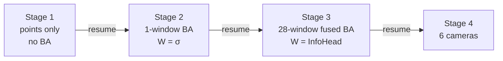

| Stage | What's trained | held-out 1 frame | Why this order |
|---|---|---|---|
| 1 | Points only (`gaussian2d_nll` only) | rot 0.1829°/72.8 mm | Introducing BA before μ and σ are usable causes divergence |
| 2 | 1-window BA (`W = σ`) | 0.1716°/60.5 mm | First get GN working with a single window |
| 3 | 28-window fused BA (`W = InfoHead`) | **0.0247°/4.9 mm** | This is where the order of magnitude changes |
| 4 | 6 cameras | 0.021–0.031° across the 6 cameras | Extend to side and rear |

**A caution when introducing BA in Stage 3.** Starting with `ba_weight` at
0.5 from ep0 causes divergence. Since the untrained InfoHead has
zero-initialized final layer, `W` is the constant 0.4818·I (the same weight
for every point), giving a BA loss of 5285 and a gradient of 2.0e6. Set
`--ba-weight 0.05` and ramp it up from 0 with `--ba-warmup-end 10`.

50 epochs is enough for CAM_FRONT (ep40 0.0304° → ep50 0.0256°, and even
running to 80 plateaus at ep75 0.0244°). 6 cameras converges slower and needs
100.

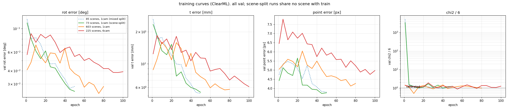

ClearML val curves. All are scene-split (no shared scenes with train).
`chi2/6` drops from the 3000s to around 1 within the first few epochs and
doesn't move after that. This is **calibration happening entirely on the
InfoHead side, with σ kept fixed to the point NLL**.

6 cameras (red) starts higher than 1 camera and converges more slowly. It's
harder because side and rear geometry are added, and it only reaches the
1-camera level after 100 epochs.

---

## Numbers

Held-out scenes, 6 cameras, `cam6_250x2_100ep`. χ² gate (threshold 3) + sum
of normal equations.

| F | time | rot | t | image equiv. | χ²/6 |
|---|---|---|---|---|---|
| 1 | — | 0.0366° | 7.71 mm | 0.59 px | 1.15 |
| 2 | | 0.0242° | 4.93 mm | 0.39 px | 1.43 |
| 4 | | 0.0165° | 3.25 mm | 0.26 px | 1.80 |
| 8 | | 0.0117° | 2.47 mm | 0.19 px | 2.16 |
| 16 | | 0.0080° | 1.75 mm | 0.13 px | 2.61 |
| **32** | | **0.0068°** | **1.43 mm** | **0.11 px** | 3.16 |

The input perturbation is 0.5°/0.20 m (8–9 px in the image). 1° = 16 px
(1600 px / 100°).

Since the extrinsic parameters are fixed per vehicle, frames can be summed
across scenes. Going from 16 → 32 only gains a factor of 0.85 (theoretical
0.707), so it **plateaus at 32 frames**.

### By camera

| Camera | F=1 | F=8 | F=32 | cond(H) |
|---|---|---|---|---|
| CAM_FRONT_RIGHT | 0.0354° | 0.0112° | **0.0048°** | 2.55e+03 |
| CAM_FRONT_LEFT | 0.0387° | 0.0139° | 0.0064° | 4.93e+03 |
| CAM_BACK_LEFT | 0.0320° | 0.0095° | 0.0067° | 2.18e+03 |
| CAM_FRONT | 0.0332° | 0.0105° | 0.0076° | 2.21e+03 |
| CAM_BACK | 0.0377° | 0.0111° | 0.0078° | 3.41e+03 |
| **CAM_BACK_RIGHT** | 0.0470° | 0.0179° | **0.0120°** | **4.47e+03** |

`CAM_BACK_RIGHT` alone is 1.5–2.5 times worse. The cause is **geometry** — it
has the largest condition number. There is no systematic error (bias) and no
time correlation; the point error is actually the second-smallest (3.71 px).

Per-DOF posterior sd for 1 frame:

| Camera | wx (mdeg) | wy | wz | tx (mm) | ty | tz |
|---|---|---|---|---|---|---|
| CAM_BACK_LEFT | 32.4 | 15.2 | 50.5 | 3.9 | **8.4** | 4.4 |
| CAM_FRONT | 32.1 | 15.6 | 51.8 | 4.0 | 9.2 | 4.7 |
| CAM_BACK_RIGHT | **50.3** | 14.7 | **67.9** | 4.0 | **15.0** | 4.0 |

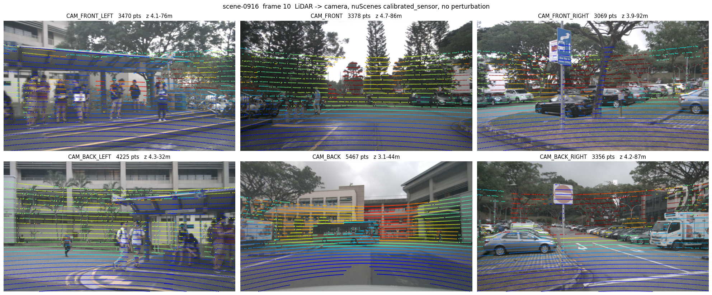

Projection for all 6 cameras (no perturbation, `calibrated_sensor` as-is).
Top row is the 3 front cameras, bottom row is the 3 rear cameras. Color is
distance.

`wx` (pitch) / `wz` (roll) / `ty` (vertical) are 1.5–1.8 times worse on the
bad camera. `wy` / `tx` / `tz` are the same across all cameras. Point count
(112–124), distance distribution (z median 13–17 m), and spread within the
image show no difference, so it's a matter of **layout**, not amount of
points.

### Weather

CAM_FRONT, val over 850 scenes.

| Condition | n | rot median | p90 | max | t | point error | χ²/6 |
|---|---|---|---|---|---|---|---|
| Clear/day | 220 | 0.0256° | 0.0521° | 0.1988° | 4.1 mm | 3.16 px | 0.96 |
| Rain | 96 | 0.0394° | 0.0985° | **0.4284°** | 7.3 mm | 6.57 px | 0.95 |
| Night | 24 | 0.0329° | 0.0874° | 0.1228° | 7.5 mm | 4.10 px | 0.87 |

Rain gives 2.1x the point error. At night, points are still obtained but the
geometric information decreases. **χ²/6 stays 0.87–0.96 across every
condition**, so the model correctly reports its own degradation.

### Number of scenes

Compared on the same held-out set.

| Training scenes | rot median | p90 | rot max | t max |
|---|---|---|---|---|
| 10 | 0.0308° | 0.0744° | **1.0248°** | **158 mm** |
| 85 | 0.0241° | 0.0518° | 0.1318° | 40 mm |

**The median barely depends on the number of scenes. What changes is the
tail** (max is 8x). The tail comes from weather.

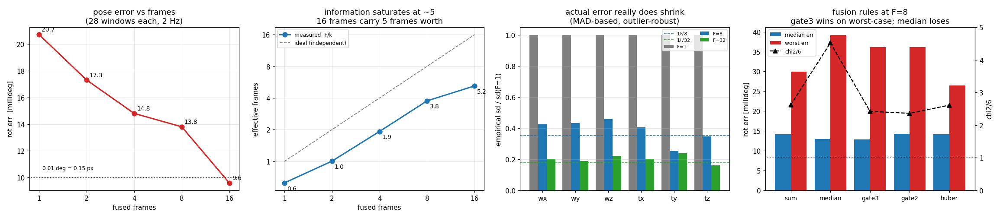

---

## What made the difference

### Separating σ from the information matrix

Where does `W` in `H = Σ JᵀWJ` come from. Per-point `σ` is supervised by
`gaussian2d_nll` as "that point's own uncertainty." Using the same σ in the
BA's `−½logdet H` too makes the two losses pull the same parameter in
opposite directions.

| | What it demands of σ |
|---|---|
| Point NLL | Match this point's actual error |
| BA | The H summed over 28 windows is overconfident, so widen it |

Measured: σ balloons from 2.28 to 26.4 px (11.6x), point error goes from 4.15
to 7.77 px, rot from 0.046 to 0.185°.

**The correct separation:**

| | What it learns | Loss |
|---|---|---|
| σ | The uncertainty this point holds on its own | `gaussian2d_nll` only |
| InfoHead | The **effective** information this point contributes to the fused 6-DOF | BA's pose NLL only |
| μ | Point correspondence | Both (shared) |

With `--ba-w-source infohead`, `make_info_from_sigma_rho` is no longer
called, and the BA gradient never reaches σ (measured: of the 106 parameters
that received a gradient via the BA path, 6 were `info_head`, and the σ
output was zero). **χ²/6 goes from 3113 to 1.0**, while σ stays at 2.28 px.

### The χ² gate

`H = Σ JᵀWJ` assumes each observation is independent. Neither the 28 tiles
within a frame nor observations across frames are independent. An outlier
frame's χ² spikes at the same time, so it can be rejected without ground
truth.

```
δ̄  = (Σ Hᵢ)⁻¹ Σ Hᵢ δᵢ
cᵢ = (δᵢ − δ̄)ᵀ Hᵢ (δᵢ − δ̄) / 6  >  3   → drop    (2 iterations)
```

| F=8 | rot median | rot worst | χ²/6 |
|---|---|---|---|
| sum | 0.0142° | 0.0299° | 2.62 |
| median | 0.0129° | 0.0392° | 4.52 |
| **gate3** | **0.0128°** | 0.0233° | 2.42 |

**Taking the median is a loss** — it throws away the weight of good frames.
Keep "reject" and "sum" separate.

### Overdispersion correction

Measure `k = χ²/6` and use `Σ = (H/k)⁻¹`. The same operation as the
dispersion parameter `φ̂ = X²/(n−p)` in GLM quasi-likelihood. **For F ≤ 8,
fix k = 2**; at F=32 it's 3.2.

k varies 1.46–4.65 by scene, but rot itself is stable (0.0047–0.0153° at
F=8, with 10 of 11 scenes in 0.0084–0.0153°). **Only the covariance varies.**

---

## What did not work

| What was tried | Result |
|---|---|
| **rank-k truncation** (reducing each frame's information to only its principal direction) | Accuracy breaks. At F=16, rank1 gives 0.155° (18x sum). A single frame's `H` carries information in all 6 directions |
| **CI (uniform weight 1/F)** | The estimate exactly matches sum (`1/F` cancels out in `H⁻¹b`). χ²/6 goes from 3.86 to 0.24 — overly conservative |
| **CI (optimized weight, maximizing logdet)** | All the weight collects onto one frame. Per-DOF complementarity is weak (rank correlation 0.40–0.94) |
| **Random effects (DerSimonian–Laird)** | Direction is right but τ² is underestimated. With the moment estimator `T`, χ²/6 only drops to 2.21, and only reaches 1.00 after scaling by 9.68x |
| **Fusion across scenes** | Same as or worse than within the same scene (effective 2.94 vs 3.59 at F=8). The cause of saturation is not a systematic error shared across scenes |
| **Spacing frames apart** | Effective count at F=16 for stride 1 / 4 / 10 is 5.2 / 3.7 / 3.9. No improvement |
| **Fusing 6 cameras into a single δ** | Doesn't hold, since each camera's extrinsic parameters are an independent unknown |

### Log of tracking down why CAM_BACK_RIGHT is bad

It wasn't systematic error, timestamps, or intrinsics.

| Suspected cause | What was measured | Result |
|---|---|---|
| Systematic error (calibration offset) | Signed bias per DOF `\|mean\|/sd` | 0.01–0.22 across all DOFs. No bias |
| Mount looseness | Autocorrelation of the error (lag 1/2/4) | −0.31 to +0.12. No time correlation |
| Intrinsics | Image-position dependence / radial component of the residual | Radial component 0.124 (others 0.027–0.186). Not an outlier |
| Timestamp | Correlation between speed and residual | 0.069. No correlation |
| **Geometry** | **Condition number of H** | **Largest at 4.47e+03. This is the cause** |

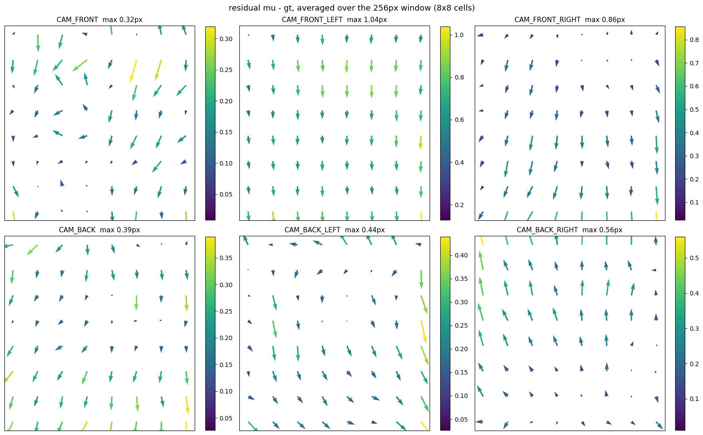

The residual `mu − gt` averaged into an 8×8 grid of cells within the 256px
window. Position-dependent structure would indicate an intrinsics error, but
`CAM_BACK_RIGHT` shows no distinctive pattern.

---

## What these numbers do not mean

**Not absolute accuracy.** It measures how much δ can be recovered, where δ
was injected against nuScenes' `calibrated_sensor` as ground truth. If
nuScenes itself has a bias, it rides on both the injection side and the
evaluation side and cancels out. There's nothing to compare against within
the dataset, so absolute accuracy can't be measured.

Two more conditions that are easier than real deployment:

- `delta_gt` is a value solved by feeding GT correspondences into **the same GN**. The solver's systematic error cancels out
- The LiDAR points' 3D positions are used as ground truth. Ranging error and beam-angle error don't enter

On the other hand, **it isn't overconfident**. 150 points/window × 28 windows
× 16 frames = 67000 points, point residual 3.6 px / √67000 = 0.014 px. The
measured 0.15 px is 10x that — on the worse side of the theoretical limit.

What's determined without an oracle is "consistency," not "correctness." The
intended use is to align once at shipping time with an oracle (target
calibration, hand-eye), and then use this method to monitor drift afterward.
**It can detect a 0.03°/8 mm offset at 3σ within 4 seconds (8 frames).**

### The assumption that LiDAR is correct also breaks down over time

This method assumes "LiDAR ↔ vehicle body is already fixed" (Method 2 in
Background). That assumption itself breaks down over time while driving.

- LiDAR also drifts while driving. Overtrusting POS LV becomes a problem
- Once LiDAR ↔ camera has been aligned, **over short timescales the camera side is more reliable**
- But over longer time, both drift equally

So **this method alone is not a complete calibration**. In particular, if the
LiDAR mount shifts, LiDAR ↔ vehicle body needs to be redone from scratch.

For that part, SMORE can obtain the LiDAR trajectory, so **comparing against
IMU gives a rough correction of the LiDAR ↔ vehicle body position**.

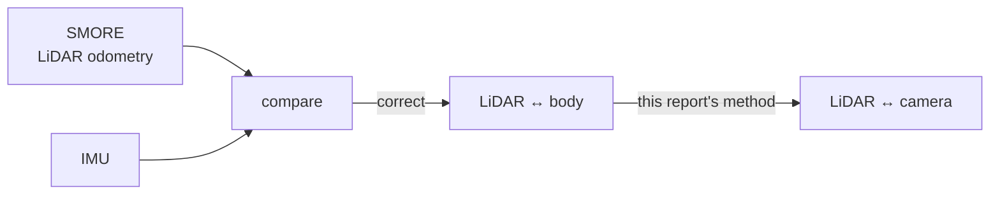

### Timestamps

Not a problem. It's stated explicitly in the paper.

> "the exposure of a camera is triggered when the top lidar sweeps across the
> center of the camera's FOV. The timestamp of the image is the exposure trigger
> time; and the timestamp of the lidar scan is the time when the full rotation
> of the current lidar frame is achieved."

Measurements also show azimuth and `dt` are linear with **residual rms
0.00 ms**, and the slope gives 50.0 ms per rotation (matching LiDAR 20 Hz).
The correlation between high-error frames and `dt` deviation is **+0.002**.

| Camera | dt = camera − LiDAR |
|---|---|
| CAM_FRONT_LEFT | −43.5 ms |
| CAM_FRONT | −35.9 ms |
| CAM_BACK_LEFT | −0.9 ms |

`ego_pose` is a separate record per sensor, and the projection uses the pose
at each sensor's shutter time. That `ego_pose` itself, though, is a value
nuScenes constructed by interpolation, and the quality of that interpolation
wasn't measured.

---

## Procedure

1. **Calibrate the single-frame covariance** — σ is dedicated to the point NLL, the GN weight is InfoHead
2. **Drive for a few minutes and collect about 30 frames** — plateaus at 32 frames. Spacing frames out over time beats capturing them back-to-back
3. **Reject with the χ² gate** — `cᵢ > 3`, 2 iterations. No GT needed
4. **Sum the remaining normal equations** — `H = Σ Hᵢ`, `δ = H⁻¹ Σ Hᵢ δᵢ`
5. **Divide the covariance by k** — k = 2 for F ≤ 8, 3.2 for F=32

What you get: **rot 0.007°/t 1.4 mm**.

### Correspondence to existing methods

| Part | Name |
|---|---|
| Reject | χ² validation gate (Bar-Shalom, NIS gating. Same as outlier rejection in g2o/GTSAM) |
| Sum | inverse-variance pooling (fixed-effect meta-analysis. The same formula as a Kalman measurement update) |
| Discount | Overdispersion correction (GLM quasi-likelihood `φ̂ = X²/(n−p)`). The same quantity as the design effect in survey sampling, or NEES in SLAM |
| Theory of overcounting | Godambe sandwich information matrix from composite likelihood |
| Unimplemented alternative | Inverse Covariance Intersection (Noack et al., Automatica 2017) |

What's new is only the part where a network learns the per-point information
matrix that builds `H`.

---

## The network

The network doesn't output a pose. It outputs only **the per-point
correspondence offset and its uncertainty**, and the outer Gauss-Newton
solves the 6-DOF. The GN has no learned parameters at all.

### Overview

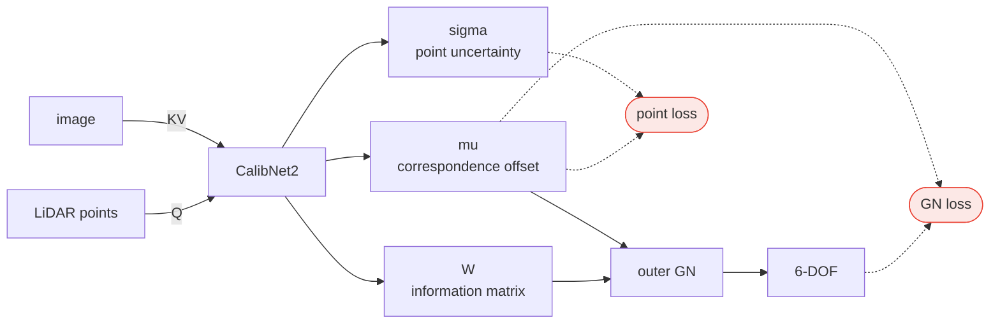

**Image is KV, LiDAR is Q.** Each LiDAR point is one query, and it looks up
image features.

**There are two losses, and they connect to different places.**

| Output | Point loss | GN loss |
|---|---|---|
| `mu` (correspondence offset) | ○ | ○ ← **shared** |
| `sigma` (point uncertainty) | ○ | — |
| `W` (information matrix) | — | ○ ← **separate** |

Making `sigma` and `W` the same breaks it. σ should express "that point's own
uncertainty," and `W` should express "its effective contribution to the
6-DOF" — the two demands point in opposite directions.

### Detail

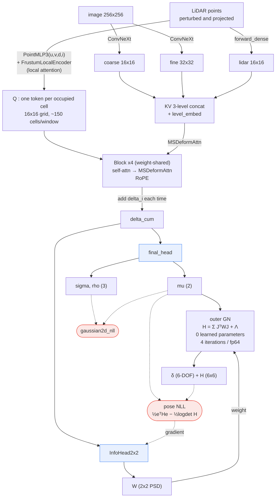

### Query — one token per occupied cell

```python
q_in = [u/img_size, v/img_size, d, intensity]   # the cell's representative point
q    = point_mlp(q_in)                          # PointMLP3
q   += frustum_enc(query_uvd, bucket_uvd, ...)  # FrustumLocalEncoder
```

The token is **per occupied cell, not per point**. The crop is binned into a
`grid_n × grid_n` grid (16×16 at 256 px), one representative LiDAR point is
taken per cell near its centre, and its `(u, v, d, intensity)` is embedded.
About 150 of the 256 cells hold LiDAR points in a typical window.

`FrustumLocalEncoder` then adds the local 3D structure around that cell, as a
**Point-Transformer-style local attention**: from the dense raw point cloud of
the same crop, take the `k` nearest neighbours by image-plane distance, use
their *relative* coordinates `(Δu, Δv, Δd, intensity)` as K/V and the cell's
token as Q, and run 2 layers of multi-head attention (Pre-LN + residual, K/V
rebuilt from the relative coordinates at each layer). Relative, so it is
translation-invariant in the image plane; the attention softmax, so it is
permutation-invariant over the neighbours.

So there are two stages of attention: this one **within the point cloud around
the cell**, and the later MSDeformAttn **between cell and image**.

### KV — 3 levels

| Level | Source | Resolution |
|---|---|---|
| coarse | ConvNeXt | 16×16 |
| fine | ConvNeXt | 32×32 |
| **lidar** | `FrustumEnc.forward_dense` | 16×16 |

**LiDAR also goes into KV**, not just the image. The 3 levels are
concatenated with `level_embed` added, and MSDeformAttn looks at all levels
in a single attend.

**For calibration alone, there's no need to put LiDAR into KV.** LiDAR
information is already in Q, so it's enough for Q to look up the image
alone.

It's included because **it will be needed when this extends to multi-frame
pose correction (i.e. odometry)**. There, LiDAR from other frames needs to be
aligned, and it can't be solved unless Q can look up another frame's LiDAR
from KV. The current setup anticipates that extension; looked at purely from
calibration, there's one extra pathway.

### Block — weight-shared × 4

```python
for _ in range(n_iter):                 # n_iter = 4
    q, delta_i = block(q, kv_flat, ...) # self-attn -> MSDeformAttn
    delta_cum += delta_i
```

The same weights, 4 times. **`delta_cum` (the accumulated residual), not `q`
itself, is passed to the readout.** `q` carries absolute positional encoding,
so reading it directly would leak position.

### Output

```python
raw    = final_head(delta_cum)
per_pt = clamp_params(raw)     # [mu_u, mu_v, log_sx, log_sy, rho], mu is in px
W      = info_head(delta_cum)  # (B, N, 2, 2) PSD, via Cholesky
```

| Output | Meaning | What trains it |
|---|---|---|
| `mu` (2) | Correspondence offset [px] | `gaussian2d_nll` |
| `σ, ρ` (3) | That point's own uncertainty | `gaussian2d_nll` |
| `W` (2×2) | The **effective** information that point contributes to the 6-DOF | BA's pose NLL |

The key point is that `σ` and `W` are separate heads (more on this later).
Both read the same `delta_cum`, but the losses are different.

### The outer GN

```
H = Σ Jᵢᵀ Wᵢ Jᵢ + Λ_prior          Λ_prior = diag(1/9, 1/9, 1/9, 1/0.09, ...)
b = Σ Jᵢᵀ Wᵢ eᵢ
δ = H⁻¹ b                          4 iterations, fp64, damping 1e-3
```

`J` is the rate of change of uv when a 3D point is moved by the 6-DOF. It's
fp64 because with `fx≈930`, the entries of `H` reach 1e7 while the prior is
0.1, giving a condition number of 1e9, and in fp32 the **backward pass**
through Cholesky produces NaN.

### 1 frame = 28 windows

The whole image is tiled in 256×256 windows, giving 28 windows.
`--share-pert` makes all 28 windows share **the same δ**, and `--ba-loss`
merges their normal equations into **a single GN**.

Each camera is handled independently (`share_pert` applies only within one
camera's 28 windows, and the GN doesn't cross cameras either). This is
correct since the extrinsic parameters are an independent unknown per
camera.

| | |
|---|---|
| Parameter count | 1.14M (256px / grid16) |
| Input | 256×256 crop, grid 16×16, 28 windows/frame |
| Perturbation | 0.5°/0.20 m, redrawn each time |

### Training stages

| Stage | Content | held-out 1 frame |
|---|---|---|
| 1 | Points only (no BA) | rot 0.1829°/t 72.8 mm |
| 2 | 1-window BA (W = σ) | 0.1716°/60.5 mm |
| 3 | 28-window fused BA (W = InfoHead) | **0.0247°/4.9 mm** |

---

## What to use

The repository still has files left over from old experiments. Only the
following are actually used.

| File | Role |
|---|---|
| `datasets/train_cnd2_ddp.py` | Training/eval main script |
| `datasets/pandaset_full.py` | Dataset |
| `models/calibnet2.py` | Network |
| `models/model_depth.py` | `InfoHead2x2` |
| `models/model_cov.py` | `gaussian2d_nll` |
| `scripts/ba/gn_pose.py` | The outer GN |
| `tests/system_test.py` | S1–S16. **Always run this before an experiment** |
| `scripts/preprocessing/build_nuscenes_v3.py` | Cache generation |
| `scripts/preprocessing/convert_tile_cache_to_lmdb.py` | LMDB conversion |

The 45 scripts under `scripts/training/`, and `pair_mode` /
`pandaset_pair.py` / `woven_sequence_pair.py`, are not used.

### Cache

```bash
python -u scripts/preprocessing/build_nuscenes_v3.py \
  --data-root <nuScenes>/trainval --meta-dir <nuScenes>/trainval/v1.0-trainval \
  --out <cache> --cams CAM_FRONT --stride 1 --frame-frac 0.075 \
  --val-frac 0.1 --workers 4          # don't add --tile
python -u scripts/preprocessing/convert_tile_cache_to_lmdb.py --cache <cache> --workers 4
```

`--scenes` narrows down the scenes. `scripts/scene_stats.py` outputs
geometry/metadata for 850 scenes, and `scripts/pick_scenes.py N` does
farthest-point sampling over `yaw_total` / `speed` / `dist` / `night` /
`rain` / `location`.

### Training

```bash
CACHE=<cache> python tests/system_test.py     # do not run experiments unless exit 0

python datasets/train_cnd2_ddp.py \
  --name <name> --cache <cache> \
  --resume-ckpt experiments/front_670x3/best_model.pt --start-epoch 0 \
  --epochs 50 --eval-every 5 --batch-size 4 --img-size 256 --grid-n 16 \
  --oversample 28 --workers 4 --scene-split --n-iter 4 --lr 3e-4 \
  --rot-deg 0.5 --t-m 0.20 --min-crop-px 256 --max-crop-px 256 \
  --use-info-head --share-pert --crop-grid --grid-frac 0.0 \
  --ba-loss --ba-iter 4 --ba-damping 1e-3 --ba-weight 0.05 --ba-loss-type nll \
  --ba-w-source infohead --ba-warmup-start 0 --ba-warmup-end 10 \
  --clearml --why "<what this experiment is meant to verify>"
```

Non-negotiable settings:

| | Reason |
|---|---|
| `--ba-w-source infohead` | With sigma, σ gets fought over between the point NLL and the BA and breaks |
| `--scene-split` | Without it, val becomes adjacent frames from the same scenes as train |
| `--ba-weight 0.05` / `--ba-warmup-end 10` | Setting 0.5 from ep0 causes divergence (BA loss 5285, grad 2.0e6 with an untrained InfoHead) |
| `--share-pert --crop-grid --grid-frac 0.0` | Fuses all 28 windows of the full image into a single GN |

50 epochs is enough for CAM_FRONT. 6 cameras needs 100.

### Weights

| | Trained on | held-out |
|---|---|---|
| `experiments/cam6_250x2_100ep/best_model.pt` | 6 cameras, 250 scenes | 0.021–0.031° across the 6 cameras, 0.0068° at F=32 |
| `experiments/front_670x3/best_model.pt` | 603 scenes, CAM_FRONT | 0.0244°/5.7 mm |
| `experiments/fuse28_infohead_scenesplit/best_model.pt` | 73 scenes, CAM_FRONT | 0.0247°, 0.0096° at F=16 |

For a fresh start, resume from `front_670x3`.

---

---

## Discussion

### Why go data-driven

A method that simply matches LiDAR edges to image edges breaks down on real
data.

| What happens | What happens to edge matching |
|---|---|
| Local drift from a hardware glitch | Just that frame stops matching |
| Camera timestamp is off | The whole thing shifts by however far the ego vehicle moved |
| Image and LiDAR features don't match at night/in rain | Correspondence itself can't be obtained |

**The essence of the problem is that the premise of calibration itself
doesn't hold.**

- Hardware isn't always rigid
- Data isn't captured in perfect sync

In other words, this isn't a "decide once and you're done" problem — it
becomes one of **continuously supervising hardware and temporal drift**.
That said, assuming "rigid to some degree" is fine.

Writing this by hand means building a separate outlier-rejection mechanism
for every individual phenomenon. With a data-driven approach, **as long as
the majority of frames are correct** (measured at 30 frames for nuScenes),
outlier frames can be rejected within a controllable range and a plausible
parameter can be found.

The supervision is nothing more than "data that a person roughly aligned,
which is correct in most frames." From that, outliers get rejected, reliable
patterns get selected, and everything is integrated. **That's what this
method does.**

### How to solve this kind of problem in the AI era

The implementation itself isn't hard. As long as you know the mechanism —
"calibrate the rear axle and the camera via rigid-body motion" — you can
write correct code once you write the visualization and the tests.

**What's hard is finding where the problem is, where the noise is. AI
doesn't discover that.** The engineer has to be the one steering it.

In this example, the factors behind the LiDAR-camera offset are a mix of
observable and unobservable ones.

- Local LiDAR rotational noise
- Camera rolling-shutter offset
- Intrinsics

**Only one thing is guaranteed by going data-driven.** Given data where a
human can confirm, via projection, that LiDAR and camera agree (some noise is
fine), you can train a model that fits it. Nothing more, nothing less.

### A different nature from detection tasks

Detection has a tail. Rare objects, rare appearances exist, so you need to
keep adding data. **Calibration basically has no tail.** What it's looking at
is local patterns of poles, buildings, curbs — they appear in every scene,
and keep the same shape across scenes.

So collecting a reasonable amount of day and night is enough — 100 scenes, a
few thousand frames, suffices. This matches the nuScenes measurements too
(going from 10 scenes → 85 scenes the median changes only 28%, from 0.031°
to 0.024°, and the only difference that showed up was the weather-driven
tail).

### What's hard is not accuracy but covariance

If all you need is to "estimate the offset," there are already several
existing methods. What's hard is producing **how much that estimate should
be trusted**.

Downstream consumers (Kalman filters, BA, sensor fusion) take in not just the
estimate but its **covariance**. If the covariance is overconfident,
downstream over-trusts that error and breaks. If it's too conservative, on
the other hand, the information that was gathered goes unused.

Furthermore, one frame doesn't give enough accuracy, so you want to fuse
multiple frames. But `H = Σ JᵀWJ` sums under the assumption that each
observation is independent, so summing correlated observations **overcounts
information and becomes overconfident**.

This report is a record of how that was handled.

### Why cross-frame handling is done outside the network

In principle, cross-frame correction could also be learned inside the
network, either by cross-attending features across multiple frames, or by
narrowing each frame down to a small number of tokens and cross-attending
them. There are two reasons this isn't done.

- **Compared to the locality and variation within a frame, cross-frame correlation is easy to measure.** An outer post-processing step (χ² gate + sum + overdispersion correction) is enough
- Making the network too complex makes it **hard to maintain and understand**

It's not clear whether this is optimal, but this is the configuration used.

---

## Next

DGX2 has **Kamikado data** and **a small amount of WovenSequence** (both in
WovenSequence format). Training on that is the next task.

Data could be increased by calibrating on LOOM, but as noted above, **about
100 scenes / a few thousand frames should be enough**.

---

The full record of the process and failures is at
[2026-08-29_worklog.md](2026-08-29_worklog.md).
