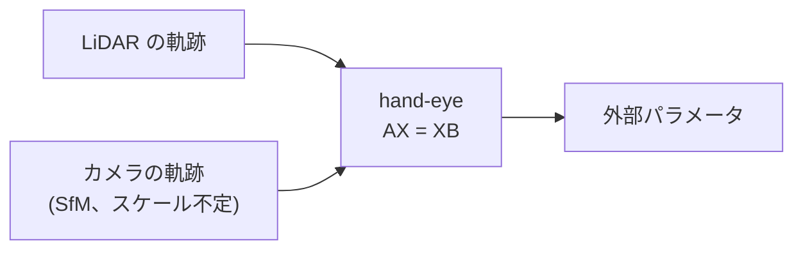
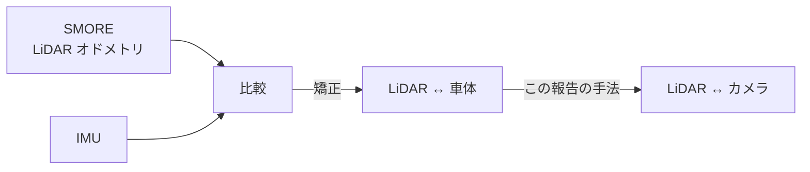
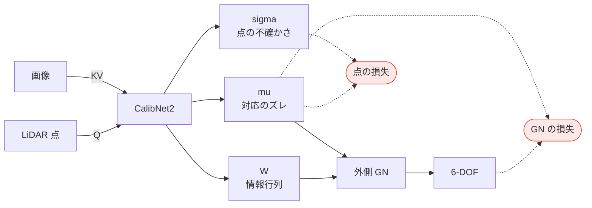
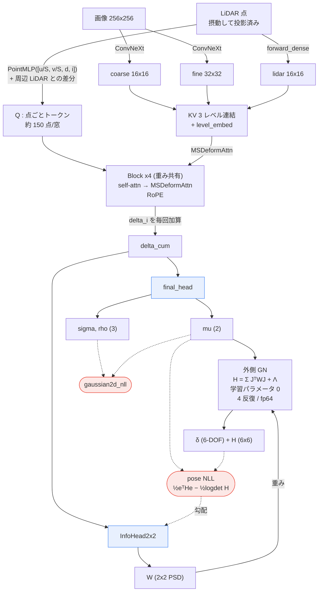

# nuScenes LiDAR–カメラ外部キャリブレーション

2026-08-31 / CalibNet2 + 外側 GN ／
[English](2026-08-31_nuscenes-calibration.en.md)

---

## 要約

nuScenes で LiDAR ↔ カメラの外部パラメータを学習で求めた。学習に一度も出ていない
シーンで **1 フレーム 0.037°／7.7 mm、30 枚合成で 0.007°／1.4 mm**（画像換算
0.11 px）。6 台のカメラを 1 つのネットワークで扱える。

実務として重要なのは 3 点。

**1. 反復が要らない。** 反復はネットワーク内部（重み共有ブロック × 4）で完結して
いて、外側の Gauss-Newton は 1 回解くだけ。初期値の良し悪しで収束先が変わる、
という心配がない。

**2. オンラインで回せる。** 必要なサンプルが少なく、1 フレームの推論は 256×256 の
クロップ 28 枚だけ。バックボーンを DINOv3 など共通のものにすれば、Detection と
同じ特徴を共有できる。

**3. 「これで十分だ」という線が引ける。** ← 一番重要

数枚でかなりの精度になり、数十枚で機械精度に近づく。それだけでなく、**6-DOF の
各方向に十分な情報が取れているかが観測できる**ので、「全軸が 0.01° 以内かつ 1 cm
以内に収まっている確からしさ」を数字で言える。枚数を増やす判断も、止める判断も、
勘ではなく数字でできる。

ただし `H = Σ Hᵢ` をそのまま足した共分散は**過信**している（F=32 で χ²/6 = 3.16、
つまり申告 sd は実際の 1/1.8）。χ² を測って過分散係数 `k` で割った共分散を見る
必要があり、`k` はデータごとに違う（シーンごとに 1.46〜4.65）ので走ってみないと
分からない。逐次 χ² を測りながら `k` を更新し、閾値を切ったら止める形になる。

### 落とし穴

| | |
|---|---|
| σ と W を同じにしない | 点の NLL と BA が同じ σ を逆向きに引くと σ が 2.3 → 26.4 px に膨らみ、点もポーズも壊れる |
| `k` を固定値にしない | データから求める。固定だと過信か保守すぎのどちらかになる |
| val はシーンで分ける | フレーム単位で切ると隣接フレームが train に入る |
| 絶対精度ではない | データセットの `calibrated_sensor` を真値としたズレの追従精度 |

### 必要なもの

| | |
|---|---|
| データ量 | 100 シーン・数千枚で足りる。検出と違って裾が無い |
| 取得 | 数分走って 30 枚ほど。連続で撮るより時間を空けて拾う |
| 前提 | LiDAR ↔ 車体が確定済み。そこは hand-eye や SMORE + IMU で別途 |

---

## 背景

自動運転車は LiDAR とカメラを併用する。両者は別の場所に付いているので、
LiDAR が測った 3D 点を画像のどこに映るかを計算するには、**2 つのセンサ間の
相対位置・姿勢（外部パラメータ、6-DOF）**が要る。これが外部キャリブレーション。

ここがズレると、下流が全部ずれる。

- LiDAR 点に画像の色や意味ラベルを貼る → 別の物体の色が付く
- 3D 検出でカメラと LiDAR を融合する → 同じ車が二重に見える
- Gaussian Splatting で再構成する → 輪郭がにじむ

nuScenes の画角は 100°／幅 1600 px なので **1° = 16 px**。0.1° ずれれば 1.6 px、
0.5° なら 8〜9 px。10 m 先の歩行者の輪郭が丸ごと外れる量。

### 外部キャリブレーションには 2 通りある

**方法 1: 軌跡から出す（hand-eye）**

REAR_AXLE のような車体基準点は外から観測できない。剛体運動を仮定して、各センサが
描いた軌跡の差から相対姿勢を解く。LiDAR 単独・カメラ単独のキャリブレーションも
こちら。



問題はカメラ側。**単眼はスケールが分からない**ので SfM を解く必要があり、そこの
精度が上限を決める。LiDAR は距離を直接測るのでスケールが確定していて、こちらの
方がやりやすい。

**方法 2: LiDAR を基準にしてカメラを合わせる**

LiDAR があるなら、まず LiDAR を軌跡でキャリブレーションし、**その後にカメラを
LiDAR へ合わせる**方が確実。


**この報告は方法 2 の後半。** LiDAR が正しいという前提で、LiDAR から見たカメラの
相対位置・姿勢を出す。LiDAR が 3D 点を直接くれるので、スケールの不定性が最初から
無く、1 フレームでも解ける。

### REAR_AXLE や IMU との関係は厳密に要らない

車体基準点（REAR_AXLE）との位置関係を正確に求める必要はない。**そもそも観測
できない**し、必要でもない。

IMU についても同じ。IMU が与えるのは 2 階微分の物理量なので、extrinsic が多少
ずれていても**合成時に吸収できる**。

本当に要るのは 2 つだけ。

| | |
|---|---|
| カメラと LiDAR が整合していること | ← この報告の対象 |
| カメラと LiDAR の軌跡が取れること | 局所的な動きなら画像から取れる。LiDAR なら SMORE のように点群を合わせる方法で正確に取れる |

軌跡はローカルに取れれば足りるので、大域的な基準点を持ち出す必要がない。

### 走行中に直せる必要がある

外部パラメータは工場で一度合わせて終わり、ではない。振動、温度、事故、部品交換で
ずれる。走行中に**自分でズレを検出して直せる**必要がある。ターゲット（チェッカー
ボード等）を使う古典手法は工場でしか使えないので、走行データだけで済む方法が要る。

---

## 原理

**正解パラメータがある。摂動を自由に与えて、それを戻す方法を学習するだけ。**

LiDAR とカメラの外部パラメータが 1 つ与えられていれば、そこに好きなだけズレを
注入できる。注入したズレは既知なので、教師はいくらでも作れる。人手のラベルは
要らない。ネットワークがやるのは「ズレた投影と画像を見て、どれだけズレたかを
点ごとに言う」ことだけ。


学習の val 図（そのまま）。赤 × が 0.5°／0.20m ずらした投影、緑が LiDAR 点が
本当に映る位置、水色がネットワークの `mu` で戻した位置。線がその移動。
**32.14 px ずれたものを 1.51 px まで戻している。**

入力はこの画像 1 枚と LiDAR 点だけ。ポーズも既知の対応も与えていない。
ネットワークは縁石やポールのパターンを抽出し、self-attention と cross-attention
で窓全体を統合することで、全体のズレを検出している。この窓を 28 枚束ねて
1 つの GN が 6-DOF を解く。

### 成功する窓と、しない窓、そして σ


同じ学習済み重みで val の窓を 6 枚。`HAT→GT` が摂動の大きさ、`PRED→GT` が戻した
後の残差、`sigma median` がネットワークが申告した不確かさ。水色の楕円が 1σ。

| | 点数 | 摂動 | 残差 | **σ 中央値** | 中身 |
|---|---|---|---|---|---|
| GOOD #20 | 105 | 11.15 px | **0.54 px** | 0.88 px | 法面と草地 |
| GOOD #14 | 139 | 8.23 px | **0.93 px** | 1.05 px | ガードレールと草 |
| GOOD #17 | 139 | 8.32 px | **1.04 px** | 0.77 px | 防護シートと支柱 |
| BAD #11 | 114 | 24.82 px | **21.73 px** | 3.55 px | 一様な草地 |
| BAD #2 | 21 | 19.74 px | **12.60 px** | 12.88 px | 信号機と空、点 21 個 |
| BAD #22 | 79 | 33.78 px | **10.50 px** | 4.25 px（p90 16.4） | 逆光の枝、白飛び |

**良い窓は楕円が点とほぼ同じ大きさ、悪い窓は楕円が大きい。** 境界のある構造
（ガードレール、支柱、法面の縁）があれば 1 px 台まで戻る。

**σ は悪い窓で確かに広がっている。** 良い窓が 0.77〜1.05 px に対し、悪い窓は
3.55〜12.88 px と 3〜13 倍。`#2` に至っては σ 12.88 px と残差 12.60 px がほぼ
一致していて、点が 21 個しかなく空ばかりで解けないことを自分で正しく申告して
いる。閾値を切れば σ だけでも弾ける。

なお外側の χ² ゲートは σ ではなく **GN を解いた後の食い違い**
`(δᵢ−δ̄)ᵀHᵢ(δᵢ−δ̄)` で判定する。σ は点ごとの量だが、ゲートが見たいのは
「この窓（フレーム）が出した 6-DOF が他と整合するか」なので、層が違う。

**30 枚を、過信しないように共分散を制御しながら合成すると大体うまくいく。**

1 フレームでは 0.037°（0.6 px）止まり。フレームを足せば下がるが、素朴に足すと
情報を数えすぎて共分散が過信になる。制御は 3 段階。

| どこで | やること |
|---|---|
| **点の中** | `σ`（点単独の不確かさ）と `W`（6-DOF への実効的な寄与）を**別ヘッド**にする。同じ σ に両方やらせると壊れる |
| **フレーム内** | 28 窓を 1 つの GN に融合。窓どうしの相関は `W` が割り引く |
| **フレーム間** | χ² ゲートで外れフレームを弾き、残りの正規方程式を足し、**データから求めた** 過分散係数 `k` で共分散を割る |

`k` は固定値では駄目。実測でシーンごとに 1.46〜4.65（F=8）とばらつくので、
**分散を正しく出したければ χ² を測って `k` をデータから求める**必要がある。

これで 30 枚で 0.007°（0.11 px）まで落ちる。**この報告の中身はほぼ全部、
この「共分散の制御」の話。**

---

## 結論

学習に一度も出ていないシーンで、**1 フレーム 0.037°／7.7 mm、32 フレーム合成で
0.0068°／1.4 mm**（画像換算 0.11 px）。6 台のカメラを 1 つのネットワークで扱い、
どの台でも同程度に動く。4 秒（8 フレーム）で 0.03°／8 mm のズレを 3σ で検出できる。

共分散の制御は 3 つに分かれる。

| | やること |
|---|---|
| **点の中** | σ（点単独の不確かさ）と W（6-DOF への実効情報）を別ヘッドにする |
| **フレーム内** | 28 窓を 1 つの GN に融合。W が相関を割り引く |
| **フレーム間** | χ² ゲートで外れを弾き、残りを足して、過分散係数 k で割る |

同じ σ を点の NLL と BA の両方に引かせると σ が 2.3 → 26.4 px に膨らみ、点も
ポーズも壊れる。分けると χ²/6 が 3113 → 1.0 に落ちる。

ただしこれは**絶対精度ではない**。nuScenes の `calibrated_sensor` を真値として
与えたズレを戻した量で、その真値自体の正しさはデータセット内では測れない。

---

## 学習をどう進めたか

一度に全部を学習させると壊れる。**3 段に分けて、前の段の重みから resume する。**


| 段 | 何を学習 | held-out 1 フレーム | なぜこの順か |
|---|---|---|---|
| 1 | 点だけ（`gaussian2d_nll` のみ） | rot 0.1829°／72.8 mm | μ と σ が使い物にならないうちに BA を入れると発散する |
| 2 | 1 窓 BA（`W = σ`） | 0.1716°／60.5 mm | まず 1 窓で GN を通す |
| 3 | 28 窓融合 BA（`W = InfoHead`） | **0.0247°／4.9 mm** | ここで桁が変わる |
| 4 | 6 カメラ | 6 台 0.021〜0.031° | 側方・後方に広げる |

**段 3 で BA を入れるときの注意。** `ba_weight` を 0.5 で ep0 から入れると発散する。
未学習の InfoHead は最終層ゼロ初期化なので `W` が定数 0.4818·I（全点同じ重み）で、
BA loss が 5285、勾配が 2.0e6 になる。`--ba-weight 0.05` にして
`--ba-warmup-end 10` で 0 から立ち上げる。

エポック数は CAM_FRONT なら 50 で足りる（ep40 0.0304° → ep50 0.0256°、80 まで
回しても ep75 0.0244° で頭打ち）。6 カメラは収束が遅く 100 必要。


ClearML の val 曲線。すべて scene-split（train とシーンを共有しない）。
`chi2/6` は最初の数エポックで 3000 台から 1 前後に落ち、そこから動かない。
**σ を点の NLL に固定したまま InfoHead 側だけで校正されている**のがこれ。

6 カメラ（赤）は 1 カメラより高いところから始まり、収束も遅い。側方・後方の
幾何が加わるぶん難しく、100 エポックでようやく 1 カメラの水準に届く。

---

## 数字

held-out シーン、6 カメラ、`cam6_250x2_100ep`。χ² ゲート（閾値 3）+ 正規方程式の和。

| F | 時間 | rot | t | 画像換算 | χ²/6 |
|---|---|---|---|---|---|
| 1 | — | 0.0366° | 7.71 mm | 0.59 px | 1.15 |
| 2 | | 0.0242° | 4.93 mm | 0.39 px | 1.43 |
| 4 | | 0.0165° | 3.25 mm | 0.26 px | 1.80 |
| 8 | | 0.0117° | 2.47 mm | 0.19 px | 2.16 |
| 16 | | 0.0080° | 1.75 mm | 0.13 px | 2.61 |
| **32** | | **0.0068°** | **1.43 mm** | **0.11 px** | 3.16 |

入力の摂動は 0.5°／0.20 m（画像上 8〜9 px）。1° = 16 px（1600 px / 100°）。

外部パラメータは車両固有で不変なので、フレームはシーンをまたいで足せる。
16 → 32 で 0.85 倍（理論 0.707）まで鈍るので、**32 枚で頭打ち**。

### カメラ別

| カメラ | F=1 | F=8 | F=32 | cond(H) |
|---|---|---|---|---|
| CAM_FRONT_RIGHT | 0.0354° | 0.0112° | **0.0048°** | 2.55e+03 |
| CAM_FRONT_LEFT | 0.0387° | 0.0139° | 0.0064° | 4.93e+03 |
| CAM_BACK_LEFT | 0.0320° | 0.0095° | 0.0067° | 2.18e+03 |
| CAM_FRONT | 0.0332° | 0.0105° | 0.0076° | 2.21e+03 |
| CAM_BACK | 0.0377° | 0.0111° | 0.0078° | 3.41e+03 |
| **CAM_BACK_RIGHT** | 0.0470° | 0.0179° | **0.0120°** | **4.47e+03** |

`CAM_BACK_RIGHT` だけ 1.5〜2.5 倍悪い。原因は**幾何**で、条件数が最大。
系統誤差（偏り）も時間相関も無く、点誤差はむしろ 2 番目に小さい（3.71 px）。

DOF ごとの 1 フレーム事後 sd:

| カメラ | wx (mdeg) | wy | wz | tx (mm) | ty | tz |
|---|---|---|---|---|---|---|
| CAM_BACK_LEFT | 32.4 | 15.2 | 50.5 | 3.9 | **8.4** | 4.4 |
| CAM_FRONT | 32.1 | 15.6 | 51.8 | 4.0 | 9.2 | 4.7 |
| CAM_BACK_RIGHT | **50.3** | 14.7 | **67.9** | 4.0 | **15.0** | 4.0 |


6 台の投影（摂動なし、`calibrated_sensor` そのまま）。上段が前方 3 台、下段が
後方 3 台。色は距離。

`wx`（ピッチ）/ `wz`（ロール）/ `ty`（上下）が悪い台で 1.5〜1.8 倍。
`wy` / `tx` / `tz` は全台同じ。点数（112〜124）も距離分布（z 中央 13〜17 m）も
画像内の広がりも差がないので、点の量ではなく**配置**の問題。

### 天候

CAM_FRONT、850 シーンの val。

| 条件 | n | rot 中央値 | p90 | max | t | 点誤差 | χ²/6 |
|---|---|---|---|---|---|---|---|
| 晴れ・昼 | 220 | 0.0256° | 0.0521° | 0.1988° | 4.1 mm | 3.16 px | 0.96 |
| 雨 | 96 | 0.0394° | 0.0985° | **0.4284°** | 7.3 mm | 6.57 px | 0.95 |
| 夜 | 24 | 0.0329° | 0.0874° | 0.1228° | 7.5 mm | 4.10 px | 0.87 |

雨は点誤差が 2.1 倍。夜は点は取れるが幾何情報が減る。
**χ²/6 はどの条件でも 0.87〜0.96** で、モデルは自分の劣化を正しく申告する。

### シーン数

同じ held-out で比較。

| 学習シーン数 | rot 中央値 | p90 | rot max | t max |
|---|---|---|---|---|
| 10 | 0.0308° | 0.0744° | **1.0248°** | **158 mm** |
| 85 | 0.0241° | 0.0518° | 0.1318° | 40 mm |

**中央値はシーン数にほぼ依存しない。変わるのは裾**（max が 8 倍）。
裾は天候由来。


---

## 効いた 3 つ

### σ と情報行列を分ける

`H = Σ JᵀWJ` の `W` をどこから取るか。per-point の `σ` は `gaussian2d_nll` が
「その点単独の不確かさ」として教師付けする。同じ σ を BA の `−½logdet H` にも
使うと、2 つの損失が同じパラメータを逆向きに引く。

| | σ に何を要求するか |
|---|---|
| 点の NLL | その点の実誤差に合わせろ |
| BA | 28 窓を足した H が過信だから広げろ |

実測: σ が 2.28 → 26.4 px（11.6 倍）に膨らみ、点誤差 4.15 → 7.77 px、
rot 0.046 → 0.185°。

**正しい分離**:

| | 学習するもの | 損失 |
|---|---|---|
| σ | その点が単独で持つ不確かさ | `gaussian2d_nll` のみ |
| InfoHead | その点が融合後の 6-DOF に足す**実効**情報 | BA の pose NLL のみ |
| μ | 点の対応 | 両方（共有） |

`--ba-w-source infohead` で `make_info_from_sigma_rho` が呼ばれなくなり、BA の
勾配が σ に届かない（実測: BA path で勾配を受けた 106 パラメータのうち 6 個が
`info_head`、σ 出力はゼロ）。**χ²/6 が 3113 → 1.0**、σ は 2.28 px のまま。

### χ² ゲート

`H = Σ JᵀWJ` は各観測が独立という仮定。フレーム内 28 タイルも、フレーム間も
独立ではない。外れフレームは χ² も同時に跳ねるので、GT 無しで弾ける。

```
δ̄  = (Σ Hᵢ)⁻¹ Σ Hᵢ δᵢ
cᵢ = (δᵢ − δ̄)ᵀ Hᵢ (δᵢ − δ̄) / 6  >  3   → 落とす    （2 回反復）
```

| F=8 | rot 中央値 | rot 最悪 | χ²/6 |
|---|---|---|---|
| sum | 0.0142° | 0.0299° | 2.62 |
| median | 0.0129° | 0.0392° | 4.52 |
| **gate3** | **0.0128°** | 0.0233° | 2.42 |

**中央値を取るのは損**。良いフレームの重みを捨ててしまう。「弾く」と「足す」は
分ける。

### 過分散補正

`k = χ²/6` を実測して `Σ = (H/k)⁻¹`。GLM の quasi-likelihood の dispersion
parameter `φ̂ = X²/(n−p)` と同じ操作。**F ≤ 8 なら k = 2 固定**、F=32 で 3.2。

k はシーンによって 1.46〜4.65 とばらつくが、rot 自体は安定（F=8 で
0.0047〜0.0153°、11 シーン中 10 が 0.0084〜0.0153°）。**ばらつくのは共分散だけ**。

---

## 効かなかったもの

| 試したこと | 結果 |
|---|---|
| **rank-k 打ち切り**（各フレームの情報を主方向だけに削る） | 精度が壊れる。F=16 で rank1 が 0.155°（sum の 18 倍）。1 フレームの `H` は 6 方向すべてに情報を持つ |
| **CI（重み一律 1/F）** | 推定値が sum と完全に一致（`1/F` が `H⁻¹b` で相殺）。χ²/6 が 3.86 → 0.24 と保守側に行き過ぎ |
| **CI（重み最適化、logdet 最大化）** | 1 フレームに全部の重みが寄る。DOF ごとの相補性が弱い（順位相関 0.40〜0.94） |
| **変量効果（DerSimonian–Laird）** | 方向は正しいが τ² を過小評価。積率推定の `T` では χ²/6 が 2.21 までしか下がらず、9.68 倍にして初めて 1.00 |
| **シーンをまたいだ融合** | 同一シーン内と同じか悪い（F=8 で実効 2.94 対 3.59）。飽和の原因はシーン共通の系統誤差ではない |
| **フレーム間隔を空ける** | F=16 の実効数が stride 1 / 4 / 10 で 5.2 / 3.7 / 3.9。改善しない |
| **6 カメラを 1 つの δ で融合** | 各カメラの外部パラメータは独立した未知量なので成立しない |

### CAM_BACK_RIGHT が悪い原因を探した記録

系統誤差でもタイムスタンプでも内部パラメータでもなかった。

| 疑ったもの | 測ったこと | 結果 |
|---|---|---|
| 系統誤差（校正ズレ） | DOF ごとの符号付き偏り `\|mean\|/sd` | 全 DOF 0.01〜0.22。偏りなし |
| マウントの緩み | 誤差の自己相関（ラグ 1/2/4） | −0.31〜+0.12。時間相関なし |
| 内部パラメータ | 残差の画像位置依存・放射成分 | 放射成分 0.124（他 0.027〜0.186）。特異でない |
| タイムスタンプ | 速度と残差の相関 | 0.069。相関なし |
| **幾何** | **H の条件数** | **4.47e+03 で最大。これが原因** |


残差 `mu − gt` を 256px 窓の中で 8×8 セルに平均したもの。位置依存の構造が
あれば内部パラメータの誤差だが、`CAM_BACK_RIGHT` に特異なパターンはない。

---

## この数字が意味しないこと

**絶対精度ではない。** nuScenes の `calibrated_sensor` を真値として δ を注入し、
それを戻せた量を測っている。nuScenes 自体にバイアスがあれば注入側と評価側の
両方に乗って相殺される。データセット内には比較対象がないので絶対精度は測れない。

さらに 2 つ、実運用より条件が良い:

- `delta_gt` は GT 対応を**同じ GN** に入れて解いた値。ソルバの系統誤差が相殺される
- LiDAR 点の 3D 位置を真値として使っている。測距誤差・ビーム角誤差は乗らない

一方 **過信はしていない**。1 窓 150 点 × 28 窓 × 16 フレーム = 67000 点、
点残差 3.6 px / √67000 = 0.014 px。実測 0.15 px はその 10 倍で理論限界より悪い側。

オラクルなしで決まるのは「一貫性」であって「正しさ」ではない。出荷時に一度
オラクル（ターゲット校正、hand-eye）で合わせ、その後のドリフトをこの手法で
監視する使い方になる。**4 秒（8 フレーム）で 0.03°／8 mm のズレを 3σ で検出できる。**

### LiDAR が正しいという前提も時間とともに崩れる

この手法は「LiDAR ↔ 車体は確定済み」を前提にしている（背景の方法 2）。その前提
自体が走行とともに崩れる。

- LiDAR も走行中にずれる。POS LV を過信すると問題になる
- 一旦 LiDAR ↔ カメラを合わせた後なら、**短時間では カメラ側の方が信頼できる**
- ただし時間が経てば両方ずれるのは同じ

したがって**この方法だけでは完全なキャリブレーションではない**。特に LiDAR の
マウントがずれたら、LiDAR ↔ 車体からやり直す必要がある。

そこは SMORE で LiDAR の軌跡が取れるので、**IMU と比べれば LiDAR ↔ 車体の位置を
大まかに矯正できる**。



### タイムスタンプ

問題ない。論文に明記されている。

> "the exposure of a camera is triggered when the top lidar sweeps across the
> center of the camera's FOV. The timestamp of the image is the exposure trigger
> time; and the timestamp of the lidar scan is the time when the full rotation
> of the current lidar frame is achieved."

実測でも方位と `dt` が **残差 rms 0.00 ms** で線形、傾きから 1 回転 50.0 ms
（LiDAR 20 Hz と一致）。誤差の大きいフレームと `dt` のずれの相関は **+0.002**。

| カメラ | dt = カメラ − LiDAR |
|---|---|
| CAM_FRONT_LEFT | −43.5 ms |
| CAM_FRONT | −35.9 ms |
| CAM_BACK_LEFT | −0.9 ms |

`ego_pose` はセンサごとに別レコードで、投影は各センサのシャッター時刻の姿勢を
使う。ただしその `ego_pose` 自体は nuScenes 側が補間して作った値で、補間の質は
測っていない。

---

## 実運用の手順

1. **1 フレームの共分散を校正する** — σ は点の NLL 専用、GN の重みは InfoHead
2. **数分走って 30 枚ほど集める** — 32 枚で頭打ち。連続で撮るより時間を空けて拾う
3. **χ² ゲートで弾く** — `cᵢ > 3`、2 回反復。GT 不要
4. **残りの正規方程式を足す** — `H = Σ Hᵢ`、`δ = H⁻¹ Σ Hᵢ δᵢ`
5. **共分散を k で割る** — F ≤ 8 なら k = 2、F=32 なら 3.2

得られるもの: **rot 0.007°／t 1.4 mm**。

### 既存手法との対応

| 部分 | 名前 |
|---|---|
| 弾く | χ² validation gate（Bar-Shalom、NIS gating。g2o/GTSAM の外れ値除去と同じ） |
| 足す | inverse-variance pooling（fixed-effect meta-analysis。カルマンの測定更新と同式） |
| 割り引く | 過分散補正（GLM quasi-likelihood `φ̂ = X²/(n−p)`）。標本調査の design effect、SLAM の NEES と同じ量 |
| 数えすぎの理論 | composite likelihood の Godambe サンドイッチ情報行列 |
| 未実装の代替 | Inverse Covariance Intersection（Noack et al., Automatica 2017） |

新しいのは、`H` を作る per-point 情報行列をネットワークに学習させている部分だけ。

---

## ネットワーク

ネットワークはポーズを出さない。**点ごとの対応のズレとその不確かさだけ**を出し、
6-DOF は外側の Gauss-Newton が解く。GN には学習パラメータが 1 つも無い。

### 全体像



**画像が KV、LiDAR が Q。** LiDAR 点 1 つが 1 クエリで、画像特徴を引きにいく。

**損失は 2 本で、繋がる先が違う。**

| 出力 | 点の損失 | GN の損失 |
|---|---|---|
| `mu`（対応のズレ） | ○ | ○ ← **共通** |
| `sigma`（点の不確かさ） | ○ | — |
| `W`（情報行列） | — | ○ ← **別** |

`sigma` と `W` を同じにすると壊れる。σ は「その点単独の不確かさ」を、
`W` は「6-DOF への実効的な寄与」を表すべきで、要求が逆向きになるため。

### 詳細



### Query — 点ごとのトークン

```python
q_in = [u/img_size, v/img_size, d, intensity]      # 摂動後に投影した位置と深度
q    = point_mlp(q_in)
q   += frustum_enc(query_uvd - bucket_uvd, ...)    # 周辺 LiDAR 点との相対配置
```

1 点 1 トークン。窓あたり約 150 点。`frustum_enc` が「その点の周りに LiDAR 点が
どう並んでいるか」を差分で足すので、点は孤立せず局所構造を持つ。

### KV — 3 レベル

| レベル | 出所 | 解像度 |
|---|---|---|
| coarse | ConvNeXt | 16×16 |
| fine | ConvNeXt | 32×32 |
| **lidar** | `FrustumEnc.forward_dense` | 16×16 |

画像だけでなく **LiDAR も KV に入る**。3 レベルを連結して `level_embed` を足し、
MSDeformAttn が 1 回の attend で全レベルを見る。

**キャリブレーション単体なら LiDAR を KV に入れる必要はない。** LiDAR の情報は
すでに Q に入っているので、Q が画像だけを引けば足りる。

入れてあるのは、**複数フレームのポーズ矯正（＝オドメトリ）に進んだときに必要に
なる**から。そこでは他フレームの LiDAR と合わせる必要があり、Q が別フレームの
LiDAR を KV から引けないと解けない。いまの構成はその拡張を見越したもので、
キャリブレーションだけを見れば余分な経路が 1 つある状態。

### Block — 重み共有 × 4

```python
for _ in range(n_iter):                 # n_iter = 4
    q, delta_i = block(q, kv_flat, ...) # self-attn -> MSDeformAttn
    delta_cum += delta_i
```

同じ重みを 4 回。`q` 自身ではなく **`delta_cum`（残差の累積）を読み出しに渡す**。
q には絶対位置エンコーディングが乗っているので、そのまま読むと位置が漏れる。

### 出力

```python
raw    = final_head(delta_cum)
per_pt = clamp_params(raw)     # [mu_u, mu_v, log_sx, log_sy, rho]、mu は px
W      = info_head(delta_cum)  # (B, N, 2, 2) PSD、Cholesky 経由
```

| 出力 | 意味 | 何が学習する |
|---|---|---|
| `mu` (2) | 対応のズレ [px] | `gaussian2d_nll` |
| `σ, ρ` (3) | その点単独の不確かさ | `gaussian2d_nll` |
| `W` (2×2) | その点が 6-DOF に足す**実効**情報 | BA の pose NLL |

`σ` と `W` を別ヘッドにしてあるのが要点（後述）。どちらも同じ `delta_cum` を
読むが、損失が別。

### 外側の GN

```
H = Σ Jᵢᵀ Wᵢ Jᵢ + Λ_prior          Λ_prior = diag(1/9, 1/9, 1/9, 1/0.09, ...)
b = Σ Jᵢᵀ Wᵢ eᵢ
δ = H⁻¹ b                          4 反復、fp64、damping 1e-3
```

`J` は 3D 点を 6-DOF で動かしたときの uv の変化率。fp64 なのは、`fx≈930` で
`H` の成分が 1e7 に達し prior が 0.1 なので条件数 1e9 になり、fp32 だと
cholesky の**逆伝播**が NaN になるため。

### 1 フレーム = 28 窓

画像全体を 256×256 のタイルで覆い、28 窓を取る。`--share-pert` により 28 窓は
**同じ δ** を持ち、`--ba-loss` でそれらの正規方程式を **1 つの GN** にまとめる。

各カメラは独立に扱う（`share_pert` は 1 カメラの 28 窓内のみ、GN もカメラを
またがない）。外部パラメータがカメラごとに独立した未知量なので、これが正しい。

| | |
|---|---|
| パラメータ数 | 1.14M（256px / grid16） |
| 入力 | 256×256 クロップ、grid 16×16、28 窓/フレーム |
| 摂動 | 0.5°／0.20 m、毎回引き直し |

### 学習の段階

| 段 | 内容 | held-out 1 フレーム |
|---|---|---|
| 1 | 点だけ（BA なし） | rot 0.1829°／t 72.8 mm |
| 2 | 1 窓 BA（W = σ） | 0.1716°／60.5 mm |
| 3 | 28 窓融合 BA（W = InfoHead） | **0.0247°／4.9 mm** |

---

## 使うもの

リポジトリには古い実験由来のファイルが残っている。実際に使うのは以下だけ。

| ファイル | 役割 |
|---|---|
| `datasets/train_cnd2_ddp.py` | 学習・評価の本体 |
| `datasets/pandaset_full.py` | データセット |
| `models/calibnet2.py` | ネットワーク |
| `models/model_depth.py` | `InfoHead2x2` |
| `models/model_cov.py` | `gaussian2d_nll` |
| `scripts/ba/gn_pose.py` | 外側の GN |
| `tests/system_test.py` | S1〜S16。**実験の前に必ず通す** |
| `scripts/preprocessing/build_nuscenes_v3.py` | キャッシュ生成 |
| `scripts/preprocessing/convert_tile_cache_to_lmdb.py` | LMDB 変換 |

`scripts/training/` の 45 本、`pair_mode` / `pandaset_pair.py` /
`woven_sequence_pair.py` は使わない。

### キャッシュ

```bash
python -u scripts/preprocessing/build_nuscenes_v3.py \
  --data-root <nuScenes>/trainval --meta-dir <nuScenes>/trainval/v1.0-trainval \
  --out <cache> --cams CAM_FRONT --stride 1 --frame-frac 0.075 \
  --val-frac 0.1 --workers 4          # --tile は付けない
python -u scripts/preprocessing/convert_tile_cache_to_lmdb.py --cache <cache> --workers 4
```

`--scenes` でシーンを絞る。`scripts/scene_stats.py` で 850 シーンの幾何・メタを
出し、`scripts/pick_scenes.py N` で `yaw_total` / `speed` / `dist` / `night` /
`rain` / `location` の farthest-point sampling。

### 学習

```bash
CACHE=<cache> python tests/system_test.py     # exit 0 でなければ実験しない

python datasets/train_cnd2_ddp.py \
  --name <name> --cache <cache> \
  --resume-ckpt experiments/front_670x3/best_model.pt --start-epoch 0 \
  --epochs 50 --eval-every 5 --batch-size 4 --img-size 256 --grid-n 16 \
  --oversample 28 --workers 4 --scene-split --n-iter 4 --lr 3e-4 \
  --rot-deg 0.5 --t-m 0.20 --min-crop-px 256 --max-crop-px 256 \
  --use-info-head --share-pert --crop-grid --grid-frac 0.0 \
  --ba-loss --ba-iter 4 --ba-damping 1e-3 --ba-weight 0.05 --ba-loss-type nll \
  --ba-w-source infohead --ba-warmup-start 0 --ba-warmup-end 10 \
  --clearml --why "<この実験で何を確かめるか>"
```

外せないもの:

| | 理由 |
|---|---|
| `--ba-w-source infohead` | sigma だと σ が点の NLL と BA に取り合われて壊れる |
| `--scene-split` | 付けないと val が train と同じシーンの隣接フレームになる |
| `--ba-weight 0.05` / `--ba-warmup-end 10` | 0.5 を ep0 から入れると発散（未学習 InfoHead で BA loss 5285、grad 2.0e6） |
| `--share-pert --crop-grid --grid-frac 0.0` | 全画像 28 窓を 1 つの GN に融合 |

CAM_FRONT は 50 エポックで足りる。6 カメラは 100。

### 重み

| | 学習 | held-out |
|---|---|---|
| `experiments/cam6_250x2_100ep/best_model.pt` | 6 カメラ、250 シーン | 6 台 0.021〜0.031°、F=32 で 0.0068° |
| `experiments/front_670x3/best_model.pt` | 603 シーン CAM_FRONT | 0.0244°／5.7 mm |
| `experiments/fuse28_infohead_scenesplit/best_model.pt` | 73 シーン CAM_FRONT | 0.0247°、F=16 で 0.0096° |

新しく始めるなら `front_670x3` から resume。

---

---

## 議論

### なぜデータドリブンにするのか

単純に LiDAR のエッジと画像のエッジを合わせる手法は、実データでは破綻する。

| 起きること | エッジ合わせがどうなるか |
|---|---|
| ハードウェアの不調で局所的にずれる | そのフレームだけ合わない |
| カメラのタイムスタンプがずれる | 自車の動いた分だけ全体がずれる |
| 夜・雨で画像と LiDAR の特徴が合わない | 対応そのものが取れない |

**この問題の本質は、キャリブレーションの前提そのものが成り立たないこと。**

- ハードは常に剛体ではない
- データは完璧に同期して取られていない

つまり「1 回決めれば終わり」ではなく、**ハードウェアと時間的なズレを監督し
続ける**問題になる。ただし「ある程度は剛体」は仮定してよい。

これを手で書くと、現象ひとつひとつに対して外れ値を弾く仕組みを個別に組むことに
なる。データドリブンなら、**大半が正しいフレームで構成すれば**（実測で nuScenes
なら 30 フレーム）、制御可能な範囲で外れフレームを弾き、確からしいパラメータを
求められる。

教師は「大体人が合わせた、大部分のフレームでは合っているデータ」でしかない。
そこから外れ値を弾き、信頼できるパターンを選び、統合する。**それがこの手法の
やっていること。**


### AI 時代にこの種の問題をどう解くか

実装自体は難しくない。「Rear-axle とカメラを剛体運動でキャリブレーションする」と
いう仕組みさえ知っていれば、可視化とテストを書けば正しいコードは書ける。

**難しいのは、問題がどこにあるか、ノイズがどこにあるかを見つけること。そこは
AI が発見しない。** エンジニアが制御する必要がある。

この例で言えば、LiDAR とカメラのズレの要因には可観測なものとそうでないものが
混ざっている。

- 局所的な LiDAR の回転ノイズ
- カメラのローリングシャッターのずれ
- 内部パラメータ

**データドリブンで保証されるのは 1 つだけ。** 「人間が投影で LiDAR とカメラが
合っていることを確認できるデータ」があれば（多少のノイズは可）、それに合わせる
モデルを学習で作れる。それ以上でも以下でもない。

### 検出タスクとは性質が違う

検出には裾がある。稀な物体、稀な見え方があるので、データを増やし続ける必要が
ある。**キャリブレーションには基本的に裾が無い。** 見ているのはポール・建物・
縁石の局所パターンで、どのシーンにも出るし、シーンが変わっても同じ形をしている。

だから昼と夜をある程度集めれば十分で、100 シーン・数千枚で足りる。nuScenes の
実測とも合う（10 シーン → 85 シーンで中央値が 0.031° → 0.024° と 28% しか
変わらず、差が出たのは天候由来の裾だけ）。

### 難しいのは精度ではなく共分散

「ズレを推定する」だけなら既存手法がいくつもある。難しいのは**その推定を
どれだけ信じてよいか**を出すこと。

下流（カルマンフィルタ、BA、センサ融合）は推定値だけでなく**共分散**を受け取る。
共分散が過信していれば、下流はその誤差を過大に信頼して破綻する。逆に保守的
すぎれば、せっかくの情報が使われない。

さらに、1 フレームでは精度が足りないので複数フレームを融合したい。ところが
`H = Σ JᵀWJ` は各観測が独立という仮定で足すので、相関のある観測を足すと
**情報を数えすぎて過信する**。

この報告は、そこをどう扱ったかの記録。

### なぜフレーム間を外側でやるのか

本来なら複数フレームの特徴を cross-attention させる、あるいはフレームごとに
トークンを少数に絞って cross-attention することで、フレーム間の矯正も
ネットワーク内で学習できる。そうしていない理由は 2 つ。

- **フレーム内の局所性・バリエーションに比べて、フレーム間の相関は測りやすい**。
  外側の後処理（χ² ゲート + 和 + 過分散補正）で足りる
- ネットワークを複雑にしすぎると**保守と理解が難しくなる**

これが最良かどうかは分からないが、この構成にしている。

---

## 次にやること

DGX2 に **Kamikado データ**と**少量の WovenSequence**（両方 WovenSequence 形式）が
ある。それで学習するのが次の課題。

データは LOOM 上でキャリブレーションすれば増やせるが、上記の通り **100 シーン
ほど・数千枚あれば足りる**はず。

---

経緯と失敗の全記録は [2026-08-29_worklog.md](2026-08-29_worklog.md)。
