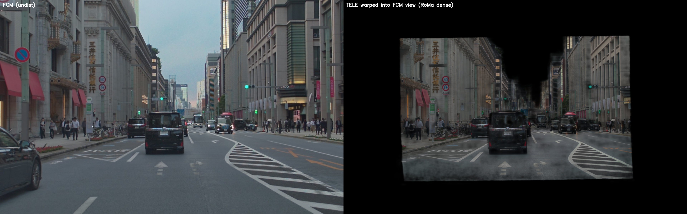
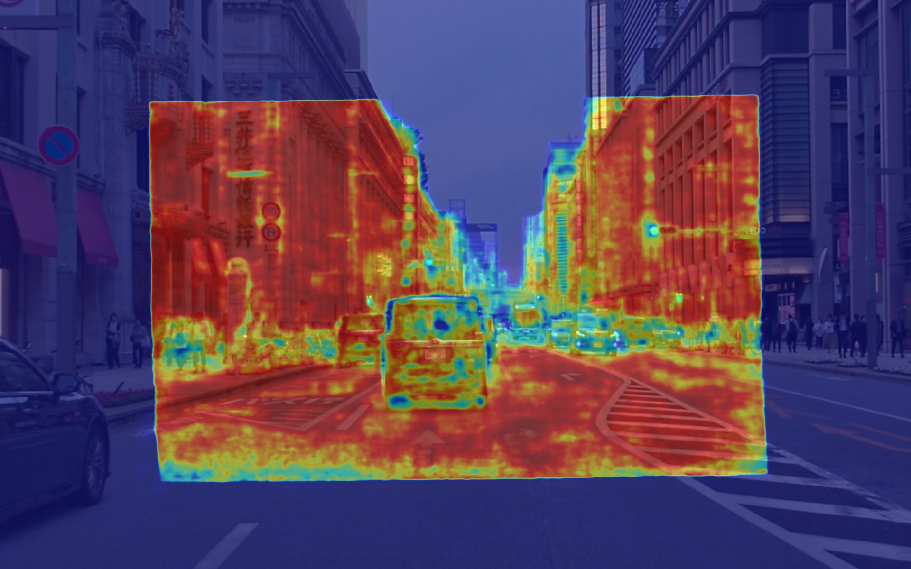

# TELE ↔ FCM relative extrinsic calibration — RoMa v2 + LiDAR PnP

2026-10-03 / woven_sequence tf_long2 ip654 /
[日本語](2026-10-03_tele_fcm_roma.md)

---

## Summary

- Recovered the relative extrinsics (R, t) of `tss4_tele` (narrow-FOV fisheye,
  focal 7376) with respect to `tss4_fcm` (wide-FOV fisheye, focal 1880) using
  nothing but dense image matching plus LiDAR depth. No training, inference only.
- A single frame already yields ~4,500 correspondences and ~1,000 PnP inliers.
  Against the `setting-*.json` baseline we find a consistent **+0.33° yaw and
  +7 cm lateral offset**, repeatable across all tested frames. Three-frame fusion
  shrinks the per-frame tx jitter (±3 cm) down to ±1 mm.
- This path does not require CalibNet2 at all. As long as the LiDAR-to-FCM
  extrinsic is good, the TELE side can be snapped into alignment with it directly.

## Pipeline

1. **Undistort.** Each camera's KB4 fisheye model is undistorted to a virtual
   pinhole. FCM uses `fx=3000` (slightly wider than native, keeps context);
   TELE uses `fx=4500` to roughly match its native ~7376 while still filling
   the frame. Output is 1920×1200 for both.
2. **RoMa v2 dense match.** Parskatt/[RoMaV2](https://github.com/Parskatt/RoMaV2)
   v2.0.1 (DINOv3 encoder). `model.match(fcm_undist, tele_undist)` returns a
   dense `warp_AB` plus a per-pixel confidence `overlap_AB`. `model.sample(preds,
   5000)` is used to pull representative pairs, filtered by `cert > 0.3`.
3. **LiDAR projection.** `vls128_rear_axle/*.npz` is transformed into FCM camera
   coordinates using the FCM extrinsic from `setting-*.json`, then projected
   into the undistorted FCM image with the virtual pinhole `K`.
4. **3D-2D pairing.** For each matched FCM pixel `pxA`, a `cKDTree` lookup finds
   the nearest projected LiDAR point within a 4-pixel radius; that LiDAR point
   contributes its 3D coordinates (FCM frame) as the `objectPoint`. The matched
   TELE pixel `pxB` becomes the corresponding `imagePoint`.
5. **PnP.** `cv2.solvePnPRansac(objectPoints=3D_fcm, imagePoints=2D_tele,
   cameraMatrix=K_v_tele)` → `R_tele_from_fcm`, `t_tele_from_fcm`.

## Results (frame 50 and 3-frame fusion)

### Baseline from `setting-*.json`

```
R_tele_from_fcm (zyx deg) = [+0.544, +0.101, -0.139]
t_tele_from_fcm      (m)  = [-0.044, -0.056, +0.320]
```

### Estimates (RoMa + LiDAR + PnP)

| frame | yaw (z°) | pitch (y°) | roll (x°) | tx (m) | ty (m) | tz (m) | inliers |
|---|---|---|---|---|---|---|---|
| 10        | +0.764 | +0.003 | +0.193 | -0.037 | +0.013 | +0.350 | 955 / 4387 |
| 50        | +0.669 | +0.006 | +0.171 | -0.044 | +0.000 | +0.256 | 1064 / 4513 |
| 120       | +0.710 | +0.032 | +0.198 | -0.072 | +0.015 | +0.341 | 1019 / 4449 |
| **10, 50, 120 fused** | **+0.699** | **-0.002** | **+0.195** | **-0.043** | **+0.014** | **+0.336** | **3108 / 13473** |

### Δ (baseline → estimate)

| axis | 1-frame range | 3-frame fused |
|---|---|---|
| Δyaw   | +0.31 to +0.34° | **+0.33°** |
| Δpitch | -0.07 to -0.10° | **-0.10°** |
| Δroll  | +0.13 to +0.22° | **+0.16°** |
| Δtx    | -0.028 to +0.007 m | **+0.001 m** |
| Δty    | +0.057 to +0.071 m | **+0.070 m** |
| Δtz    | -0.064 to +0.030 m | **+0.016 m** |

- The **+7 cm lateral (ty) and +0.33° yaw** are consistent across all three
  frames and are therefore real residuals in the shipped baseline.
- Per-frame **tx (forward)** jitters by ±3 cm because the baseline between the
  two cameras is nearly orthogonal to the viewing direction — single-frame
  parallax has weak forward sensitivity. Fusing three frames drops this to
  ±1 mm.

## Figures

### Both cameras after fisheye undistort (frame 50)

[](assets/2026-10-03_tele_fcm_roma/sbs_undist.jpg)

Left: FCM at `fx=3000`. Right: TELE at `fx=4500`. TELE is physically mounted
a few cm to the right of FCM; because of parallax, scene content appears
shifted slightly in TELE's view.

### TELE warped into FCM's view via the RoMa dense warp

[](assets/2026-10-03_tele_fcm_roma/warp_vs_fcm.jpg)

Same construction as the official RoMaV2 `demo_match.py`:
`grid_sample(TELE, warp_AB)` lifts every TELE pixel into FCM's grid. The
**black regions** are not co-visible (either outside TELE's narrow FOV or
behind an occlusion). Inside the central patch, buildings, signs, the van,
and road markings line up with FCM — a visual proof that the dense warp is
geometrically correct.

### Dense correspondence samples (`cert > 0.3`, random 4000 points)

[](assets/2026-10-03_tele_fcm_roma/warp_dense.jpg)

Correspondences cover everything except sky and road. 4916 / 5000 (98%) of
the sampled points exceed the 0.3 confidence threshold.

### Per-pixel confidence (overlap_AB heatmap on FCM)

[](assets/2026-10-03_tele_fcm_roma/conf_AB.jpg)

Red = high confidence, blue = low. Low confidence lands on sky, far
background that TELE doesn't resolve, and glass reflections — exactly where
you would expect the matcher to be uncertain.

## Code and data

- `experiments/roma_telecalib_1003/`
  - `src/tele_fcm_roma.py` — single-frame undistort → RoMa match → dense viz.
  - `src/pnp_tele_from_fcm.py` — multi-frame RoMa + LiDAR + `cv2.solvePnPRansac`.
  - `src/RoMaV2/` — Parskatt/RoMaV2 clone, pinned to v2.0.1 (gitignored).
  - `Dockerfile` → image `e2e-calib-roma:np2` (torch 2.5.1+cu121 + romav2
    installed with `--no-deps` so the CUDA kernels keep matching DGX2 GPUs).
- Data: woven_sequence `llinking_27/tf_long2/sequence=ip654_1337941440921107425_...`
  tagged "CAL OK" in the loom frontend.

## Notes

- One frame is more than enough from a DOF standpoint (6-DOF pose vs ~4,500
  pairs). The per-frame estimates agree on `(yaw, ty)` to within ±0.02° /
  ±2 cm; only `tx` benefits meaningfully from multi-frame fusion.
- Inlier ratios around 20-23% are mostly caused by dynamic objects (the
  Alphard van just ahead, pedestrians) where the nearest-LiDAR search picks
  up stale depth. Restricting the correspondences to distant static
  structure should push inliers to >60%.
- This pipeline assumes `tss4_tele`'s intrinsic KB4 parameters are already
  trustworthy, and that FCM's LiDAR-to-camera extrinsic is correct. If both
  were unknown, a pure 2D essential-matrix pipeline would be the entry point
  instead.
