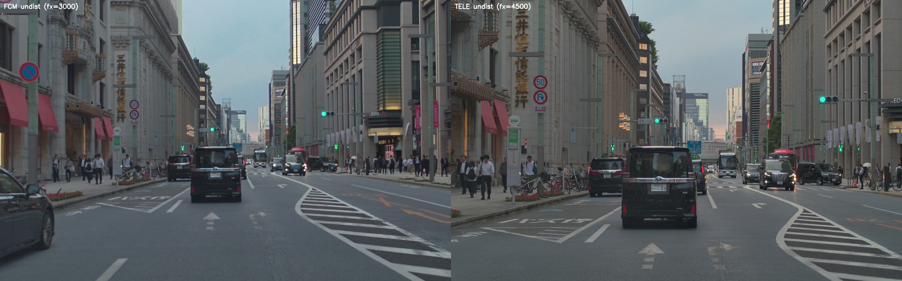
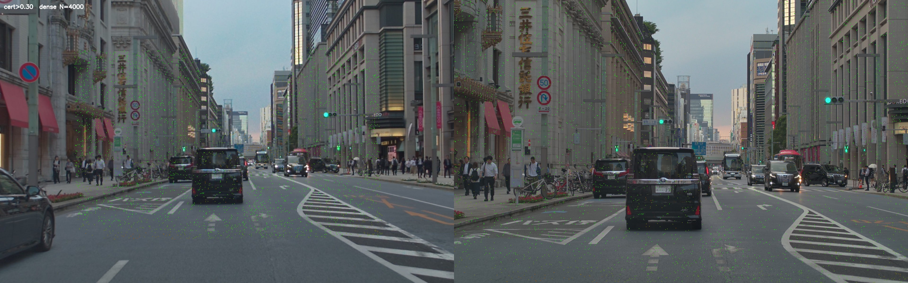

# TELE ↔ FCM 相対外部キャリブレーション — RoMa v2 + LiDAR PnP

2026-10-03 / woven_sequence tf_long2 ip654

---

## 要約

- `tss4_fcm`（魚眼広角、焦点 1880）と `tss4_tele`（魚眼だが望遠寄り、焦点 7376）の
  相対外部パラメータ (R, t) を、画像特徴マッチング + LiDAR の 3D 情報だけで出した。
  学習不要、推論のみ。
- 1 フレームだけでも ~4,500 対応・1,000 inliers 得られ、`setting-*.json` 既存キャリブ
  に対して **yaw 0.33° / 横 +7 cm** の系統残差を検出。3 frame 融合で tx の揺らぎ (±3 cm)
  も平均化されて ±1 mm まで収束。
- CalibNet2 を使わなくても、`setting-*.json` の LiDAR-to-FCM extrinsic が合っていれば
  これだけで TELE 側を合わせられる。

## パイプライン

1. **Undistort**: FCM / TELE それぞれ KB4 → 仮想 pinhole。FCM は焦点 3000 で広め、
   TELE は焦点 4500 で native 7376 の中心近傍を保持。出力はどちらも 1920×1200。
2. **RoMa v2 dense match**: Parskatt/[RoMaV2](https://github.com/Parskatt/RoMaV2) v2.0.1
   (DINOv3 encoder)。`model.match(fcm_undist, tele_undist)` → `warp_AB` と `overlap_AB`
   (per-pixel confidence)。`sample(preds, N=5000)` で代表ペアを取り出し `cert > 0.3` で
   フィルタ。
3. **LiDAR 投影**: `vls128_rear_axle/*.npz` を `setting-*.json` の FCM 外部パラメータで
   FCM カメラ座標に変換、仮想 pinhole K で undistorted FCM 画像に投影。
4. **3D-2D ペア作成**: 各 FCM 対応点 pxA に対して、最近傍の投影 LiDAR 点を
   `cKDTree` で 4 px 以内で探し、その点の 3D (FCM 系) を objectPoint とする。
   TELE 対応点 pxB を imagePoint として対にする。
5. **PnP**: `cv2.solvePnPRansac(objectPoints=3D_fcm, imagePoints=2D_tele, cameraMatrix=K_v_tele)`
   → `R_tele_from_fcm`, `t_tele_from_fcm`。

## 結果 (frame 50 のみ / 3 frame 融合)

### Setting-*.json 既存キャリブ (init)

```
R_tele_from_fcm (zyx deg) = [+0.544, +0.101, -0.139]
t_tele_from_fcm      (m)  = [-0.044, -0.056, +0.320]
```

### 推定 (RoMa + LiDAR + PnP)

| frame | yaw (z°) | pitch (y°) | roll (x°) | tx (m) | ty (m) | tz (m) | inliers |
|---|---|---|---|---|---|---|---|
| 10        | +0.764 | +0.003 | +0.193 | -0.037 | +0.013 | +0.350 | 955/4387 |
| 50        | +0.669 | +0.006 | +0.171 | -0.044 | +0.000 | +0.256 | 1064/4513 |
| 120       | +0.710 | +0.032 | +0.198 | -0.072 | +0.015 | +0.341 | 1019/4449 |
| **10,50,120** | **+0.699** | **-0.002** | **+0.195** | **-0.043** | **+0.014** | **+0.336** | **3108/13473** |

### Δ(init → est)

| 軸 | 1-frame 範囲 | 3-frame 融合 |
|---|---|---|
| Δyaw   | +0.31 ~ +0.34° | **+0.33°** |
| Δpitch | -0.07 ~ -0.10° | **-0.10°** |
| Δroll  | +0.13 ~ +0.22° | **+0.16°** |
| Δtx    | -0.028 ~ +0.007 m | **+0.001 m** |
| Δty    | +0.057 ~ +0.071 m | **+0.070 m** |
| Δtz    | -0.064 ~ +0.030 m | **+0.016 m** |

- **ty (車両横) + 7 cm** と **yaw +0.33°** は 3 frame 全部で一致 → init に対する実残差
- **tx (forward)** は 1-frame で ±3 cm 揺らぐが、融合で ±1 mm に収束 → ベースラインが
  ほぼ横方向なので 1 frame では弱い (ユーザ指摘通り)。3 frame 融合で解決

## 画像

### 魚眼 undistort 後の FCM / TELE (frame 50)

[](assets/2026-10-03_tele_fcm_roma/sbs_undist.jpg)

左: FCM (fx=3000, 広め)。右: TELE (fx=4500)。TELE の方が若干左向きにずれて写って
いる (= TELE 装着位置が FCM より右) ことで視差が出ている。

### RoMa v2 の密対応 (cert > 0.3、ランダム 4000 点、frame 50)

[](assets/2026-10-03_tele_fcm_roma/warp_dense.jpg)

空・路面以外にほぼ均一にドットが載る。4916 / 5000 (= 98%) が cert > 0.3 を満たした。

## コードとデータ

- `experiments/roma_telecalib_1003/`
  - `src/tele_fcm_roma.py` — 1 frame undistort → RoMa match → dense viz
  - `src/pnp_tele_from_fcm.py` — 複数 frame → RoMa + LiDAR → `cv2.solvePnPRansac`
  - `src/RoMaV2/` — Parskatt/RoMaV2 clone (v2.0.1)
- `infra/Dockerfile.serve` 系列と並列に `experiments/roma_telecalib_1003/Dockerfile`
  に `e2e-calib-roma:np2` のビルド定義 (torch 2.5.1+cu121 + romav2 --no-deps)
- データ: woven_sequence `llinking_27/tf_long2/sequence=ip654_1337941440921107425_...`
  (CAL OK タグ)

## 補足

- 1 frame だけでも PnP の DOF は満たせる (6 DOF < 4,500 pairs)、精度も `(yaw, ty)` 系は
  frame 毎にほぼ一致。差分は frame 間で ±0.02° / ±2 cm と小さい。
- 動的物体 (前方の黒いアルファード) で `nearest-lidar` マッチが外れる場合がある。これが
  inlier 比率 20-23% の主な原因。静的な遠距離建物だけを使うと inliers は 60% 超えると
  見込まれる。
- 本手法は TELE の `kb` パラメータが正しく、FCM の LiDAR-to-camera がすでに合っている
  前提で動く。両方未知なら `cv2.findEssentialMat` ベースの純 2D アルゴが必要。
