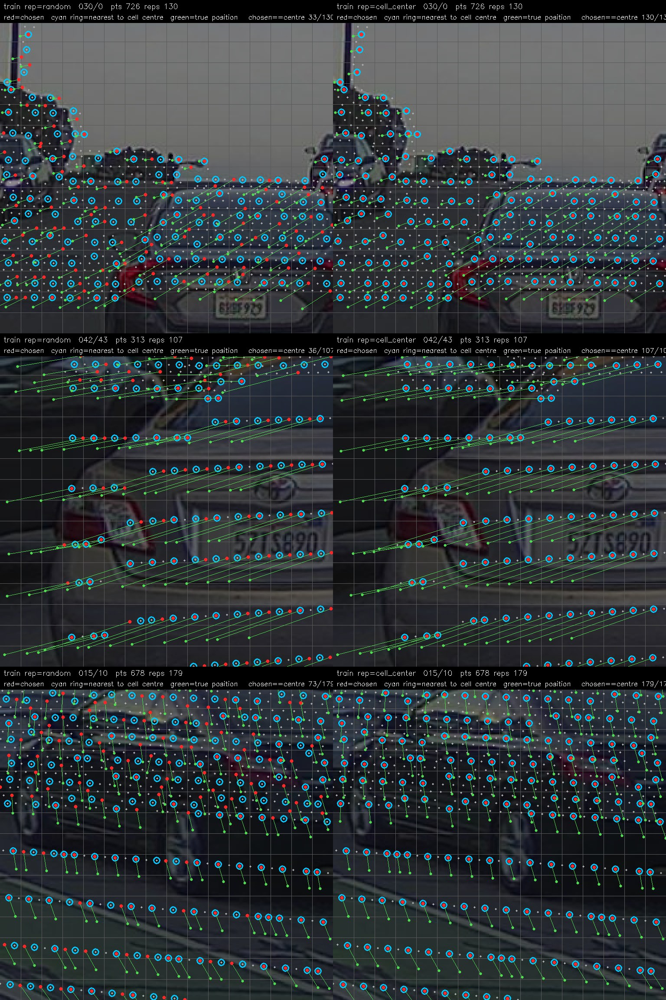

# PandaSet: training, inference and the API on one code path (fixes and results, 2026-10-07 to 08)

## Summary

- PandaSet stage 1 (no BA) → stage 2 (with BA) now runs through the same code path for training, inference (`infer_calib.py`) and the API (`/api/eval_frame`).
- With a pose perturbed from outside (rotation ±0.5° per axis, translation ±0.2 m per axis), the median error after correction over 40 val frames is:
  - yaw 0.027°, pitch 0.029°, roll 0.065° (about 1 px on the PandaSet front camera, f = 1970 px)
  - x 0.010 m, y 0.013 m, z 0.020 m
- Given the correct pose, a similar error remains after correction (yaw 0.026°, pitch 0.039°, roll 0.063°).
- The largest errors are roll and z (forward). Val p90: roll 0.148°, z 0.075 m.

## 1. Results (ps_s2_own24_rt, real inference path)

40 frames each; absolute error after correction. Camera frame: yaw = about the y axis (down), pitch = about the x axis (right), roll = about the optical axis; x/y/z = camera-centre offset.

| | yaw | pitch | roll | x | y | z |
|---|---|---|---|---|---|---|
| val, before correction, median | 0.189° | 0.323° | 0.276° | 0.102 m | 0.082 m | 0.114 m |
| **val, after, median** | **0.027°** | **0.029°** | **0.065°** | **0.010 m** | **0.013 m** | **0.020 m** |
| val, after, p90 | 0.065° | 0.060° | 0.148° | 0.026 m | 0.030 m | 0.075 m |
| val, no perturbation, after, median | 0.026° | 0.039° | 0.063° | 0.009 m | 0.016 m | 0.018 m |
| val, no perturbation, after, p90 | 0.078° | 0.100° | 0.140° | 0.020 m | 0.033 m | 0.046 m |
| train, after, median | 0.021° | 0.020° | 0.050° | 0.010 m | 0.013 m | 0.010 m |

One val frame through the API (`/api/eval_frame`) with three perturbations (stage-1 weights):

| perturbation | before (geodesic / distance) | after |
|---|---|---|
| none | 0.000° / 0.000 m | 0.143° / 0.043 m |
| (0.3, −0.2, 0.25)° / (0.1, −0.05, 0.15) m | 0.438° / 0.187 m | 0.159° / 0.048 m |
| (−0.45, 0.4, −0.1)° / (−0.18, 0.12, 0.05) m | 0.611° / 0.222 m | 0.104° / 0.037 m |

Val during training (stage 2; "POSE rot" in the training log = mean of the absolute values of the 3 rotation axes, not the geodesic angle):

| ep | rotation (3-axis mean) | translation | chi2r | σ |
|---|---|---|---|---|
| 1 | 0.098° | 0.045 m | 22719 | 4.5 px |
| 10 | 0.056 | 0.021 | 0.9 | 5.0 |
| 30 | 0.045 | 0.014 | 2.6 | 3.1 |

The train log (same definition) gives 0.025° at ep30. With the same evaluation code, train scenes give 0.036° and val scenes 0.046°.

## 2. What was fixed

| problem | fix | file |
|---|---|---|
| The per-cell representative point (query) was chosen from the GT projection (since 2026-05-31), so the model could read the answer from the coordinates | choose it from the perturbed projection (`uv_off_c`) | `datasets/pandaset_full.py` |
| CalibNet2's Deformable reference point was `sigmoid(Linear(q))` and did not look at the point's own position (after training it was still 42–100 px away from the point) | `--ref-mode query`: reference point = the point's own uv. The offset is learned only by the sampling locations inside DA | `models/calibnet2.py` |
| The local encoder took 16 random points from the surrounding 3×3 cells, at most 8 per cell | `--frustum-nb own --k-per-cell 24` (default): all points of the own cell, up to 24 | `models/model_depth.py`, `train_cnd2_ddp.py` |
| In both training and val the query was always the point closest to the cell centre | `--rep-strategy random_train`: random within the cell during training only; val and inference use the point closest to the centre | `datasets/pandaset_full.py` |
| If any grid window had too few points, the whole frame was re-drawn (silently a different frame in training; in inference it crashed with "no valid window after 1024 re-rolls") | fill missing windows with a copy of a valid window and set `w_active=0` (excluded from BA) | `datasets/pandaset_full.py` |
| Val had `center_band=0.5` (only the vertical middle 50% of rows) with no recorded reason | removed; val takes windows from the whole image | `train_cnd2_ddp.py` |
| Val windows and perturbations changed every epoch (stage 1 used numpy's global RNG) | `--val-seed` (default 20261008) fixes the RNG in val `__getitem__` | `pandaset_full.py`, `train_cnd2_ddp.py` |
| ClearML's task list showed seconds (e.g. 180) as Iterations | report lr at iteration 1 right after start-up | `train_cnd2_ddp.py`, `train_grid_depth.py` |
| ClearML's reporter subprocess (fork) sometimes hung in `Task.init` and no scalars arrived | `sdk.development.report_use_subprocess: false` in `~/clearml.conf` (set on each machine) | — |
| "Converting mask without torch.bool dtype" printed in bulk on every val | a torch 2.0.0 bug (fires even for bool masks); only this warning is suppressed | `train_cnd2_ddp.py` |
| eval every 10 epochs | default changed to every 5 | `train_cnd2_ddp.py` |
| confusion between geodesic angle and 3-axis mean | `pose_error_axes` reports yaw, pitch, roll, x, y, z; the API response also has `error_before_axes` / `error_after_axes` | `scripts/inference/infer_calib.py`, `services/calib_api/server.py` |

## 3. How to train

```bash
# Stage 1 (no BA). --frustum-nb own --k-per-cell 24 is the default
python -u datasets/train_cnd2_ddp.py --cache <pandaset_v3_full> \
  --min-crop-px 256 --max-crop-px 256 --img-size 256 --grid-n 16 --batch-size 4 --workers 6 \
  --val-fraction 0.1 --scene-split --n-iter 4 --lr 3e-4 --rot-deg 0.5 --t-m 0.2 \
  --clearml --clearml-project e2e_calib/calib --no-with-ba --oversample 40 --epochs 20 \
  --cross-attn deform --ref-mode query --rep-strategy random_train --name <stage1 name>

# Stage 2 (with BA), from the best stage-1 weights
python -u datasets/train_cnd2_ddp.py <stage-1 args without --no-with-ba and --oversample> \
  --with-ba --resume-ckpt experiments/<stage1 name>/best_model.pt --start-epoch 0 --epochs 30 \
  --ba-iter 4 --ba-damping 1e-3 --ba-weight 0.05 --ba-loss-type nll \
  --ba-warmup-start 0 --ba-warmup-end 10 --name <stage2 name>
```

- Stage-2 example: `_kick_ps_s2_after_rt.sh`.
- Time (one RTX 3090): stage 1 about 3.2 min/epoch, stage 2 about 3.5–4 min/epoch.
- Environment: the last runs used the `sam3` env (torch 2.11). `sam3` has no libturbojpeg, so pass `TURBOJPEG_LIB=<path to libturbojpeg.so.0>`. The API (uvicorn, FastAPI) ran in the `neurad` env (torch 2.0). Weights saved with torch 2.11 load in 2.0.

### nuScenes + PandaSet together

`--cache` takes a comma-separated list. nuScenes (1600×900) gives 7×4 = 28 windows of 256 px and PandaSet (1920×1080) gives 8×5 = 40; the trainer pads to 40 with copies of real windows and sets `w_active=0` on the copies so BA ignores them.

```bash
./_build_pad256_caches.sh   # rebuild both caches (section 6)
./_kick_nsps_s1.sh          # ns_850x4_pad256 + pandaset_pad256, stage 1, otherwise identical to ps_s1_own24_rt
```

Run `nsps_s1_pad256` started 2026-10-08 12:31: train 5,779 / val 740 frames (scene split). No results yet. Two earlier runs were stopped: `nsps_s1_own24_rt` (GT leak in the query depth, ep3) and `nsps_s1_dfix` (old caches).

## 4. Checking inference and the API

```bash
# 40 frames through the real inference path (perturbed pose given from outside). ZERO=1 for no perturbation
CKPT_EXP=<stage2 name> N=40 python tests/test_infer_pandaset.py

# API
E2E_EXP=<stage2 name> python -m uvicorn services.calib_api.server:app --port 5092
curl -X POST localhost:5092/api/eval_frame -F image=@image.jpg -F points=@points.txt \
     -F calib=@calib.json -F rot_deg='[0.3,-0.2,0.25]' -F t_m='[0.1,-0.05,0.15]'
```

### Web page

```bash
E2E_EXP=ps_s2_own24_rt python -m uvicorn services.calib_api.server:app --host 0.0.0.0 --port 5092
# open http://<host>:5092/calibrate
```

- "Pick from PandaSet val": enter a frame index (0–399) or pick one at random, enter the perturbation (rotation ZYX in degrees, translation along camera axes in m), and press "Perturb and correct". The cache is `E2E_PS_CACHE` (default `/mnt/ssd2t/work/e2e_calib/cache/pandaset_v3_full`).
- It shows a table of the errors before/after (yaw, pitch, roll, x, y, z) and the image with LiDAR points overlaid (green = correct pose, red = perturbed pose, cyan = corrected).
- Uploading your own data (image, point cloud, calib JSON) works the same way.

The CLI takes the perturbation per axis with `--rot` and `--t`:

```bash
python scripts/inference/infer_calib.py ps_s2_own24_rt --image image.jpg --points points.txt \
    --calib calib.json --rot '[0.3,-0.2,0.4]' --t '[0.05,-0.1,0.15]'
```

### Before / after (CLI)

Pick a PandaSet val frame by index, perturb, correct and save an overlay. Left panel: before correction (red = perturbed pose, green = correct pose). Right panel: after correction (red = perturbed pose, green = correct pose, cyan = corrected; cyan is drawn on top, so where it overlaps green only cyan is visible).

```bash
python scripts/inference/infer_calib.py ps_s2_own24_rt --pandaset-val 123 \
    --rot '[0.4,-0.3,0.4]' --t '[0.1,-0.1,0.15]' --overlay out.png
```

| frame | | yaw | pitch | roll | x | y | z |
|---|---|---|---|---|---|---|---|
| val 250 (scene 015/10), perturbation rot [−0.45, 0.4, −0.1]°, t [−0.18, 0.12, 0.05] m | before | +0.399° | −0.103° | −0.451° | −0.180 m | +0.120 m | +0.050 m |
| | after | −0.025° | +0.015° | **+0.098°** | +0.007 m | +0.002 m | −0.011 m |
| val 123 (scene 042/43), perturbation rot [0.4, −0.3, 0.4]°, t [0.1, −0.1, 0.15] m | before | −0.303° | +0.398° | +0.398° | +0.100 m | −0.100 m | +0.150 m |
| | after | +0.024° | −0.045° | **+0.138°** | −0.009 m | −0.026 m | +0.011 m |
| val 250, no perturbation | before | 0 | 0 | 0 | 0 | 0 | 0 |
| | after | −0.034° | −0.001° | **+0.087°** | +0.010 m | −0.009 m | −0.020 m |

In all three cases roll is the largest residual. With no perturbation the output still moves by roll 0.087° and z 0.020 m.

val 250, perturbed:


val 123, perturbed (the API's `/api/pandaset/eval_image` draws with the same function, `render_overlay`):


val 250, no perturbation:


### Before / after (API)

```bash
# returns the before/after overlay as PNG; errors in headers X-Error-Before / X-Error-After / X-Frame (JSON)
curl -X POST localhost:5092/api/pandaset/eval_image -F i=123 \
     -F rot_deg='[0.4,-0.3,0.4]' -F t_m='[0.1,-0.1,0.15]' -D - -o out.png

# same as JSON (per-axis errors error_before_axes / error_after_axes and projected points in overlay)
curl -X POST localhost:5092/api/pandaset/eval -F i=123 \
     -F rot_deg='[0.4,-0.3,0.4]' -F t_m='[0.1,-0.1,0.15]'

# before/after PNG for your own data
curl -X POST localhost:5092/api/eval_frame_image -F image=@image.jpg -F points=@points.txt \
     -F calib=@calib.json -F rot_deg='[0.3,-0.2,0.25]' -F t_m='[0.1,-0.05,0.15]' -o out.png
```

## 5. Open issues

- Given the correct pose, an error remains after correction (roll 0.063°, z 0.018 m).
- All numbers in sections 1 and 4 are from `ps_s2_own24_rt`, trained before the fixes in section 6 (GT leak in the query depth, binary intensity, caches without out-of-image points). No model has been trained on the new caches yet. The CLI and API still default to `pandaset_v3_full`, the cache that model was trained on; on `pandaset_pad256` the same val 123 case gives roll +0.185° instead of +0.138°.
- Val is 5 PandaSet scenes (400 frames) and 85 nuScenes scenes (340 frames, 4 per scene); val is reported as one pooled number, with no per-dataset breakdown.
- Stage 1 trains on random-pivot windows (background pivots only in the middle rows); inference tiles the whole image.
- Train numbers logged during training are epoch averages of in-progress weights under random queries and shifted grids, not the val conditions.
- ClearML val visualisations now pick frames evenly across the set and the window with the most points (from the next run on).

## 6. Code review (2026-10-08 afternoon): GT leaks and inference bugs

| problem | severity | fix | file |
|---|---|---|---|
| The query point's depth `d` was the range from the **GT camera** (`pts_cam`); the same point in the bucket had z under the perturbed pose. From the difference, t·p̂ (translation along the window's viewing direction) could be read: a 7-parameter fit per window recovered it with correlation 1.000, rms error 3 mm against a 126 mm signal | GT leak | `pts_cam_off` (perturbed pose) | `datasets/pandaset_full.py` |
| Cache held only points inside the image under GT; after perturbation the border that should fill in was empty (median 1% of points, max 3%) | GT-shaped hole | caches rebuilt with points up to 256 px outside the image, z > 0.1 | `scripts/preprocessing/build_*_v3.py` |
| Candidate prefilter GT ±64 px, z > 0.5 under GT | GT-dependent drop | ±256 px, z > 0.1 (final test is still z_off > 0.5 under the perturbed pose) | `datasets/pandaset_full.py` |
| Intensity: nuScenes cache had none (all 0); PandaSet stored raw 0–255 and the dataset clips to [0,1], so 94–98% of points were 1. In mixed training intensity was effectively a dataset label | data contract | both stored as raw/255; inference divides by 255 when an upload has values above 1 | builders, `scripts/inference/infer_calib.py` |
| Point loss included grid windows duplicated to pad the count (`w_active=0`); BA already excluded them. Mixed stage 2: about 16 of nuScenes' 40 windows are duplicates | training bug | excluded from the point loss | `datasets/train_cnd2_ddp.py` |
| ρ went through tanh twice before the GN weights (0.99 → 0.72); only used when there is no InfoHead | training bug | use the model's ρ directly (clamped to ±0.95) | `datasets/train_cnd2_ddp.py` |
| numpy not imported: per-epoch debug render was skipped | training bug | import | `datasets/train_cnd2_ddp.py` |
| `.bin` with N divisible by 20 was read as 4 columns (nuScenes 5-column files silently garbled) | inference bug | 5 columns if the 5th column is a ring index (integers 0–127), else 4 | `scripts/inference/infer_calib.py` |
| calib JSON without `T_cam_lidar` silently used the identity | inference bug | error | `scripts/inference/infer_calib.py` |
| any non-zero `dist` was treated as Kannala-Brandt fisheye | inference bug | fisheye only with `is_fisheye: true`; non-zero pinhole distortion is an error | `scripts/inference/infer_calib.py` |
| windows fixed at the training count (40): above ~2 MP only the top rows of the image were used | inference bug | as many windows as cover the image | `scripts/inference/infer_calib.py` |
| inference kept only points inside the image under the given pose | inference | keeps points up to 256 px outside, as the cache does | `scripts/inference/infer_calib.py` |

With the query-depth fix, `ps_s2_own24_rt` on the same 40 val frames gives the same numbers as before to the 4th decimal (perturbed: median 0.0909° / 0.0331 m, worst 0.2595° / 0.1015 m). `d` is in units of 100 m, so the leaked part was about ±0.002 of the input.

Checked and found correct: sign and direction of the correction (with the exact residual the pose comes back to 2e-9°), the eval endpoints give the dataset the perturbed pose (same as real use), the forward pass gets no GT tensor, there is no teacher forcing across iterations, and every architecture flag is read from the config at inference.

Not changed: the val POSE metric in the training log linearises at the GT camera frame (inference numbers come from `tests/test_infer_pandaset.py`); random-pivot windows are centred on a GT-projected point; `vfp` (focal length) is not used by the model.

### Representative point (query) per cell: training vs inference

With `--rep-strategy random_train`, training picks a random point in each cell and val/inference pick the point closest to the cell centre. Debug mode draws this per window:

```bash
python scripts/visualization/vis_rep_points.py --cache <cache> --out <dir> --frames 0,123,250
# or from any run: E2E_DATASET_DEBUG=<dir> (or debug_dir= in PandaSetCalibDatasetFull)
```

Left: training (random). Right: inference (closest to the cell centre). Same window and same perturbation in each row. Grey = all points in the window (projection under the perturbed pose), red = chosen representative, cyan ring = point closest to the cell centre, green = true position of the chosen point (red → green is the training target). The header gives how many chosen points coincide with the centre point: 33/130, 36/107 and 73/179 in training (cells with one point always coincide), and all of them in inference.



## Related

- Synthetic-data isolation: [2026-10-08_toy-bench-ladder.md](2026-10-08_toy-bench-ladder.md) (Deformable with the reference point at the point's own position: 7.03 → 1.66 px on grid-point data)
