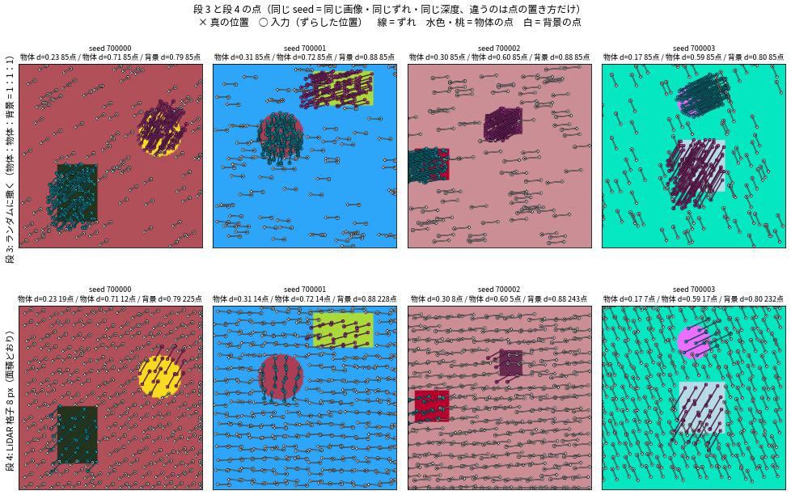
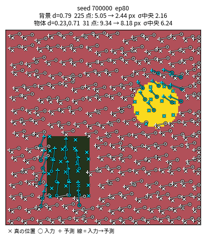
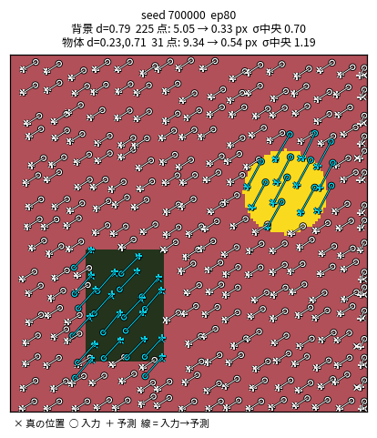

# 人工データのベンチ：どこで崩れるか（2026-10-07〜08）

## 結論

- 点を LiDAR の格子に置くと、全体クロスアテンションの CalibNetDepth は物体の点を直せない（8.51 px）。クロスアテンションを Deformable（参照点＝各点自身の uv）にすると、同じデータで 1.66 px まで下がる。1 px は切っていない。
- 全体アテンションのまま位置埋め込みを鋭くしても、局所エンコーダの Q から絶対位置を抜いても、7〜9 px 台のまま。
- 1 px を切ったのは、旧データ（物体の上に点の 3 分の 2 を密集させた、簡単すぎる問題）の 0.95 px だけ。

## 1. 旧データから 1 つずつ変えたときの物体の点の誤差

モデルは CalibNetDepth（3 層）、128 px、損失は NLL（全点平均）、80 エポック。val は seed 700000〜 の 800 枚。何も補正しないときは約 11 px。

| 段 | 前の段から変えたこと | クロスアテンション | 局所エンコーダ | ep80 物体 | ep80 背景 |
|---|---|---|---|---|---|
| 0 | 旧データ（物体 2 個＋背景、255 点を 1:1:1、白黒、深度固定） | 全体 | なし | 0.95 | 1.99 |
| 2 | 画像を白黒 → ランダムな色の RGB | 全体 | なし | 1.04 | 1.83 |
| 3 | 深度を固定 → ランダム | 全体 | なし | 1.14 | 1.90 |
| 4 | 点を LiDAR 格子 8 px（面積どおり。物体の点 約 170 → 中央値 20） | 全体 | なし | **8.51** | 2.70 |
| 4a | 格子でなく一様ランダム（点の数は段 4 と同じ） | 全体 | なし | 10.72 | 1.19 |
| 4f | 段 4 に局所エンコーダ | 全体 | あり | 7.03 | 2.63 |
| 4f-1 | 局所エンコーダの Q を（d, 強度）だけから | 全体 | あり | 7.39 | 2.67 |
| 4f-PE | 位置埋め込みを鋭く（画像と点に同じサイン波、周期 画像 2 枚分〜4 px） | 全体 | あり | 8.83 | 2.05 |
| **4f-D** | クロスアテンションを Deformable（参照点＝自分の uv） | Deformable | あり | **1.66** | 1.02 |
| 4f-D g1 | 1 段目だけ全体、2・3 段目 Deformable | 混合 | あり | 2.16（ep47 で停止） | 1.31 |
| 4f-D grid4 | 格子 4 px（1 枚 約 1024 点） | Deformable | あり | 1.57（ep31 で停止） | 0.92 |

段 3 と段 4 の点（同じ seed、違うのは点の置き方だけ）:

段 4（全体アテンション）と段 4f-D（Deformable）の ep80、val の 1 枚目:

## 2. 全体アテンションで何が起きているか

- 画像を別のサンプルのものに差し替えても予測がほとんど変わらない run がある（物体だけずらして背景を止めた run で、予測の変化 0.02 px）。画像を使わずに、平均（ずれ 0）を出し続けている。
- 物体のずれを全サンプル共通の定数にした問題でも、約 375 回の更新のあいだ出力 0 のまま止まり、そのあと急に下がった。
- 損失には物体の点も入っていて、勾配も流れている。同じ 16 枚だけなら 200 回で 9.99 → 1.03 px まで覚える。
- 深度は見えている。物体の点の深度を背景の値に書き換えると、段 4 の予測は 12.96 px 動く。物体だと分かったあとに、その物体のずれを画像から読めていない。
- 16×16 の最小問題（物体の画素の点だけ、全点同じずれ ±3 px）なら、全体アテンションでも 0.14〜0.16 px まで下がる。

## 3. 損失について（物体 1 個、64 px のベンチ）

| 損失 | 物体の点 |
|---|---|
| NLL（全点平均） | 1 バッチ 400 回でも 9.1〜15.4 px（σ を広げて μ が動かない） |
| μ は距離、σ は μ を止めた NLL（split） | 5.47 px（100 エポック） |
| split で物体と背景を半分ずつ（split_grp） | 2.60 px（深度差 0.05〜0.10 でも中央値 2.00 px） |

物体の点は全点の 6.8%。全点平均だと、損失の 9 割以上を背景の点が占める。

## 4. まだやっていないこと

- LiDAR のように密度を変え（横と縦の間隔を別々に 4〜24 px）、画像の外にも点を撒いてずらしたあとに画像内だけ残す版。局所エンコーダあり・なしの 2 本は、セッションが落ちてまだ 1 エポックも回っていない。
- 格子 4 px と 1 段目全体アテンションの run を最後まで回すこと。
- GT を与えない推論の確認（点の順番を入れ替える、ずらさない入力、自分で足したずれ）。
- 物体ごとに独立なずれではなく、1 つのポーズから来るずれ（回転は共通、並進は 1/d）にしたときに、全体アテンションと Deformable の差が残るか。
- PandaSet（CalibNet2）に戻すこと。参照点の作り方を直した ps_s1_refq は 10 エポックで 6.50 px。参照点＝自分の uv そのもの（`--ref-mode query`）は ep3 で止めたまま。

## 再現

- 学習: `GRID_CFG=configs.<設定> python -u train_grid_depth.py`（設定は `configs/grid_depth*.py`）
- データ: `datasets/synthetic.py` の `make_image_and_points_depth`（段 0〜4）、`make_image_and_points_lidar`（64 px ベンチ）
- ClearML: プロジェクト e2e_calib/calib、タグ `toy_bench`
