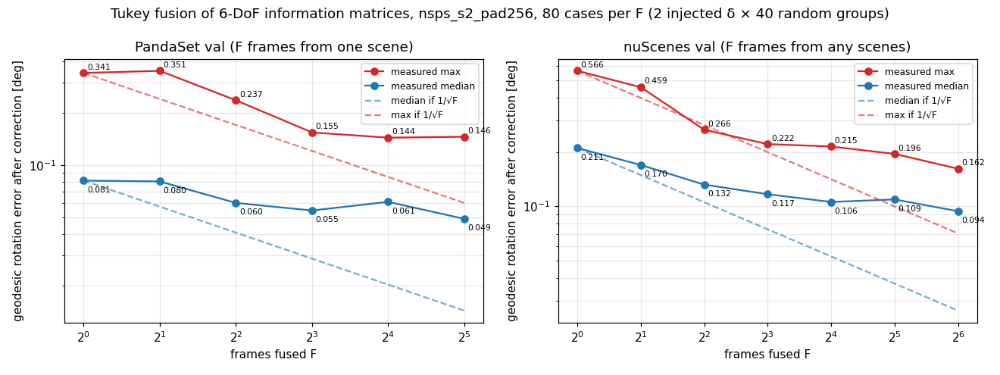

# Multi-frame fusion: how far does fusing frames bring the calibration error down? (2026-10-09)

## Summary

- Fusing F frames' 6-DoF estimates through their information matrices brings the error down on both datasets, but more slowly than 1/√F, and it levels off.
- nuScenes (median geodesic): 0.211° at one frame → 0.094° at 64 frames (0.45×). The worst of 80 cases: 0.566° → 0.162°.
- PandaSet: 0.081° → 0.049° at 32 frames; worst 0.342° → 0.146°. Yaw and pitch are already 0.02–0.03° (median) at one frame; roll stays at 0.04–0.05°.
- The nuScenes groups mix scenes, which real data does not allow (calibration differs per log). Within-sequence fusion is next (section 4).



Solid lines are measured; dashed lines are what independent per-frame errors averaging out (1/√F from the F=1 value) would give.

## 1. Method

1. Per frame, the same path as the API (`build_inst` → `make_dataset` → `predict_pose`) gives the correction δ̂_f (rotation 3 + translation 3) and its 6×6 information matrix H_f from the GN over the frame's windows.
2. One injected δ is applied to every frame of a draw (one rig, one calibration error).
3. F frames are fused into one δ̄, and E(δ̄) @ T_in is compared with the true pose:

| rule | what it does |
|---|---|
| sum | δ̄ = (Σ H_f)⁻¹ Σ H_f δ̂_f |
| gate3 | drop frames with (δ̂_f − δ̄)ᵀ H_f (δ̂_f − δ̄) / 6 > 3, refit |
| huber / tukey | IRLS on r_f = √((δ̂_f − x)ᵀ H_f (δ̂_f − x)), scaled by 1.4826·median(r); Huber c = 1.345, Tukey c = 4.685 (starts from the Huber solution) |

Setup: model `nsps_s2_pad256` (nuScenes + PandaSet, stage 2 with BA), 200 val frames evenly spaced, 2 injected δ (rotation ±0.5°, translation ±0.2 m per axis) × 40 random groups per F = 80 cases per row. PandaSet groups come from one scene; nuScenes groups from any scenes (its val cache has 4 frames per scene).

## 2. Results (Tukey; F = 1 is a single frame)

Rotation per axis is the absolute error in degrees (yaw = about the camera y axis, pitch = x, roll = optical axis); geodesic = the three axes as one rotation; t = camera-centre distance.

| | F | median yaw / pitch / roll [deg] | max yaw / pitch / roll [deg] | geodesic median / max [deg] | t median / max [m] |
|---|---|---|---|---|---|
| PandaSet | 1 | 0.027 / 0.025 / 0.054 | 0.115 / 0.079 / 0.328 | 0.081 / 0.341 | 0.033 / 0.108 |
| | 4 | 0.022 / 0.024 / 0.051 | 0.101 / 0.057 / 0.236 | 0.060 / 0.237 | 0.027 / 0.086 |
| | 8 | 0.020 / 0.024 / 0.048 | 0.093 / 0.057 / 0.147 | 0.055 / 0.155 | 0.029 / 0.079 |
| | 16 | 0.022 / 0.029 / 0.054 | 0.092 / 0.048 / 0.130 | 0.061 / 0.144 | 0.037 / 0.078 |
| | 32 | 0.024 / 0.022 / 0.042 | 0.089 / 0.047 / 0.130 | 0.049 / 0.146 | 0.032 / 0.065 |
| nuScenes | 1 | 0.081 / 0.089 / 0.120 | 0.436 / 0.408 / 0.458 | 0.211 / 0.566 | 0.054 / 0.168 |
| | 4 | 0.041 / 0.057 / 0.081 | 0.207 / 0.166 / 0.235 | 0.132 / 0.266 | 0.031 / 0.079 |
| | 16 | 0.039 / 0.064 / 0.058 | 0.132 / 0.107 / 0.187 | 0.106 / 0.215 | 0.025 / 0.060 |
| | 64 | 0.037 / 0.065 / 0.053 | 0.079 / 0.093 / 0.135 | 0.094 / 0.162 | 0.021 / 0.046 |

Against 1/√F (median geodesic, deg):

| | F=1 | F=4 | F=16 | F=32 / 64 |
|---|---|---|---|---|
| PandaSet, measured | 0.081 | 0.060 | 0.061 | 0.049 (F=32) |
| PandaSet, 1/√F | 0.081 | 0.041 | 0.020 | 0.014 (F=32) |
| nuScenes, measured | 0.211 | 0.132 | 0.106 | 0.094 (F=64) |
| nuScenes, 1/√F | 0.211 | 0.106 | 0.053 | 0.026 (F=64) |

- nuScenes pitch: median 0.089° → 0.065° and max 0.408° → 0.093° from F=1 to 64; the median stays at 0.064–0.065° from F=16 to 64, the largest of the three axes at F=64.
- PandaSet's max stays at 0.144–0.146° from F=16 to 32, and p90 at 0.13–0.14° from F=4 to 32. Its groups come from one of 5 val scenes, so frames in a group are not independent.
- Sum, Huber and Tukey differ by at most 0.025° in the max (nuScenes F=8: sum 0.246°, Tukey 0.222°). The χ² gate is worse than the sum in some rows (PandaSet F=16 median 0.072° vs 0.063°).
- For scale: 0.02° ≈ 0.69 px on PandaSet (f = 1970 px) and ≈ 0.44 px on nuScenes (f ≈ 1260 px).

## 3. Why it levels off

Every frame in a group carries the same injected δ. An error that depends on δ itself (a bias of the network or the GN for that δ) is the same in every frame and does not average out; only the frame-to-frame part does. The 40 groups per F are drawn from the same 200 frames, so they overlap and the 80 cases are not independent either.

## 4. Next: within-sequence fusion on nuScenes

The nuScenes val cache keeps 1 in 10 keyframes (`--frame-frac 0.1`, 4 per scene), so the groups above mix scenes. Real calibration is fixed only within a log, so fusion has to be measured within one sequence. A cache of the same 85 val scenes with every keyframe (about 40 per scene) is being built:

```bash
python scripts/preprocessing/build_nuscenes_v3.py --data-root <nuScenes trainval> --meta-dir <...>/v1.0-trainval \
  --out <cache>/ns_850val_all_pad256 --cams CAM_FRONT --stride 1 --frame-frac 1.0 --val-frac 1.0 \
  --scenes ns_850x4_val_scenes.txt
```

## Reproduce

```bash
python scripts/eval/multiframe_infer.py --exp nsps_s2_pad256 --cache <cache>/pandaset_pad256 --tag ps --group scene --F 1,2,4,8,16,32
python scripts/eval/multiframe_infer.py --exp nsps_s2_pad256 --cache <cache>/ns_850x4_pad256 --tag ns --group any --F 1,2,4,8,16,32,64
```

- Fusion rules: `scripts/eval/frame_fusion.py` (`fuse(H, dp, mode=sum|gate3|huber|tukey)`).
- Per-frame (δ̂, H) and the result tables: `experiments/multiframe/`.
- Related: [2026-10-08_pandaset-calib-fixes.md](2026-10-08_pandaset-calib-fixes.md) (model, caches, inference path).
