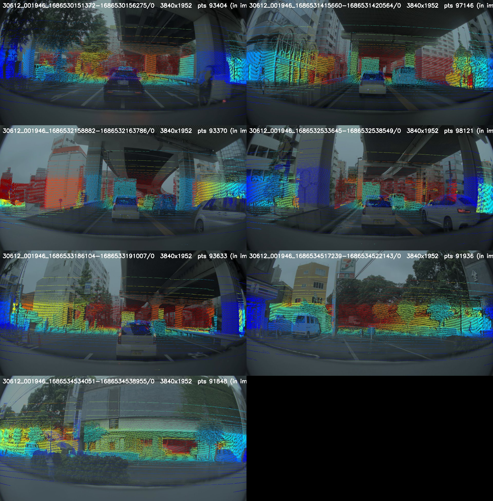

# TSS4 (vehicle 248) camera calibration after the manual KB4 fit (2026-10-09)

Current values in every `setting-248.json` of `tss4_calib_raw_01/20230612_001946/sequence=248_*` (8 sequences).
Machine-readable copy: [2026-10-09_tss4_248_calib.json](2026-10-09_tss4_248_calib.json) (`fcm` and `poslv` blocks, same layout as `setting-248.json`).

## Values

| | value |
|---|---|
| resolution | 3840 × 1952 |
| focal length (fx = fy, `fc` / `kb.focal_length`) | 2324.8389 px |
| principal point (`cc`) | (1922.5, 1099.2) px |
| KB4 k1, k2, k3, k4 | **−0.277462, 0.095509, −0.045560, 0.010639** |
| fcm `rot` (roll, pitch, yaw), zyx | −0.0271189, −0.0008720, 0.0008479 rad = −1.5538°, −0.0500°, 0.0486° |
| fcm `mp` (x, y, z), vehicle-front frame | **−1.876, −0.010, 1.465** m |
| `poslv` `mp` (rear axle in the front frame) | −3.823, 0, 0.702 m |
| `poslv` `rot` | 0.004451, 0.004363, −0.003264 rad = 0.255°, 0.250°, −0.187° |

Bold = changed by the manual fit. Before: k1..k4 = −0.276398, 0.114961, −0.102750, 0.044422; mp = −1.836, 0.0, 1.465 m. rot, fx, cc and poslv are unchanged.

## How it was obtained

- Tool: `scripts/webui_kb_fit/app.py` (port 5007), started from the sequences' own `setting-248.json`.
- Fit reported by the tool: rms 1.35 px, 2 iterations, 6 arrows, 74 anchors.
- LiDAR (`vls128_rear_axle`) → camera composes POSLV: R = R_rdf · R_fcmᵀ · R_poslv, t = R_rdf · R_fcmᵀ · (mp_poslv − mp_fcm) (same as LOOM `get_poslv_adjusted_calibration`, `build_woven_sequence_v3._camera_calib_fcm`).

## Files

- The 8 `setting-248.json` hold these values; the previous ones are kept next to them as `setting-248.json.bak_20261009_033115` (older: `.bak_20261002_145414`).
- Cache built from them: `/mnt/ssd2t/work/e2e_calib/cache/tss4_pad256` (train 350 / val 50 frames; val = `sequence=248_..._1686529656324-1686529661227`). The cache from the old values is kept as `tss4_pad256_old_setting`.
- Projection check (cached `uv_full`, `scripts/visualization/vis_cache_proj.py`): 

To rebuild a cache with a different fit without touching the settings: `build_woven_sequence_v3.py --fcm-override <json with fcm keys>`.
