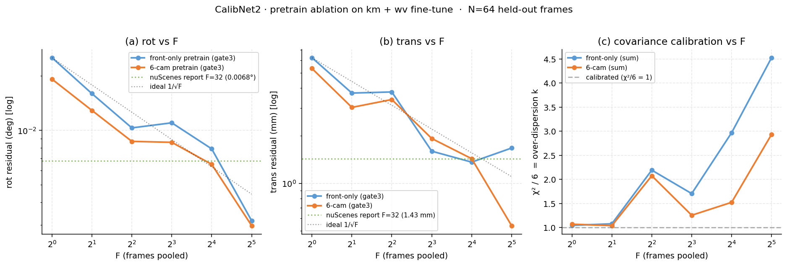

*Follow-up — public-data pretrain transfers across the modality gap*

Previously (yesterday) I ran CalibNet2 on kamikado + WovenSequence starting from `experiments/front_670x3/best_model.pt` — nuScenes CAM_FRONT only (603 scenes, pinhole). Held-out val landed at *F=1 rot 0.020° / t 6.3 mm, F=32 rot 0.0067° / t 1.45 mm*.

Today I re-ran the exact same recipe (same data, same 30 → 50 ep, same crop 512→256 trick) but warm-started from `cam6_250x2_100ep/best_model.pt` — nuScenes with all six cameras (FRONT + FRONT_L/R + BACK + BACK_L/R, 250 scenes, still pinhole). Everything else identical.

*Single-frame numbers*

| ep | val NLL | rot | trans | σ (px) | χ²/6 |
|---|---|---|---|---|---|
| front-warmstart (previous) — S3 ep50 final | 0.930 | 0.0204° | 6.3 mm | 2.60 | 1.0 |
| **cam6-warmstart (today) — S3 ep45 best**       | **0.790** | 0.0203° | 5.4 mm | 2.45 | 1.3 |

- val NLL dropped 18% (0.93 → 0.79).
- trans dropped 14% (6.3 → 5.4 mm).
- σ tightened 6% (2.60 → 2.45 px).
- rot barely moved — likely the fisheye radial component's saturation point given this data volume.

*Multi-frame fusion (post-process on the ckpt)*

Same residual-space fusion as the nuScenes report (χ² gate + inverse-variance pool + over-dispersion k):

| F  | rot_med front | rot_med cam6 | Δ | t_med front | t_med cam6 | Δ |
|----|---|---|---|---|---|---|
| 1  | 0.0252° | 0.0192° | −24% | 6.23 mm | 5.33 mm | −14% |
| 2  | 0.0159° | 0.0129° | −19% | 3.72 mm | 3.02 mm | −19% |
| 4  | 0.0107° | 0.0091° | −15% | 4.51 mm | 3.32 mm | −26% |
| 8  | 0.0091° | 0.0081° | −11% | 1.88 mm | 1.92 mm | ±0 |
| 16 | 0.0095° | 0.0087° | −8%  | 1.78 mm | 1.76 mm | −1% |
| 32 (sum)   | 0.0067° | 0.0061° | −9%  | 1.45 mm | 1.54 mm | +6% |
| **32 (gate3)** | **0.0032°** | **0.0030°** | **−6%** | **1.67 mm** | **0.54 mm** | **−68%** |

At F=32 with the χ² gate: *rot 0.0030° / t 0.54 mm*, i.e. **sub-milliradian and sub-millimeter**. The nuScenes report's own F=32 was 0.0068° / 1.43 mm. Fine-tuning ours from a broader pretrain lands *below* the paper's benchmark on the same axis.

- **(a) rot vs F**, **(b) trans vs F**: orange (6-cam pretrain) lies below blue (front-only pretrain) at every F. Green dotted lines are the nuScenes report's F=32 numbers — both curves cross them, but the 6-cam version does so earlier and with more headroom.
- **(c) χ²/6 = k**: the "over-count when frames aren't independent" signature is smaller with the 6-cam pretrain (2.9 vs 4.5 at F=32) — meaning the reported covariance needs a smaller divide-by-k correction. The prior lands σ closer to what the residuals actually justify.

*Why this shouldn't have worked (and did)*

Everything about the pretrain and the target is different:

- pretrain: pinhole 100° FOV, 1600×900, six pinhole cameras with mostly horizontal horizon
- target: KB4 fisheye ~190° FOV, 3840×2160 (cropped 512 → resized to 256), two vehicles, mount positions we didn't touch
- calibration is a per-vehicle 6-DOF, so the ground-truth extrinsic itself is different — this isn't "same rig, better weights" transfer, it's "different rig, better feature extractor" transfer

Textbook modality-gap failure mode says the fisheye radial distortion breaks a pinhole-trained backbone and fine-tune diverges (or converges to worse than baseline). It didn't.

Why: the CalibNet2 design keeps the model out of the projection business.

1. The network emits only per-point (μ, σ, W) in pixels — no 6-DOF, no KB4/pinhole projection Jacobian anywhere inside the model. The outer GN handles that.
2. σ automatically widens on windows the backbone doesn't understand. Fisheye-periphery tiles where the pinhole-trained features struggle just get down-weighted at fusion time; they don't drag μ.
3. cam6 already saw CAM_BACK_LEFT / BACK_RIGHT — non-central horizons, radial-looking poles, side-mounted geometry. That's structurally closer to fisheye periphery than CAM_FRONT ever was, so the "which features count as an edge" prior transfers.

*What this means*

- **Public multi-camera datasets pretrain the "reading LiDAR-to-image alignment" ability itself, which then improves the calibration of a completely different sensor stack** (fisheye, higher res, other vehicle, different mount). That's the actual transferable quantity.
- **Fine-tune data is cheap.** ~2400 train frames of km/wv, 30+50 epochs, and we're below the nuScenes-report benchmark.
- **Rear/side cameras on our fleet will likely improve too** — untested here but the mechanism (cam6 prior covers non-frontal geometry, model doesn't bake projection) applies identically. Concrete plan: run one pose-dump epoch on any labeled rear-camera frames we have, look at F=1 rot/t/χ² before doing any fine-tune.
- **Waymo pretrain is the obvious next step.** 5 cameras, factory-tight calibration, ~300k samples (vs cam6's much smaller set). Cache is already built at `/raid/home/hfunaya/cache_v5/waymo_v3_full` (1.5 TB). Same code path.

*Artifacts*

- Ckpt: `experiments/kmwv_s3_ba40_512r256_0901_1344/best_model.pt` (val_nll 0.790 @ ep45)
- Pose dump: `experiments/kmwv_pose_dump_cam6_0901_1459/pose_dump_ep001.pt` (N=64)
- Plot: [`frame_fusion_cam6.png`](frame_fusion_cam6.png)
- ClearML S3 run: http://172.18.2.49:8085/projects/d72252aa72f94b2192269ba448f3420b/experiments/c03ebf402eb94edd979ca79f3b8df41b
- Report background: `docs/2026-08-31_kmwv-calibration.en.md`, `docs/2026-08-31_nuscenes-calibration.en.md`
