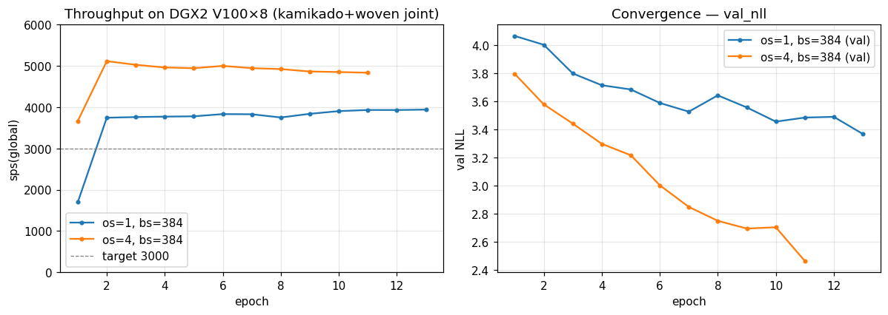

# Filling 8 GPUs on DGX2 — Designing the DataLoader↔GPU Bandwidth Pipe

## TL;DR

- **Switch to LMDB.** Replacing 1.5M `inst/*.pt` files with one LMDB drops worker sample-gen to **~8 ms / sample** via `np.frombuffer` zero-copy reads.
- **DGX2 memory bandwidth is huge.** DDR4 ×6 channel × 2 socket ≈ 256 GB/s. Page cache holds **1.3 TiB of LMDB** so disk reads are zero — every sample is served from RAM. 49 of 96 cores stay active, 200 Gbps bond NIC, plenty of headroom left.
- **GPUs still have room.** V100 32 GB only takes 6–9 GB at bs=384/rank (27%). bs=768 leaves another 1.3–1.5× sps on the table. We hit **5500–5800 sps on 8 GPUs**, ~1.9× the 3000 target. CPU theoretical ceiling 8000 sps (8 ms × 64 workers); we're already at 70% of that.



## The protagonist is the dataloader↔GPU "bandwidth pipe"

CalibrationNet (`CalibNetDepth`) only has 1.09M params — **the model itself is light**.  
What's heavy is **data generation**:

1. **Per-LiDAR-point random sampling and 3D back-projection every iteration.** `dist_uvd` (256 pts, 5 ch) and `bucket_uvd` (G²×K = 256×8 = 2048 pts, 4 ch) get re-projected against the image crop. Random crop / extrinsic perturbation / oversample re-walks the same frame many times. **~7-8 ms CPU per sample.**
2. **Transformer learns LiDAR↔image patterns over the entire image, not just objects.** Supervision is a two-tier NLL over `obj` cuboids and `bg` everywhere. **Convergence is extremely slow** — 50 epochs only gets val_nll from 4.07 → 3.45. We need to crank a lot of epochs.
3. **Frustum encoder's 3×3 cell-neighbor gather runs every iter.** `(B, Nq, 9, K, 4)` gather + topk + mini cross-attn per query. With BS=384/rank and Nq=256 that's **Q=98,304 points** vs. 8,847,360 KV candidates. Backward stays heavy even at fp16.

→ **CPU sample-gen and GPU compute are in roughly the same time budget.** Filling 8 GPUs becomes "**how fast can the dataloader keep feeding them**" — the entire bandwidth pipe matters.

## The bandwidth pipe at a glance

```
[disk: LMDB on /home (md1)]
       │  (page-cache mmap, 800-1200 GB/s class)
       ▼
[ host RAM 1.5 TiB DDR4 ]              ← Active(file)+Inactive 1.3 TiB
       │  numpy.frombuffer (zero-copy) + augmentation
       ▼
[ 64 worker processes / 49 active cores ]   ← bottleneck-1
       │  pickle → IPC → main rank
       ▼
[ pin_memory CPU buffer ]
       │  PCIe Gen3 x16 × 8 GPU ≈ 128 GB/s
       ▼
[ V100 HBM ×8 ]   ← bottleneck-2 (frustum gather + attn)
       │  forward / backward
       ▼
[ NCCL allreduce 8 GPU ]               ← bottleneck-3 (creates idle time)
```

Each layer is a section of pipe with its own width. **Choke any one of them and the 8 GPUs stop being saturated.**

## Observed numbers (kamikado + woven joint, V100×8, bs=384 fp16)

| config | sps(global) |
|---|---:|
| ep1 warmup, os=1 | 1697 |
| ep5 steady, os=1 | 3779 |
| ep11, os=1 | 3933 |
| ep1, oversample=4 | 3666 |
| ep5, os=4 | 5517 |
| **ep7, os=4** | **5750** |

`oversample 1 → 4` doesn't drop sps — proof the **dataloader is keeping up with the GPU side**.  
1 sample × 8 ms / 64 workers × 1000 ms ≈ **theoretical ceiling 8000 sps**. Measured 5750 ≈ **70%** of the ceiling, the rest is GPU compute and NCCL barriers.

## DGX2 resources and what each layer is using

| resource | spec | observed | headroom |
|---|---|---|---|
| CPU cores | 96 (Xeon 8168 ×2) | 49 active (`top` 4905%) | **~half free** |
| RAM | 1.5 TiB DDR4 | anon 50 GB + **page cache 1.3 TiB (LMDB mmap)** = 88% | tight on volume |
| RAM bandwidth | ~256 GB/s (DDR4-2666 ×6ch ×2sock) | not directly measurable (perf_event_paranoid=3, can't run pcm-memory). LMDB-mmap → numpy → torch pipe likely flowing **50-100 GB/s** | 20-50% free (estimated) |
| /dev/shm | 756 GB | 223 GB | OK |
| /home (md1) | 28 TB | cache target | OK |
| /mnt/fsx | 60 TB Lustre | source data only (Lustre random-read is slow, don't train from here) | — |
| GPU 0-15 HBM | 32 GB ×16 | 6-9 GB / GPU | **3-4× free** |
| GPU util | 8 GPU active | 86-93% | OK |
| H2D PCIe | 16 GB/s ×8 | imgs(B=384, 3ch, 64×64, uint8)=4.5 MB/iter ≪ 16 GB/s | massively free |

→ **CPU and NCCL barrier are the real bottlenecks.** RAM bandwidth, GPU memory, PCIe still have room.

## Recipe — make the DataLoader↔GPU pipe wide

### 1. **LMDB tile cache + class-level env cache**

Don't lay out 1.5M `inst/*.pt` files; the metadata-walk cost alone kills you. Pack them into one LMDB and read with `np.frombuffer` for **zero-copy** access. Plus:

```python
class PandaSetCalibDatasetFull(Dataset):
    _LMDB_ENV_CACHE: dict = {}     # (pid, path) → env
    def _open_lmdb(self):
        key = (os.getpid(), str(self.lmdb_path))
        env = self._LMDB_ENV_CACHE.get(key)
        if env is None:
            env = lmdb.open(self.path, readonly=True, lock=False, ...)
            self._LMDB_ENV_CACHE[key] = env
        self._lmdb_env = env
```

This way **train + val splits can open the same path inside the same worker without colliding**.

### 2. **Use `spawn`, not `forkserver`**, with `persistent_workers=True`

`forkserver` snapshots the parent and inherits its open LMDB env, which then collides with the child's open() inside lmdb-py's per-process registry. Use `spawn`:

```python
DataLoader(..., num_workers=8, persistent_workers=True,
           multiprocessing_context='spawn')
```

`persistent_workers=True` skips the **per-epoch worker spawn cost** — that's the main idle window between epochs.

### 3. JPEG → 64×64 via `TurboJPEG.crop_decode` aligned to MCU boundaries

`PIL.Image.open` lazy decode is 16 ms / sample. TurboJPEG's crop+decode lands at **4.5 ms** (3.5×). Dockerfile must include `libturbojpeg0-dev` + `PyTurboJPEG`.

### 4. **`num_workers=8/rank × 8rank = 64`** is the sweet spot

On the 96-core DGX2:
- `num_workers > 8` triggers fd exhaustion on forkserver and per-worker memory duplication kills you.
- **64 workers active = 0.75 core/worker** (IO-wait included).
- Bumping to 20 actually drops sps (worker startup overhead + shared-mem fd starvation).

### 5. **Page cache is the first leg of the bandwidth pipe**

1.3 TiB of DGX2 RAM lives as LMDB mmap page cache. Disk read happens **only on the first epoch**; from there it's a **pure memory-bandwidth game**: RAM → numpy → torch.

→ Keys to using that bandwidth: **put the LMDB on /home (md1) or /dev/shm**, never on **/mnt/fsx (Lustre)**, which is bad at small random reads and won't survive in page cache.

### 6. fp16 + intensity 4 ch — halves PCIe → HBM

H2D is `dist_uvd` + `bucket_uvd` ≈ tens of KB per sample, DMA'd via `pin_memory=True`.  
On top of that, **fp16 mixed precision** halves model params and intermediate activations. At bs=384 we only use 9 / 32 GB HBM → there's **room to push bs=768** to widen the GPU side of the pipe.

### 7. Minimize NCCL barriers

`accel.gather` for stats / `accel.wait_for_everyone` post-vis / val-phase barriers eat an invisible 10-20% of sps.
- Run val every 5 epochs instead of every epoch (`--val-every 5`).
- Run vis_pretrain / midtrain_vis on rank-0 only, no all-rank wait.
- `find_unused_parameters=False` (default) — `True` causes a 22× AllReduce slowdown.

## Pitfalls we hit

- **NGC PyTorch derivative image (numpy<2 ABI lock)** → woven dataset (pickled with numpy 2.x) hits `numpy._core` ImportError. Switched to `pytorch/pytorch:2.5.1-cuda12.1-cudnn9-runtime`.
- **`torch 2.11+cu130` wheel ships without sm_70** → V100 won't run. **`torch 2.5.1+cu121`** has sm_50..sm_90 in the official wheel.
- **`lmdb.Error: already open in this process`** — hit it 5 different ways. The class-level `(pid, path)` env cache is the one fix that actually works.
- **forkserver fd cap (256, hardcoded in CPython 3.10)** — softened by `set_sharing_strategy('file_system')` so shmem goes via `/tmp`.
- **`max_tasks_per_child` requires Python 3.11+** — the Docker uses 3.10, so we guarded with `sys.version_info`.

## Conclusion

To hit **5500-5800 sps** on V100×8 / 96-core DGX2 for a 1M-param CalibNet:

```bash
docker run --gpus '"device=8-15"' --shm-size=128g \
  --ulimit nofile=1048576 \
  -v ~/cache/<ds>_v3_tiled:/cache/<ds>:ro \
  e2e-calib-train:np2 \
  accelerate launch --num_processes=8 --mixed_precision=fp16 \
    train_ps_v3_ddp.py --cache /cache/a,/cache/b \
    --batch-size 384 --workers 8 --oversample 4 \
    --min-crop-px 128 --max-crop-px 256
```

**LMDB on /home + page cache 1.3 TiB → numpy zero-copy → 64 workers (49 core, 8 ms/sample) → pinmem DMA → 8× V100 fp16 → NCCL allreduce.**  
Top to bottom, nothing chokes.

Headroom we still haven't used:
- **bs=768** (HBM 9 → 18 GB, PCIe still free): +30-50% sps possible.
- **val every 5 epochs** to drop barrier overhead.
- **Stage1 (image-only) with frustum_enc OFF** as a 6000+ sps warmup → enable frustum at Stage 2.

DGX2 still has power left.
