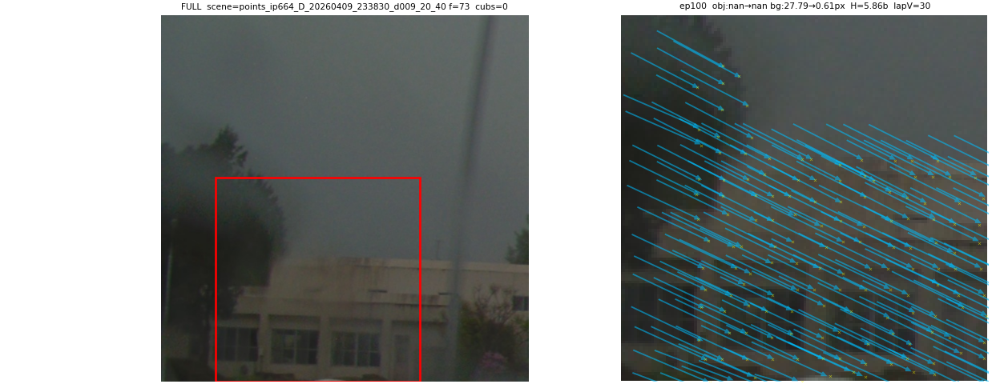
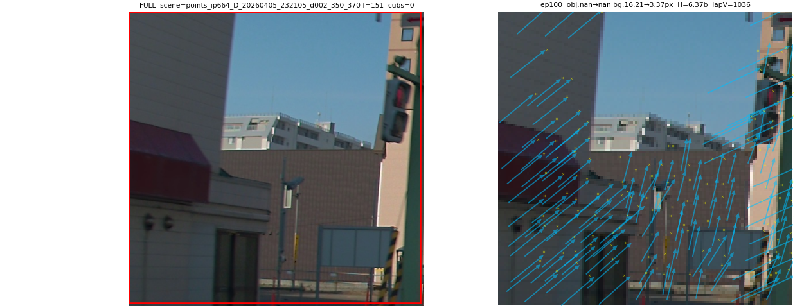
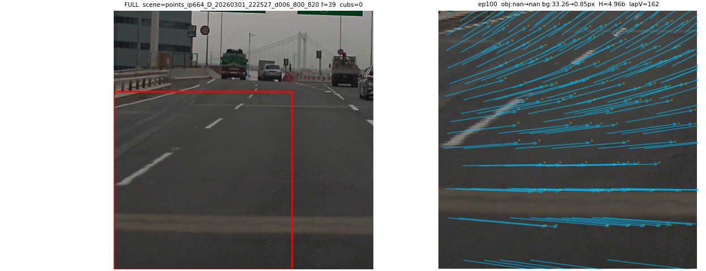
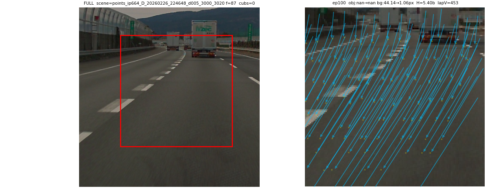

# Weekly 3P (2026-05-09 → 2026-05-15)

E2E_CALIB σ-net. Progress / Problem / Plan.

---

## Progress

### ★ σ-net on **TMPOC production data** (kamikado unlock)

Until this week σ-net was trained only on public datasets (ZOD, Waymo,
PandaSet, nuScenes, DDAD, AV2). **This week it ran end-to-end on TMPOC
production-vehicle data** (front cam + VLS-128, kamikado provided). The data
is the gate that turns σ-net from a paper trick into something deployable on
the cars we actually ship.

| | |
|---|---|
| cache | `tss4_v3_tiled` (V3 tile cache, 4-ch intensity), built from TMPOC raw |
| frames | 795 → train 716 / val 79 (frame-level split, seed=42, no scene leak) |
| instances | train 229,120 / val 25,280 (post tile-expansion) |
| model | ConvNeXt + frustum + deform_sl + 4-layer cross-attn |
| training | 100 ep, batch=256, bf16, 198 min |
| **best val NLL** | **2.1348** (ep 100, monotonic descent) |

`obj NLL = 0` because the TMPOC cache has no obj annotations → bg-only NLL =
pt NLL. ZOD baseline on the same arch sits ~1.7 with 10× more frames; with a
TMPOC drive of equivalent frame budget the gap should close.

Sample viz (left = tile location on full frame, red box = crop; right = tile
crop with LiDAR projection):

(σ-ellipse overlay needs a separate viz pass on `best_model.pt` — the
training-time viz preset only shows tile + point projection.)

### Joint training across public + internal (3 caches)

Now training a single σ-net on **ZOD + TMPOC + PandaSet** simultaneously
(1.56 M train instances, `rep_strategy=nearest_cam`, os=4 per cache,
`val_every=5`). Run `zod_tss4_ps_20260515_joint_repnear_os4_50ep_lrmin1e6`:

| ep | train | val | save |
|---:|---:|---:|---|
| 1 | 5.462 | 5.079 | ★ |
| 5 | 4.287 | 4.152 | ★ |
| 7 | 3.940 | (val every 5) | (in flight) |

`lr_min` raised 1e-7 → 1e-6 vs the previous run (the old run plateaued at val
3.211 with the schedule freezing for 9 ep before any movement). 50 ep ETA
~14 h.

### DGX-2 ClearML — evaluations now visible to the team

Stood up **ClearML on the office DGX-2** this week. Every σ-net run — losses,
val NLL, sample visualizations, model artifacts — is now reachable from any
TRI-AD seat. The "is this run better than last week's?" question stops being
something I have to answer in chat and becomes a link.

### Waymo V3 tile cache (4-ch intensity)

595 / 798 segs done (75%), ~20 GB written; finishes tonight. Joins joint
training as the 4th cache.

---

## Problem

### WOVEN cache lost in the previous tracker move

The legacy experiment-tracker host went down hard mid-week. The **WOVEN
cache** that took most of last sprint to build was registered as a ClearML
Dataset and showed *completed* in the UI, but only the metadata
(`state.json`, ~10 MB, 35,881 file entries) survived — the actual data zip
chunks were never durably uploaded before the host died. The cache itself is
gone, and the only path forward is rebuilding from raw Loom frames on the
source PC. Annoying. The new DGX-2 ClearML has stricter upload-completion
gating specifically so that this exact failure mode can't recur, but the lost
build time still hurts.

### LAUNCHBOX cannot be exposed as a service

LAUNCHBOX's IP is not exposable externally (network policy), so the σ-net
demo / inference-as-a-service path we'd planned to host on it is **blocked
for general access**. Options:

1. Move the demo to a host that can serve externally — same trick we use for
   the team-internal blog/dashboard endpoints.
2. Run LAUNCHBOX behind an internal-only URL and document the access step for
   users (degrades UX).
3. Drop the LAUNCHBOX path entirely and consolidate on the externally-
   serveable host.

Leaning toward option 1: the alternative host has the compute and an
existing TLS endpoint; moving the demo there avoids the IP-exposure issue
without adding a new hop. Confirm with networking before committing.

---

## Plan (next week)

1. **WOVEN cache rebuild from Loom raw.** Source data is on the Loom-team
   PC; rebuild from raw frames + LiDAR using the V3 tile builder. Adds the
   4th internal sensor stack to joint training.
2. **Waymo cache → 5-cache joint training.** Public + internal (ZOD + Waymo +
   PandaSet on the public side, TMPOC + WOVEN on the internal side). Tests
   whether public scale generalizes the internal-stack σ predictions.
3. **TMPOC σ-ellipse viz.** Run a separate viz pass on `best_model.pt` to
   render covariance ellipses — needed to ship the result to non-numeric
   stakeholders.
4. **Cross-frame σ-net (start).** First milestone: VCPE + KV concat with
   UV-emb-only query path, smoke-trained on ZOD pair frames. Foundation for
   learning-based VO + BA on TMPOC data.
5. **LAUNCHBOX → externally-serveable demo migration.**
6. **Finish current 50ep joint** (`os=4, lr_min=1e-6`); compare end-of-tail
   val vs the `os=1` baseline; decide schedule for the next run.
