# 1-frame closed-form BA — 2026-05-18

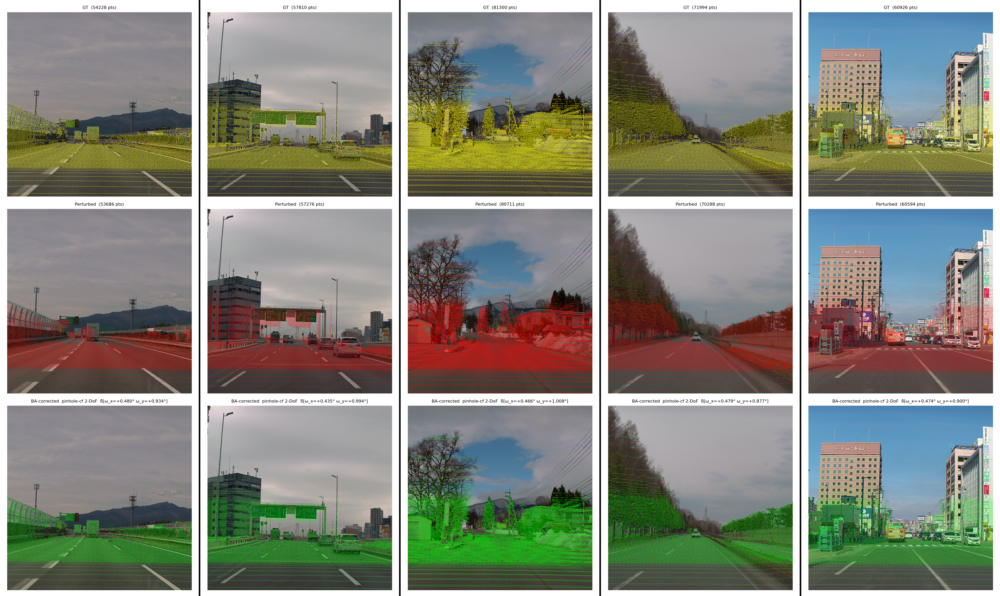

5-scene 1-frame BA result (1024×1024 crops around the road / lead
vehicle). Each column is one scene; from top to bottom: GT (yellow) /
perturbed (red) / BA-corrected (green).

## Summary

Working today:

- **A 2-DoF (pitch, yaw) closed-form Gauss-Newton solver with the
  Kannala-Brandt distortion baked into the Jacobian** — δ̂ lands within
  ±0.1° of GT on a single frame across all 5 scenes. 0.1° is roughly on
  the same order as a careful human visual calibration (humans are
  still a hair better).
- The whole problem reduces to a single 6×6 normal equation
  (extrinsics only; ~10×10 once intrinsics join), so one frame solves
  in **milliseconds** — fits as a continuous on-vehicle drift monitor.
  In practice the camera position barely shifts during operation, so
  monitoring the rotation drift (pitch, yaw) on a per-frame basis
  already covers the realtime calibration-monitor use case.
- Translation is harder: a single frame doesn't carry enough
  information to nail it (depth scale degeneracy). For position we
  need **multi-frame fusion**. Still, having a 1-frame baseline at
  this accuracy is a meaningful starting point.

Not yet working:

- **Going to full 6-DoF / 10-DoF blows up before we even hit
  degeneracy** — yaw doubles, tz parks at -2 m, etc. The way the
  normal equation is being assembled needs more debugging.
- The likeliest single suspect is the linearisation point: we
  back-project the observed uv with a pinhole formula `(u-cx)·z/fx`
  even for fisheye, which is wrong by tens of percent at the rim.
  Fix that first, then re-evaluate.

## The 1-frame BA pipeline

We split a 4K TMPOC-vehicle frame (Kannala-Brandt fisheye) into 8×5
tiles and run each tile through the trained per-tile model. For every
LiDAR point the model returns "this is how much the projection is off
in the image (Δu, Δv)" plus "and this is how confident I am about that
estimate (σx, σy, ρ)".

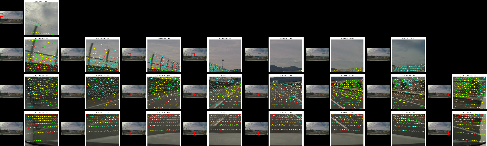

Per-pt (Δu, Δv, σ) come out of every tile, we pool everything into a
single solver and solve for one global rig misalignment in one normal
equation — i.e. closed-form BA.

### Training data

Three datasets joint-trained:

- **Waymo Open Dataset** — public large-scale multi-cam autonomous
  driving.
- **kamikado dataset** — collected on the TMPOC vehicle, authored by
  kamikado-san, 6 scenes.
- **Woven Sequence dataset** — collected on the TMPOC vehicle, 4
  scenes (in-house).

kamikado and Woven Sequence were both captured on the **same TMPOC
vehicle (4K fisheye, Kannala-Brandt)**. Different annotation tooling,
but the camera / LiDAR nominal parameters (intrinsics, extrinsics,
fisheye coeffs) are common.

### Training status

ConvNeXt backbone, img_size=128, crop_size 256-512, 200 epochs, joint
training across the three sources within each epoch. **One run
finishes in ~6 hours on DGX2 (8 GPUs).**

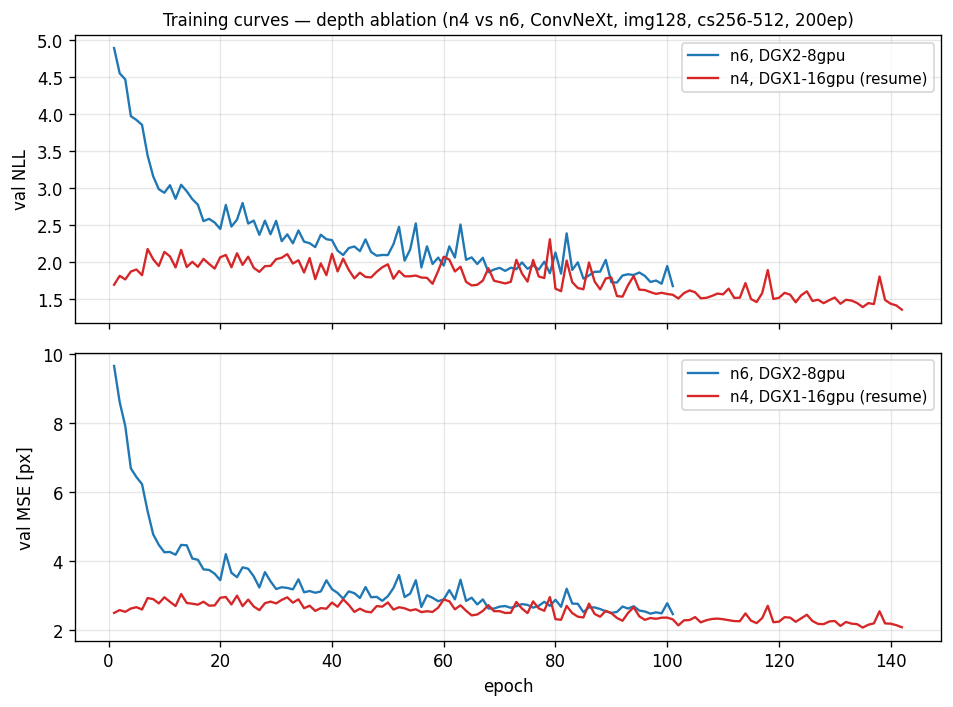

- **n6 (DGX2-8gpu)**: 6 layers, scratch → ep 101: val NLL 4.90→1.68,
  val MSE 9.64→2.46 px.
- **n4 resume (DGX1-16gpu)**: 4 layers, continued from a prior n4
  ckpt, ep 142: val NLL 1.36, val MSE 2.08 px (in-progress).

**n=2 was clearly worse on a separate (uncontrolled) experiment**, so
we don't put numbers here, but the trend is "more layers ⇒ better".
n=4 and n=6 land val MSE in the same 2.0–2.5 px range, but **n=6 sits
a notch lower on val NLL**. This is consistent with Transformers
gradually picking up wider tile-level context as depth grows; many
mainstream vision Transformers also settle around 6 layers.

For deployment, the compute / accuracy trade-off lands somewhere
between n=4 and n=6.

Worth noting: unlike box-regression detectors that hit a clear
plateau, **val NLL keeps decreasing the longer we train**. This
matches the neural-scaling-laws picture where Transformer loss falls
as a power law in compute / data / model size (Kaplan et al. 2020
[^kaplan]; image / video / multimodal extension Henighan et al. 2020
[^henighan]). Self-supervised ViTs like DINOv2 (Oquab et al. 2023
[^dinov2]) target the same regime by stabilising the recipe so long
training is practical. The behaviour reads as "compute keeps buying
power-law improvement" rather than a hard plateau. Tweaks like
lowering the softmax temperature to sharpen the predictions might
help us reach a flatter point sooner.

[^kaplan]: Kaplan et al., "Scaling Laws for Neural Language Models",
  arXiv:2001.08361 (2020). Loss decays as a power law over 7+ orders
  of magnitude of compute.
[^henighan]: Henighan et al., "Scaling Laws for Autoregressive
  Generative Modeling", arXiv:2010.14701 (2020). Power-law-plus-
  constant improvement across image / video / multimodal. The
  constant term is the irreducible floor; in practical ranges the
  curves do not look like a plateau.
[^dinov2]: Oquab et al., "DINOv2: Learning Robust Visual Features
  without Supervision", arXiv:2304.07193 (2023). Reports a 2× speedup
  and 3× memory reduction that "makes longer training with larger
  batches feasible", consistent with the long-training story for
  self-supervised ViTs.

## Why closed-form

- **Real-time**: extrinsic-only is a 6×6 normal equation (~10×10 once
  intrinsics join). One frame solves in milliseconds, fast enough to
  run as a continuous on-vehicle drift monitor.
- **σ already does the heavy lifting**: per-tile inference returns
  Σ_i with the uncertainty baked in. BA just aggregates with
  Mahalanobis weights — no extra optimisation muscle needed.
- **Robustness via IRLS**: the same closed-form scaffold gets a
  Huber-IRLS layer on top to down-weight outliers. The linearisation
  point doesn't move every iteration (unlike LM/Ceres), so compute
  stays cheap.
- **Camera model goes into the Jacobian**: for KB fisheye we plug the
  distortion straight into the analytic J_i (no iterative wrapper).
- **Future path**: a tile-level pose-regression head could buy more
  accuracy on top, but the aggregator stays the same closed-form.

## Result

Against a synthetic perturbation of pitch=+0.500° / yaw=+1.000°, δ̂
lands within 0.05–0.1° of GT across 5 scenes.

Because the camera is fisheye (Kannala-Brandt), the choice of solver
matters:

- **A naive pinhole closed-form on every point in the frame
  underestimates yaw to 70–80 % of GT** (the pinhole Jacobian
  diverges from truth at the image edges).
- **Restricting to the centre band brings it back to 90–95 %.**
- **A closed-form GN with the KB distortion baked into the analytic
  Jacobian** lets us use the whole frame and converge to GT ±0.1°.

## Closed-form derivation (per-pt Δuv → 6-DoF δ̂)

### Observation model

For each LiDAR point 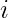, the model returns

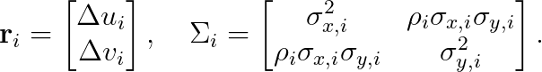

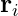 is the per-point correction we want to apply to the
observed uv to land on GT.  is the model's uncertainty on
that correction. We want to explain it all with a single 6-DoF rig
offset 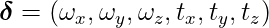.

 is not a scalar — it's a **2-D covariance** that encodes
the direction in which that point carries information.

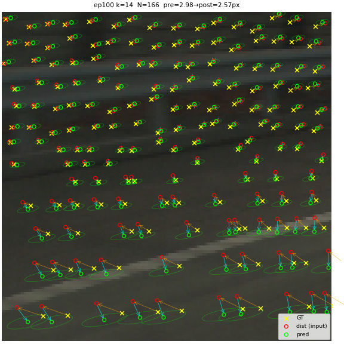

The green ellipses are σ. Ground points stretch **along the white
line** (the model is uncertain *along* the line but knows where it is
*across* it). Points on the white guardrail have small ellipses
(strong edge + texture, well constrained in both directions). Points
on the sky or uniform asphalt show large isotropic ellipses (no info).

This is the data-driven part: the model has learned to say
"I can't tell along the white line direction" instead of pretending
it can. BA uses 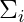 as a Mahalanobis weight, so only the
information-rich directions of each point actually enter the solve.

### Linearisation

When the cam-frame point 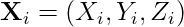 moves under
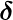, the image-plane displacement to first order is

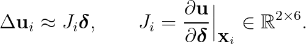

Each column is an SE(3) generator pushed through the camera model.
Under pinhole, e.g.,

- 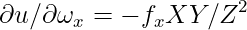
- 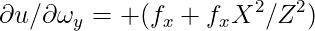
- 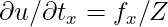 … (`scripts/ba/ba_multicam_corr.py:DOF_JAC`).

### Intuition

It's just **"if 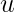 at point  moves a tiny bit, how much does each
of the six camera parameters explain that movement under
linearisation?"**. A 1° yaw moves a centre point by 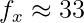
px, edge points move a bit more, … six axes' worth of those
sensitivities.

The expressions above are exactly that (one-line chain rule for
pinhole; KB fisheye is the same chain rule with one extra layer, no
iterative solver needed).

The point:

- The per-pt sensitivity matrix 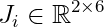 is
  only **rank 2** (one point cannot pin all 6 DoF).
- Stack thousands of points spread across the frame and
  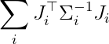 becomes full rank (regular 6×6).
- Invert and out pops 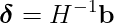.
- No iterative optimisation, so **compute is dramatically lower** —
  one 6×6 system per frame in ms instead of running LM/Ceres. Fits
  well inside an automotive on-board budget.

For KB fisheye, 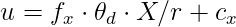 with
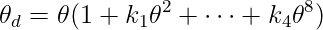. Same chain rule
runs through and we get an analytic 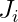 in
`scripts/ba/ba_kb_jac.py:KB_DOF_JAC`.

### Mahalanobis-weighted normal equation

We minimise the sum of whitened per-pt residuals
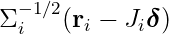:

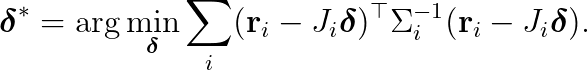

Differentiate, set to zero, collapse to a 6×6 system:

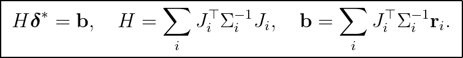

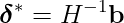 in one step. The covariance
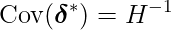 falls out for free.

### Huber IRLS for outlier suppression

Compute the per-pt Mahalanobis distance
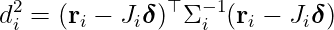,
scale 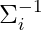 by 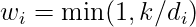, re-solve. The
linearisation point doesn't move; only the per-pt weight does. Same
closed-form scaffold, just iterated a handful of times to suppress
outliers.

## Residual plot (5 scenes × 2 solvers)

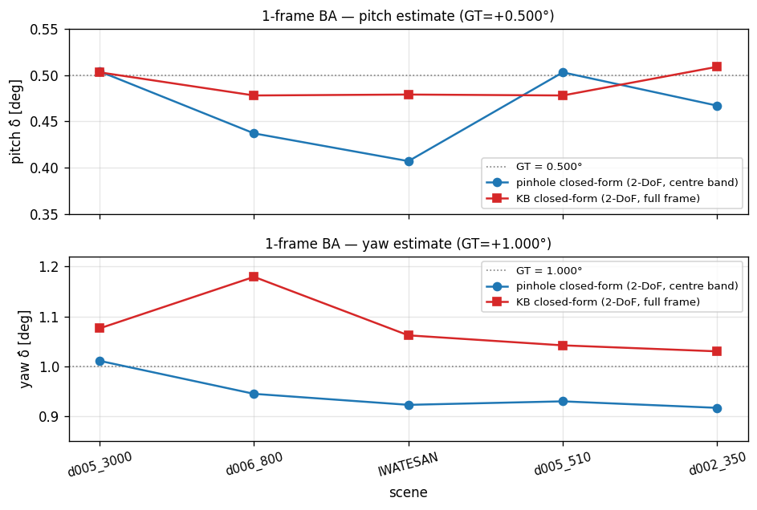

- **Blue (○)**: pinhole closed-form, centre band + σ-stratified
  TOP-100.
- **Red (□)**: KB closed-form (analytic Jac), full frame +
  σ-stratified TOP-300.
- Grey dashed line: GT (pitch +0.500° / yaw +1.000°).

Both stay within ±0.1° of GT on every scene. Pinhole biases yaw a
hair low; the KB Jacobian solver biases it slightly high.

## 3-stage reprojection overlay (full parent, 1 scene)

The hero figure at the top showed truck-area 1024×1024 crops; the
full parent view looks like this. GT (yellow) / perturbed (red) /
BA-corrected (green), all LiDAR points re-projected onto the parent
image. The closer the green is to the yellow, the better the BA.

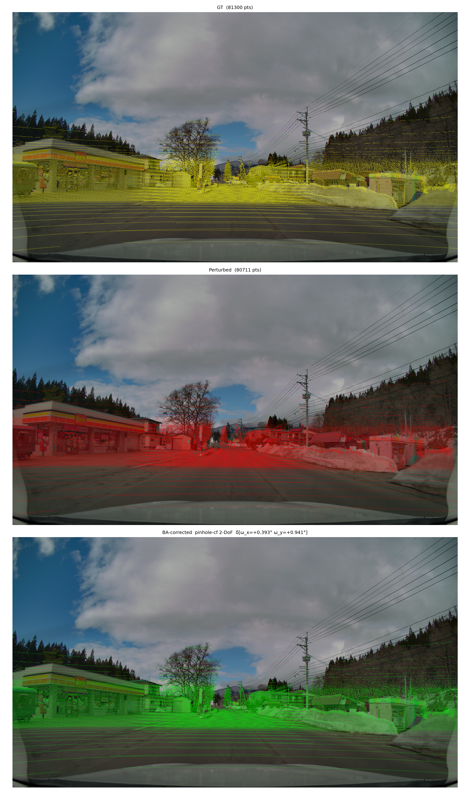

## What worked

- **Pinhole closed-form (`solve_dofs`)**: existing solver, Jacobian
  assumes pinhole. Throwing the entire frame at it shrinks yaw to
  70–80 % of truth (KB distortion at the edges). Restricting to the
  **centre band (mid 50 %×25 %)** recovers it to 90–95 %.
- **KB closed-form (`solve_dofs_kb`)**: new in
  `scripts/ba/ba_kb_jac.py`. Plug the analytic 6-axis ∂uv/∂δ for the
  KB projection 
  straight into the closed-form pipeline; iterate Gauss-Newton a few
  times to re-linearise. Warm-start with the pinhole closed-form δ̂
  and we converge cleanly to GT ±0.1° on 2-DoF (pitch + yaw).

## Point selection and DoF choice

- **TOP-K of low-σ points** is fine; here σ-stratified TOP-100 with
  an 8×4 grid cap (max 5 per cell) was enough to keep the solver
  from collapsing onto the left/right wall edges.
- **2-DoF (pitch, yaw) is the right default.** Real on-vehicle
  calibration drift is rotation-dominated; tx/ty/tz are degenerate
  with depth scale on a single frame, and closed-form 6-DoF blew yaw
  out to >2× truth in early experiments. For position, fall back to
  multi-frame.
- `solve_dofs_kb` exposes all 6 DoF for completeness, but in practice
  solving only 2-DoF gets us to GT ±0.1°.

## Next

1. **KB unprojection at the linearisation point.** We currently
   back-project observed uv via pinhole `(u-cx)·z/fx` to get
   (X, Y, Z) — at the fisheye rim that's tens of percent off, which
   is what's detonating 6-DoF KB-CF. Replace with KB unproject and
   6-DoF should stay close to the warm-start.
2. **Multi-frame fuse.** Stack 5–6 frames from the same rig into a
   single normal equation; the per-frame ±0.05° systematic bias
   should average out, and translation gets enough geometric
   constraint to converge.
3. **CaaS API.** Wrap 1-frame closed-form (~ms) as a realtime drift
   monitor; wrap multi-frame batch as the first-time calibration
   endpoint.

## Files

- `scripts/ba/ba_kb_jac.py` — KB analytic Jacobian + Gauss-Newton
  solver.
- `scripts/_debug/ba_one_frame_vis.py` — 5-scene driver + 3-stage
  overlay.
- `scripts/_debug/plot_one_frame_ba_residuals.py` — residual plot.
- `scripts/_debug/plot_learning_curves.py` — training curve pull.
