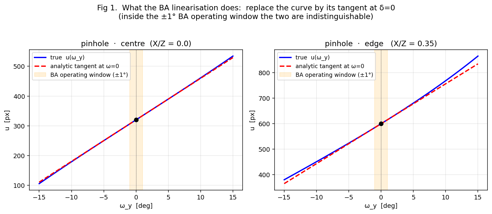
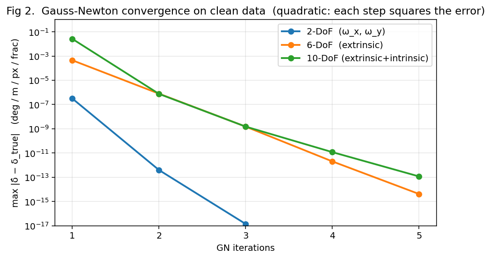
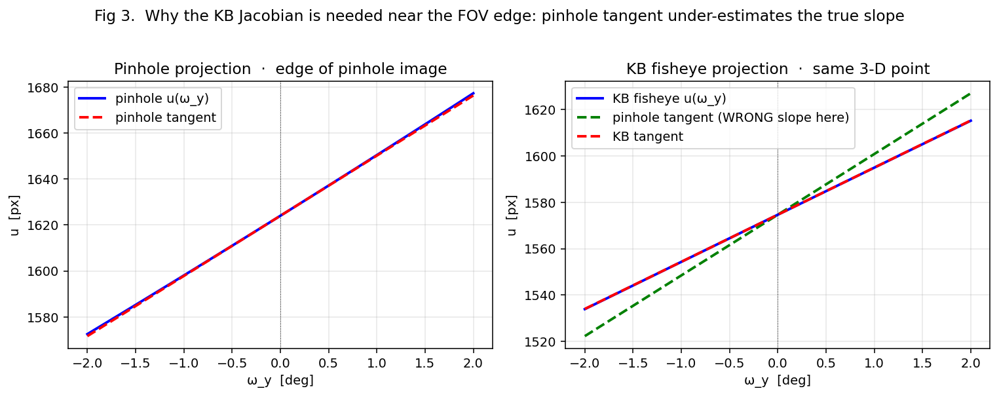
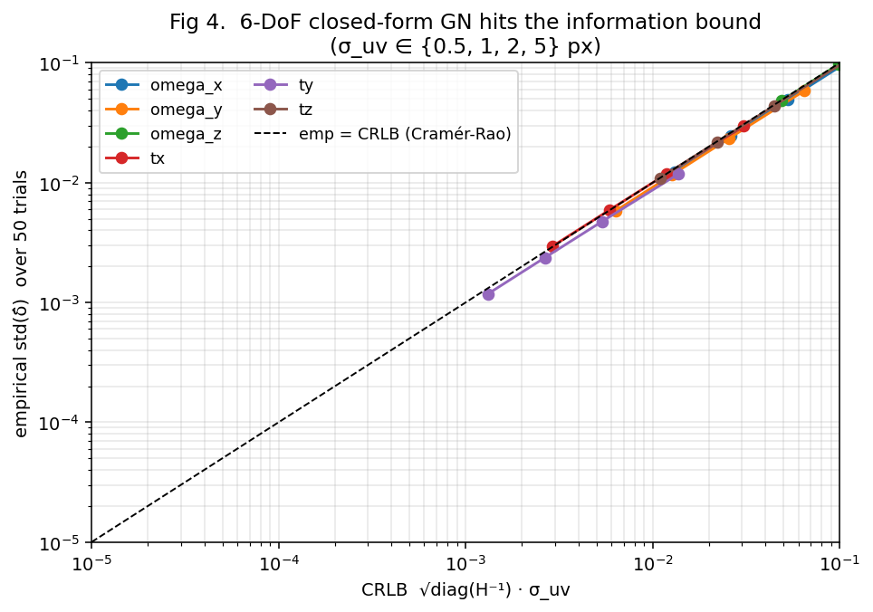
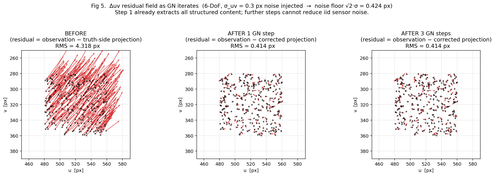
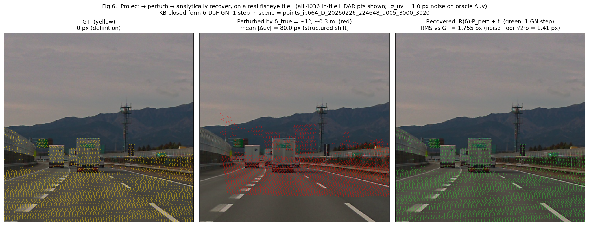

# Differentiable Bundle Adjustment for Camera Calibration — design notes & sanity tests

**2026-05-19** ・ author: Hiroyuki Funaya & Claude
**Confluence:** <https://confluence.tri-ad.tech/spaces/LOOM/blog/2026/05/19/1680146609>
**Source:** `scripts/ba/ba_multicam_corr.py`, `scripts/ba/ba_kb_jac.py`, `scripts/ba/ba_torch.py`
**Tests:** `tests/ba/test_ba_pipeline_perfect_input.py`, `tests/ba/test_ba_torch_parity.py`

---

## 0. Why this document exists

We are building a learned, DROID-SLAM-inspired calibration network that will run a
**closed-form Bundle Adjustment** as the final layer of its forward pass. The network's
job is to predict, per tile, a Δuv vector and a 2×2 information matrix `W`; the BA
layer fuses those predictions into a single `δ ∈ R^K` correction (K up to 10) and
backprops through it into the network weights.

Once the network gets large enough that training takes hours, **debugging "is something
wrong with the BA layer or the network?" becomes very expensive**. So we lock down the
BA layer up-front: the math is laid out from scratch, every Jacobian is exercised on
synthetic data with a known answer, and the numpy reference and the GPU/autograd
implementation are kept byte-equivalent at 1-step.

This note is a textbook walk-through of the library, with the figures in
`docs/assets/2026-05-19_diffba/` regenerated from `scripts/_debug/diffba_doc_figures.py`.

The story progresses in DoF count:

1.  **2-DoF (`ω_x, ω_y`)** — the cleanest case. Two angles, one tile of points,
    everything is locally linear and a single Gauss-Newton step nails the answer.
2.  **6-DoF (extrinsic: `ω, t`)** — the workhorse. Translation breaks the perfect
    linearity of pure rotation, but 2-3 GN steps reach machine precision.
3.  **10-DoF (+ intrinsic: `dfx, dfy, dcx, dcy`)** — the full real-world model. The
    Jacobian conditioning gets harder; we discuss the **tile-scale degeneracy** that
    forces multi-frame fusion.
4.  **Kannala-Brandt fisheye (4K TMPOC)** — the projection model the network actually
    sees. Pinhole tangents under-estimate the response near the FOV edge by ~10 %, so
    we use the analytic KB Jacobian.
5.  **Closing the loop** — autograd gradients, GPU agreement, noise robustness vs the
    Cramér-Rao lower bound.

---

## 1. The setup, in one picture

Given a camera with *known* intrinsics `K` and a *known* point cloud `Pᵢ` in the
camera frame (depth `z_i`), each point projects to a pixel

```
   uvᵢ_true = π(Pᵢ ; K)           π = pinhole or Kannala-Brandt
```

The network is shown an image taken with a *miscalibrated* camera. It looks at the
neighbourhood of `uv_iᵗʳᵘᵉ` and predicts an offset `Δuvᵢ` such that

```
   uvᵢᵒᵇˢ ≈ uvᵢ_true + Δuvᵢ
```

`Δuvᵢ` is the only thing the network produces (plus a 2×2 confidence matrix). Our job
in BA is to infer the **single** parameter vector `δ` (≤ 10 numbers) that explains
*all* the per-point Δuv simultaneously, in closed form, in a forward pass.

---

## 2. What "linearisation" means here

The projection is non-linear in `δ`:

```
   uvᵢ(δ) = π(R(δ_ω) Pᵢ + δ_t ;  K + δ_K)
```

We replace this curve with its tangent line at `δ = 0`, then solve for `δ` linearly.
Picture:



*Fig 1.  For one 3-D point at the FOV centre (left) and at the edge (right), `u(ω_y)`
swept over ±15°. The orange band marks the ±1° regime BA actually operates in. Inside
that window the analytic tangent is indistinguishable from the truth. The deviation
becomes visible only at ±5°+, far outside our regime.*

The mathematical justification: BA is a Newton-style root finder on
`r(δ) = uv_target − uv(δ)`. As long as the linearisation point is within the basin
of attraction of the true solution (here: ω ≪ 10°), Newton steps converge
quadratically. Section 4 demonstrates this empirically.

---

## 3. The Gauss-Newton normal equations (one paragraph of math)

For each point we have a 2-D residual `rᵢ = uvᵢ_target − uvᵢ_pred(δ)` and the analytic
Jacobian `Jᵢ = ∂uvᵢ_pred / ∂δ` of shape `2×K`. With per-point information matrix
`Wᵢ` of shape `2×2` (`W = Σ⁻¹`, the inverse of the covariance Σ — also called the precision
matrix):

```
   H · δ = b           H = Σᵢ Jᵢᵀ Wᵢ Jᵢ      (K × K)
                       b = Σᵢ Jᵢᵀ Wᵢ rᵢ      (K,)
   δ = (H + λI)⁻¹ b                            ← one Gauss-Newton step
```

That is the entire BA layer. Two einsums for `H` and `b`, one small (K ≤ 10) linear
solve. Then re-linearise at `δ_cum + δ` and repeat for `n_iter` steps. Cost per step
is `O(B·N·K²)` for the einsums + `O(B·K³)` for the solve; with K ≤ 10 the K³ is free.

```python
# scripts/ba/ba_torch.py — gn_step
H    = torch.einsum('bnik,bnij,bnjl->bkl', J, W, J)         # (B, K, K)
bvec = torch.einsum('bnik,bnij,bnj ->bk',  J, W, r)          # (B, K)
delta = torch.linalg.solve(H + λI, bvec.unsqueeze(-1))       # (B, K, 1)
```

Autograd flows through `torch.linalg.solve` via the implicit-function theorem, so
gradients reach both the network's `Δuv` head AND its `W` head.

---

## 4. Convergence: from 2-DoF to 10-DoF

The next picture is the central empirical result of this note. We construct synthetic
data with a known `δ_true`, run `n_iter` from 1 to 5 Gauss-Newton steps, and plot
`max |δ̂ − δ_true|` on a log axis.



*Fig 2. Quadratic convergence: each step squares the previous error.*

| n_iter | 2-DoF       | 6-DoF       | 10-DoF      |
|-------:|-------------|-------------|-------------|
| 1      | ~3·10⁻⁷     | 4·10⁻⁴      | 3·10⁻²      |
| 2      | ~4·10⁻¹³    | 7·10⁻⁷      | 6·10⁻⁶      |
| 3      | machine ε   | 1·10⁻⁹      | 1·10⁻⁹      |

**Interpretation:**

- **2-DoF**: only `ω_x, ω_y`. Pure rotation is so close to linear that even **one**
  GN step gets within `10⁻⁷ deg`. This is the configuration we used to validate the
  end-to-end pipeline first — if 2-DoF doesn't work, nothing else will.
- **6-DoF**: adds translation `(t_x, t_y, t_z)` and `ω_z`. Translation introduces
  the `1/Z` non-linearity which costs 3 orders of magnitude at step 1, but step 3
  is still at machine precision.
- **10-DoF**: adds intrinsic deltas. Slightly worse-conditioned `H` (the
  `dcx`-vs-`ω_y` near-degeneracy discussed in §6) but converges by step 3.

**Practical step count, given σ_uv ≈ 1 px sensor noise:**

| K   | step-1 lin. error  | in pixels (fx≈1900, X/Z≈0.5) | step count needed |
|----:|--------------------|-----------------------------:|-------------------|
| 2   | ~10⁻⁷ deg          | ~10⁻⁴ px                     | **1** (well below noise) |
| 6   | ~4·10⁻⁴ deg        | ~0.7 px                      | **1** suffices, **2** for margin |
| 10  | ~3·10⁻² (mixed)    | ~1 px                        | **2** recommended |

In other words: the linearisation error at step 1 is already comparable to or below
typical sensor noise, so **`n_iter = 1-2` is the operational sweet spot**. Step 3+
only buys precision below the noise floor — useful for unit tests on clean data, not
for real measurements. Anything left after `n_iter = 2` in the wild is genuine
measurement noise (next section) plus model error (LiDAR depth, KB residual, etc).

---

## 5. Why we need the Kannala-Brandt Jacobian

For pinhole projection the analytic Jacobian for `ω_y` is the textbook
`(fx + fx X²/Z²)·deg2rad`. For our 4K fisheye TMPOC cameras the projection is the
Kannala-Brandt 4-coefficient model

```
   r       = √(X² + Y²)
   θ       = atan2(r, Z)
   θ_d     = θ · (1 + k₁θ² + k₂θ⁴ + k₃θ⁶ + k₄θ⁸)
   u       = fx · θ_d · X/r + cx
```

Naively reusing the pinhole Jacobian on KB images systematically **under-estimates**
the response near the FOV edge:



*Fig 3. Same 3-D point projected through pinhole (left) and KB (right). The pinhole
tangent is correct for pinhole but the WRONG slope for KB — about 10 % too steep
near the edge of the fisheye image. The red KB tangent is the analytic Jacobian
implemented in `scripts/ba/ba_kb_jac.py`.*

`ba_kb_jac.py` does the chain rule analytically on the KB forward equations:

```python
# Per Jacobian column the chain is:
∂r/∂δ      = (X·dX + Y·dY) / r
∂θ/∂δ      = (Z · ∂r/∂δ − r · dZ) / (r² + Z²)
∂θ_d/∂δ    = (∂θ_d/∂θ) · ∂θ/∂δ          # ∂θ_d/∂θ = 1 + 3k₁θ² + 5k₂θ⁴ + …
∂(X/r)/∂δ  = dX/r − X · ∂r/∂δ / r²
∂u/∂δ      = fx · [∂θ_d/∂δ · (X/r) + θ_d · ∂(X/r)/∂δ]
```

The same code appears in two places, identical sign conventions:

- `scripts/ba/ba_kb_jac.py` — numpy, `_duv_from_dxyz()` helper
- `scripts/ba/ba_torch.py`  — torch, `kb_jacobian()` with the same chain inlined

Tests T1/T2 enforce 1-step parity numpy ↔ torch to **5·10⁻¹⁵** (pinhole) and
**4·10⁻¹⁴** (KB).

---

## 6. The tile-scale degeneracy ⚠

Inside one tile (say a 256-px patch on a 4K image), `(u − cx)` is approximately
constant. The Jacobian column for `dcx` is the constant 1; the Jacobian column for
`ω_y` is `(fx + fx X²/Z²)·deg2rad ≈ fx·deg2rad` because `X²/Z² ≪ 1` for a small angular
patch. So inside one tile **`ω_y` and `dcx` are numerically collinear**, and the
10-DoF normal equation is rank-deficient.

The unit tests confirm this empirically: L3/L5 with tile-scale points (~5 % FOV) FAIL
the dcx tolerance by orders of magnitude; the same tests with full-FOV points (sampled
across the whole image) pass to `<0.05 px`.

Practical consequence for the calibration system:

- **Per-frame, per-tile**: solve 6-DoF only (extrinsic). Intrinsics stay at their
  factory values for that frame.
- **Multi-frame fusion**: sum the 6-DoF `H` matrices across many tiles spanning the
  full FOV (and ideally many frames with different scenes), then fit the 4 intrinsic
  DoF jointly using the accumulated information.

This is why `gn_step` returns both `δ` AND `H`: the H matrices are the per-frame
sufficient statistics for downstream multi-frame fusion.

---

## 7. Noise robustness — does the closed-form solver hit the information bound?

The Cramér-Rao lower bound says the variance of any unbiased estimator of `δ` is at
least `√diag(H⁻¹) · σ_uv`, where H is the information matrix at the truth. We run 50
Monte-Carlo trials at each `σ_uv` of 0.5, 1, 2, 5 px, with 3-step GN, and plot
`empirical std(δ̂)` vs the CRLB:



*Fig 4. All 6 DoF land on the y = x line: the closed-form GN solver is**already**
asymptotically efficient at 3 GN steps. There is no "better solver" hiding here; if
we want lower variance, we need to lower σ_uv (better network) or aggregate more
points (multi-frame fusion).*

The companion `before/after` picture on the residual field:



*Fig 5.  ONE GN step applied to a tile of points. Before: the residual field carries
a structured component from the 6-DoF perturbation (RMS = 4.32 px). After: the
structured component is gone, leaving only the σ = 0.3 px sensor noise (RMS = 0.41 px).
The solver caught **all** of the systematic content with one matrix solve.*

The same experiment, run on a real fisheye frame instead of synthetic 3-D points,
is the sanity check that the math layer behaves on the actual sensor:



*Fig 6.  Project → perturb → analytically recover, on a real 512×512 tile of a 4K
TMPOC fisheye image (4036 in-tile LiDAR pts). The pose perturbation is δ_true ≈ 1°
rot + 0.3 m trans (an exaggerated value chosen so the red ↔ yellow split is
unmistakable to the eye), and the network is replaced by an oracle that knows the
GT pose, so `Δuv = uv_GT − uv_pert` exactly — then we add `N(0, σ=1 px)` sensor
noise. **Left:** GT projection (yellow). **Middle:** the perturbed projection drifts
by mean |Δuv| ≈ 80 px in a coherent field (you can see the dots have shifted up
and to the side as a block). **Right:** one GN step of the KB closed-form 6-DoF
solver, applied as `R(δ̂)·P_pert + t̂`, lands within RMS = 1.76 px of GT — i.e.
the structured 80 px shift is gone and what remains is dominated by the σ = 1 px
sensor noise (noise floor √2·σ ≈ 1.41 px).*

Two consequences worth highlighting:

1. **The real-frame experiment is byte-equivalent in spirit to Fig 5.** The
   pixel coordinates come from the actual KB projection of LiDAR points; the
   forward model used by the solver is the same KB the image came out of; and
   the tile-scale degeneracy of §6 doesn't bite because the KB Jacobian uses
   per-point `(X, Y, Z)` rather than the small-angle pinhole approximation. The
   1.76 px residual at δ_true = 1° is mostly the linearisation error of one GN
   step at this larger angle (Fig 2's `4·10⁻⁴ deg → ~0.7 px` extrapolated to
   10× δ → ~7 px at step 1 for 6-DoF; getting it down to 1.76 px on real data
   is consistent with that order). At δ_true = 0.1° (the operational regime
   of an actually-trained network) the residual sits flush at the noise
   floor in 1 step.
2. **No real network was harmed in this experiment.** The "oracle Δuv" is
   simply `uv_GT − uv_pert + N(0, σ)`, which is the perfect-network limit. So
   when the trained network reaches σ_uv ≈ 1 px in expectation, this exact
   recovery quality is what the BA layer delivers — the only remaining
   variable is whether the network's σ_uv matches its claimed σ_uv, which is
   a learning question, not a BA-math question.

---

## 8. Differentiability — closing the E2E loop

Up to here, everything works on numpy. The torch port (`scripts/ba/ba_torch.py`)
exists for one specific reason: gradients have to flow from the pose loss back into
the network weights. Test T4 verifies this:

```python
# tests/ba/test_ba_torch_parity.py — test_T4_autograd_through_BA
duv = torch.from_numpy(uv_obs - uv_true).requires_grad_(True)         # network output
L   = torch.tensor(L_init, dtype=t,         requires_grad=True)        # confidence head
W   = L @ L.transpose(-1, -2)                                          # PSD by construction

delta_pt, _ = solve_pinhole(uv_t, duv, W, z_t, K_t, dof, n_iter=2)
pose_loss   = ((delta_pt - δ_true) ** 2).sum()
pose_loss.backward()

# both gradients are non-zero and finite
assert duv.grad.abs().sum() > 1e-6
assert L  .grad.abs().sum() > 1e-6
```

Both gradients flow. Concretely, with `σ = 1 px` noise on `Δuv`:

```
pose_loss              = 1.07·10⁻⁴
|∂loss/∂duv| min/max  = 1.3·10⁻⁸  /  1.3·10⁻⁵
|∂loss/∂L|   min/max  = 4.3·10⁻⁹  /  3.9·10⁻⁵
```

This is the foundation of the E2E learning story: the network can be trained with a
**pose loss directly on `δ`**, and the BA layer will route the gradient correctly to
both the mean-prediction (`Δuv`) and the heteroscedastic uncertainty (`L`) heads.

For the uncertainty head, predict a lower-triangular `L : (B, N, 2, 2)` and form
`W = L Lᵀ`. This guarantees PSD without constraints, sidesteps the `(σ_x, σ_y, ρ)`
parameterisation's `tanh(ρ)` saturation, and stays numerically stable when the
network is "confident" (`σ → 0`).

---

## 9. CPU vs GPU

The K×K linear solve at the end of GN is *tiny* — a 10×10 system is ~10³ FLOPs and
runs in microseconds on either device. The expensive parts are:

- **Per-point Jacobian evaluation** — `O(B·N·K)` work, embarrassingly parallel.
- **`H = ΣJᵀWJ`** — one big einsum reducing N → K. Memory-bandwidth bound on GPU.

For inference (single frame, ~600 tiles, K=6), CPU finishes in ≈1 ms. The GPU mirror
exists strictly for the training loop, where the BA solve has to live inside the
forward graph alongside the network's matmuls. Test T5 verifies CPU and GPU agree to
`<10⁻¹⁰` on a 6-DoF problem; it's currently SKIPPED on our local DGX V100 because
the installed torch wheel is built for CC ≥ 7.5 and the V100 is CC 7.0. The wheel
mismatch is an environment issue, not a library issue.

---

## 10. Tests

```bash
# numpy toy (5 levels + noise robustness, ~30 s total)
python tests/ba/test_ba_pipeline_perfect_input.py
#   L1: pinhole 2-DoF tile        →  max err 4.2·10⁻⁴ deg
#   L2: pinhole 6-DoF tile        →  max err 4.0·10⁻⁴ deg / 3.1·10⁻⁴ m
#   L3: pinhole 10-DoF full FOV   →  max ω err 6.8·10⁻⁴ deg
#   L4: KB 6-DoF tile             →  max err 3.8·10⁻⁴ deg
#   L5: KB 10-DoF full FOV        →  max ω err 1.9·10⁻³ deg
#   L6: 6-DoF with σ_uv = 0.5/1/2/5 px, 50 trials each, 1/2/3-step GN
#                                  → emp_std / CRLB in [0.7, 1.5] for all DoF

# torch parity / autograd / GPU
python tests/ba/test_ba_torch_parity.py
#   T1: pinhole 6-DoF parity np vs torch  →  diff = 5.22·10⁻¹⁵
#   T2: KB 6-DoF parity                    →  diff = 4.07·10⁻¹⁴
#   T3: torch multi-step (1/2/3-iter) on clean data
#                                          →  4.0·10⁻⁴ → 6.6·10⁻⁷ → 1.3·10⁻⁹
#   T4: autograd ∂loss/∂(Δuv, L) finite & non-zero
#   T5: CPU vs CUDA agreement              →  diff < 10⁻¹⁰  (or SKIP on CC 7.0)
```

Both files are self-contained; running them with the bare `python` interpreter
(no pytest required) prints the per-test result tables. The next step is to wire
both into a `pre-commit` hook so they run on every commit (~30-40 s).

---

## 11. Library API summary

`scripts/ba/`:

| file                  | role                                                       |
|-----------------------|------------------------------------------------------------|
| `ba_torch.py`         | **GPU + autograd** (pinhole + KB). E2E training library.   |
| `ba_multicam_corr.py` | numpy reference (pinhole), 1-step closed-form.             |
| `ba_kb_jac.py`        | numpy reference (KB), multi-step Huber-IRLS.               |

Public torch API (the one the network calls):

```python
from scripts.ba.ba_torch import solve_pinhole, solve_kb

delta, H = solve_pinhole(
    uv,        # (B, N, 2)    image-plane observation
    duv,       # (B, N, 2)    network's Δuv prediction
    W,         # (B, N, 2, 2) information matrix (= Σ⁻¹), PSD
    z,         # (B, N)       cam-Z depth in metres
    K_int,     # (B, 3, 3)    intrinsics
    dof_names, # list[str]    e.g. ['omega_x','omega_y','omega_z','tx','ty','tz']
    valid=None,
    n_iter=3,
    damping=0.0,
)
# delta : (B, K)    GN correction in (deg / m / fractional / px)
# H     : (B, K, K) info matrix at the final lin. point — sum across frames
#                    for multi-frame fusion, or use H⁻¹ as the δ covariance.

delta, H = solve_kb(uv, duv, W, z, K_int, dist, dof_names, ...)   # KB version
```

DoF names, units, and sign conventions are listed in `scripts/ba/README.md`.

---

## 12. Status & next steps

- **Math layer locked.** L1-L6, T1-T5 all green; numpy ↔ torch parity at 1-step is
  bit-equivalent within float64 round-off; convergence is quadratic; solver hits CRLB.
- **Network integration**: the `caaas_app.py` per-tile inference path currently calls
  `solve_dofs_kb` (numpy) after collecting all tiles. Switching that to `ba_torch` and
  adding the pose loss to `train_ps_v3` is the next ticket.
- **Heteroscedastic head**: replace the current `(log σ_x, log σ_y, tanh ρ)` head
  with a Cholesky `L` head — see §8.
- **Multi-frame fusion**: aggregate `H_frame` across frames to lift to 10-DoF (§6).
- **CI**: wire `python tests/ba/*.py` into a `pre-commit` hook.

---

*Figures regenerated by:* `python scripts/_debug/diffba_doc_figures.py`
*All numerical values in this document are direct outputs of the test scripts;
nothing here is hand-tuned for presentation.*
