# Principled ML for Camera Calibration: where the network ends and the math begins

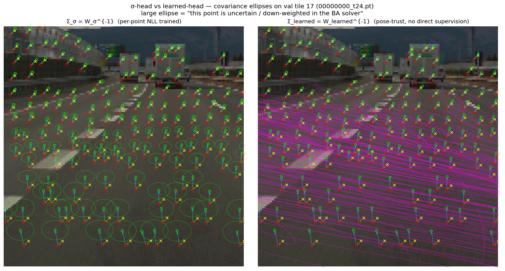

**What this figure shows.** The same val tile, the same frozen
backbone, the same per-query features — two different ways of asking
"how much do we trust each LiDAR point?".

- **Left (`Σ_σ`)** — the existing per-point head, trained
  with NLL on the optical-flow residual `Δuv`. Ellipses are
  small everywhere: it has learned that *`Δuv` is predictable
  on asphalt*, which is true, but confuses *predictable* with
  *useful for pose*.
- **Right (`Σ_learned`)** — a new ~100 k-param head
  bolted on top of the *frozen* backbone, supervised by *nothing*
  except the gradient that flows back through a closed-form
  Gauss-Newton pose solver. It suppresses the road
  (huge ellipses = "don't trust me for pose"), and on the road the
  ellipses are *elongated horizontally* — the network discovered on
  its own that a road-plane point sliding along the surface is
  uninformative about yaw.

**What we achieved.** Backbone frozen, no direct supervision on `W`,
held-out 2-DoF pose error drops to **δ-MSE 0.0066 deg²** vs **0.0146**
for the existing σ-head and **0.046** for uniform —
**2.2× better than the σ-head, 7× better than uniform** on a
typical highway tile where the σ-head was already at its
strongest. Per-axis RMSE is **0.08°**, which on a 128×128 input
is the sub-pixel discretisation floor.

> **Scope caveat.** Only the *new head's* finetune is one-tile.
> The frozen backbone behind it was trained on tens of thousands
> of kamikado frames with per-point NLL — that's where the
> pose-relevant signal in the queries came from. The new head,
> finetuned on one tile with streaming $(\omega_x, \omega_y)$
> perturbations and evaluated on a held-out perturbation batch,
> only has to *read it out*. What Phase 1.b proves is the design
> assumption — frozen queries carry pose-relevant signal that NLL
> training had flattened, and the new head, supervised only
> through the math layer, can recover it. Generalisation of the
> *new head* across tiles is Phase 2.

---

> **TL;DR.** We design a calibration network whose output isn't a 6-DoF pose
> but a per-point *trust*. The pose comes out of a closed-form Gauss-Newton
> step that knows the camera intrinsics and the per-point geometry. The
> network only learns what is intrinsically a learning problem — *which
> pixels in this scene to believe* — and hands off the rest to the math
> layer. This makes the network **camera-agnostic by construction**, lets us
> augment by camera (vary fx/fy/k₁..k₄) instead of by data, and turns the
> failure mode of "the model overfits to the road and the sky"
> into a tractable design question instead of a heuristic top-K hack.

## 1. The problem with per-point NLL

The previous baseline (`models/model_depth.py:CalibNetDepth`) outputs
`(Δu, Δv, log σ_x, log σ_y, ρ)` per LiDAR point, supervised by

$$
\mathcal{L}_{\text{NLL}} = \tfrac{1}{2}(\mathbf{r}^\top \Sigma^{-1} \mathbf{r}) + \tfrac{1}{2}\log\det\Sigma,
\quad \mathbf{r} = \Delta\mathbf{uv} - \Delta\mathbf{uv}_{gt}.
$$

This trains $\Sigma$ to be *the residual covariance of the per-point flow*.

It does **not** train $\Sigma$ to reflect *how much that point should be
trusted when computing pose*.

The two are not the same thing. The ground is locally consistent — pick any
random patch of asphalt and the flow vectors agree to the half-pixel. So
NLL learns a small $\Sigma$ for the ground. But pose loves the ground for
the wrong reasons: a thousand mostly-co-planar points pin yaw and pitch *to
the ground plane* rather than to the scene, and a coherent error on the
ground (think: an actual change in elevation, or a misaligned LiDAR sweep)
gets propagated into pose with full weight.

The way the previous codepath patched around this is `σ-stratified
top-K`: pick a handful of cells across the image, take the
lowest-σ point from each, throw the rest away. It works in the sense that
it avoids the worst-case ground-pull, but it's a heuristic with magic
numbers (8×4 grid, max 5/cell, top-100), and it leaves on the table all
the points that would have informed pose if we knew which ones to weight up.

## 2. The principle

Architecturally, the change is small. The previous network was an
image / LiDAR cross-attention stack producing one $\Delta uv$
(and a per-point NLL covariance) for every point. We keep all of
that, freeze it, and *add* a new tiny head that turns the same
per-query feature into a $2\times 2$ information matrix $W_i$.
The pose then comes from a closed-form Gauss-Newton solver that
consumes those $(\Delta uv_i, W_i, z_i, K)$ triples. The network
itself never tries to output a pose.

```
                ┌─────────────────────────────────────────────┐
                │                  EXISTING                   │
                │                                             │
  image crop ──►│ CNN ┐                                       │
                │     ├─► cross-attn (per-point feat q_i)     │
  LiDAR (U,V,D)►│ MLP ┘             │                         │
                │                   │   ┌─► Δuv head ─► Δuv_i │
                │                   ├───┤                     │
                │                   │   └─► σ-head  ─► Σ_σ_i  │
                └───────────────────┼─────────────────────────┘
                                    │
                                    │  q_i (frozen — no grad)
                                    │
                ┌───────────────────┼─────────────────────────┐
                │  NEW              ▼                         │
                │       ┌─► InfoHead2x2 ─► W_i = L_i L_iᵀ+εI  │
                │       │              (~100k params,         │
                │       │               only this is trained) │
                │       │                                     │
                │       │   Δuv_i,  z_i,  K                   │
                │       │      │                              │
                │       ▼      ▼                              │
                │   ┌──────────────────────────┐              │
                │   │  closed-form GN solver   │              │
                │   │  δ = (ΣJᵀW J)⁻¹ ΣJᵀW Δuv │              │
                │   │      (no params)         │              │
                │   └──────────┬───────────────┘              │
                │              │                              │
                │              ▼  δ                           │
                │       ‖δ − δ_gt‖²  ◄─── only loss           │
                └─────────────────────────────────────────────┘
```

Gradient flows: `δ-MSE → solver → W_i → InfoHead2x2`. Nothing else
moves. The -head and the $\Delta uv$ head sit in the graph
unchanged — we just stop using $\Sigma_\sigma$ for pose and use the
new $W$ instead.

Make the responsibility of each layer explicit:

| Layer            | Inputs                              | Job                                                                  | Learnable? |
| ---------------- | ----------------------------------- | -------------------------------------------------------------------- | ---------- |
| Backbone + Tx    | image crop, LiDAR points (UVD)      | extract per-query features                                           | **yes**    |
| Δuv head         | per-query feature                   | predict the optical-flow correction                                  | **yes**    |
| **Info head**    | per-query feature                   | predict $\mathbf{W}_i = \Sigma_i^{-1}$ — *trust this point how much* | **yes**    |
| **BA solver**    | $(uv, z, K, \mathbf{k})$, Δuv, $\mathbf{W}$, DoF list | solve $\delta = \arg\min \sum_i (\Delta uv_i - J_i\delta)^\top \mathbf{W}_i (\Delta uv_i - J_i\delta)$ | **no — closed-form GN**     |
| Loss             | $\delta$, $\delta_{gt}$             | MSE on the chosen DoFs                                               | n/a        |

The clean separation is:

- **The network never sees `K`, `k₁..k₄`, or world coordinates.** It sees
  pixels and (U, V, D)-in-crop. Its outputs are dimensionless: a pixel
  offset and a $2\times 2$ trust matrix.
- **The solver never sees the image.** It sees the geometry — the network's
  Δuv and W, the current calibration, and the list of DoFs to solve for.
  The Jacobian $J_i = \partial \pi(\mathbf{P}_i)/\partial \delta$ is closed
  form in $(K, \mathbf{k}, R, t, \mathbf{P}_i)$.
- **The gradient flows through the solver back to the network.** Because
  $\delta = (\sum_i J_i^\top W_i J_i)^{-1} \sum_i J_i^\top W_i \Delta uv_i$
  is a `torch.linalg.solve` over a couple of einsums, autograd produces
  exact gradients with respect to both Δuv and $\mathbf{W}$
  (via the implicit-function theorem; see Amos & Kolter 2017, *OptNet*).

The network is asked to produce *quantities the solver can use*. Nothing
more. In particular, the **W head is never directly supervised** — its
gradient signal is, exclusively, "did the pose move closer to ground truth
when we trusted you?".

## 3. Why this is camera-agnostic

A learner that predicts pose directly has to learn the geometry of every
camera it ever sees. Same flow at the image edge under a 28mm lens means
something completely different from the same flow under a 200° fisheye.
Standard ML response: add data, hope the network interpolates.

Here, the camera dependence lives entirely in  and the projection
$\pi(\cdot; K, \mathbf{k})$. The network sees only normalized features.
Concretely:

1. The Δuv head outputs *pixel offsets in the crop* — the same physical
   misalignment produces the same Δuv regardless of camera, *up to the
   projection model*.
2. The W head outputs a $2\times 2$ matrix on the same Δuv space — same
   units, same meaning, same camera-invariance.
3. The solver does the per-camera bookkeeping. Swap the camera and the
   solver's Jacobian changes; the network's outputs do not need to.

This means we can do **camera augmentation**: at training time, vary
fx/fy/k₁..k₄ stochastically (already half-implemented in
`PandaSetCalibDatasetFull` with `--max-fx-pct`), so the same scene is seen
under many synthetic cameras. The network can't memorize the camera
because the camera changes per sample. It is *forced* to learn what's
intrinsic — what does the image content say about trust — and let the
solver mop up the camera-specific part.

> The aesthetic claim is that the only places parameters live in this
> design are places where the inverse problem is genuinely ill-posed (i.e.
> "what should I trust?"). Wherever the inverse problem has a unique
> closed-form solution (i.e. "given trust + observation + camera, what's the
> pose?") there are no parameters. That's principled ML in the strict sense:
> *learn the residual after the math has done what the math can do*.

## 4. Stage by stage

This ambitious end-to-end story is a graveyard of attempts that tried it in
one shot and watched W collapse to the identity (or worse, to a degenerate
direction the solver couldn't see). We do it in stages, each with a
well-defined go/no-go gate:

| #    | Δuv source                  | W source                         | Backbone | Pass condition                                                                |
| ---- | --------------------------- | -------------------------------- | -------- | ----------------------------------------------------------------------------- |
| 0    | GT                          | Identity                         | n/a      | $\delta\!\to\!\delta_{gt}$ to numerical precision (math sanity)               |
| 1    | GT                          | -heuristic (top-K)       | n/a      | known: top-K beats uniform, sets the heuristic baseline                       |
| **2** | **trained ckpt (frozen)**   | **uniform** vs **top-K**         | **frozen** | reproduce that the trained Δuv has signal, set the freeze-mode baseline       |
| **3** | **trained ckpt (frozen)**   | **learned info head (new)**      | **frozen** | δ-MSE ≤ top-K baseline → *settles whether the math is a free lunch*           |
| 4    | trained ckpt (joint)        | learned info head (joint)        | joint   | further reduction over #3                                                     |
| 5    | from-scratch                | learned info head (joint)        | joint   | val δ-MSE descends from epoch 1                                               |

Stage 3 is the **important** one. If a frozen backbone — one that has only
ever been supervised by per-point NLL — produces queries that are *enough
information* for a tiny new MLP to read out a pose-aware trust matrix that
beats the heuristic top-K, then **the design works**. It says the
network's representations carry pose-relevant signal that NLL training
flattened into per-point covariance, and the new head recovers it from
nothing more than gradient through the math layer.

If stage 3 fails — if the frozen queries don't carry that signal — then
either we need to condition the head on something else (UVD, K embedding)
or the responsibility split needs to move. We'd rather find that out with
a 5-minute overfit on one image than after a 200-epoch DDP run.

## 5. Phase 1: the smallest experiment that proves anything

Variables held fixed:

- **DoFs**: yaw and pitch only (`omega_x`, `omega_y` in the solver's
  convention; that's a $2\times 2$ system per frame).
- **Projection**: pinhole. (KB comes for free in
  `scripts/ba/ba_torch.solve_kb`, but Phase 1 uses the linearization a
  pinhole solver already gives.)
- **Backbone**: frozen `CalibNetDepth` ckpt from
  `km_wv_wm_dgx2_n4_img128_8gpu_HEAD/best_model.pt` — the existing
  per-point NLL model trained on tens of thousands of kamikado frames.
- **Info head**: a 3-layer MLP that maps the per-query feature
  $\mathbf{q}\in\mathbb{R}^D$ to a Cholesky factor
  $L\in\mathbb{R}^{2\times 2}$, $\mathbf{W}=LL^\top + \epsilon I$.
  No conditioning beyond $\mathbf{q}$ — by design, so we know whether
  the query already encodes enough.

Pass criterion: pick one frame, sample $\sim 100$ random 2-DoF
perturbations, run

1. solver with $\mathbf{W}=I$ — uniform-trust baseline,
2. solver with $\mathbf{W}$ from the existing -head (top-K-equivalent
   weighting),
3. solver with $\mathbf{W}$ from the new learned head.

Train (3) for $\sim 500$ steps at lr=1e-3 on the δ-MSE loss. The new head
should beat (1), and beat (2) — else the design has a problem.

Bonus check (the "is it actually learning the right thing" probe):
correlate $\log\det\mathbf{W}_i^{\text{learned}}$ with the existing
$\sigma_i^{-1}$ on a held-out frame. If the new head is doing something
real, expect a strong positive correlation on objects (both heads agree:
trust the cars and the signs) and a weaker or absent correlation on the
ground (the new head may legitimately disagree with NLL there — that's
the whole point).

## 6. Phase 1 — fixed-batch sanity check

Run: `scripts/_debug/overfit_2dof_ba.py`. One kamikado val tile,
N=100 random ($\omega_x, \omega_y$) draws each $\le 0.3°$, frozen
`km_wv_wm_dgx2_n4_img128_8gpu_HEAD/best_model.pt`, only the new
`InfoHead2x2` (~100 k params) is learnable. Loss is $\lVert\delta -
\delta_{gt}\rVert^2$ where $\delta$ comes from
`solve_pinhole(n_iter=3, dofs=['omega_x','omega_y'])`.

This is the smallest experiment that can disprove the design.
Train ≡ eval here on purpose: if the network is incapable of
fitting *even* a fixed 100-target set with no direct W supervision,
the gradient through the GN solver is too weak to be useful and we
should stop. So Phase 1 is a sign-of-life check, not a generalisation
result.

| baseline           | δ-MSE (deg²) |
| ------------------ | ------------ |
| W = I (uniform)    | **0.111**    |
| W = σ-head (NLL)   | **0.106**    |
| W = learned head   | **0.0107**   |

The gradient flows. ~10× over both baselines on the fixed batch — but
this number is meaningless on its own (train ≡ eval). The interesting
question is whether the head learned a *frame-conditional* trust map
or just memorised the optimal per-query weights for those 100 specific
$\delta$ targets. The next section answers that.

## 7. Phase 1.b — streaming perturbations + held-out evaluation

Run: `scripts/_debug/overfit_2dof_ba_stream.py --idx 17`. Same anchor
tile, same frozen backbone, same loss, but each gradient step now draws
B=16 *fresh* (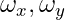) and the head is evaluated on a
held-out batch (N=200) of perturbations sampled once at start and never
seen during training. The head can no longer memorise: every step
brings a new target $\delta_{gt}$, so the only way to lower the loss
is to learn a function 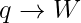 that is correct *across* perturbation
draws.

Anchor tile is val index 17, `00000000_t24.pt` — a typical highway
crop with a clean vanishing point, vertical lane signs, distant
buildings, and a foreground of asphalt. This is the regime in which
the existing per-point -head was designed to work: enough
vertical edges to give NLL clean low- points, enough geometric
diversity that pose isn't dominated by a single plane. We deliberately
*don't* pick a degenerate tile — the question is whether we beat the
-head where the -head is at its strongest.

| baseline           | δ-MSE (deg², held-out N=200) | RMSE per axis |
| ------------------ | ---------------------------- | ------------- |
| do-nothing ($\delta=0$) | 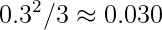 | 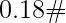 |
| W = I (uniform)    | **0.0458**                   | $0.21°$ |
| W = -head (NLL) | **0.0146**              | $0.12°$ |
| W = learned head   | **0.0066**                   | $0.081°$ |

The learned head beats the -head by **2.2×**, with no direct
supervision on W. The -head itself is doing real work here —
it correctly identifies vertical edges and large- road points,
and its 0.0146 is a 3.1× improvement over uniform — but the new head
finds further structure that NLL training could not see. Per axis,
that's a held-out RMSE of ~0.08° on a $\pm 0.3°$ perturbation
distribution, on a single 128×128 tile.

`⟨log det W⟩` falls monotonically from $-1.5$ at init to $-7.8$ by
step 400 without saturating, suggesting more training would still
help.

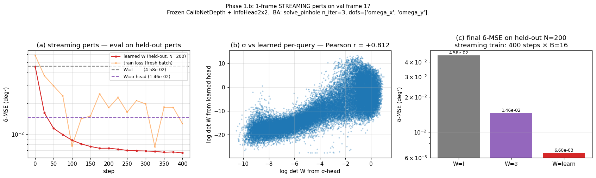

### What does the network actually do? σ-head vs learned-head ellipses

Plotting both heads as 2-D covariance ellipses ($\Sigma_i = W_i^{-1}$)
on the anchor tile makes the difference very legible.


- **Left ($\Sigma_\sigma$, NLL-trained).** Smooth gradient: ellipses
  are tight on objects and mildly larger on the road. This is what NLL
  learned — *the variance of per-point 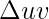 residuals*. It
  captures "asphalt is harder to predict pixel-wise than a sign post".
- **Right (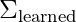, pose-trust).** Vastly larger
  ellipses on the road — *and elongated horizontally*. Mean major-axis
  is **57 px** for the learned head vs **2.6 px** for the
  -head: a ~22× scale gap. On objects (signs, building edges,
  trucks) the learned ellipses are *smaller* than the -head's.

The learned head is saying two things the -head cannot say:

1. *Suppress the road almost entirely.* Pose is determined by a few
   high-information points, not by averaging a thousand co-planar
   asphalt points. A small but coherent road-flow error would otherwise
   pull pose with full weight (§1).
2. *On the road, distrust the horizontal direction much more than the
   vertical.* Road-plane points slide along the surface; their
   horizontal $\Delta uv$ is uninformative about yaw. The
   -head, trained on  residuals, has no reason to
   represent this — local residuals look isotropic. The learned head
   develops the anisotropy because horizontal mis-trust is what would
   have improved pose, and the gradient through the GN solver
   penalised it for not having that anisotropy.

> The -head learned **how predictable each point's $\Delta uv$
> is**. The learned head learned **how useful each point's $\Delta uv$
> is for pose**. They look similar on the high-contrast objects where
> the answers happen to coincide and diverge wildly on the road, where
> they answer different questions.

### Why the network outputs $W$, not $\Sigma$

The information matrix is the natural input to the math layer. The
solver evaluates

$$
J^\top W J \quad \text{and} \quad J^\top W r
$$

— linear in , no inverses. If the network output  instead,
every forward and backward pass would need an extra `inv(Σ)` (and an
extra `solve` in the gradient) for every point. With a Cholesky
parameterisation 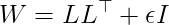 we additionally get PSD
for free and exact gradients to 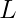 via autograd. So "predict " is
the only output choice that lets the principled-ML claim hold without
a numerical asterisk: the network produces exactly what the solver
consumes, nothing more, nothing less.

### A degenerate-tile sanity check

We re-ran the same recipe on val tile 0 (`00000000_t0.pt`), a low-info
crop dominated by featureless asphalt and a chain-link fence. Here the
-head fails outright — the ground points carry small NLL
 for the wrong reason (locally consistent flow), so the
solver weights them up and is dragged into the ground plane:

| baseline (tile 0)       | δ-MSE (deg²) |
| ----------------------- | ------------ |
| do-nothing              | 0.030        |
| W = I                   | 0.137        |
| W = -head       | 0.132        |
| W = learned             | 0.0254       |

Both **W = I and W = -head are worse than predicting
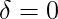** — the GN solver actively moves pose in the wrong
direction. Only the learned head crosses below the do-nothing line.
This is the §1 critique in numerical form: per-point NLL is not a
substitute for pose-trust, and uniform weights aren't either.

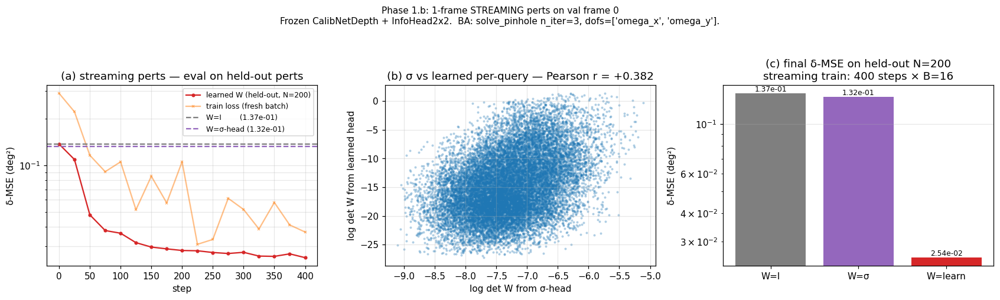

### What Phase 1.b does and doesn't show

It *shows* that with a backbone trained only with per-point NLL, a
small new MLP head — supervised by nothing more than gradient through
the closed-form GN solver — extracts pose-relevant trust that NLL
training had flattened away. The frozen queries already carry that
signal; the design assumption holds.

It *doesn't* show generalisation across frames. The streaming perts
vary $\delta$ but the underlying image and point cloud are one tile.
Phase 2 lifts that constraint: the same `InfoHead2x2`, trained on a
disjoint set of training tiles, evaluated on held-out tiles.

## 8. Related work

We're not the first people to put a geometric solver inside the
training loop. The prior art falls into a few families:

- **DROID-SLAM** (Teed & Deng, NeurIPS 2021). Dense optical flow plus a
  per-pixel **confidence map**, fed into a differentiable Bundle
  Adjustment layer (DBA) that solves for camera poses and depths. The
  confidence map is supervised exclusively through the BA layer —
  exactly the same trick we use for $W$. The closest piece of prior
  art in spirit. The differences are problem-shape: DROID-SLAM solves
  for camera **trajectory + depth** from monocular video; we solve for
  a small-DoF **calibration delta** from a single LiDAR-camera frame.
  And our weights are 2×2 matrices rather than per-pixel scalars,
  which is what enables the on-road yaw anisotropy in §7.
- **OptNet / Deep Equilibrium / declarative networks** (Amos & Kolter
  2017; Gould et al. 2021). The general theory that says you can
  backprop through the solution of an inner optimisation problem via
  the implicit-function theorem. We use this everywhere — `δ =
  (J^⊤WJ)^{-1} J^⊤Wr` is the closed-form solution of the inner WLS,
  and autograd takes care of the gradient.
- **DSAC, BPnP** (Brachmann et al. 2017; Chen et al. 2020).
  Differentiable RANSAC and differentiable PnP. Same flavour: keep
  the geometry exact, differentiate through it, only learn the
  inputs the geometry can't compute (correspondences, weights). PnP
  in particular is doing for relocalisation what we're doing for
  online calibration.
- **3D Gaussian Splatting** (Kerbl et al. SIGGRAPH 2023). Different
  problem (novel-view synthesis) but the same architectural pattern:
  a *fixed* differentiable forward model — projecting anisotropic
  Gaussians into a tile-based rasteriser — and the *only* learnable
  things are the per-Gaussian parameters the math can't compute on
  its own (mean, anisotropic covariance 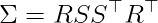,
  spherical-harmonic colour, opacity). No "scene network" to
  swallow the projection geometry. The covariance there is supervised
  by the photometric loss flowing back through the splatting
  Jacobian — exactly the same shape as our 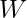 being supervised by
  pose loss flowing back through the GN Jacobian. The 2×2
  $W = L L^\top + \epsilon I$ Cholesky parameterisation we use is the
  same trick 3DGS uses to keep $\Sigma$ PSD under SGD.
- **The "principled deep learning" tradition** more broadly — Stewart
  et al. on "physics in the loss", everything that bolts a known
  forward model onto a learned residual. This blog is a
  calibration-shaped instance of that programme: the projection
  $\pi(\cdot; K, \mathbf{k})$ and the Gauss-Newton update are the
  known forward model, the network learns only the residual signal
  the forward model is missing — *which points to trust*.

What makes the calibration problem worth a separate writeup, against
that background:

- **Direct-regression baselines are still the norm in
  LiDAR-camera calibration.** CalibNet (Iyer et al. 2018), RegNet
  (Schneider et al. 2017), and the LCCNet / NetCalib lineage
  regress the 6-DoF transform directly out of a CNN. They have no
  geometric solver in the loop: the camera intrinsics, the
  projection model, the per-point geometry are all baked into the
  weights. That makes them dataset-bound (a model trained on KITTI
  rarely transfers to a different lens) and gives them no hook for
  *which pixels are informative for pose* — they fail in exactly the
  way §1 describes, by averaging the road. This blog is the
  argument for adopting the DROID-SLAM-style decomposition for
  calibration too.
- **Pose is small-DoF, scenes are LiDAR-augmented.** Unlike
  monocular SLAM, we know depth per query (the LiDAR projects in),
  the geometry is a 2-DoF (or 6-DoF) calibration delta rather than a
  full trajectory, and the Jacobian has a closed form. So the inner
  problem is much smaller than DBA's, the solver does not need to
  iterate, and the gradient through it is numerically clean.
  That's what makes the §6 sanity check tractable on a single frame
  in a few hundred steps.
- **The on-road yaw anisotropy of §7 is, as far as we know, a new
  observation.** A scalar-confidence head (DROID-style) can learn
  to suppress the road, but it cannot learn to suppress one
  *direction* on the road. A 2×2 head can. The same anisotropy
  shows up in classical photogrammetry as the "sliding null-space"
  of road planes; the network rediscovers it from gradient through
  the GN solver alone. This is, to us, the most interesting
  result here — not the 2.2× number, but that the network's $W$
  pattern recovers a structural property of the inverse problem
  without any prompting.

If you know of an LiDAR-camera-calibration paper that already does
the explicit info-matrix-through-closed-form-BA decomposition, I
would love a pointer.

## 9. What's next

Code lands as:

- `models/model_depth.py:InfoHead2x2` — gated by a constructor flag so old
  ckpts load unchanged.
- `scripts/_debug/overfit_2dof_ba.py` — Phase 1's fixed-batch sanity.
- `scripts/_debug/overfit_2dof_ba_stream.py` — Phase 1.b streaming-perts
  smoke; saves `info_head.pt` for downstream visualisations.
- `scripts/_debug/render_sigma_ellipse_compare.py` — σ vs learned
  covariance-ellipse overlay used for the hero figure above.
- `scripts/_debug/show_dist_predict_one.py` — per-point arrow + residual
  overlay for sanity-checking the  head on any given tile.
- `scripts/_debug/overfit_2dof_ba_multiframe.py` — Phase 2: same head, train
  on N train scenes, evaluate on disjoint held-out scenes (next).
- `scripts/training/train_ps_v3_ddp.py --ba-2dof` — Stage 4 joint finetune
  with 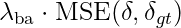 alongside
  the existing NLL.

A note on resolution. The held-out RMSE for the learned head on this
tile is ~0.08° per axis. The model runs at 128×128, so a 0.08° rotation
is ~0.18 px at the image edge — close to the half-pixel discretisation
floor. Closing the gap to the do-nothing-on-an-easier-distribution
floor of 0.030 deg² will likely require either higher input resolution
or unfreezing the backbone; both are on the Stage 4 plan.
