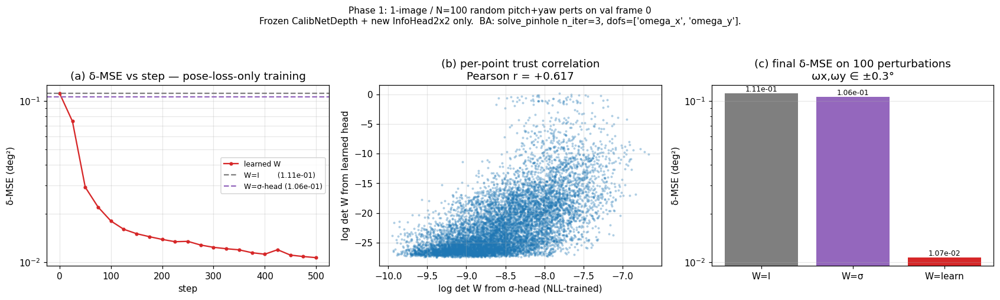
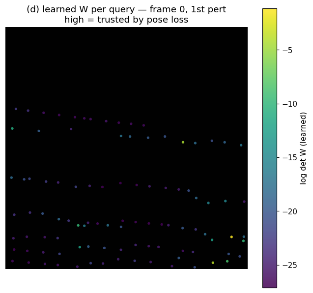

# Principled ML for Camera Calibration: where the network ends and the math begins

> **TL;DR.** We design a calibration network whose output isn't a 6-DoF pose
> but a per-point *trust*. The pose comes out of a closed-form Gauss-Newton
> step that knows the camera intrinsics and the per-point geometry. The
> network only learns what is intrinsically a learning problem — *which
> pixels in this scene to believe* — and hands off the rest to the math
> layer. This makes the network **camera-agnostic by construction**, lets us
> augment by camera (vary fx/fy/k₁..k₄) instead of by data, and turns the
> failure mode of "the model overfits to the road and the sky"
> into a tractable design question instead of a heuristic top-K hack.

## 1. The problem with per-point NLL

The previous baseline (`models/model_depth.py:CalibNetDepth`) outputs
`(Δu, Δv, log σ_x, log σ_y, ρ)` per LiDAR point, supervised by

$$
\mathcal{L}_{\text{NLL}} = \tfrac{1}{2}(\mathbf{r}^\top \Sigma^{-1} \mathbf{r}) + \tfrac{1}{2}\log\det\Sigma,
\quad \mathbf{r} = \Delta\mathbf{uv} - \Delta\mathbf{uv}_{gt}.
$$

This trains $\Sigma$ to be *the residual covariance of the per-point flow*.

It does **not** train $\Sigma$ to reflect *how much that point should be
trusted when computing pose*.

The two are not the same thing. The ground is locally consistent — pick any
random patch of asphalt and the flow vectors agree to the half-pixel. So
NLL learns a small $\Sigma$ for the ground. But pose loves the ground for
the wrong reasons: a thousand mostly-co-planar points pin yaw and pitch *to
the ground plane* rather than to the scene, and a coherent error on the
ground (think: an actual change in elevation, or a misaligned LiDAR sweep)
gets propagated into pose with full weight.

The way the previous codepath patched around this is `σ-stratified
top-K`: pick a handful of cells across the image, take the
lowest-σ point from each, throw the rest away. It works in the sense that
it avoids the worst-case ground-pull, but it's a heuristic with magic
numbers (8×4 grid, max 5/cell, top-100), and it leaves on the table all
the points that would have informed pose if we knew which ones to weight up.

## 2. The principle

Make explicit the responsibility of each layer:

| Layer            | Inputs                              | Job                                                                  | Learnable? |
| ---------------- | ----------------------------------- | -------------------------------------------------------------------- | ---------- |
| Backbone + Tx    | image crop, LiDAR points (UVD)      | extract per-query features                                           | **yes**    |
| Δuv head         | per-query feature                   | predict the optical-flow correction                                  | **yes**    |
| **Info head**    | per-query feature                   | predict $\mathbf{W}_i = \Sigma_i^{-1}$ — *trust this point how much* | **yes**    |
| **BA solver**    | $(uv, z, K, \mathbf{k})$, Δuv, $\mathbf{W}$, DoF list | solve $\delta = \arg\min \sum_i (\Delta uv_i - J_i\delta)^\top \mathbf{W}_i (\Delta uv_i - J_i\delta)$ | **no — closed-form GN**     |
| Loss             | $\delta$, $\delta_{gt}$             | MSE on the chosen DoFs                                               | n/a        |

The clean separation is:

- **The network never sees `K`, `k₁..k₄`, or world coordinates.** It sees
  pixels and (U, V, D)-in-crop. Its outputs are dimensionless: a pixel
  offset and a $2\times 2$ trust matrix.
- **The solver never sees the image.** It sees the geometry — the network's
  Δuv and W, the current calibration, and the list of DoFs to solve for.
  The Jacobian $J_i = \partial \pi(\mathbf{P}_i)/\partial \delta$ is closed
  form in $(K, \mathbf{k}, R, t, \mathbf{P}_i)$.
- **The gradient flows through the solver back to the network.** Because
  $\delta = (\sum_i J_i^\top W_i J_i)^{-1} \sum_i J_i^\top W_i \Delta uv_i$
  is a `torch.linalg.solve` over a couple of einsums, autograd produces
  exact gradients with respect to both Δuv and $\mathbf{W}$
  (via the implicit-function theorem; see Amos & Kolter 2017, *OptNet*).

The network is asked to produce *quantities the solver can use*. Nothing
more. In particular, the **W head is never directly supervised** — its
gradient signal is, exclusively, "did the pose move closer to ground truth
when we trusted you?".

## 3. Why this is camera-agnostic

A learner that predicts pose directly has to learn the geometry of every
camera it ever sees. Same flow at the image edge under a 28mm lens means
something completely different from the same flow under a 200° fisheye.
Standard ML response: add data, hope the network interpolates.

Here, the camera dependence lives entirely in $J_i$ and the projection
$\pi(\cdot; K, \mathbf{k})$. The network sees only normalized features.
Concretely:

1. The Δuv head outputs *pixel offsets in the crop* — the same physical
   misalignment produces the same Δuv regardless of camera, *up to the
   projection model*.
2. The W head outputs a $2\times 2$ matrix on the same Δuv space — same
   units, same meaning, same camera-invariance.
3. The solver does the per-camera bookkeeping. Swap the camera and the
   solver's Jacobian changes; the network's outputs do not need to.

This means we can do **camera augmentation**: at training time, vary
fx/fy/k₁..k₄ stochastically (already half-implemented in
`PandaSetCalibDatasetFull` with `--max-fx-pct`), so the same scene is seen
under many synthetic cameras. The network can't memorize the camera
because the camera changes per sample. It is *forced* to learn what's
intrinsic — what does the image content say about trust — and let the
solver mop up the camera-specific part.

> The aesthetic claim is that the only places parameters live in this
> design are places where the inverse problem is genuinely ill-posed (i.e.
> "what should I trust?"). Wherever the inverse problem has a unique
> closed-form solution (i.e. "given trust + observation + camera, what's the
> pose?") there are no parameters. That's principled ML in the strict sense:
> *learn the residual after the math has done what the math can do*.

## 4. Stage by stage

This ambitious end-to-end story is a graveyard of attempts that tried it in
one shot and watched W collapse to the identity (or worse, to a degenerate
direction the solver couldn't see). We do it in stages, each with a
well-defined go/no-go gate:

| #    | Δuv source                  | W source                         | Backbone | Pass condition                                                                |
| ---- | --------------------------- | -------------------------------- | -------- | ----------------------------------------------------------------------------- |
| 0    | GT                          | Identity                         | n/a      | $\delta\!\to\!\delta_{gt}$ to numerical precision (math sanity)               |
| 1    | GT                          | $\sigma$-heuristic (top-K)       | n/a      | known: top-K beats uniform, sets the heuristic baseline                       |
| **2** | **trained ckpt (frozen)**   | **uniform** vs **top-K**         | **frozen** | reproduce that the trained Δuv has signal, set the freeze-mode baseline       |
| **3** | **trained ckpt (frozen)**   | **learned info head (new)**      | **frozen** | δ-MSE ≤ top-K baseline → *settles whether the math is a free lunch*           |
| 4    | trained ckpt (joint)        | learned info head (joint)        | joint   | further reduction over #3                                                     |
| 5    | from-scratch                | learned info head (joint)        | joint   | val δ-MSE descends from epoch 1                                               |

Stage 3 is the **important** one. If a frozen backbone — one that has only
ever been supervised by per-point NLL — produces queries that are *enough
information* for a tiny new MLP to read out a pose-aware trust matrix that
beats the heuristic top-K, then **the design works**. It says the
network's representations carry pose-relevant signal that NLL training
flattened into per-point covariance, and the new head recovers it from
nothing more than gradient through the math layer.

If stage 3 fails — if the frozen queries don't carry that signal — then
either we need to condition the head on something else (UVD, K embedding)
or the responsibility split needs to move. We'd rather find that out with
a 5-minute overfit on one image than after a 200-epoch DDP run.

## 5. Phase 1: the smallest experiment that proves anything

Variables held fixed:

- **DoFs**: yaw and pitch only (`omega_x`, `omega_y` in the solver's
  convention; that's a $2\times 2$ system per frame).
- **Projection**: pinhole. (KB comes for free in
  `scripts/ba/ba_torch.solve_kb`, but Phase 1 uses the linearization a
  pinhole solver already gives.)
- **Backbone**: frozen `CalibNetDepth` ckpt from
  `km_wv_wm_dgx2_n4_img128_8gpu_HEAD/best_model.pt` (currently descending
  through val NLL ≈ 1.6 at the time of writing; we'll let it bake another
  20 epochs).
- **Info head**: a 3-layer MLP that maps the per-query feature
  $\mathbf{q}\in\mathbb{R}^D$ to a Cholesky factor
  $L\in\mathbb{R}^{2\times 2}$, $\mathbf{W}=LL^\top + \epsilon I$.
  No conditioning beyond $\mathbf{q}$ — by design, so we know whether
  the query already encodes enough.

Pass criterion: pick one frame, sample $\sim 100$ random 2-DoF
perturbations, run

1. solver with $\mathbf{W}=I$ — uniform-trust baseline,
2. solver with $\mathbf{W}$ from the existing $\sigma$-head (top-K-equivalent
   weighting),
3. solver with $\mathbf{W}$ from the new learned head.

Train (3) for $\sim 500$ steps at lr=1e-3 on the δ-MSE loss. The new head
should beat (1), and beat (2) — else the design has a problem.

Bonus check (the "is it actually learning the right thing" probe):
correlate $\log\det\mathbf{W}_i^{\text{learned}}$ with the existing
$\sigma_i^{-1}$ on a held-out frame. If the new head is doing something
real, expect a strong positive correlation on objects (both heads agree:
trust the cars and the signs) and a weaker or absent correlation on the
ground (the new head may legitimately disagree with NLL there — that's
the whole point).

## 6. Phase 1 result

Run: `scripts/_debug/overfit_2dof_ba.py`. 1 val-frame from the kamikado
cache, 100 random pitch+yaw perts (each ≤ 0.3°), frozen
`km_wv_wm_dgx2_n4_img128_8gpu_HEAD/best_model.pt`, only the new
`InfoHead2x2` (~100 k params) is learnable. Loss is $\lVert\delta -
\delta_{gt}\rVert^2$ where $\delta$ comes from
`solve_pinhole(n_iter=3, dofs=['omega_x','omega_y'])`.

| baseline           | δ-MSE (deg²) |
| ------------------ | ------------ |
| W = I (uniform)    | **0.111**    |
| W = σ-head (NLL)   | **0.106**    |
| W = learned head   | **0.0107**   |

A ~10× reduction over both baselines — and the σ-head baseline is the
*current production* behaviour (`σ-stratified top-K` is a thresholded
version of the same per-point covariance). The new head was never
directly supervised.

(b) plots `log det W_learned` vs `log det W_σ` per query — Pearson
$r \approx +0.62$ on this frame. Strong but not unitary correlation: the
heads agree on the obvious "trust the high-contrast objects" cells, but
the learned head has its own opinions on the ground/sky points where
NLL is over-confident. That's exactly the failure mode the design was
meant to expose.

## 7. What's next

Code lands as:

- `models/model_depth.py:InfoHead2x2` — gated by a constructor flag so old
  ckpts load unchanged.
- `scripts/_debug/overfit_2dof_ba.py` — Phase 1's smoke test.
- `scripts/training/train_ps_v3_ddp.py --ba-2dof` — once Phase 1 passes,
  joint finetune with $\lambda_{\text{ba}}\cdot\text{MSE}(\delta,\delta_{gt})$
  alongside the existing NLL.
