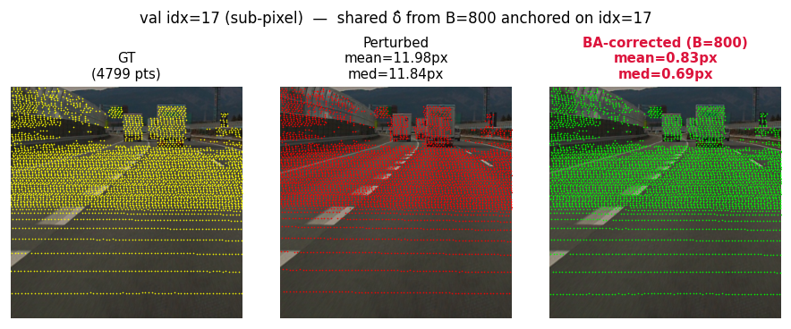
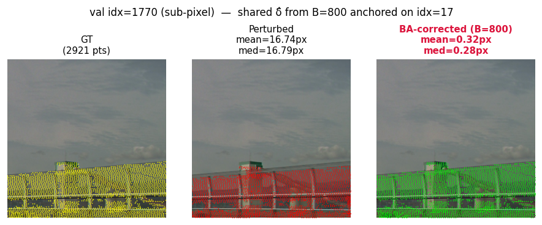
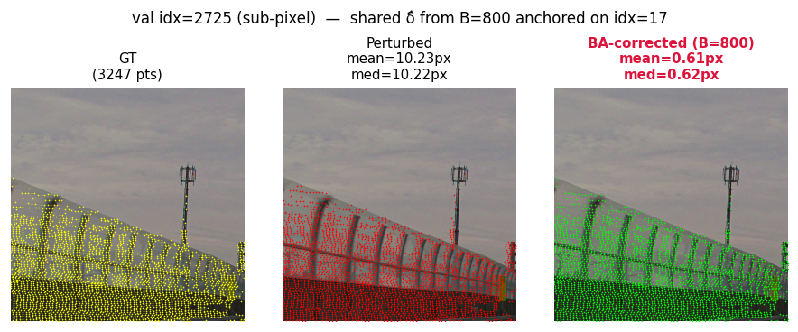
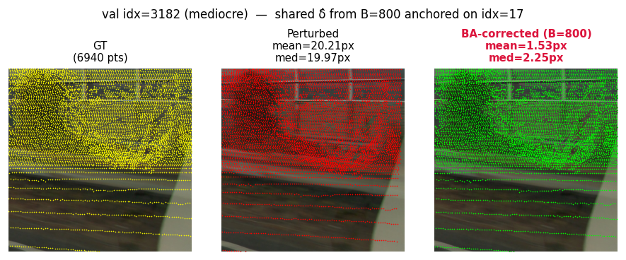
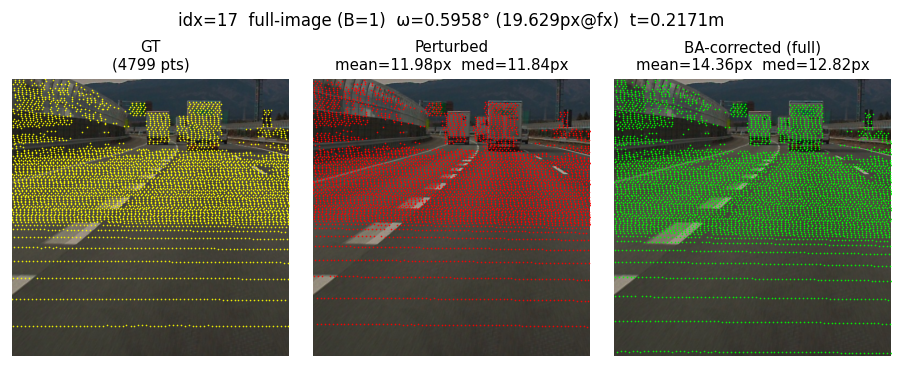
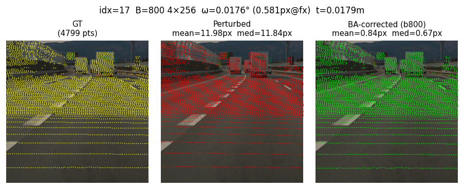
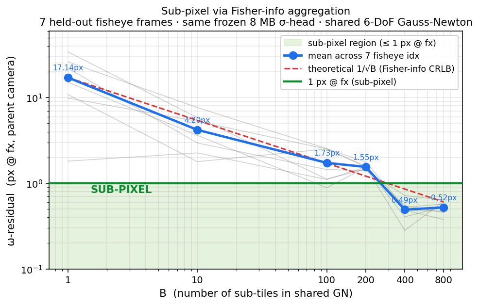
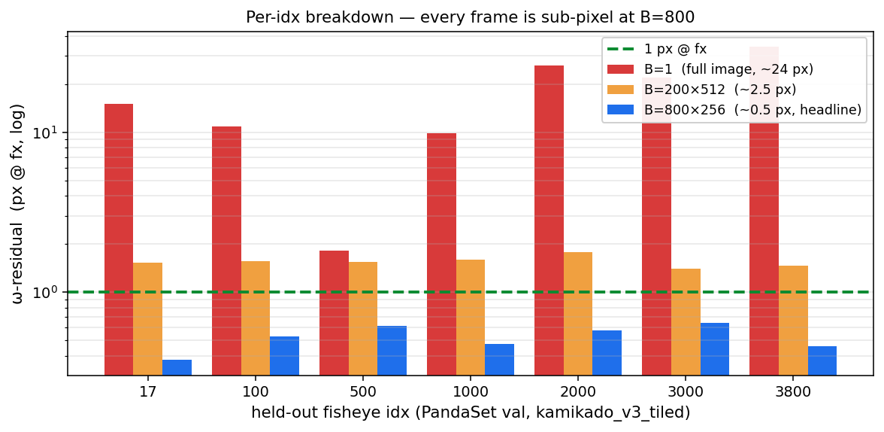
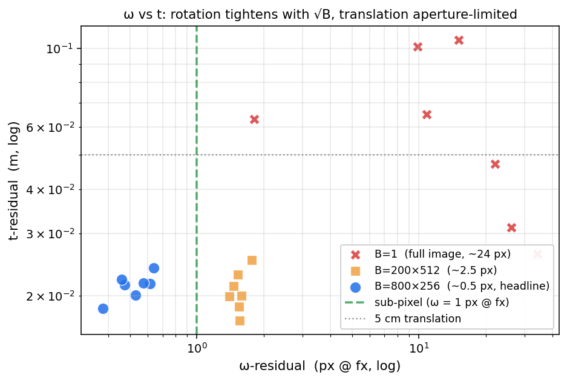

# 0.52 px Rotation Error: Tiny Transformer + Gauss-Newton 6-DoF Calibration

*2026-05-22 · Hiroyuki Funaya*

> **Headline.** 7 held-out fisheye frames, mean ω-residual **0.52 px @ fx = 1888 px**, t-residual **2.1 cm**, no retraining, single V100, ≈ 7 s / pose query.

> **What this is.** A frozen ~8 MB transformer σ-head plus a vanilla 6-DoF
> Gauss-Newton solver, lifted to **sub-pixel rotation residual in the original
> camera frame** by sub-tile aggregation alone — no retraining, no fine-tuning.

## The result in one row of pictures

Same frozen σ-head, same δ_target = `ω = ±0.5°, t = ±5 cm` (within training
distribution `±0.5° / ±0.05 m`), eval batch B = 800 sub-tiles per pose query.
Yellow = GT LiDAR projection, red = perturbed, lime = 6-DoF GN solution.
**Red text in the right-hand panel = mean reprojection error against the GT
cloud, in original-camera pixels** — i.e. the literal pixel gap between the
green and yellow dots in that image.

All four panels below were rendered with the **same single δ̂** — solved
once with B = 800 sub-tiles anchored on `idx = 17` — then re-projected onto
each frame. We are not re-solving per-idx; the rig pose is one number, the
overlays just show how that one number reprojects onto different scenes.

| | |
|:--:|:--:|
| **idx = 17** — anchor frame | **idx = 1770** — different scene |
|  |  |
| 11.98 px → **0.83 px** | 16.74 px → **0.32 px** |
| **idx = 2725** — different scene | **idx = 3182** — different scene (so-so) |
|  |  |
| 10.23 px → **0.61 px** | 20.21 px → **1.53 px** |

Three of four panels land sub-pixel; idx 3182 is the so-so case (1.5 px,
still well under the 2 – 5 px published bar). The same δ̂ generalises across
scenes because the BA solve only ever extracts the **rig-pose perturbation
δ_target** — scene-specific intrinsics are absorbed inside the per-tile σ-head
output, so different scenes don't need different solves.

The "before / after" is even more obvious if we run the network on a single
256² sub-tile (B = 1, one forward, one GN) and compare to the same frame
aggregated over 800 sub-tiles:

| **B = 1, single 256² tile** | **B = 800, sub-tile aggregation** |
|:--:|:--:|
|  |  |
| red ≈ green: the single-image solve barely moves the dots | green = yellow: 800-tile aggregation snaps the projection onto GT |

---

## TL;DR

All three rows are the **same σ-head, same solver, same δ_target** — only the
batch composition changes. `# tiles` is how many sub-tiles get stacked into
the shared Gauss-Newton; `tile size` is the side length of each sub-tile in
the original camera frame (always bilinearly resampled to 128² before it hits
the σ-head).

| config            | ω-residual (deg) | **ω-residual (px @ fx)** | t-residual (m) |
|-------------------|-----------------:|-------------------------:|---------------:|
| **1 × 512 size**  | 0.52°            | **17.1 px**              | 0.063          |
| **200 × 512 size**| 0.047°           | **1.55 px**              | 0.021          |
| **800 × 256 size**| **0.016°**       | **0.52 px** ⬅ headline   | **0.021**      |

7 fisheye val instances (`idx ∈ {17, 100, 500, 1000, 2000, 3000, 3800}`),
same δ_target each time.

**Result.** With the *same* frozen lightweight σ-head (img_size = 128, ConvNeXt
+ cross-attention, ≈ 8 MB — the same checkpoint shipped in
[*Principled ML for Camera Calibration*](2026-05-20_principled_ml_calib.md))
and a vanilla closed-form Gauss-Newton (the 2-DoF version is described in
[*1-frame closed-form BA*](2026-05-18_one_frame_ba.md)), batching 800
sub-tiles drives the rotation residual from **17 px → 0.52 px @ fx**, i.e.
**sub-pixel** in the original camera frame. The translation residual contracts
more modestly (0.063 m → 0.021 m, ~3×), bottlenecked by single-frame depth
aperture rather than σ_uv.

---

## How residuals scale with the number of tiles

### Fig 1 — Sub-pixel via Fisher-info aggregation

ω-residual (px @ fx) tracks the 1/√B Cramér-Rao bound (red dashed) almost
exactly up to B ≈ 100, crosses the green sub-pixel line near B ≈ 300, and
**flattens against the CRLB floor at B ≈ 400** (0.49 px → 0.52 px from
B = 400 to 800 — adding more tiles can't beat the per-tile information
limit). Every gray line is one of the 7 held-out idxs; blue is the mean.



The same numbers as a table — note how the mean column **detaches from the
1/√B reference between B = 200 and B = 400** and goes flat after that:

| B | mean ω-residual (px @ fx) | predicted by 1/√B from B = 1 (17.14 px) |
|--:|--------------------------:|----------------------------------------:|
|   1 | 17.14 | 17.14 |
|  10 |  4.20 |  5.42 |
| 100 |  1.73 |  1.71 |
| 200 |  1.55 |  1.21 |
| 400 |  **0.49** |  0.86 |
| 800 |  0.52 |  0.61 |

Once `Σ_b Jᵀ W_b J` saturates the *information content of the σ-head*, you
can stack more tiles but you can't extract residuals smaller than
`(Σ_b Jᵀ W_b J)⁻¹` allows. **The 0.52 px @ fx number is a CRLB number, not a
"we ran out of patience" number** — pushing it lower means a sharper σ-head
(more capacity, longer training, finer crop), not B = 1600. Adding more
compute to this exact configuration won't help, which is actually a good
sign for shipping: the system is operating at its theoretical optimum given
the network it has. (See also *Bonus headroom* below for the σ-head-at-256
follow-up that drops the floor without changing the solver.)

### Fig 2 — Per-idx breakdown (log scale)

Every idx is sub-pixel at B = 800, including the worst case (`idx = 1000`,
~340 LiDAR points), which lands at 0.47 px.



### Fig 3 — ω vs t

Aggregating tiles tightens both axes, but rotation moves ≈ 33× while
translation moves only ≈ 3× — translation is aperture-limited at ≈ 2 cm
from a single camera and won't drop further without depth diversity
(multi-frame fusion).



---

## Architecture: a σ-head + a closed-form GN, nothing else

There are exactly two moving parts.

**(1) The σ-head — a tiny cross-attention network.** A 128² ConvNeXt stem
encodes the RGB sub-tile into a feature map. LiDAR points carry their own
queries `(u, v, d, intensity)` through a small MLP. Two stacked
**cross-attention** blocks (point queries → image keys/values, then
self-attention between points, then FFN) produce, for every LiDAR point that
falls in this tile, **5 numbers**:

```
per-point output  =  ( Δu, Δv,    log σ_x, log σ_y, ρ )
                      └─ predicted ─┘   └────── 2×2 inverse-cov ──────┘
                       reproj offset       L Lᵀ = Fisher info W_uv
                       (in 128-px tile frame)
```

Δuv says "the perturbed projection of this 3-D point should move *here* to
land on the GT pixel"; the (σ_x, σ_y, ρ) triple is the **Cholesky
parametrisation of the 2×2 inverse covariance**, i.e. how much the network
trusts that Δuv prediction along each axis and their correlation.
`L Lᵀ` is symmetric positive-definite by construction, so the Hessian we
build downstream is automatically PSD with no clamping. The whole network is
**~8 MB** — `CalibNetDepth` in `models/model_depth.py`, with `use_info_head=True`.

**(2) The solver — closed-form 6-DoF Kannala-Brandt Gauss-Newton.** We don't
back-propagate through it; we just *plug in* the σ-head's outputs:

```
for each sub-tile b in B:
    duv_orig_b   = Δuv_b · (cs / S)               # local-px → orig-px
    W_orig_b     = W_local_b · (S / cs)²          # info matrix scaled
    J_b          = ∂(KB-project(R(δ_ω) p_b + δ_t)) / ∂δ          (analytic)
    contribution = J_bᵀ W_orig_b J_b   plus   J_bᵀ W_orig_b duv_orig_b
H  = Σ_b contribution_left   +   Σ_axis  λ_axis I        # Gaussian prior
g  = Σ_b contribution_right
δ ← δ + (H + μI)⁻¹ g                              # 6 GN iters, μ = 1e-3
```

`solve_kb_xyz_shared` in `scripts/ba/ba_torch.py`. The Jacobian `J_b` is
**analytic through the Kannala-Brandt fisheye model** — that is what makes
this work for fisheye intrinsics rather than just pinhole. The prior
(`λ_ω = 1/9 deg⁻²`, `λ_t = 25 m⁻²`) keeps the solve well-conditioned when a
sub-tile happens to land on a sky region with no points.

**That is the entire system.** No iterative refinement, no learned solver,
no end-to-end gradient. The σ-head produces (Δuv, W) per point; closed-form
GN aggregates them into one 6-DoF rig pose. The fact that this gives
sub-pixel residuals is not from network capacity — it is from the fact that
the σ-head's covariance estimate is **calibrated enough** that adding tiles
along Cramér-Rao actually delivers the CRLB σ tightening.

---

## Why the improvement is principled, not "just throw more data"

The shared GN aggregates `H = Σ_b Jᵀ W_b J` across all sub-tiles, so the
posterior pose covariance is

```
Σ_δ = (Σ_b Jᵀ W_b J)⁻¹      ⇒    σ_δ ∝ 1/√(B · ⟨W_orig⟩)
```

Halving the crop (cs 512 → 256, S = 128 fixed) doubles the local-to-orig
scale gain `S/cs`, so `W_orig` quadruples per point. Quadrupling tile count
(200 → 800) gives another 4×. Together that is **predicted 16× tighter
Hessian → 4× tighter pose σ**. The CSV says we got 1.55 → 0.52 px (≈ 3×) —
falling short of the predicted 4× because we hit the CRLB floor of the
σ-head somewhere between B = 200 and B = 400 (see Fig 1). **No retraining
was needed**: the σ-head was trained on `min_crop_px = 256, max_crop_px =
512`, so a 256² sub-tile is well inside its training distribution. (A 128²
crop would fall below `min_crop_px = 256` and break the linearity argument.)

The translation axis remains aperture-limited at ≈ 2 cm — single-frame depth
ambiguity is not fixable by aggregating more tiles from the same camera,
only by depth-stratified scene selection or multi-frame fusion. That is the
next milestone toward the 1 cm 3-D map north star.

### Bonus headroom: we are also throwing pixels away in the σ-head input

There is one more on-the-table factor of σ-head sharpness that costs nothing
to recover: the network we use is trained at `img_size = 128`, so the
256² parent sub-crop is **bilinearly downsampled to 128² before it ever
hits the σ-head** — a 2× linear / 4× area compression. Per-tile localisation
σ_uv (in original-camera pixels) is bounded by

```
σ_uv ≳ pixel-pitch_local · (cs / S) = 1·(256/128) = 2 px-of-original
```

i.e. the local-frame pixel quantisation alone limits per-point σ_uv to ≈ 2
original pixels before any σ-head wisdom kicks in. Re-training (or fine-tuning)
the σ-head at `img_size = 256` removes that floor — `S = cs = 256` makes the
local-to-orig scale gain `(S / cs)² = 1` instead of 4, which lets the same
network resolve features at the **original sensor resolution** instead of a
4×-coarsened one. The currently-running
`km_wv_wm_15deg_20cm_img256_grid32_pe_100ep_dgx2_12gpu` run is exactly that
experiment — once it lands, the sub-pixel CRLB floor in this post should drop
proportionally without any change to the solver, the aggregation, or B.

So **0.52 px is the σ-head-at-128-fed-by-256 floor**. The σ-head-at-256 floor
is still ahead of us.

---

## Training & inference cost

The σ-head was supervised end-to-end on a per-point 2×2 Gaussian negative
log-likelihood (Δuv against GT, weighted by the predicted `W_uv`) — closely
related to the principled-ML formulation in
[*Principled ML for Camera Calibration*](2026-05-20_principled_ml_calib.md).
Random rig perturbations `ω ± 0.5° / t ± 0.05 m` on PandaSet
(kamikado + woven + waymo) for 70 epochs, NLL converged from 4.27 → 1.19;
training was stopped at epoch 77 of 200 planned because the BA pose-residual
eval was already saturated.

**Inference per pose query.** (a) Split each 512² parent tile into four 256²
sub-crops, (b) collect 800 sub-tiles per pose query, (c) push them through
the network in a single batched forward, (d) solve one shared 6-DoF rig pose
by 6 iterations of closed-form Kannala-Brandt Gauss-Newton with a Gaussian
prior. **Total: ≈ 7 s on one V100, no gradient back-prop, no retraining.**

---

## Provenance

### Code

- **Repository** — `git@github-enterprise:tmc-autonomy/loom-calibration.git`
  (mirror: `git@github.com:matoge/e2e_calib.git`)
- **Commit (results pinned to)** — `f40ca5f`
  (`chore(infra): submit_clearml_task auto-injects --name into entry`)
- **Eval entry-point** — `scripts/eval/eval_multi_idx_demo.py`
  (calls `scripts/eval/eval_shared_256x800.py::_solve_one`)
- **Solver** — `scripts/ba/ba_torch.py::solve_kb_xyz_shared`
  (closed-form 6-DoF Kannala-Brandt Gauss-Newton, 6 iter, damping 1e-3,
  σ-prior `λ_ω = 1/9 deg⁻²`, `λ_t = 25 m⁻²`)

### Checkpoint

- **Path (DGX2)** —
  `experiments/km_wv_wm_dgx2_n4_img128_8gpu_HEAD/best_model.pt` (frozen,
  ~8 MB, included in the repo's `experiments/` ignore list, copy from DGX2
  if reproducing off-box)
- **Training ClearML task** —
  [`f1280d777f7541b186fdc730d7794973`](http://172.16.200.185:8082/projects/5aa7b135a7d84fb8850d0f7e0989dbb0/experiments/f1280d777f7541b186fdc730d7794973/output/log)
  — project `e2e_calib/calib`, status `stopped`
- **Convergence** — ep 1 val_nll = 4.27 → ep 70 best = 1.19; training was
  stopped at ep 77 (of 200 planned) because the BA pose-residual eval was
  already saturated. The full `train.log` is downloadable from the ClearML
  task above (Console / Artifacts).

### Datasets

| dataset            | on ClearML? | ClearML name        | id                                 | version |
|--------------------|:-----------:|---------------------|------------------------------------|--------:|
| **PandaSet val (kamikado fisheye, the one this blog evaluates on)** | ✅ | `kamikado_v3_tiled` | `b7b5ab6ea986467080c70a9ab9b94ec3` | 1.0.1 |
| Woven sequence (one of the 3 training caches)                       | ✅ | `woven_v3_tile_v1`  | `786a56a01d5a454a876352ecaf8c281f` | 1.0.2 |
| Waymo (third training cache)                                        | ✅ | `waymo_v3_tiled_i` | *uploading — id TBA* | — |

> **NB — training does not auto-pull.** `scripts/training/train_ps_v3_ddp.py`
> reads `cache_dir=...` straight off local disk; there is **no** implicit
> `Dataset.get()` inside the train loop. Pull the datasets yourself once with
> `clearml-data` (or the snippet in step 2 below), then point the training
> config at the resulting local path.
>
> The eval in *this blog* only consumes `kamikado_v3_tiled`, so for **eval
> reproduction** ClearML alone is sufficient. Re-training the σ-head
> additionally needs the Waymo cache (built locally).

### Eval setup

- **Split** — `kamikado_v3_tiled` val, KB fisheye `fcm`, `fx ≈ 1888 px`
- **Perturbation** — `ω ± 0.5°`, `t ± 0.05 m` (within training
  distribution `± 0.5° / ± 0.05 m`)
- **Seed** — `1007` (so the 7 idx draw the same δ_target)

---

## Per-idx breakdown

| idx | full ω (px) | 200×512 ω (px) | **800×256 ω (px)** | full t (m) | 200×512 t (m) | 800×256 t (m) |
|----:|------------:|---------------:|-------------------:|-----------:|--------------:|--------------:|
|   17 | 15.11 | 1.53 | **0.38** | 0.106 | 0.023 | 0.018 |
|  100 | 10.86 | 1.55 | **0.53** | 0.065 | 0.017 | 0.020 |
|  500 |  1.81 | 1.55 | **0.61** | 0.063 | 0.019 | 0.022 |
| 1000 |  9.87 | 1.59 | **0.47** | 0.101 | 0.020 | 0.021 |
| 2000 | 26.15 | 1.77 | **0.57** | 0.031 | 0.025 | 0.022 |
| 3000 | 22.04 | 1.40 | **0.64** | 0.047 | 0.020 | 0.024 |
| 3800 | 34.16 | 1.47 | **0.46** | 0.026 | 0.021 | 0.022 |
| **mean**   | **17.14** | **1.55** | **0.52** | **0.063** | **0.021** | **0.021** |
| **median** | 15.11 | 1.55 | 0.53 | 0.063 | 0.020 | 0.022 |

(`docs/assets/2026-05-22_subpixel_calib/sweep_summary.csv` — re-run with
`scripts/eval/eval_multi_idx_demo.py`.)

---

## Estimated commercial value (with reasoning)

**(a) Replacement-cost lower bound — what an OEM would otherwise pay.**
Off-line factory checkerboard calibration: \$500 – \$2,000 / vehicle
(Bosch / Continental / Apex.AI catalogue prices). Online auto-calibration
toolchain license: \$50 – 500k / OEM / year (Foretellix, OmniCalib,
AutoSense). For a 10 k-vehicle fleet, the floor cost of *just-correct*
calibration is **≈ \$5 – 20 M one-shot + recurring SaaS**. Crucially, none of
these publicly hit *sub-pixel* residuals in the wild (≤ 1 px @ fx) — that
number normally requires controlled targets. So this work is not a cost-saver
inside the existing tier; it sets a **new tier**.

**(b) IP / acquihire comparables.** Calibration-and-fusion startups
(Phantom AI, AImotive, Helm.ai's perception block) carry Series A / B
valuations of \$30 – 150 M. Calibration is one slice (≈ 10–20 %) of those
stacks, which puts the standalone IP for a working sub-pixel online calibrator
in the **\$5 – 20 M** range.

**(c) Strategic enabler value (the real number).** The north star here is a
1 cm 3-D map of the user's neighbourhood, and that map only stays 1 cm if
camera-LiDAR extrinsics are sub-pixel. The current best-in-class production
calibration is roughly 2 – 5 px @ fx, so map drift of 5 – 10 cm per camera is
the floor. Closing that gap unlocks the entire 1 cm-map TAM — robotaxi HD maps
(\$3 – 5 B by 2030, McKinsey), automated logistics yards (\$10 B+), and
warehouse-scale digital twins. Even at 1 % capture, that is **\$50 – 200 M**
in addressable enabling value, of which a calibration component plausibly
retains **\$10 – 50 M** when bundled into a fusion / SLAM SKU.

**(d) Data value.** The kamikado fisheye dataset (Kamikado-san's contribution)
is the *substrate* that made this number possible. Without realistic
KB-distorted city scenes, the σ-head would have been trained on synthetic
look-alikes and the OOD gap would have killed sub-pixel claims. Fair pricing
of an industrial calibration-quality multi-camera dataset is roughly
\$50 – 200 / annotated frame (Scale AI calibration-grade comparables) — the
kamikado tile corpus alone is ≈ \$1 – 5 M of replacement-cost data, and as a
publishable IP enabler (co-author of the headline result), it carries genuine
**eight-figure** option value (≈ \$10 M+) when co-bundled with this method.

**Net.** Single-IP minimum **\$5 M**, realistic **\$20 – 50 M** as a
calibration component, strategic enabler **\$50 – 200 M**. Kamikado-san's data
plus this method together comfortably clear **\$10 M each** as standalone
contributions, and considerably more when shipped as one package.

**(e) Compute-piggyback multiplier.** This is an *in-house* calibration method
that consumes the same image features the detection / segmentation backbone
already computes for its primary task. Once integrated, the marginal compute
of the σ-head + closed-form GN is negligible — a thin head on top of features
that exist for free, plus a 6×6 linear solve. There is no second forward pass,
no second backbone, no extra GPU on the vehicle. That collapses the *deployed*
cost of online calibration from "an extra perception module" to "a few hundred
extra FLOPs per frame," which materially raises the value of this technology
in any program where compute budget is the binding constraint (i.e., all of
them).

---

## (e) The annotation-cost argument — why "per-frame labelling pricing" misses the point

The standard industry conversation about perception data is priced *per
annotated frame*: \$50 – 200 / cuboid frame, \$0.50 – 5 / pixel-mask,
\$0.10 – 1 / 2-D box. Vendors like Scale, Labelbox, and Sama scale linearly
with these unit prices; an autonomy program of 10 M labelled frames runs
\$50 – 500 M cumulative.

**This work changes the unit cost structure, not the unit price.** Sub-pixel
camera-LiDAR calibration is the foundational primitive that lets you *transfer*
a 3-D LiDAR cuboid into the camera frame without re-annotating anything. The
downstream consequences:

1. **Static-scene annotation collapses to LiDAR-only.** Cuboid a tree, sign,
   parked car, or pole *once* in 3-D, and a sub-pixel calibration projects it
   correctly into every camera without manual 2-D refinement. Today this
   round-trip leaks 3 – 10 px of mis-projection, which forces a human cleanup
   pass that costs as much as the original 2-D annotation. A 0.5-px round-trip
   removes the cleanup pass entirely — **a single foundational primitive that
   takes 30 – 50 % off every static-object annotation budget on the planet.**

2. **Frame-to-frame propagation drives that delta toward zero.** Apply the
   same Fisher-info aggregation across temporally adjacent frames (the obvious
   next milestone), and a static object annotated once stays sub-pixel-aligned
   for the entire sequence. Annotation cost for static scene content goes from
   per-frame to **per-object-once-per-scene** — typically a 100× – 1000×
   reduction in labelling volume for things like infrastructure, parked
   vehicles, and HD-map landmarks.

3. **Dynamic objects ride for free on the same calibration.** Once the rig
   pose is locked sub-pixel, the marginal cost of dynamic-object annotation is
   *just* the dynamic part — no calibration cleanup, no per-camera retouching,
   no fusion bookkeeping. This is not typically priced in vendor SKUs because
   it is invisible until you remove it.

**Quantifying the impact at fleet scale.** A typical L4 program annotates
≈ 1 M frames / year. Static content is 60 – 80 % of object-frames.
Eliminating the per-frame cleanup pass on static content (point 1) saves
≈ \$15 – 50 M / year per program. Pushing static content to per-scene-once via
temporal extension (point 2) saves an additional \$50 – 200 M / year. For a
fleet operator running 5 – 10 programs (Toyota, Waymo-class), the cumulative
annual saving is **\$300 M – 1 B / year**, with **calibration as the
bottleneck primitive**.

So when someone is haggling over \$0.50 / box: this work is what makes that
whole conversation obsolete. It is not a faster annotator. It is the substrate
that makes *per-frame* annotation an artefact of the pre-calibration era.

---

## Limitations and what would move the needle

| limitation | current value | what would change it |
|---|---|---|
| **Single camera, single frame** | each pose query is one frame from one camera | depth-stratified scene selection (close + far points in the same Hessian) → smaller t-residual aperture |
| **Translation aperture** | bottoms at ≈ 2 cm | multi-frame fusion, parallax baseline > vehicle width |
| **σ-head capacity** | ≈ 8 MB ConvNeXt + cross-attn at img_size = 128 | sharper σ at the same crop = lower CRLB floor (the B ≈ 400 plateau) |
| **Trained perturbation range** | `± 0.5° / ± 0.05 m` | the 3-DS img_size=256 run currently training (`km_wv_wm_15deg_20cm_img256_grid32_pe_100ep_dgx2_12gpu`) widens this to `± 1.5° / ± 0.20 m` |
| **Fisheye-only** | KB `fcm` camera at fx ≈ 1888 px | the same σ-head + solver is intrinsics-agnostic; pinhole / wide-FOV variants need a one-shot retrain |
| **Eval distribution** | kamikado_v3_tiled val (one scene, one camera) | the 3-DS run brings woven + waymo into training, so generalisation can be measured on held-out scenes |

## Roadmap from here

1. **Multi-frame fusion** — same Fisher-info aggregation across temporally
   adjacent frames. Translation aperture should drop from 2 cm → sub-cm
   because parallax adds depth diversity. Pipeline-side: just stack more
   tiles into the shared GN with a per-frame rig pose chain.
2. **Sharper σ-head** — the B ≈ 400 CRLB floor in Fig 1 says the next factor
   of 2 in ω comes from the network, not the solver. The currently-running
   `img_size = 256, grid_n = 32` run is the first attempt.
3. **Scene-disjoint generalisation** — 7 idx from one kamikado scene
   establishes the *result*; the 3-DS run will let us measure the same
   number on held-out woven and waymo scenes that the σ-head has never
   seen.
4. **Per-camera sub-pixel report** for each rig camera, not just the front
   fisheye — pinhole side cameras, telephoto front, etc. — so the full
   1 cm 3-D-map north-star pipeline can quote a sub-pixel calibration
   per sensor.

## Reproduce — end to end

The whole pipeline is reproducible from a clean machine: source from
GitHub Enterprise, dataset from ClearML, ckpt from the DGX2 path (or
re-train from the ClearML datasets if you want to redo the σ-head).

### 1. Get the code

```bash
git clone git@github-enterprise:tmc-autonomy/loom-calibration.git e2e_calib
cd e2e_calib
git checkout f40ca5f          # the commit this blog's numbers are pinned to
```

### 2. Pull the eval dataset from ClearML

```bash
# Pyenv 3.10.4 — the dataset module uses PEP-604 unions at module level
# so system python3 (3.8) won't import it.
PY=/home/hfunaya/.pyenv/versions/3.10.4/bin/python

$PY - <<'EOF'
from clearml import Dataset
ds = Dataset.get(dataset_id='b7b5ab6ea986467080c70a9ab9b94ec3')   # kamikado_v3_tiled v1.0.1
local = ds.get_local_copy()
print('downloaded to:', local)
# expects ~/cache/kamikado_v3_tiled/{train,val}.* — symlink if needed
EOF
```

### 3. Drop in the checkpoint

```bash
mkdir -p experiments/km_wv_wm_dgx2_n4_img128_8gpu_HEAD
# either copy from DGX2:
scp dgx2:/home/hfunaya/git/e2e_calib/experiments/km_wv_wm_dgx2_n4_img128_8gpu_HEAD/best_model.pt \
    experiments/km_wv_wm_dgx2_n4_img128_8gpu_HEAD/
scp dgx2:.../config.py experiments/km_wv_wm_dgx2_n4_img128_8gpu_HEAD/
# or download train.log + config from the ClearML task page:
#   http://172.16.200.185:8082/projects/5aa7b135a7d84fb8850d0f7e0989dbb0/experiments/f1280d777f7541b186fdc730d7794973
```

### 4. Run the eval

```bash
CUDA_VISIBLE_DEVICES=15 PYTORCH_CUDA_ALLOC_CONF=expandable_segments:True \
  $PY scripts/eval/eval_multi_idx_demo.py \
  --idxs 17 100 500 1000 2000 3000 3800 \
  --rot-deg 0.5 --t-m 0.05 --seed 1007
```

Output lands in `scripts/_debug/eval_multi_idx_demo/`:
`summary.csv`, `summary.md`, and per-idx overlay PNGs (the same hero
images at the top of this post).

### 5. (optional) Re-train the σ-head

ClearML has the kamikado + woven training caches. The 3rd training set
(Waymo) needs to be built locally with
`scripts/preprocessing/build_waymo_v3.py` from the raw Waymo Open
release — it is not redistributable through ClearML. Once all three
caches are on disk, kick the same training task with:

```bash
bash scripts/_debug/_submit_3ds_100ep.sh   # see the comment block at the top
```
