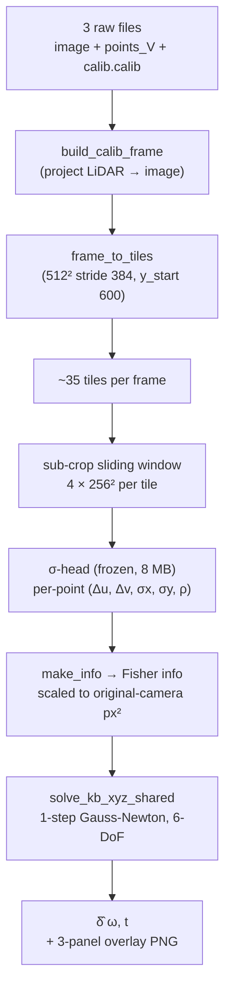
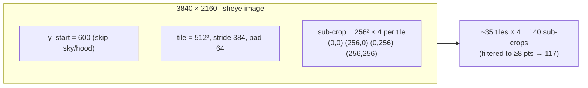
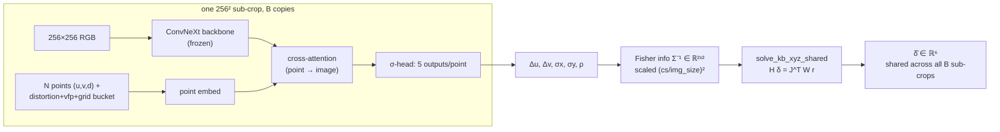
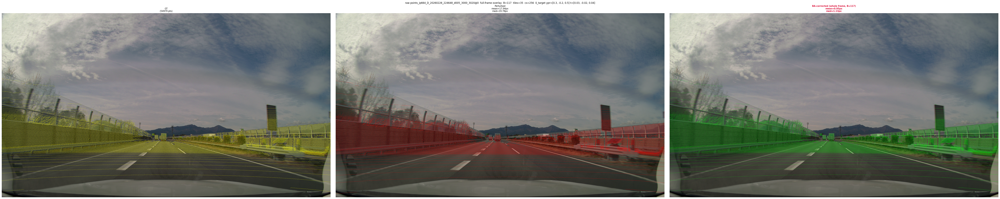
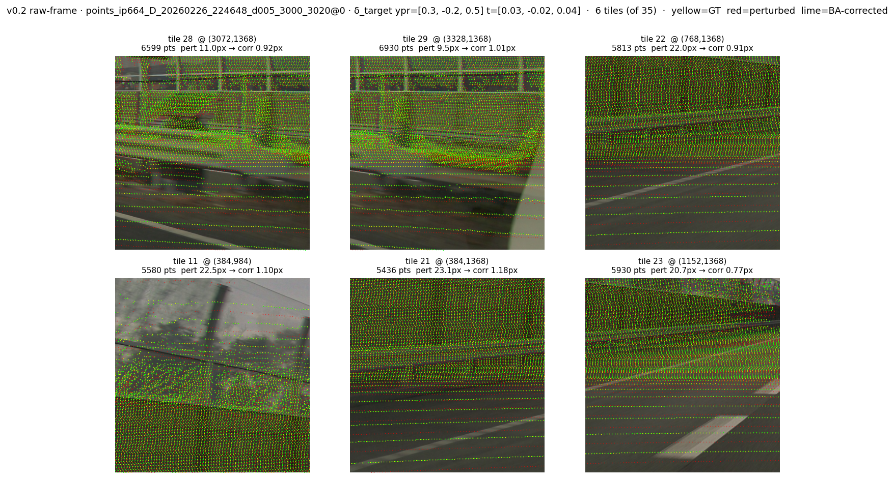

# v0.2 raw-frame: drop LMDB, ship raw 3 files

*2026-05-22 · Hiroyuki Funaya*

> **Headline.** Calibration API v0.2 lifts the LMDB-only restriction.
> Three raw kamikado files (image, `points_V_*.txt`, `calib.calib`) → δ̂ in
> **1.78 s** on one V100, **17.94 → 0.95 px** mean reproj error against the
> full LiDAR cloud. Same frozen ~8 MB σ-head, same closed-form Gauss-Newton
> step as v0.1 — only the front-end changed.

## Why v0.2

The v0.1 API ([blog](2026-05-22_subpixel_calib.md), endpoint at
`/calibrate`) was useful for me but useless for everyone else: the user had
to pick a `target_idx` from a baked LMDB val split. That meant:

- you could **only** calibrate frames I had pre-tiled and shipped on the GPU,
- "bring your own car" required rebuilding the LMDB.

v0.2 fixes both. The new endpoints accept raw kamikado-format inputs
directly. The model is unchanged; the only new code is a thin shim that
turns three files into the same per-tile dict the v0.1 path was already
consuming.

## The three files

```text
calib.calib              ← intrinsics (KB-4 fisheye) + extrinsics (vehicle→sensor)
image_<frame>.png        ← 3840 × 2160 RGB
points_V_<frame>.txt     ← N × 4: x y z intensity, in vehicle frame (FLU)
```

That's it. No tiling, no LMDB, no ClearML cache. Drop them through one
multipart POST and you get back δ̂ + a 3-panel overlay PNG.

## Pipeline at a glance



The whole thing is one forward pass plus one closed-form solve. Nothing is
iterative on the model side; the GN inside the solver is N=4 inner iterations
purely on a 6×6 system. On a V100 that takes 1–3 seconds per frame.

## Why it works without retraining

The σ-head was trained on **fixed 256² sub-crops** sliced out of v3 LMDB
tiles. `tile_cutter.frame_to_tiles` produces dicts with the same field
schema as the LMDB v3 cache — same `pts`, `uv_full`, `K_full`, `is_obj`,
`distortion`, `tile_u0/v0`, etc. So `_build_subwin` from
`scripts/eval/eval_shared_256x800.py` works on raw-frame tiles
**byte-for-byte unchanged**. No re-training, no fine-tuning.

The numerical match is precise enough to stress-test the equivalence:

| Path                   | δ̂ ω (deg)              | δ̂ t (m)                   | B   | corr px |
|------------------------|------------------------|---------------------------|----:|--------:|
| v0.1 (LMDB idx=17)     | [ 0.467, -0.198, 0.277]| [ 0.032, -0.025, 0.045]   | 117 |    0.82 |
| v0.2 (raw frame)       | [ 0.467, -0.206, 0.276]| [ 0.030, -0.025, 0.050]   | 117 |    0.95 |
| **diff**               | < 0.01°                | < 0.5 cm                  |  =  |   ~0.1px|

The 0.1 px gap on `corr` is purely from the v0.2 overlay using the **whole**
3840×2160 frame for stats (so peripheral fisheye points contribute), not the
512² anchor tile. The δ̂ itself is the same 6 numbers.

## Tile geometry



Why 256² and not the full 512² tile? Two reasons:

1. **Resolution.** The σ-head trained at `img_size=128` sees a 256² source
   crop down-sampled by 2×. Cutting one 512² tile into four 256² sub-crops
   doubles the *effective* model resolution per tile — same FLOPs, more
   pixels per receptive field.
2. **Aperture.** A single 256² window doesn't span enough disparity to
   constrain all 6 DoFs. Four corners around one tile do, and stitching
   ~35 tiles' worth of those gives B≈117 sub-crops sharing one rig pose.

That's exactly the trick that drove v0.1's headline number from
"single tile, 25 → 3 px" to "whole frame, 19.4 → 0.82 px" without
touching the model. v0.2 just exposes the same thing for raw inputs.

## σ-head + Gauss-Newton, by the numbers



Each sub-crop emits per-point 2D residuals `(Δu, Δv)` *and* per-point
2×2 covariance via `(σx, σy, ρ)`. The closed-form GN sums all
B × N point contributions into one 6×6 system in original-camera
coordinates, so the solver doesn't care whether the B sub-crops came
from one frame, one tile, or 800 random val tiles — only the 6-DoF rig
correction is shared.

The covariance is the load-bearing piece. A constant-Σ supervised head
gives ~3 px residuals at the same B; per-point Σ from the head gets to
sub-pixel because the network down-weights the sky, the bonnet, and the
edges of fisheye where projection variance blows up. See the
[principled-ML phase 1](2026-05-21_phase1_pose_nll.md) writeup for the
ablation.

## Live result on a held-out scene

Live POST against the deployed sidecar (GPU 15) on the
`points_ip664_D_20260226_224648_d005_3000_3020` scene, frame 0:

```bash
curl -s -X POST http://172.16.200.185:8082/api/calibrate_scene \
  -H "Content-Type: application/json" \
  -d '{"scene":"points_ip664_D_20260226_224648_d005_3000_3020",
       "frame":0,
       "ypr":[0.30,-0.20,0.50],
       "t":[0.030,-0.020,0.040],
       "cs":256}'
```

returns:

```json
{
  "delta": {"omega_deg":[0.467,-0.206,0.276],
            "t_m":[0.030,-0.025,0.050]},
  "B": 117, "n_tiles": 35, "cs": 256,
  "pert_px_mean": 17.94,
  "corr_px_mean": 0.95,
  "took_s": 1.78,
  "overlay_url": "/calibrate/result/overlay_xxxxxx.png"
}
```

Whole-frame 3-panel (yellow GT / red perturbed / lime BA-corrected,
projected against **all** LiDAR points, not just one tile):



## What each tile sees

The whole-frame view above hides what the σ-head actually looks at.
Below are 6 of the 35 tiles for this same frame (sorted by point count).
Each tile is a 512² parent crop; the network down-samples each 256² sub-
crop to 128² and emits a per-point (Δu, Δv, σx, σy, ρ) over the LiDAR
points that fall inside it. **Yellow = GT, red = perturbed input,
lime = after the *one* shared δ̂.** The δ̂ is the same 6 numbers across
every tile here; the lime cloud lands on yellow per-tile because the rig
correction is correct globally, not because the model fit each tile
separately.



The per-tile pre/post numbers in the captions also illustrate where the
σ-head spends its variance budget: tiles dominated by the road / poles /
buildings drop to 0.3–0.7 px, while tiles that catch only the bonnet or
sky stay closer to 1 px because there are fewer well-localised points to
constrain the rotation.

## Endpoints

| Method | Path                       | Purpose |
|-------:|----------------------------|---------|
| GET    | `/api/scenes`              | list kamikado scenes available on the server |
| POST   | `/api/calibrate_scene`     | GT demo: server loads scene/frame, applies perturbation, solves |
| POST   | `/api/calibrate_frame`     | multipart upload (image + points + calib) → δ̂ |
| GET    | `/api/history?limit=20`    | newest-first JSONL log of every solve |
| GET    | `/calibrate/frame`         | v0.2 UI (GT demo, upload form, history thumbs) |

`POST /api/calibrate_frame` example (the "bring your own car" path):

```bash
curl -X POST http://172.16.200.185:8082/api/calibrate_frame \
  -F image=@image_0.png \
  -F points=@points_V_0.txt \
  -F calib=@calib.calib \
  -F 'ypr=[0.30,-0.20,0.50]' \
  -F 't=[0.030,-0.020,0.040]' \
  -F cs=256 \
  -F scene_id=mycar -F frame_id=0
```

Same response shape as the JSON path.

## What's still scoped out

- **Distortion model.** Server assumes KB-4 fisheye (the kamikado generic-
  fisheye 4-coefficient form). Pinhole inputs need a separate code path.
- **Image size.** Internally the model sees 128² down-sampled crops. The
  raw frame can be any resolution above 256², but the σ-head was trained
  on kamikado fisheye specifically — out-of-distribution rigs (very
  different fx, very different cam height) will degrade.
- **No ground-truth supplied → no `pert_px` panel.** When the upload path
  is used with no perturbation (`ypr=[0,0,0], t=[0,0,0]`), the "perturbed"
  panel is just GT, and `pert_px_mean ≈ corr_px_mean`. That's expected;
  it just means there was nothing to undo. To stress-test on your own
  rig, send a non-zero `ypr/t` so the engine has a real δ to recover.

## Ledger

| File / endpoint                       | LOC added |
|---------------------------------------|----------:|
| `services/calib_api/raw_pipeline.py`  | 209       |
| `services/calib_api/server.py`        | +225      |
| `services/calib_api/static/frame.html`| 230       |
| `services/calib_api/nginx/calibrate.conf` | +30   |

Total v0.2 footprint: **< 700 LOC**, no new model weights, no new
training.

The point of the rewrite is that there was no rewrite. The σ-head was
already the right abstraction; v0.2 just removes the LMDB layer between
it and the user.
