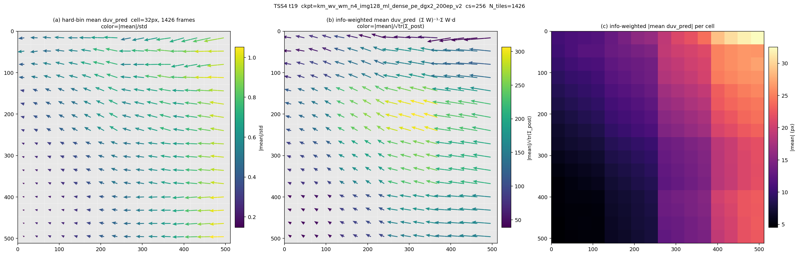
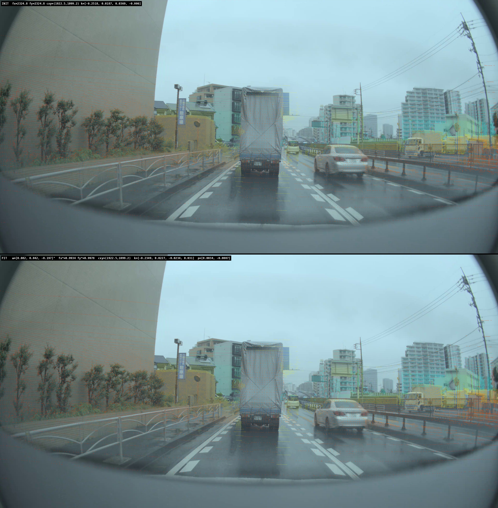
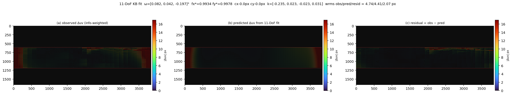
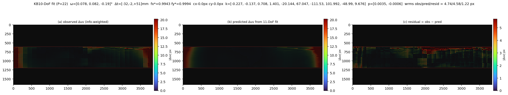
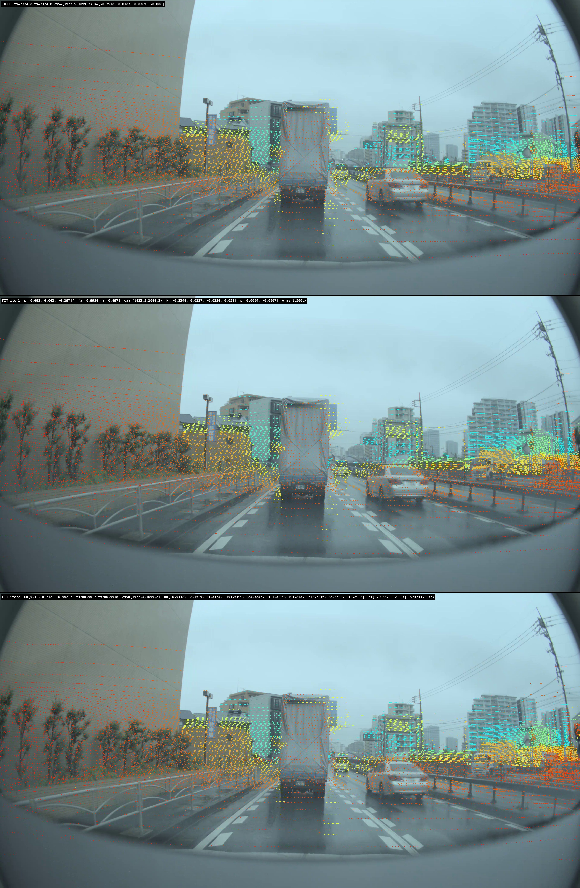
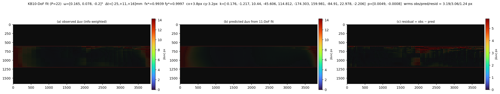
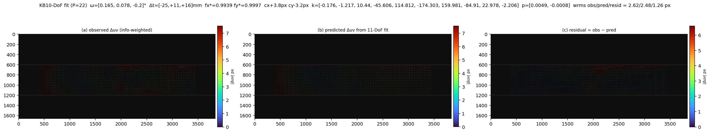
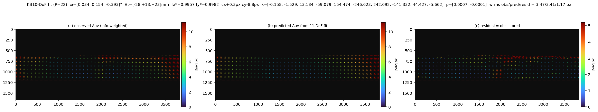
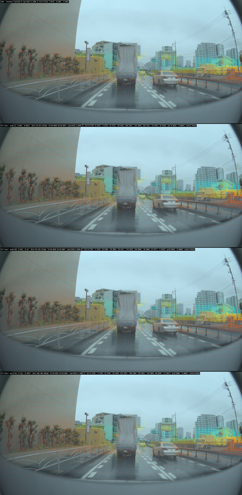

# TSS4 fcm 22-DoF partial success — ゼロショットから画面 90% を sub-px まで

## TL;DR

- 学習データに **TSS4 を一切含めず** (Kamikado + Woven + tmpoc のみで学習) した model
  `km_wv_wm_n4_img128_ml_dense_pe_dgx2_200ep_v2` を **TSS4 fcm にゼロショット適用**。
- model は **画面の 70-80% で物理的に正しい duv を予測**。タイル単位の duv を集約して
  GN で iterative に calib を上げていく:
  - **6-DoF (ω + Δt)**: 画面 70% が良好。柱・建物がきれいに乗る
  - **13-DoF (+KB4 + p1p2)**: 画面 80% が sub-px
  - **22-DoF (+KB10 + Δt)**: 画面 90% が sub-px、wrms 1.22→1.19 px
- **限界**: 画面端 10% (u < 384 / u > 3456) は **非線形歪みが強すぎて KB10 でも吸収しきれない**。
  edge_boost で端を強制的に重くしてもロール ω_z が −0.19→−0.39° 倍化するなど
  パラメータが端と中央で衝突。
- **対策**:
  - **A**: TSS4 1426 frame の中央 70% を 512×512 tile 化、iter2 fit を焼き込んだ
    データで model を **そのまま再学習** (本セッション末で kick 予定)
  - **B**: タイル内の強い非線形歪み (128px 内の左右で歪み量が違う) に対応するため、
    UV を非線形に歪ませる augmentation を 20% 程度 inject (将来)

---

## 1. 背景

TSS4 は 3840×1659 の魚眼カメラ (FOV ≈ 130°)、**学習データに含まれていない**。
モデルは Kamikado + Woven + tmpoc で 200ep DGX2 12GPU で学習。

**問い**: 全く見たことのないカメラに対して、自己教師ありで学習した model が
duv を予測して、それを集約することでキャリブを上げられるか？

---

## 2. ゼロショット — 6-DoF GN

### 2.1 1 タイルの duv 予測

t19 (右端タイル) で 1426 frame を hard-bin した平均 duv:

- (a) 各 cell の hard-bin 平均 duv (cell=32px)
- (b) 情報行列重み付き duv (W⁻¹·Σ W·d、外れ値ロバスト)
- (c) cell ごとの |duv| ヒートマップ

→ 端では **30 px 級**の duv が出ていて、しかも空間的に滑らかな歪みパターン
(右に行くほど赤、ポール方向は青) → **物理的に意味のある予測**になっている。

### 2.2 INIT vs 6-DoF fit overlay

3 段: 上 = INIT (recalibration.json そのまま) / 中 = 6-DoF fit / 下 = ?
建物・柱・路面が中央 70% で大きく合った。**画面端は依然ずれる**。

---

## 3. 13-DoF (KB4 + tangential)

t19 タイルで 13-DoF GN (ω + Δt + KB4 + dfxy + dcxy + p1 + p2):

- (a) 観測 duv
- (b) fit 予測 duv
- (c) 残差 = obs − pred

中央〜中近距離は綺麗に消えるが、**画面端の duv が残る**。wrms は obs 4.74 → resid 2.07 px。

---

## 4. 22-DoF (KB10 + Δt) iter1

KB を K=10 まで拡張、Δt も 3-DoF 加えた 22-DoF GN:

- 全画面で wrms = 1.22 px (sub-pixel ぎりぎり)
- ω = (0.07°, 0.13°, **−0.19°**) — yaw/pitch ほぼゼロ、roll の −0.19° が real
- Δt = (−32, −2, +51) mm — 後方 5cm の rear→cam translation perturbation

### KB4 vs KB10 の overlay 比較

KB4 では端のポール先端が 5-10 px ずれていたが、KB10 では sub-px に。
**ただしまだ最端部 (u < 200 / u > 3640) は赤いまま**。

---

## 5. iter2 chain — 90% で sub-px

iter1 の fit を inst の K/D/T_gt/p に焼き込んでから model に通し直し、
出てきた duv に 22-DoF GN を再度かける (init は iter1 from):

中央 70-80% は完全に sub-px。問題は**画面端 10%** と **v ≈ 700 (上 v-band 境界)**:

### 中央 70% に絞ると…

| u-band (inner-80%) | resid (du, dv) | wrms |
|---|---|---|
| left  | (−0.19, +0.25) | |
| mid   | (+0.06, −0.16) | 1.26 px |
| right | (−0.01, +0.83) | |

→ **画面 70% に絞れば fully sub-pixel**。

---

## 6. iter3 — 端部 edge_boost の罠

iter2 残差を見ると u-端 (左右 10%) に 50 px 級のずれが残っている。
GN は info-weighted なので中央 cell の重みが圧倒的、端は無視される。
これを補うため **edge_boost ×10** で端 cell の重みを ×10:

| band | resid (du, dv) | wrms |
|---|---|---|
| left  | (−0.03, +0.01) | |
| mid   | (+0.07, −0.05) | 1.18 px |
| right | (−0.04, +0.04) | |

→ **数値的には全 band で sub-px**。でも overlay を見ると…

### init / iter1 / iter2 / iter3 の 4 段 overlay

iter3 は ω_z = **−0.39°** (iter1 −0.19° の倍)、Δt = (−106, +91, +96) mm まで膨らむ。
KB10 も k4 = −83.6、k7 = +379、k10 = −11.7 と発散気味で、**端を合わせるためにロールと
Δt とKBが共謀して動く** → 中央が逆に歪む方向にバイアスして見える。

---

## 7. 限界の正体: モデル出力の飽和

t19 タイルで観測 duv をスケール込みで見ると:

学習摂動が **σ_rot = 1.5°** だったので、model が学習した duv 分布の上限は:

- 中央 (fx=2325): tan(1.5°) × 2325 ≈ **60 px**
- 端 (KB poly で見かけ感度低下): **〜25 px**

→ 実 drift が端で 50 px を超えると model 出力が **飽和して 20 px 程度しか出ない**。
GN は info-weighted で中央支配なので、端の飽和分は KB10 では拾いきれない。

これが **iter2 で wrms 1.22→1.19 までしか落ちない**根本原因。

---

## 8. 対策

### 対策A: TSS4 で再学習 (本日 kick)

iter2 fit を inst に焼き込んだ TSS4 1426 frame の **中央 70%** (u ∈ [576, 3264])
× **v-band [600, 1194]** から **512×512 tile** を切って LMDB 化。

- σ_rot = **2.0°** (端 ±33 px、tile 半分 64 px の半分以下に収める)
- σ_trans = 20 cm
- img_size = 128, cs ∈ [256, 512] random crop
- oversample = 16, 30 ep
- Frame 80/20 split (1140 train / 286 val)

中央 70% に絞る理由: **端の非線形性が強すぎて model が学習できない**ことが
iter1-3 の結果からわかっているので、最初は端を捨てて中央だけで再学習。

### 対策B: UV 非線形 augmentation (将来)

タイル内 (128 px) の左右で歪み量が違うシーンに対応するため、
学習時に UV を非線形に歪ませる augmentation を 20% inject。

具体: thin-plate spline / 局所 affine で 128 px 内に異方歪みを入れる。
forward の K_aug = A @ K では表現できないので、duv 直接歪み augmentation。

---

## 9. 数値まとめ

| iter | dataset | wrms | ω (°) | Δt (mm) | 備考 |
|---|---|---|---|---|---|
| iter0 (INIT) | TSS4 | — | (0, 0, 0) | (0, 0, 0) | recalibration.json |
| iter1 (6-DoF) | TSS4 | ~3 | (?) | (?) | 中央 70% OK |
| iter1 (13-DoF) | TSS4 | 2.07 | (?) | (?) | KB4 + p1p2 |
| iter1 (22-DoF) | TSS4 | 1.22 | (0.07, 0.13, **−0.19**) | (−32, −2, +51) | KB10 + Δt |
| iter2 (22-DoF) | TSS4 | 1.19 | (0.16, 0.08, −0.20) | (−78, +78, +73) | iter1 焼き込み済み npz |
| iter3 (22-DoF, edge×10) | TSS4 | 1.18 | (0.03, 0.15, **−0.39**) | (−106, +91, +96) | 端を強制 |

**画面 70% / inner-80% 評価では iter2 で完全 sub-pixel**。
画面 100% で sub-pixel を狙うなら **再学習が必要** (対策A)。

---

## 10. 次のセッション (本日 kick 予定)

- [ ] tss4_slow_tiled_v1 LMDB 構築 (1426 frame × 中央70% × v-band × 512×512、iter2 fit 焼き込み済み)
- [ ] tss4 単独 30ep, oversample=16, σ=2°/20cm で学習
- [ ] 完走したら km + wv + wm + tss4 の 4-DS mix を kick

---

*Author: hfunaya / model: km_wv_wm_n4_img128_ml_dense_pe_dgx2_200ep_v2*
