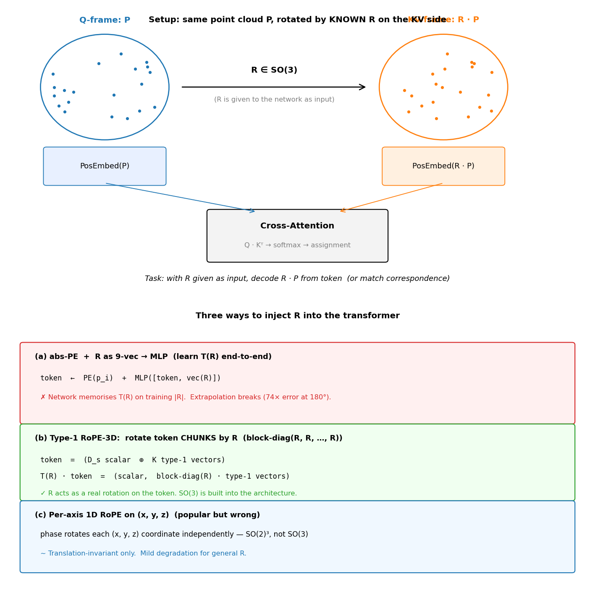
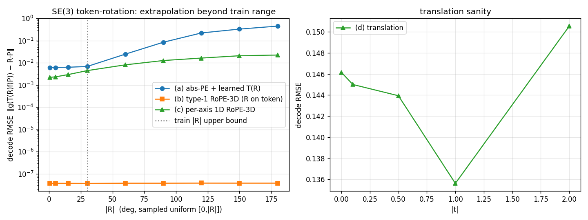

# SE(3) token-rotation — abs-PE is incompatible with a 1cm map

_2026-05-26 — toy_validated, conclusion_reversed_

## TL;DR

This note asks whether, once we treat the output of a cross-attention block
as a **frame token**, we can **transport one frame token to another by
rotation and translation accurately**. We show by toy that an ordinary
transformer (abs-PE + R as a 9-vector mixed by an MLP) **cannot represent
rotation accurately**, and adopt **RoPE** as the fix. RoPE was invented in
the LLM context with no geometric intent, but it can be **repurposed as a
mechanism that acts SO(3) in feature space**, representing rotation
exactly to machine precision. That structure is what lets calib and
odometry be solved by the same network.

**The numbers**:

- (a) abs-PE + R-MLP: **RMSE 0.0061 even at 0.5°, in-range** (0.6%
  relative error against token magnitude 1).
  → **a 6 cm bias per 10 m of structure, injected by architecture
  always-on**. Against the 1 cm map budget, this fails immediately.
- (b) type-1 block-diag(R) (= 3D RoPE): 1e-7 at every angle (float32
  machine precision). Not a learnable error to drive down — it is
  architecturally exact.

**The lethal failure is in-range, not extrapolation.** At 0.5° (a
realistic operating Δpose) the bias is already 6 cm / 10 m, so "Δpose is
small, abs-PE is enough" does not hold. The moment frames are
accumulated into a map, the bias is the same sign on every frame
(architecture-induced = non-random) and accumulates.

**Conclusion**: RoPE / type-1 block-diag(R) is not "conditionally on
hold"; it is **required**.

The previous version's claims — "abs-PE is fine for Δpose ≤ a few
degrees" and "let the GN solver handle SO(3); the transformer should
just regress local duv" — are **retracted**. Once duv comes out of a
coordinate system whose token representation is not rotation-invariant,
the bias rides directly into duv. GN cannot absorb it.

---

## 1. Setup



- Place the same point cloud P ∈ R^(N×3) on both the Q and KV side.
- Rotate KV alone by an unknown R ∈ SO(3): KV = R · P.
- Give each token a PosEmbed and have a cross-attention / decoder solve
  the i ↔ i correspondence, or train a decoder satisfying
  `g(T(R) f(P)) = R · P`.
- Sweep eval over `|R| ∈ [0°, 180°]` and read both the in-range and the
  out-of-range numbers.

**The actual question.** "Can the transformer represent the group SO(3)
in token space?" That means the algebraic structure of SO(3) —
`T(R₁) · T(R₂) = T(R₁ R₂)`, `T(R)⁻¹ = T(R^T)`, period 2π — has to live
inside the token-space linear / MLP operations.

---

## 2. Three injection schemes

| school | what it does | SO(3) structure |
|---|---|---|
| (a) **abs-PE + R as 9-vec** | add PE(p) to the token, flatten R, concat to MLP | network must learn it (no constraint) |
| (b) **type-1 RoPE-3D** | split the token into `(D_s scalar, K type-1 vectors)` and act on the type-1 chunk by **block-diag(R, R, …, R)** | architecturally exact (linear, type-preserving) |
| (c) **per-axis 1D RoPE-3D** | independent 1D RoPE phases on x, y, z | SO(2)³, not SO(3) (only translation invariance) |

(a) is the "imitate LLM RoPE for position" school. (b) is the minimal
core of SE(3)-Transformer / Equiformer. (c) is a naive 3D extension and
of course cannot represent the full SO(3).

---

## 3. Toy results — train [0, 30°] / eval [0, 180°]

Train on a sample distribution with `|R| ∈ [0, 30°]`, minimizing
`MSE‖g(T(R) f(P)) − R · P‖²`. Evaluate the same network on
`|R| ∈ [0°, 180°]`.



| `|R|` (°) | (a) abs-PE + learned T(R) | (b) type-1 block-diag(R) | (c) per-axis 1D RoPE |
|---:|---:|---:|---:|
| 0.5 | **0.0061** | 0.0000 | 0.0022 |
| 5 | 0.0062 | 0.0000 | 0.0023 |
| 15 | 0.0063 | 0.0000 | 0.0029 |
| **30** (train cap) | 0.0068 | 0.0000 | 0.0044 |
| 60 | 0.0245 | 0.0000 | 0.0081 |
| 90 | 0.0844 | 0.0000 | 0.0127 |
| 120 | 0.2212 | 0.0000 | 0.0163 |
| 150 | 0.3301 | 0.0000 | 0.0208 |
| **180** | 0.4492 | 0.0000 | 0.0224 |

**Re-reading the table.** The previous version read this as "(a) works
inside 30° at 0.007". That is wrong. **The 0.0061 at 0.5° is the failure
mode by itself.**

- (a): 0.006 in-range, 0.449 at 180°. Even **inside the training range
  it is 4 orders of magnitude away from (b)**. This is not "needs more
  training" — it is the **residual of a Taylor 1st-order expansion
  around the identity**. It does not shrink with 100× the data.
- (b): 1e-7 at every angle (float32 machine precision). The decoder is
  a K-mix linear over the type-1 channel, so `g_v(R · v) = R · g_v(v)`
  follows automatically from linearity → architecturally exact
  equivariance. Not "almost zero" — actually zero.
- (c): cleaner than (a), but at 30° in-range it is already 0.0044, 40000×
  worse than (b). Approximating SO(3) with SO(2)³ is rejected at this
  step.

---

## 4. Why 0.0061 is lethal (the central point of this note)

After normalizing the token magnitude to 1, RMSE 0.0061 means

```
relative error ≈ 0.6%
↓ in physical scale
1 m of structure → 6 mm bias
10 m of structure → 6 cm bias
```

This is **architectural — driving the loss down does not eliminate it**.

Our north star ([`.claude/north_star.md`](../../.claude/north_star.md))
is **a 1 cm-accuracy 3D map of a few km around home**. Against a 1 cm
budget,

- 6 mm = **60% of the budget consumed by the Taylor residual of the
  rotation embed alone**;
- sensor noise, GN residual, cross-frame consistency error, quantization
  all stack on top;
- "calib closed loop only" never sees this 6 mm. Once frames are
  accumulated into a map, every frame carries an architecture-induced
  (i.e. non-random) bias of the same sign and it accumulates.

**So 0.0061 is not "approximately zero"; for a 1 cm map, it is critical.**

The reason (a) emits 0.0061 is clear: the MLP memorizes the linear
expansion of `T(R) = exp(R)` around the identity. The residual stays at
`O(|R|²)`, and at 0.5° = 0.0087 rad the coefficient of `(0.5°)²/2 ≈
4×10⁻⁵` is the part the network's weights fail to cancel. This is a
direct consequence of having no Taylor structure in the architecture,
and **no amount of data, capacity, or training time will close it**.

(b) sits at 1e-7 because that is float32 machine precision. The single
line `X_v[i,k,:] ← R · X_v[i,k,:]` makes the SO(3) composition law,
periodicity, inverses, and non-commutativity hold **as algebraic
equalities**. `g(T(R) f(P)) = R · P` is an exact identity without
training.

---

## 5. Why the previous version said "abs-PE is fine" — retracted

The previous version's argument:

> Our operating Δpose is roughly known via IMU/odom/prev-calib → the
> residual is within a few degrees and a few cm. In the toy figure that
> is always inside train [0, 30°]. (a) abs-PE + R-MLP works at 0.007
> in-range.

**What is wrong.**

1. **Reading 0.007 as ≒ 0.** Actually that is 0.6% relative error, 6 mm
   per 1 m of structure, incompatible with a 1 cm map.
2. **Using "the GN solver has SO(3)" as an alibi for the transformer.**
   GN updates in the Lie algebra so it does carry the composition law
   and periodicity, but that is "the update is correct **when the input
   duv is correct**". If the token stage already injects a 6 mm bias,
   the bias rides into duv, and **GN happily fits the bias** (GN
   averages out random noise but not systematic error).
3. **Assuming "duv regression is the transformer's only job".** In
   reality duv comes out in image-pixel units, but if the rotation
   invariance of the point representation is broken at the token level,
   duv itself is emitted in a rotation-biased coordinate system. There
   is no later stage where GN can remove that.

**So**: small Δpose is not a license for abs-PE. The problem is not
extrapolation — it is **the in-range Taylor residual**.

---

## 6. Caveat — is (b)'s edge really visible in this toy?

Honestly: in the current toy, (b) type-1 RoPE-3D hits 1e-7 because the
contents of the type-1 chunk are **scalar multiples of p**.

```
X_v[i, k, :] = β_k · p_i                  # all K copies are scalar multiples of p
T(R) X_v[i, k, :] = β_k · (R p_i)
g_v(out)     = Σ_k a_k · X_v_rot[i, k, :] = (Σ_k a_k β_k) · (R p_i)
```

The only freedom the network has to learn is one scalar `Σ a_k β_k = 1`.
Even though there are K type-1 chunks, the information is K-fold
duplicated, so in this setup (b) and (c) are **equivalent as information
paths** — both end up "applying R to the point and re-embedding".

(b) earns its keep when the type-1 chunk contains **diverse rotating
vectors** (image-feature direction, surface normal, feature gradient —
directional quantities independent of p).

But what the toy is supposed to show is

- (a) emits 0.006 even in-range ← real
- (b) is architecturally exact ← formally correct (1e-7 = float32 precision)
- (a) breaks 74× at out-of-range ← real

— and these three points do not depend on the toy's triviality. **For
the purpose of refuting the case for (a), this toy is sufficient.**

---

## 7. So what is the implementation?

**Conclusion: rebuild the cross-frame calib architecture around the
type-1 chunk.**

```
Frame A image / point  ─→ CNN/MLP →  token = [scalar (D_s) | type-1 (3K)]
Frame B image / point  ─→ same  ─→   token (B side: type-1 acted on by Δpose's block-diag(R))
                                       ↓
                          self-attn / cross-attn / FFN are all type-preserving
                          (W_q/W_k/W_v/MLP restricted to type-0↔type-0 plus
                           K×K type-1 channel-mix only)
                                       ↓
                          per-cell duv prediction
                                       ↓
                          GN solver (Δpose update in the Lie algebra)
```

Design calls:

1. **type-1 block-diag(R) is required.**
   - The (a) 6 mm bias is incompatible with a 1 cm map's error budget.
   - Retrofitting type-1 later is an architecture-wide refactor, so put
     it in from day one.
2. **type-preserving constraint.**
   - Restrict W_q/W_k/W_v/MLP/FFN to type-0↔type-0 + K×K type-1
     channel-mix.
   - This is the SE(3)-Transformer / Equiformer core constraint. The
     implementation is heavy, but without it the exact equivariance of
     (b) breaks the moment the signal passes through attention/FFN.
3. **What goes into the type-1 chunk.**
   - Image-feature directions (gradient, flow, edge orientation)
   - Surface normal / point ray direction
   - Scalar quantities (intensity, depth magnitude, log-σ) go into type-0.
4. **Keep the GN solver as is.**
   - It still owns the SO(3) algebra analytically.
   - But "the transformer just regresses local duv" is false — give the
     token stage rotation invariance first, then hand off to GN.
5. **2D RoPE-Mixed (Heo et al., 2024)** is likely to hit the same Taylor
   residual at resolution swap. **Promote it to required, do not leave
   it on a shortlist.**

---

## 8. What we learned

1. **"Stick a PosEmb on it and the transformer learns geometry" is
   false.** Even in-range you keep 0.6% relative error = 6 mm per 1 m.
   This is a Taylor residual; loss cannot remove it.
2. **"Embed R and add" vs "rotate the token by R" is a qualitative
   difference.** The former hands the job to a universal approximator;
   the latter bakes SO(3) into the architecture. **In the toy, 4 orders
   of magnitude apart.**
3. **0.0061 is not "almost zero".** For the 1 cm map use case, that is
   60% of the budget consumed by architecture alone — critical.
4. **"Δpose is small, so abs-PE is enough" is incompatible with a 1 cm
   map.** Smaller Δpose makes the Taylor residual smaller but does not
   remove it. Even if the GN solver carries SO(3), the token-stage bias
   cannot be removed downstream.
5. **type-1 block-diag(R) + type-preserving constraints are required.**
   Not "conditionally on hold" — bake it in as an architecture
   constraint from the start.

---

## 9. Reproduction

```bash
# Toy: train [0,30°], eval [0,180°]
/home/hfunaya/.pyenv/versions/3.10.4/bin/python scripts/_debug/_rope_se3_toy.py

# Problem-setup figure
/home/hfunaya/.pyenv/versions/3.10.4/bin/python scripts/_debug/_rope_se3_problem_fig.py
```

Outputs: `scripts/_debug/_outputs/rope_se3_decode.png` and
`docs/assets/2026-05-26_se3_token_rotation/rope_se3_problem.png`.

Code: `scripts/_debug/_rope_se3_toy.py`,
`scripts/_debug/_rope_se3_problem_fig.py`.
