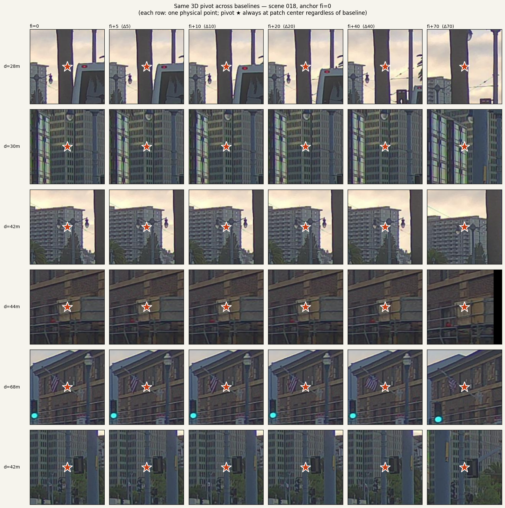
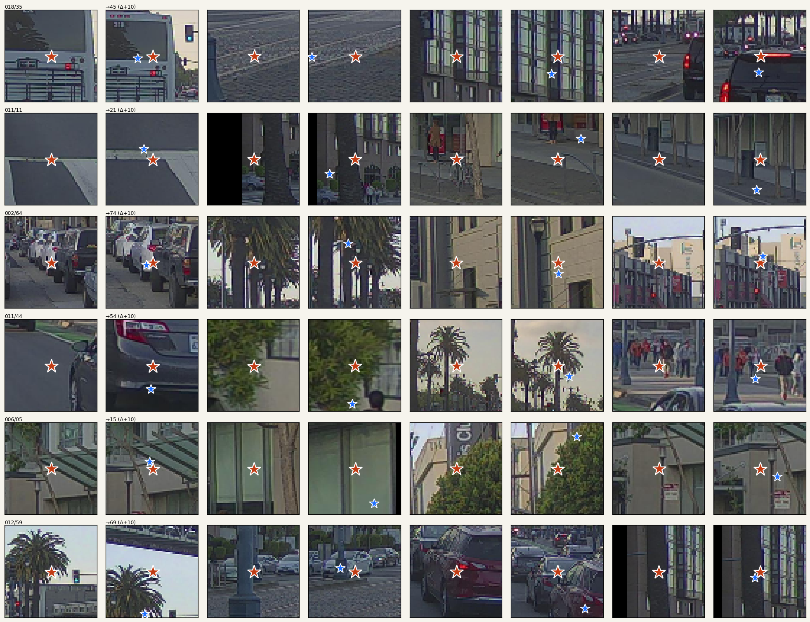
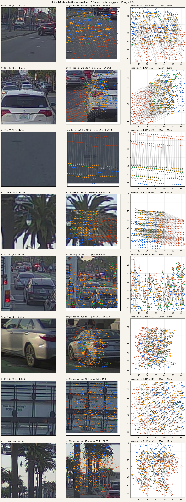
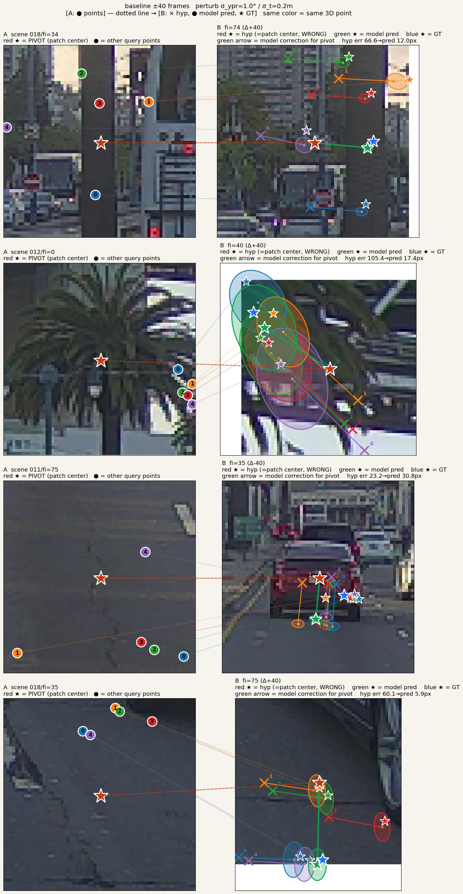

# A Single Residual Head for Calibration, VO, and Loop Closure

*LiDAR 3D &mdash; camera images &mdash; hypothesis pose &mdash; ひとつの "この 3D 点は別フレームのどこにずれるか" 関数を学ぶだけで、calibration / VO / loop closure / BA が同じ一つの呼び出しに集約される。*

> **一言で。** LiDAR は 3D 点群を吐き、カメラは同期して画像を取り、車両 pose は ego-motion で繋がる。**点 P_A が frame B でどこに映るかは、pose が正しければ幾何的に投影するだけの問題**である。実運用では pose は完璧ではないので残差が出る。この残差を予測する関数さえ学べれば、calibration / VO / long-baseline loop closure / BA のすべての幾何問題が *同じ関数呼び出し* に集約される。
>
> この記事はその関数 f を 1.59M params で学び、PandaSet 31 train / 8 val scene (scene-level 分離) で **val 2.61 px**、さらに **誰も教えていないのに動体で uncertainty σ が自動的に膨らむ** ことを確認するまでの記録。

---

## 問題設定: f は baseline を知らない

学習するのは以下の関数 f 一つだけ:

```
f : (image_B patch, 3D point P_A in frame A, hypothesis pose T_AB_hat)
        → (Δu, Δv, Σ)
    s.t.  π_B(T_AB_gt · P_A) = π_B(T_AB_hat · P_A) + (Δu, Δv)
```

入力に *baseline* という概念は現れない。A と B が 1m 離れていようが 200m 離れていようが、f には同じ型の入力が来る。これが成り立つから、次の既存タスクが **全部 f の特殊ケース** になる:

- **LiDAR↔Camera calibration**: A=B (同一フレーム)、T_AB = extrinsic ± 摂動
- **VO (連続フレーム)**: T_AB = frame t → t+1、摂動 = dead-reckoning 誤差
- **Loop closure**: A と B が 100–200m 離れている、摂動 = map-relative 誤差
- **Long-range relocalization**: 事前地図との pose 差

> **既存系列との違い (ここが本稿の立ち位置)。**
>
> 画像だけの matcher (*LoFTR*, *RoMa*, *MASt3R*) は対応付け問題が本質的に under-determined &mdash; 同じ画素でも 5m 先の車と 50m 先の建物では行き先が違う (epipolar 曖昧性)。彼らはこれを RANSAC / 幾何検証として *下流* に投げる。
>
> 我々は LiDAR の 3D 点を入力に持っているので `π_B(T_hat · P_A)` が閉じた関数で定まり、**曖昧性が最初から消えている**。ネットは "曖昧対応" ではなく "幾何で決まる点からの残差" だけを学べばよい。
>
> 一方、pose を条件に入れて更新を吐くという構造は BA-Net / DROID-SLAM / DPVO の refiner 系と共通。違いは (a) image-only ではなく LiDAR+camera、(b) per-point covariance Σ を明示的に出して *Ceres BA に渡す hybrid 設計*、(c) f が baseline を知らないので calibration / VO / loop-closure で同じネットが使える点。LCCNet / CalibNet / RGGNet は同じ LiDAR+camera 入力だが "フレーム単位 1 個の extrinsic 回帰" に留まり、per-point 残差や T≠I は扱わない。

## ペアの作り方: correctness checks

1 学習ペア = (patch_A, patch_B, uvd_A, uvd_B, T_AB_hat, Δ_target)。PandaSet 39 scene のうち train 31 scene でランダム scene → frame_A → pivot 3D 点 → baseline 1–20 frames で frame_B をサンプル。`T_AB_hat = T_AB_gt · δT` (σ_ypr=1°, σ_t=0.2m) で dead-reckoning 級の摂動を入れる。



*同一 3D 点 (高所 z>3m の LiDAR 点、traffic light / 建物コーナー候補) を +0 / +5 / +10 / +20 / +40 / +70 frames の 6 段階で track。赤★ は常に patch 中心 &mdash; 70 frame (~7秒、~70m) 進んでも pivot は物体に lock されたまま、sampler の正しさが視覚で確定。*

> **重要な correctness 設計:** 訓練時、patch_B は *hypothesis 投影* `π_B(T_hat · P_A)` を中心にクロップする &mdash; *GT 投影ではない*。もし GT を中心にすると答えが常に patch 中央に落ち、self-supervised リークで学習が壊れる。



*各 patch_B: 赤★ = hypothesis (patch 中心、モデル入力); 青★ = GT (わずかに offset、正解)。モデルは赤→青 の pixel-space Δ を予測する。*

## アーキテクチャ: ひとつの asymmetry が全部を支える

両フレームに共有 CNN + PointMLP、concat して self-attn で modality fusion、そこから cross-attn で frame A ↔ B を直接繋ぐ。シンプル。ただし一箇所だけ asymmetric にする:

```
Q  = LiDAR token (3D position → π で target 一意)
KV = concat(LiDAR, image)     # geometry + appearance どちらで引いてもよい
pose_emb = PoseMLP(T_AB_hat)  # A 側の LiDAR token にだけ足す
```

**Q が LiDAR である必然性** &mdash; (Δu, Δv) の target が well-defined であるには、クエリ側が 3D 位置を持たねばならない。画像 token を Q にすると (u, v) だけになり depth 曖昧性が再発して同じ (u,v) で 5m 先の車と 50m 先の建物の区別が付かない (← ここが前述の image matcher の泣き所)。LiDAR Q はこの曖昧性をクエリ側で閉じる。

**pose_emb を片側だけに足す** &mdash; 両側に同じ embedding を足すと相対位置が変わらない。逆方向 (B→A) は `PoseMLP(inv(T_hat))` で B の LiDAR token に足し、loss は両方向で対称 &mdash; dual projection loss。片側 overfit を防ぎ、pose_emb に semantic 対称性を強制する。

出力は 2D gaussian (Δu, Δv, logσu, logσv, ρ) の 5 次元。後述の v12 で深度も含めた 7 次元 (Δd, logσd 追加) に拡張するが、UV 精度は落ちない。

## 結果: val 2.61 px, deformable attention が決定打

PandaSet 31 train scene / 8 val scene (scene-level 分離、seed=42 で deterministic shuffle)。baseline 1–20 frames、σ_ypr=1.0°、σ_t=0.2m、img_size=64, max_points=256, 60 epoch。RTX 5080 上で 1 run 約 6 分。val 側 8 scene は学習で一切見ない、真の scene-level 汎化テスト。

| Run | 構成 | params | val err (px) | vs base (15.4px) |
|---|---|---:|---:|---:|
| v04 | std attn, 1 cross-layer | 1.31M | 4.58 | −77% |
| v09 | std attn, **2 cross-layer** | 1.51M | 4.46 | −78% |
| v08 | **deform sl**, 2-layer | 1.59M | 2.87 | −86% |
| v10 | deform sl + padded crop (pivot-centered) | 1.59M | 2.65 | −82% |
| v11 | v10 repro (sampling fix) | 1.59M | 2.61 | −83% |
| **v12** | **v11 + UVD head (Δu, Δv, Δd, full Σ)** | **1.59M** | **2.61** | **−83%** |

- **Deformable attention が決定打。** std 1→2 layer は 0.12 px しか縮まない (v04 4.58 → v09 4.46)。deform 投入は 1.59 px 縮む (v09 4.46 → v08 2.87)。つまり deform は layer 追加の **13× 効く**。モデル深化より attention 機構の改善が圧倒的。
- **UVD head は "free"。** 7 次元 (Δu, Δv, Δd, logσu, logσv, logσd, ρ_uv) に拡張しても val UV err は 2.61 px で v11 と完全同点。深度予測が *UV を犠牲にせずに付いてくる* ので、下流の Σ-weighted BA で 3D 拘束として使える (camera-ray だけでなく depth 方向にも効く)。

## 面白い副産物: 動体で σ が自発的に膨らむ

学習した model を bl = ±5 / ±10 / ±20 / ±40 frames の val pair に当て、各 query 点の予測 (Δu, Δv, Σ) を "予測• + 2σ 共分散楕円" として描画:



*baseline ±5 frames (~0.5s, ~5m)。緑• = model 予測、塗りつぶし楕円 = 2σ、青★ = GT 投影。静止構造 (建物・縁石・信号機) では σ が小さく楕円は ≲ 1 px。**動いている車**では σ が顕著に大きくなり、楕円がパッチの数割を覆う &mdash; しかもその楕円は GT ★ を (概ね) 含んでいる。*

> **これは誰も教えていない。**
>
> 動体 / 静止体のラベルは一切与えていない。A ↔ B 間で投影が一致するかしないか、だけが NLL の勾配として届く。NLL で訓練する限り *"はっきり当てる" より "当たらないなら σ を大きく出す"* のが最適解、モデルはそれを自分で見つけた。
>
> 下流で期待される効き方:
> - **σ-weighted BA で動体点が自動的に down-weight される** (Mahalanobis 距離 Δ/σ が分母で効く)。動体検出や semantic segmentation をハードに外出しせずに、統計的な outlier rejection が無料で手に入る。
> - σ の閾値で動体マスクを切り出せば、副産物として *教師なしの dynamic-object detector* にもなる。
> - 長距離 pair では σ が全体的に大きくなる (下の bl40 参照) &mdash; BA solver はこの pair の信頼度は低いと判断できる。
>
> これはちょうど SuperGlue の matchability や RoMa の confidence head のような "outlier filter を別途学習" ではなく、NLL だけで自然に獲得した形。



*baseline ±40 frames (~4s, ~40m, 訓練分布の上限超え)。model 予測自体は持ちこたえている (緑• ≈ 青★) が、σ 楕円は全体的に肥大化し、モデルが "この pair の信頼度は低い" と正しく signaling している。*

## LLN + BA: translation がまだ負、next bottleneck

v12_uvd で LLN+BA 評価を回すと、rotation は baseline 1–20 で +10–21% 改善、しかし **translation は全 baseline で悪化** (bl=40 で 32.9cm → 275cm)。これは UVD 固有ではなく v10/v11 から持ち越しの BA 側問題。

| baseline | rot hat | rot BA | rot Δ | t hat | t BA | t Δ |
|---:|---:|---:|---:|---:|---:|---:|
| 1 | 1.45° | 1.15° | +21% | 32.8cm | 36.5cm | −11% |
| 5 | 1.59° | 1.38° | +13% | 32.3cm | 51.7cm | −60% |
| 20 | 1.60° | 1.45° | +10% | 33.0cm | 101.7cm | −208% |
| 40 | 1.55° | 2.36° | −52% | 32.9cm | 275.6cm | −738% |

per-point 予測は baseline が伸びても retained (緑• ≈ 青★) するが、pose-level 集約で outlier が暴れる。次の一手は **v12 の Δd を BA の 3D 拘束として使う** &mdash; 現 BA は camera-ray 方向の UV 2D 残差しか見ていないので、depth σ を Mahalanobis 形で入れれば translation も制約できるはず。

## f が baseline を知らない ⇒ bootstrap ループが回る

核心的観察: f は入力に baseline を取らない。したがって *f は baseline を知らない*。短距離 (1–5m) の信頼できる GT pose で f を訓練し、推論時に長距離 (100–200m) で f を呼び、BA で多点集約すれば、大数の法則により pose 推定は真値に収束する &mdash; *f が out-of-distribution で unbiased である限り*。

```
stage 0:  短距離 (1–5m) で訓練           ← public GT は信頼できる
stage 1:  中距離 (20–60m) に f を適用、LLN+BA で pose 推定
stage 2:  高信頼トラック (σ 小) の予測だけ → 中距離の pseudo-GT
stage 3:  短 + 中で再訓練
stage 4:  長距離 (100–200m) に同じループ
stage 5:  全域で再訓練 → 完成
```

Noisy Student / DROID-SLAM 系の progressive self-training と構造は類似。違いは per-point Σ 付き残差を出すネットで bootstrap する点 &mdash; Σ が stage 2 の "高信頼トラック抽出" に直接使える。

## Related Work: どこに位置するのか

| 系列 | 代表 (年) | 入力 | 出力 | σ | pose cond |
|---|---|---|---|:---:|:---:|
| Image matcher | LoFTR (21), RoMa (24) | img × 2 | 2D–2D 対応 | — | ✗ |
| 3D pointmap | DUSt3R / MASt3R (24) | img × N | per-pixel 3D + match | — | ✗ |
| Learned BA | BA-Net (19), DROID-SLAM (21), DPVO (22) | img | pose + depth 更新 | ± | ✓ (recurrent) |
| LiDAR-cam calib | CalibNet (18), LCCNet (21), RGGNet | LiDAR + img | 6-DoF 外参 Δ | ✗ | ✓ (Δ from init) |
| **本手法** | — | LiDAR 3D + img×2 + T_hat | per-point (Δu, Δv, Δd, Σ) | **✓** | **✓** |

最も近い 3 本:

- **DROID-SLAM (Teed & Deng, 2021)** &mdash; recurrent iterative refinement of pose + depth。"pose を入力して Δ を吐く" 構造は共通。違いは入力 (image-only vs LiDAR+image)、covariance 明示、ネットが BA を hold せず traditional Ceres に渡す点。DROID の学習分布は video-rate 前提が強く、長距離 loop closure は別口で扱う。
- **LCCNet (Lv et al., 2021)** &mdash; LiDAR↔camera decalibration 6-DoF を cost volume で回帰。同じセンサ構成だが、"フレーム単位 1 個の姿勢" を出すだけで per-point 残差や baseline≠0 は扱わない。本手法は LCCNet を per-point × arbitrary baseline に一般化した形と見なせる。
- **BA-Net (Tang & Tan, 2019)** &mdash; feature-metric BA、"geometry prior を network に埋める" 思想の始祖。我々は depth basis を LiDAR に置き換えて学習対象を Δ + Σ に絞り、BA 本体は Ceres に残した hybrid。ネットは 1.59M params で軽く、rig/dataset 非依存。

## まとめと次の一手

- **今ここ:** PandaSet 8 val scene で val 2.61 px、deform attention + UVD head、σ は動体で自然に膨らむ。
- **Next bottleneck:** BA の translation 改善が負。v12 の Δd を BA の 3D 拘束 (Mahalanobis w/ diag depth σ) として入れて t が救えるかを検証。
- **スケールアップ:** NuScenes / Waymo を追加 (Waymo は per-segment 0.2° の pose GT 誤差があるので補助扱い)。PandaSet 39 → 数百 scene。
- **σ を動体フィルタとして使う ablation:** σ > θ をハード reject vs 1/σ² でソフト重み、どちらが BA に効くか。
- **scale_emb:** long baseline 向けに log(d_B/d_A) を positional encoding に注入。v12 の Δd を input にフィードバックする循環形も。

---

*詳細レポート・全 ablation 曲線・interactive plot・σ 楕円 vis 全 baseline 版は [`docs/cross_frame_report.html`](cross_frame_report.html) と社内の e2e_calib docs hub `http://172.18.2.49:5080/hub.html#cross_frame_report.html` を参照。コード: `models/cross_frame.py`, `datasets/pandaset_pair.py`, `train_cross_frame.py`。*
