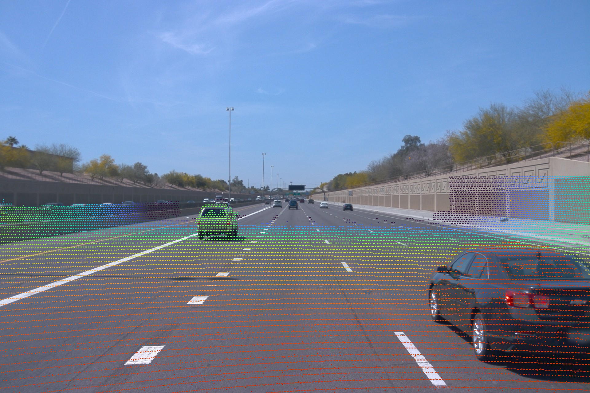
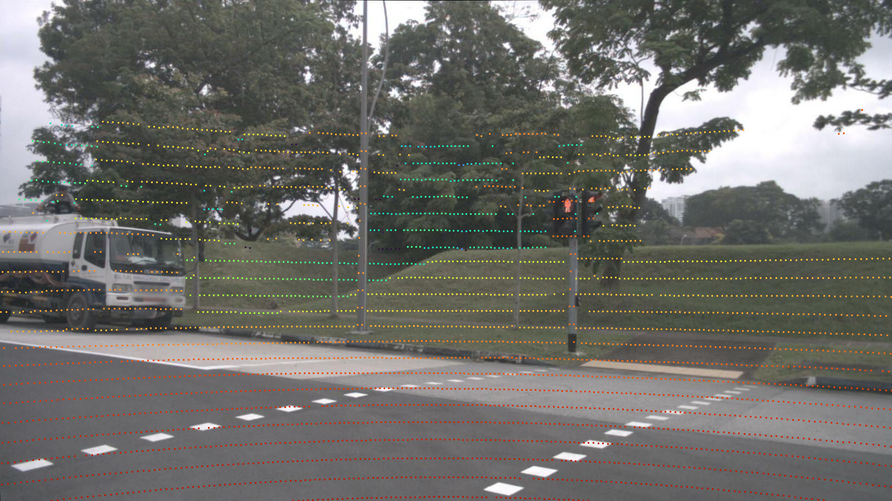
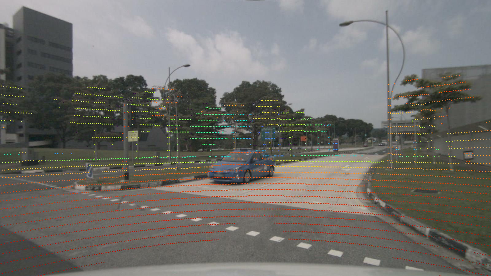
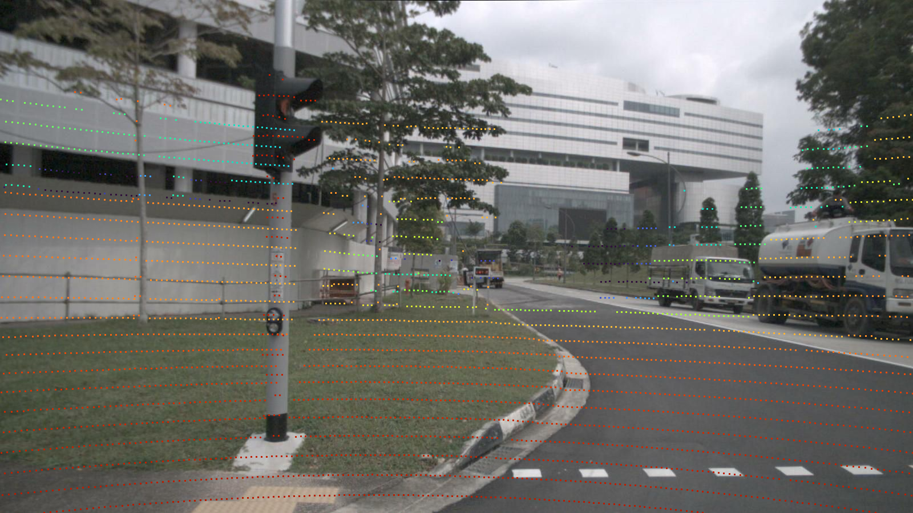
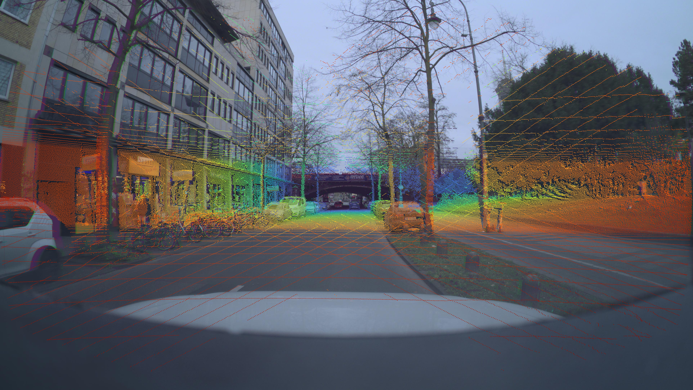
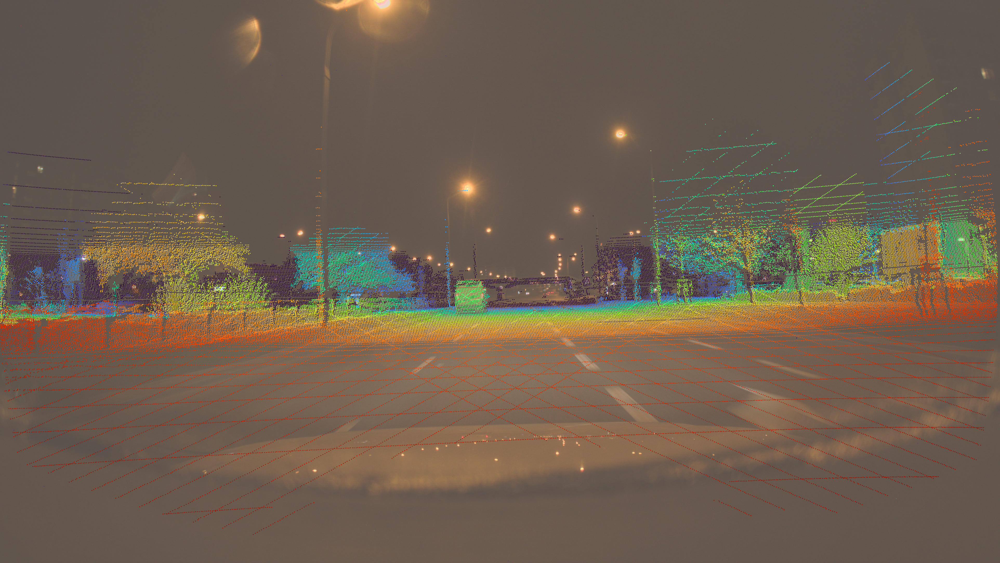
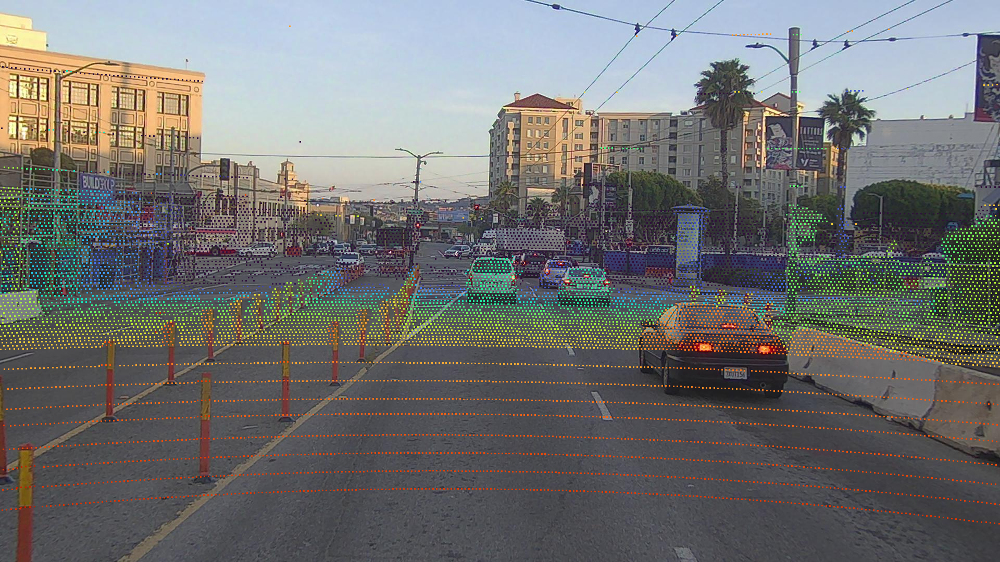
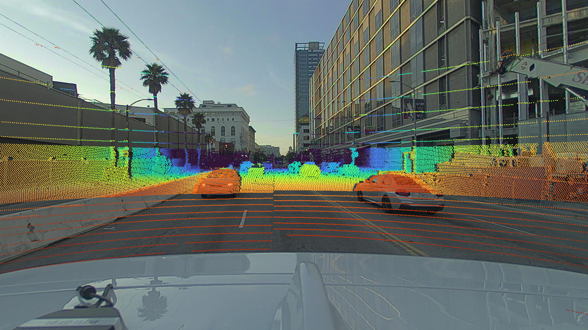
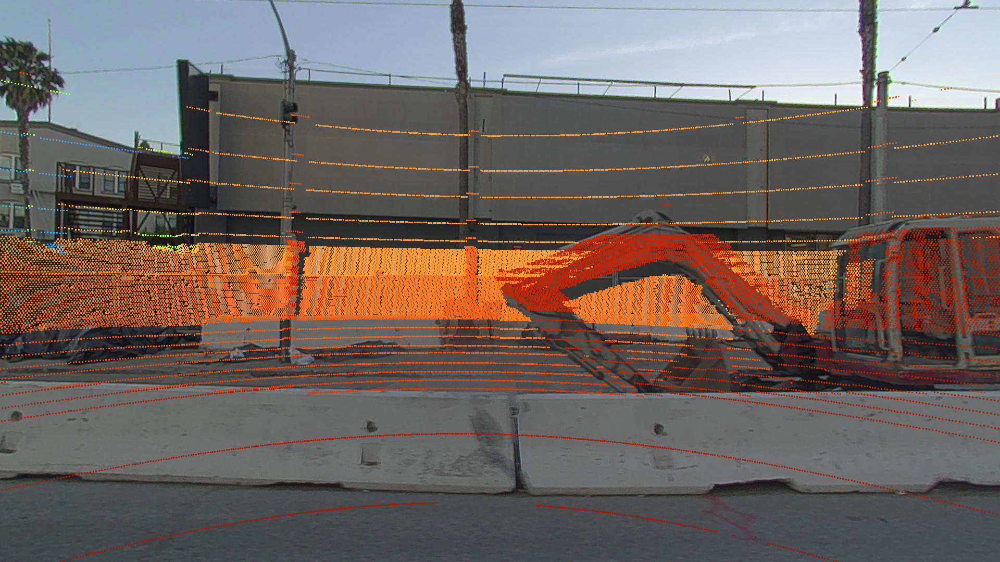

# 公開データセット 4 種の lidar-camera キャリブレーション品質レポート

calib 残差ネット学習用データとして使う 4 つの公開データセットについて、**lidar→camera 投影品質** を実画像で検証した結果のメモ。

## サマリー

| Dataset | カメラ | LiDAR | 解像度 / FOV | calib 品質 | 主な癖 |
|---|---|---|---|---|---|
| **Waymo** v2 | 5 cam | 64 beam custom | 1.9 MP / ~50° | **★★★★★ ほぼ完璧** | LCP per-shot 補正 + image-lidar BA、ただし FOV 狭くて近めの絵 |
| **nuScenes** | 6 cam | HDL-32E | 1.4 MP / ~70° | **★★★★★ 完璧** | 全 cam 安定、低密度 lidar |
| **ZOD** Frames | 1 cam (front) | **VLS-128** | **8.3 MP / 121°** | ★★★★ 中央良好 / **エッジ・高速で時々ズレ** | 8% 端切ればクリーン、>50 km/h で残差増 |
| **PandaSet** | 6 cam | Pandar64 | 2.0 MP / ~60° | front ★★★★ / **side ★★ 多い** | front 以外は 30-75 ms time-offset、cross-frame 学習で顕在化 |

**会社データ (8.3 MP + VLS-128) との適合性順:**
1. **Waymo** — calib 信号品質は決定的、pretrain ベース  
2. **nuScenes** — 多 cam mix のクッション  
3. **ZOD** — sensor 解像度 1:1 マッチ、low-speed フィルタ必須  
4. **PandaSet** — front のみ採用、side 切る

---

## Waymo

5 cam (front / front-left / front-right / side-left / side-right) × 64-beam custom lidar。**lidar_camera_projection (LCP) parquet** で per-pixel level の precomputed UV が配布されてる。これは Waymo 内部の bundle adjustment で:
- per-shot lidar timestamp に対する ego-pose interpolation
- lidar 機械的回転に伴う rolling shutter 補正
- camera image-lidar tie-point 残差最小化
を全部焼いた結果なので、**ユーザ側で再計算しても同等品質に届かない**。

**高速 (102 km/h, 高速道路)：**



道路標識 / 街灯の支柱 / 路面ラインがピクセル一致。Waymo の calib 信号は **学習時の真の GT** として使える。FOV ~50° で被写体が近めに見えるのが弱点。

**結論:** calib 残差ネットの **pretrain ベース** にこれより適切なデータは無い。

---

## nuScenes

6 cam × HDL-32E lidar。lidar 32 beam で密度低めだが、calib は全 cam で素直に合う。

**front cam:**


**back cam:**


**front-left:**


全 cam で時間同期 + extrinsic がよく取れてる、Waymo に次ぐ完成度。pts 密度が低い (1 frame あたり 30k 程度) ので遠距離は薄いが、**多 cam で大量データ取れるドメイン拡張用** に最適。

**結論:** Waymo の補完。多 cam ロバストネス学習用。

---

## ZOD (Zenseact Open Dataset)

**唯一 VLS-128 (会社と同じ lidar) を搭載した公開データセット。** 1 cam (front 8.3 MP / FOV 121°) のみだが解像度・視野角・lidar 射程 (250 m) が会社の sensor 構成と完全一致。

**重要な実装上の罠:**
ZOD SDK は `frame.compensate_lidar()` / `motion_compensate_scanwise()` というヘルパを公開してるが、**これらは `core_timestamp` 1 点のみで block 補正**で、per-shot 補正はやってない。115 ms かけてスキャンする VLS-128 では block 補正だと 50 km/h で ~5 px の残差が乗る。**真に per-shot 補正するには `motion_compensate_pointwise()` を直接呼ぶ必要がある:**

```python
from zod.utils.compensation import motion_compensate_pointwise
cam_ts = frame.info.camera_frames['front_dnat'][0].time.timestamp()
pc = motion_compensate_pointwise(
    frame.get_lidar()[0],
    frame.ego_motion,
    frame.calibration.lidars[Lidar.VELODYNE],
    target_timestamp=cam_ts,
)
```

**pointwise 補正後の都市部 (~30 km/h):**


街灯、看板、フェンスがクリーンに乗る。VLS-128 の 250 m 射程で **遠距離まで点が立つ** のが ZOD の強み (Waymo の lidar は ~75 m が実用域)。

**幹線道路 (~60 km/h, 夜間, 雨):**


中央域は問題ないが、**画像左右端に 2-3 px のズレ** が出る。原因は KB 4 係数モデル自体の限界というより、**publish された intrinsic 値の精度不足** (calib ターゲットが画像中心に集中してたため周辺の係数が tight じゃない) と推定。

**実用上の制約:**
- **エッジ 8% は学習対象から外す** (`edge_margin_frac=0.08`)
- **>50 km/h は train から除外** が安全 (oxts.velocities でフィルタ)

**結論:** 会社 sensor へのドメインマッチ用。低速・中央域に絞れば Waymo に近い品質、フィルタ前提で大規模学習に投入可能。

---

## PandaSet

6 cam × Pandar64 lidar。**front_camera は綺麗だが、他 5 cam に 30-75 ms の cam-lidar 時刻オフセット** が乗ってる (前 V3 cache 構築時の検証で確定)。

**front_camera (基準):**


ほぼ Waymo 並みのクリーンさ、地面・建物・道路標識合致。

**back_camera (時刻オフセット顕在):**


地面のラインが lidar 点群と数 px 離れてる。これは calib (extrinsic) の誤りではなく、**capture box の cam-lidar 同期 pipeline 遅延** が原因。

**right_camera:**


同様に高さ方向にズレ。

**結論:** front 限定で使う。side cam を mix に入れると calib 学習信号が time-offset の bias で汚染されるので除外。会社 zero-shot 評価でも front で評価が安定する。

---

## 学習戦略への含意

```
[Waymo 800k LCP-clean]
       ↓ pretrain (calib sense 獲得)
[ZOD 100k @ <50 km/h, edge 8% drop]
       ↓ fine-tune (sensor 解像度マッチ、遠距離残差込み)
[nuScenes 240k 全 cam mix]
       ↓ blend (多 cam robustness)
[PandaSet front_camera 100k]
       ↓ blend (もう 1 ドメイン)
[会社の "良い" frames]
       ↓ final fine-tune
                 ↓
       本番 zero-shot 評価 (TSS4, 他)
```

最終的に会社データで仕上げるが、**calib 残差ネットの基本性能は Waymo + ZOD で 90% 確保** できる見立て。

---

## 検証スクリプト

このレポートの全画像は以下から再現可能:

```bash
# Waymo 高速 seg 探索 + 投影
python scripts/visualization/render_waymo_highspeed.py    # TODO: 一旦 inline

# ZOD pointwise 補正投影 (12 mini frame)
python -c "
from zod import ZodFrames
from zod.constants import Camera, Lidar, Anonymization
from zod.utils.compensation import motion_compensate_pointwise
from zod.utils.geometry import project_3d_to_2d_kannala, transform_points, get_points_in_camera_fov
# ... (datasets/zod_full.py の __getitem__ 参照)
"

# nuScenes / PandaSet は build_*_v3.py の cache 経由 で render_calib_doc_samples.py
```

Dataset access:
- Waymo Open Dataset v2: gs://waymo_open_dataset_v_2_0_0
- ZOD: zod.zenseact.com (Dropbox 経由 462 GB / scripts/preprocessing/zod_dropbox_dl.py)
- nuScenes: nuscenes.org (要登録, ~300 GB)
- PandaSet: HuggingFace (georghess/pandaset, ~44 GB)
