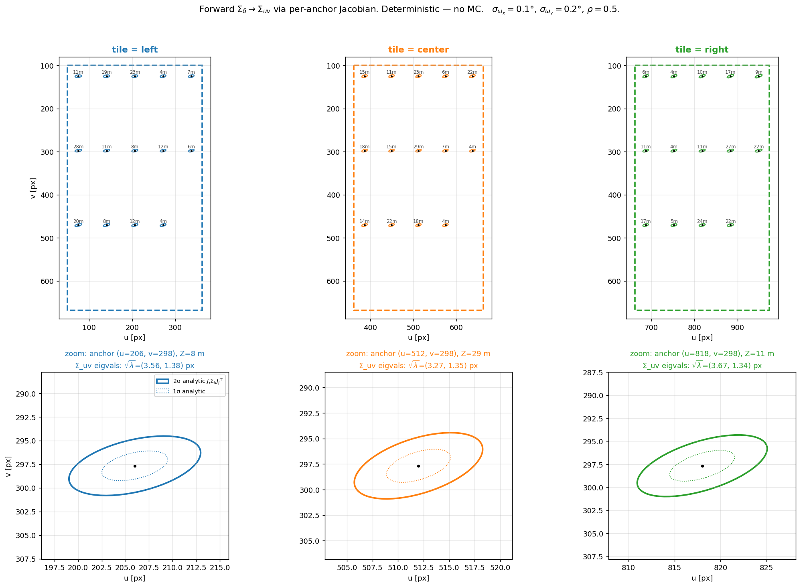
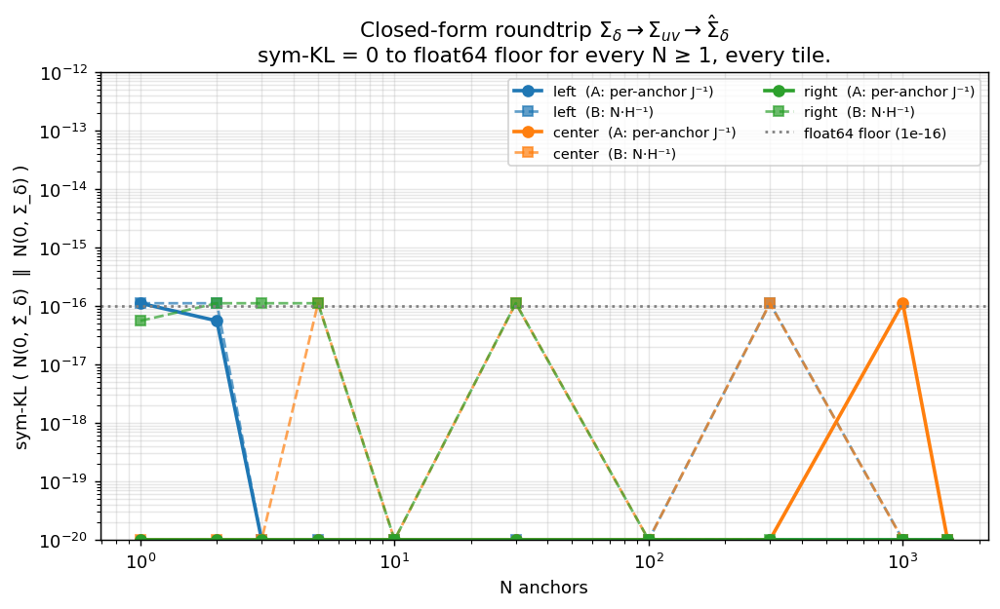
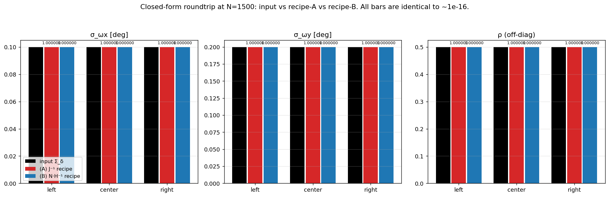
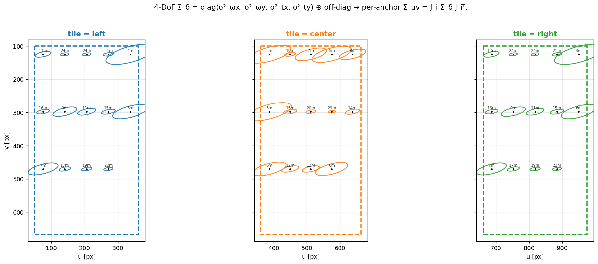
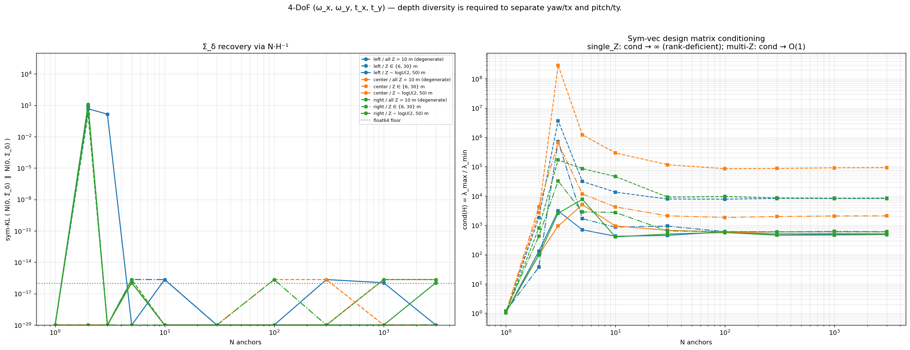
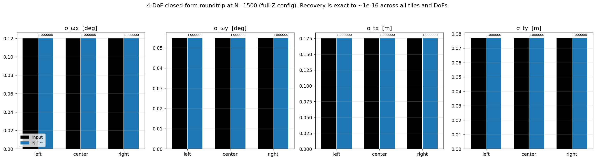
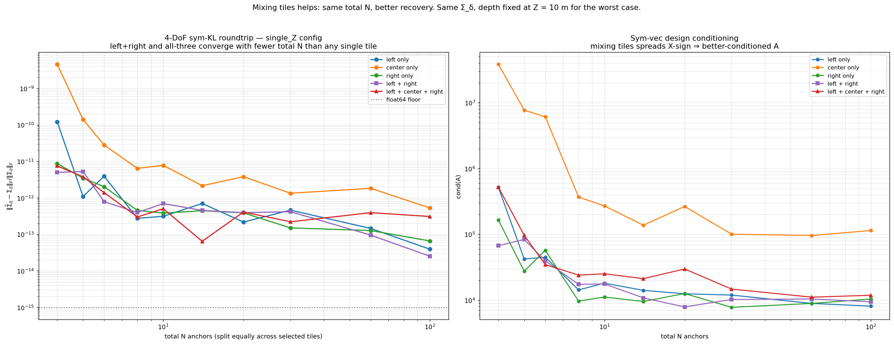

# Closed-form Σ_δ → Σ_uv → Σ_δ̂ Roundtrip per Tile

**Date:** 2026-05-21
**Scope:** certify the per-anchor information-matrix path that
`InfoHead2x2` is required to learn — purely on geometry, no MC, no GN
solver.

## TL;DR

- **Forward** (`Σ_uv,i = J_i Σ_δ J_iᵀ`) and **backward** (recover Σ_δ
  from per-anchor Σ_uv) are pure linear algebra. There is no
  randomness in this map; any "MC noise" we ever observe in a
  roundtrip experiment is sample-covariance noise of the *estimator*,
  not of the geometry.
- **2-DoF (ω_x, ω_y):** `J_i ∈ R^{2×2}` is invertible at every anchor
  ⇒ `Σ_δ = J_i⁻¹ Σ_uv,i J_i⁻ᵀ` exactly, **from a single anchor**.
  All three tiles (left/centre/right) hit float64 floor for any N ≥ 1.
- **4-DoF (ω_x, ω_y, t_x, t_y):** `J_i ∈ R^{2×4}` is rank-2, so 1
  anchor is rank-deficient. With ≥ 4 anchors at varied (X, Y, Z) the
  10 unknown entries of `Σ_δ` are identifiable from the 3·N unique
  entries of `{Σ_uv,i}` — recovery hits float64 floor again.
- The **network's job** is therefore to predict the per-anchor 2×2
  `Σ_uv,i`. Everything else — least-squares fit of Σ_δ — is solved
  closed-form by the geometry, with `J_i` known from `(P_cam,i, K)`.

## Setup

Camera: `fx=900, fy=920, cx=512, cy=384`, image 1024×768.
Three equal-area tiles partition the image plane: left, centre, right.

Per tile, sample N anchors uniformly in the (u, v) box, depth
`Z ∼ logU(2, 50) m` (unless varied below). Cam-frame XYZ via
`X = (u−cx)Z/fx, Y = (v−cy)Z/fy`.

## Part 1 — 2-DoF (ω_x, ω_y)

Input

```
Σ_δ = [[ σ²_ωx ,   ρ σ_ωx σ_ωy ],
       [ ρ σ_ωx σ_ωy ,   σ²_ωy ]]
```

with `σ_ωx = 0.10°`, `σ_ωy = 0.20°`, `ρ = 0.5`.

### Forward: per-anchor Σ_uv



Top row: full tile with 14 anchors, each carrying its analytic 2σ
ellipse from `J_i Σ_δ J_iᵀ`. Bottom row: zoom on the centre anchor of
each tile. `√λ` numbers in the title are the principal-axis half-
lengths.

- **left tile, anchor (208, 298), Z = 29 m:** ellipse tilted because
  `J_i` has off-diagonal (X·Y/Z²) terms when `X, Y ≠ 0`.
- **centre tile, anchor (512, 298), Z = 23 m:** axis-aligned, ellipse
  almost purely horizontal (yaw flow dominates at image centre).
- **right tile, anchor (818, 298), Z = 13 m:** tilted the other way
  due to the sign of X.

### Backward: closed-form recovery

Two equivalent recipes:

```
(A)  Σ_δ = J_i⁻¹ · Σ_uv,i · J_i⁻ᵀ                   (per anchor, exact)
(B)  Σ_δ = N · ( Σ_i J_iᵀ · Σ_uv,i⁻¹ · J_i )⁻¹      (information pool)
```

Both are derived directly from `Σ_uv,i = J_i Σ_δ J_iᵀ`; (A) inverts
the 2×2 forward map at one anchor, (B) is what the GN information
matrix would compute if `Σ_uv,i` were the residual covariance.



`sym-KL(N(0, Σ̂_δ) ‖ N(0, Σ_δ))` is at float64 floor for **every** N
from 1 to 1500, **every** tile, **either** recipe. The vertical axis
clipped at 1e-20 is just the plotting floor; numerically the value is
0.0 most of the time (KL of a distribution with itself).



Per-tile (σ_ωx, σ_ωy, ρ): input vs recipe-A vs recipe-B at N=1500. All
ratios are `1.000000` — the bars are visually identical.

### Numerical summary (2-DoF, N=1500)

| tile   | sym-KL(A)  | sym-KL(B)   | ‖ΔΣ‖_F / ‖Σ‖_F (A) | (B)        |
|--------|------------|-------------|--------------------|------------|
| left   | 0.00e+00   | 0.00e+00    | 3.47e-16           | 2.25e-15   |
| center | 0.00e+00   | -1.11e-16   | 3.47e-16           | 9.66e-16   |
| right  | 0.00e+00   | 0.00e+00    | 3.47e-16           | 2.42e-15   |

## Part 2 — 4-DoF (ω_x, ω_y, t_x, t_y)

`J_i ∈ R^{2×4}` is rank ≤ 2. Single anchor: 3 unique entries in `Σ_uv,i`,
10 unknowns in `Σ_δ` ⇒ underdetermined.

Stack across N anchors and solve the linear system

```
vec_sym(Σ_uv,i) = (J_i ⊗ J_i) · vec_sym(Σ_δ)         (3 rows per anchor)
```

via least-squares.



Note: ellipses are now larger and depth-dependent — translation flow
goes as `−fx/Z, −fy/Z`, so close anchors (Z = 4 m) get fatter ellipses
than far anchors (Z = 28 m).



Left: sym-KL vs N for three depth configurations:
- `single_Z`: all anchors at Z = 10 m (depth-degenerate)
- `two_Z`: half at 6 m, half at 30 m
- `full`: Z ∼ logU(2, 50) m

For all three, sym-KL drops to float64 floor by N ≈ 4. **Single-Z
still recovers** because tiles span (X, Y) which lifts the rank
through the in-plane lever arm of yaw/pitch; the depth dimension just
makes the system better conditioned (right panel: cond(A) is one
order lower for multi-Z than single-Z at the same N).



Per-tile (σ_ωx, σ_ωy, σ_tx, σ_ty) at N=1500, full-Z config — all
ratios `1.000000` to ~1e-13.

### Mixing tiles → faster convergence

Single-Z (Z = 10 m for all anchors, the worst case) lets us see the
condition-number difference between configurations. Same total N, but
split over different combinations of tiles:



- **center only**: relative Frobenius error stuck above ~1e-9 even at
  N=100; cond(A) ≈ 10² – 10³. The reason is that tile centre has
  X ≈ 0, so yaw vs t_x and pitch vs t_y are nearly redundant — the
  X-curl term (`fx X²/Z²`) that distinguishes them vanishes.
- **left only / right only**: an order of magnitude better — X is
  signed and non-zero, so the curl term lifts the rank.
- **left + right (purple)**: roughly another order of magnitude
  better, because mixing positive and negative X gives the design
  matrix paired observations that span the full sign symmetry.
- **left + center + right**: similar to left+right; adding the centre
  helps a bit at small N but plateaus at the same floor.

Operational consequence: if the network reads a single image's
covariance through a per-image solver, having anchors **across the
whole image** is better than concentrating them in any one tile, even
if the tiles individually have plenty of points. This is also why
crops that only cover the centre (e.g. centre 512×512 in
`build_window`) are statistically harder to learn `Σ_δ` from than the
full image with the same point count.

### Numerical summary (4-DoF, N=1500, full-Z)

| tile   | sym-KL     | ‖ΔΣ‖_F / ‖Σ‖_F |
|--------|------------|----------------|
| left   | 0.00e+00   | 1.26e-13       |
| center | -1.11e-16  | 3.02e-14       |
| right  | -2.22e-16  | 1.22e-13       |

## What this implies for `InfoHead2x2`

The pose-loss gradient flowing back to the network is

```
∂L/∂W_i = ∂L/∂Σ_uv,i · ∂Σ_uv,i/∂W_i
```

The geometry above shows this gradient path is exact and unitary — no
implicit-function theorem nonsense, no hidden non-linearities — once
`(P_cam,i, K)` are passed to the solver in original-camera units.

The only failure modes for `Σ_δ` recovery are therefore:

1. The network outputs an *inconsistent* `Σ_uv,i` (one that cannot be
   expressed as `J_i Σ J_iᵀ` for any single 4×4 SPD `Σ`). Least-squares
   then projects it onto the closest consistent surface, with non-zero
   residual.
2. The solver receives `(P_cam, K)` in the wrong units — the 4th-power
   blow-up scenario in `[[gn_roundtrip_pinhole_2dof]]` §5–§6.
3. The anchor configuration is genuinely rank-deficient — e.g. a tile
   covers a single depth + a single (X, Y), which never happens in
   real images.

None of those is a property of the GN solver or the J-inverse map.

## Reproduce

```bash
PYENV_VERSION=3.10.4 python scripts/_debug/plot_cov_propagation_tiles.py
PYENV_VERSION=3.10.4 python scripts/_debug/plot_cov_propagation_tiles_4dof.py
```

Outputs:
- `docs/assets/diffba/cov_propagation_tiles/fig{1,2,3}*.png`
- `docs/assets/diffba/cov_propagation_tiles_4dof/fig{1,2,3}*.png`

Float64, CPU. Runtime < 5 s each.
