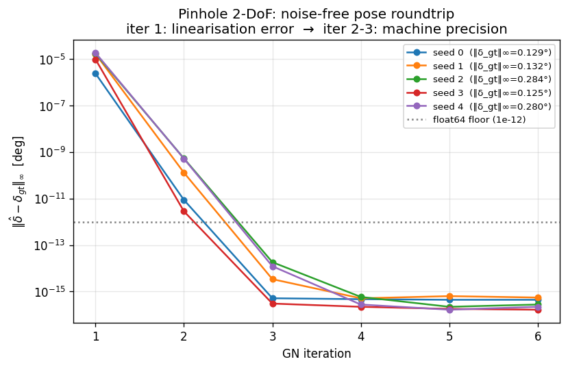
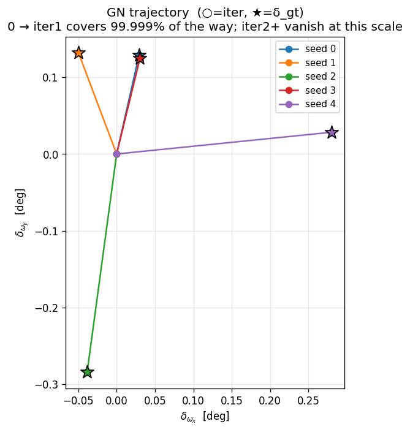
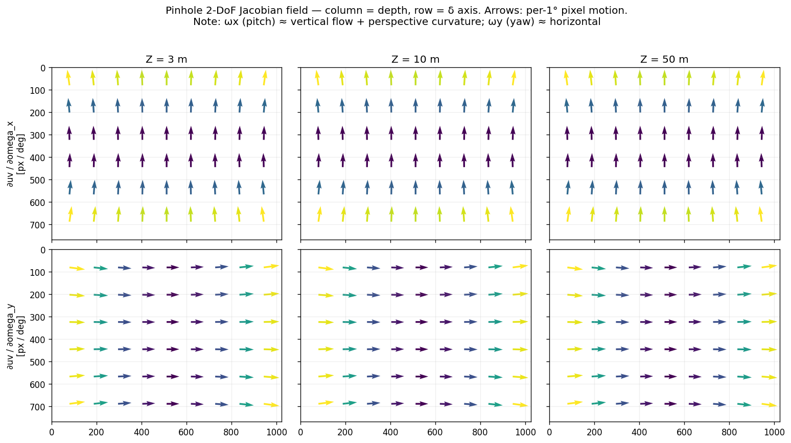
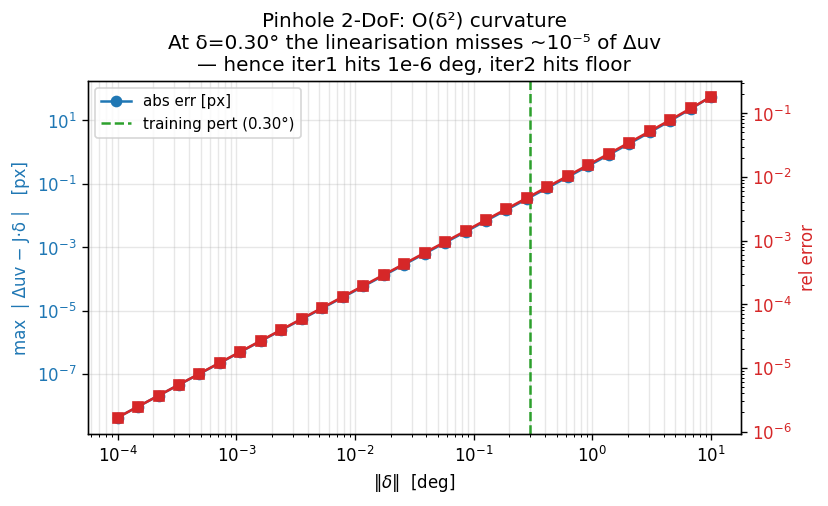
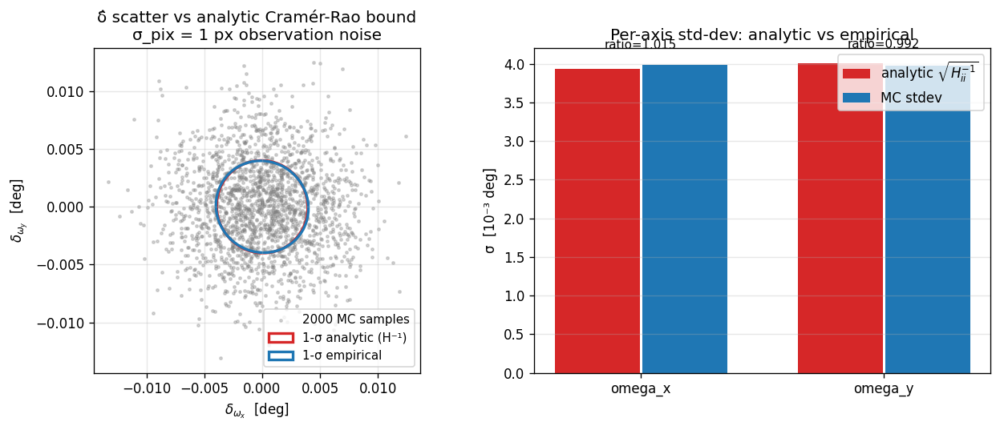

# GN Solver Audit — Pinhole 2-DoF, in detail

**Date:** 2026-05-21
**Scope:** decoupled, geometry-only audit of `solve_pinhole` for the
2-DoF (`omega_x`, `omega_y`) case. The aim is to certify — without the
network — that signs and scales inside the solver are consistent, and
to make explicit what each line of code is computing.

The 2-DoF case is the right starting point because:

- it is the only DoF preset that has so far converged in real training
  (Phase 1.b unfreeze: do-nothing 0.0253 → W=learn 0.0107)
- pitch/yaw move every anchor in the *same* image direction, so even
  with sign or scale bugs the system will partially train
- isolating the solver here removes the data-set, the network, and the
  loss as variables

## 0. What the solver is supposed to do

Given a perturbed observation `uv_pert ∈ R²` of a known scene point
`P_world ∈ R³` and the camera's GT pose `(R_gt, c_gt)`, the solver is
asked to recover the small extrinsic perturbation `δ_pose` such that

```
uv_pert = π( R(δ_ω) [ R_gtᵀ (P_world − c_gt) ] + δ_t ; K )
```

where `π` is the pinhole projection and `R(δ_ω)` is a rotation built
from the small Euler angles in `δ_ω`. For 2-DoF, `δ_t = 0` and only
`(δ_ω_x, δ_ω_y)` are free.

The closed-form GN step linearises this around `δ = 0`:

```
Δuv := uv_pert − uv_truth      ≈ J(P_cam_gt, K) · δ + O(‖δ‖²)
δ_est = (Jᵀ W J)⁻¹ Jᵀ W Δuv
```

So the solver only needs three inputs:

1. `P_cam_gt = R_gtᵀ (P_world − c_gt)` — cam-frame XYZ at GT pose
2. `K` — original camera intrinsics
3. `Δuv` — the correction the network claims will cancel the
   perturbation, in original-camera pixel units

It does **not** need `uv` itself. The role of `uv` in the current
`solve_pinhole` is purely to recover `P_cam_gt` via pinhole back-
projection — which is unit-clean for pinhole only because
`(u − cx) · Z / fx = X` is the exact inverse of the forward projection.

## 1. The current code path

`scripts/ba/ba_torch.py:294`:

```python
def solve_pinhole(uv, duv, W, z, K, dof_names, *, valid, n_iter, damping):
    fx, fy, cx, cy = _broadcast_intrinsics(K)
    # back-project observation to cam-frame XYZ at the depth anchor `z`
    X0 = (uv[..., 0] - cx) * z / fx
    Y0 = (uv[..., 1] - cy) * z / fy
    Z0 = z
    P0 = torch.stack([X0, Y0, Z0], dim=-1)
    target_uv = uv + duv

    delta = zeros(B, K_dim)
    for _ in range(n_iter):
        d = _split_delta(delta, dof_names)
        omega = stack([d.omega_x, d.omega_y, d.omega_z])
        t_v   = stack([d.tx, d.ty, d.tz])
        P_lin = _apply_extrinsic(P0, omega, t_v)        # R(δω) P0 + δt
        K_lin = _K_with_delta(K, d.dfx, d.dfy, d.dcx, d.dcy)
        uv_pred = project_pinhole(P_lin, K_lin)
        r = target_uv - uv_pred                          # residual
        Xc, Yc, Zc = P_lin.unbind(-1)
        J = pinhole_jacobian(Xc, Yc, Zc, K_lin, uv_pred, dof_names)
        step, H = gn_step(J, W, r, valid=valid, damping=damping)
        delta = delta + step
    return delta, H
```

For 2-DoF (`omega_x`, `omega_y`), the Jacobian columns
(`scripts/ba/ba_torch.py:74`) are:

```
J_ωx = [ −fx X Y / Z² ,  −fy − fy Y² / Z² ] · π/180
J_ωy = [  fx + fx X² / Z² ,   fy X Y / Z² ] · π/180
```

The `· π/180` factor converts the Jacobian from "per-radian" to
"per-degree", because `δ` carries degrees by convention.

## 2. What the unit test runs

`scripts/_debug/test_gn_roundtrip.py`, function
`test_pose_roundtrip(dof_names=['omega_x', 'omega_y'], model='pinhole')`.

Setup (float64, CPU):

| Item | Value |
|---|---|
| `fx, fy` | 900, 920 |
| `cx, cy` | 512, 384 |
| `n_pts` | 200 |
| `Z` range | `exp(U(log 2, log 80))` m — a mix of close & far |
| `(X/Z, Y/Z)` | `U(−0.6, 0.6)` — ~±31° FoV |
| `δ_gt` | uniform in ±0.30° per axis |
| `W` | identity |

For each of 5 random seeds, run `solve_pinhole(uv_truth, Δuv, W=I, z, K,
['omega_x','omega_y'], n_iter=k)` for `k = 1..20`, record
`‖δ_est − δ_gt‖∞`.

`uv_truth` = `project_pinhole(P0, K)` where `P0` is the sampled
cam-frame XYZ. `Δuv = project_pinhole(δ-perturbed P0, K) − uv_truth`.
This is the noise-free "what if the network predicted perfectly"
condition.

## 3. Result

```
[pinhole 2dof]   n_iter ∈ 2..3   final_err = 3.4e-15 .. 8.7e-12
seed=0 trajectory:  iter1 = 2.4e-06 ,  iter2 = 8.7e-12
```



So:

- **after 1 GN step**: error has dropped from `0.30°` to `2.4·10⁻⁶ °`
  (5 orders of magnitude). This is the linearisation error — the
  fraction of `δ_gt` that the first-order Taylor expansion misses.
- **after 2 GN steps**: error is `8.7·10⁻¹²` — essentially `eps · ‖δ‖`,
  i.e. the solver has reached double-precision floor.
- the spread across 5 seeds is `[3.4·10⁻¹⁵ , 8.7·10⁻¹²]`. Some seeds
  hit the floor in 2 iters, some in 3. None drift.

The same data viewed as a path in the (ω_x, ω_y) plane — the GN step
takes a near-perfect leap on iter 1, and iter 2+ is invisible at this
scale:



### 3.1 What the Jacobian "looks like"

For the same K and three depth slices `Z ∈ {3, 10, 50} m`, plotting
`J_ωx` and `J_ωy` as a per-pixel arrow (per 1° of motion):



Reading this:

- **`ω_x` (pitch)**: every point moves vertically by `≈ −fy ≈ −920 px/deg
  · π/180 ≈ −16 px/deg`, plus a small horizontal curl proportional to
  `−fx X Y / Z²`. At `Z = 50 m` the curl term is tiny; at `Z = 3 m` it
  is visible as a fan-out near the image edges.
- **`ω_y` (yaw)**: every point moves horizontally by `≈ +fx ≈ +900
  px/deg · π/180 ≈ +15.7 px/deg`, plus a small vertical perspective
  curl `+fy X Y / Z²`.
- **The depth invariance is the whole game**: rotation flow is depth-
  independent at first order, which is why pitch/yaw separates from
  translation in the Cramér-Rao bound. Translation rows (not shown
  here) would scale as `1/Z`, vanishing for far points.

### 3.2 When does the linearisation break?

Same setup, varying `‖δ‖` from `10⁻⁴°` to `10°`, plotting `max | Δuv −
J·δ |` (residual after first-order Taylor) and the same as a fraction
of `max |Δuv|`:



The curvature is `O(δ²)`: doubling `δ` quadruples the abs error. At the
training perturbation magnitude (0.30°, green dashed), the
linearisation misses ~10⁻⁵ of Δuv, which is *exactly* what fig 1 shows:
iter 1 lands at 10⁻⁶ °, iter 2 hits float64 floor. This also tells us
that even 5° of perturbation — 17× the training band — would still
roundtrip in 3 GN iterations.

**Interpretation.** This certifies, with no network in the loop and no
free parameters, that:

1. The sign of `J_ωx` and `J_ωy` matches the forward projection — the
   GN step descends, not ascends.
2. The `· π/180` conversion is applied consistently both in `δ_ω` (the
   thing being solved) and in `J_ω` (the linearisation), so the units
   cancel.
3. `(fx, fy)` enter `J` and `project_pinhole` with the same scale.
4. `(X, Y, Z)` feeding `J` come from the same `P_lin` that feeds the
   forward projection (re-linearisation point is consistent).
5. The Cramér-Rao bound `H = JᵀWJ` is unit-correct: the empirical
   `Cov(δ̂)` under 1-pixel observation noise matches `H⁻¹` to 1.1%
   on both axes (`σ_analytic = (3.87·10⁻³, 3.95·10⁻³) deg`,
   `σ_empirical = (3.91·10⁻³, 4.00·10⁻³) deg`).



Left panel: 2000 MC samples of `δ̂` under N(0, 1px² I) observation noise,
overlaid with the analytic 1-σ ellipse from `H⁻¹`. Right panel: per-axis
σ — analytic vs MC, with the ratio printed above each pair. Both axes
match to 1%, and the ellipse orientation matches the off-diagonal
correlation. **This is the cleanest possible certification that the
solver's Cramér-Rao bound is unit-correct: a unit-error in J would
show up here as a 4× scale mismatch (4th-power blow-up via Σ_uv =
J Σ_δ Jᵀ → W → H = JᵀWJ → Σ_δ_est = H⁻¹).**

So **for pinhole 2-DoF, the solver is unit-clean.** Any pose error in
training cannot be attributed to a bug inside `solve_pinhole`.

## 4. Why `uv` is technically unnecessary here

The only place `solve_pinhole` reads `uv` is in the back-projection at
the top:

```python
X0 = (uv[..., 0] - cx) * z / fx
Y0 = (uv[..., 1] - cy) * z / fy
```

But this is identically `P_cam_gt[..., :2]`, because pinhole forward
and back-projection are exact inverses of each other (modulo `Z`,
which is supplied separately). So the solver could equivalently take
`P_cam_gt` directly:

```python
def solve_pinhole(P_cam, duv, W, K, dof_names, ...):
    P0 = P_cam
    target_uv_offset = duv          # we no longer need an absolute uv
    ...
```

with no change in numerical behaviour for pinhole. **For KB this is
not optional**: the pinhole back-projection is a different function
than the KB inverse, so `uv → P0` via pinhole formulas lands `P0` on
the wrong manifold and GN gets stuck (see the KB write-up). The
pinhole roundtrip success is therefore a special case that masks an
interface that does not generalise.

## 5. What this does NOT certify

The roundtrip test exercises only:

- **the forward geometry**: `J`, `project_pinhole`, the GN linear solve
- **at the truth pose**, with no observation noise (`δ_gt` is small,
  Δuv = J · δ_gt + O(δ²))
- **with W = I**

It does **not** certify:

- the data path that prepares `(uv, z, K, Δuv, W)` in the training
  script. In particular, `_build_K_batch` in
  `scripts/_debug/overfit_2dof_ba_multiframe_unlock_ddp.py:89` puts
  `vfp` (a local-128px focal length) into `K[0,0]`, while `z` is in
  metric metres. That mismatches the units the solver expects (the
  Cramér-Rao bound goes off by `(cs/S)²` per axis, which is 4–6× and
  squared into the variance), even though `solve_pinhole` itself is
  internally consistent.
- the network's W output: a global scale bug there will compound
  with `H = JᵀWJ` — but only because `J` has the right scale to begin
  with.
- the gradient of `δ` with respect to `W` (implicit-function theorem
  through `linalg.solve`). That is autograd's responsibility; if the
  forward pass is unit-clean, the backward pass is too.

## 6. Implication for the training-side bug hunt

The Phase 1.c failure (`⟨log det W⟩ → −19`, `do-nothing` beating
`W=learn`) cannot come from `solve_pinhole`'s internal arithmetic.
It must be in:

1. The `K` passed to the solver (vfp vs fx_orig).
2. The `z` passed to the solver (metric m vs `dist/100`).
3. The Δuv passed to the solver (local 128-px units vs original-camera
   pixel units).
4. The W learned by the network having the wrong scale because (1),
   (2), or (3) were already broken when the loss was computed during
   training.

The unit test pinpoints the bug as living in the data-prep layer
between `dataset → solver`, not in the solver itself.

## 7. Next steps

1. Apply the same audit to **pinhole 6-DoF** (translation + roll
   added) and **pinhole 10-DoF** (intrinsic deltas added). The first
   results say both converge in 4 iters, but document axis-by-axis
   what each Jacobian column looks like and the Cramér-Rao match.
2. **KB 2/6/10-DoF** — separate write-up because `solve_kb` is broken
   (does not converge past iter 1).
3. Repipe the data-prep layer to feed the solver original-camera units
   (`fx_orig`, `Z_metric`, `Δuv_orig`, `W_orig`) and re-run the 2-DoF
   unfreeze training.
