# Local Point-Cloud Feature Aggregation in Calib Frustum Encoders

A walkthrough of how `CalibNetDepth` extracts per-cell local lidar features,
why the original PointNet++ choice was inefficient, and the Point-Transformer
replacement we landed on.

---

## 1. Problem framing — at the cell level

The 64-px crop is split into a **16 × 16 grid of cells**. Each occupied cell
produces ONE *cell-query*: the raw lidar point closest to that cell's
center. So a crop has up to 256 cell-queries, one per cell.

For each cell-query we want a **short feature vector** describing the local
3D shape immediately around it, summed into the query stream of the
network. The downstream cross-attn handles long-range image↔point reasoning;
this encoder's only job is to summarize the small lidar neighborhood
**very fast**.

### Neighborhood definition (per cell)

All units in **cell** units (cell-relative; same configuration behaves
identically at S=64 / 128 / 256, because `cell_px = img_size / grid_n`).

* The query sits near the center of its **own cell**.
* Search box: `±r_uv_cells = ±1.5` cells around the query → **3 × 3 cells**
  (own cell + its 8 neighbors).
* That 3×3 box is split into a **4 × 4 stratified sub-grid** (each sub-cell
  ≈ 0.75 cell wide). At most one random in-box point per sub-cell → up to
  16 stratified neighbors.
* Plus **16 random** in-box points to give dense regions extra weight.
* Total **k = 32 candidate neighbors per cell-query**, drawn from the
  dense raw point cloud `uvd_full` (≤ 1024 padded points per crop).

### Live-forward visualization (vis_frustum_neighbors.py)

Each panel: ★ green = the cell-query, ○ yellow = full point cloud,
○ cyan = the ones the encoder actually picked, magenta filled square =
the cell, red square = the ±1.5-cell search box, magenta lines = the
16×16 cell grid.

* PandaSet 64-beam (`docs/assets/frustum/sel_ps_with_depth.png`) — dense
* nuScenes 32-beam (`docs/assets/frustum/sel_ns_with_depth.png`) — sparse
* Waymo (`docs/assets/frustum/sel_wm_with_depth.png`)

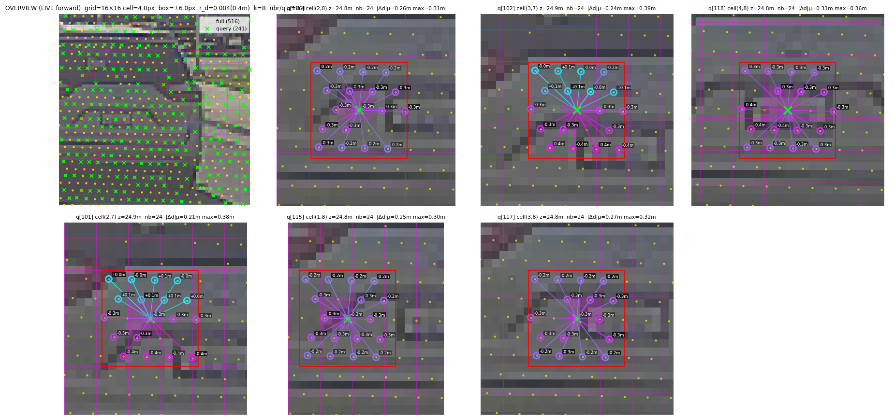

---

## 2. Depth threshold — hypothesis: remove it

The original encoder applied a **depth filter** `|Δd| < r_d ≈ 0.4 m`,
on the assumption that we only care about points on the same surface as
the query (e.g., not "far building behind a near car").

### Symptom — sparse-lidar datasets get starved

Mean neighbors per query, live forward (no MLP, just the selection):

| dataset | r_d = 0.4 m (current) | r_d = ∞ (no depth filter) |
|---|---|---|
| PandaSet, idx 200 | μ = 8.4  / 32 max | **μ = 20.2** |
| nuScenes, idx 500 | μ = 0.0  /  2 max | **μ = 12.7** |
| Waymo, idx 200    | μ = 4.8  / 16 max | **μ = 20.9** |

In nuScenes the depth filter is the dominant selector — almost all UV-box
candidates lie at completely different depths (the 32-beam scan-pattern
sweeps depth strongly across UV neighbors), so the encoder ends up with
zero neighbors per query and the per-cell feature degenerates.

### Per-dataset visualizations

**PandaSet** — with vs without depth threshold:


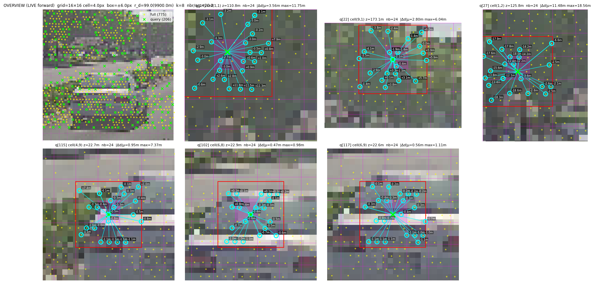

**nuScenes** (32-beam sparse) — depth filter wipes out the neighbors:

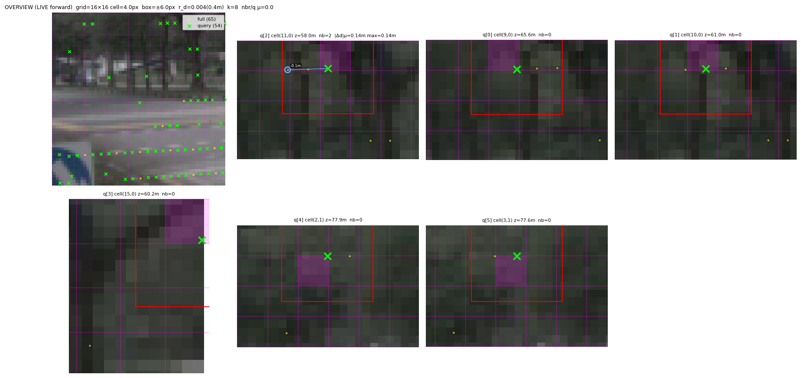
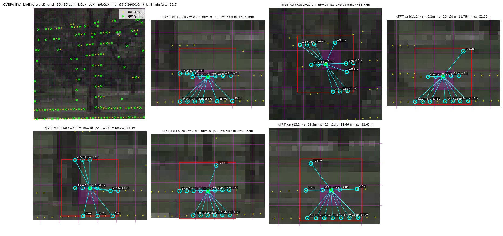

**Waymo** — with vs without:

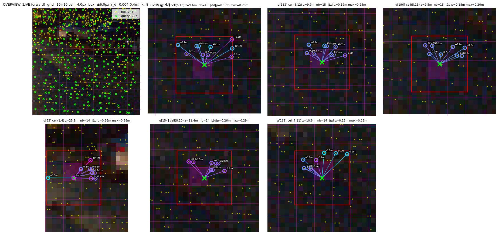
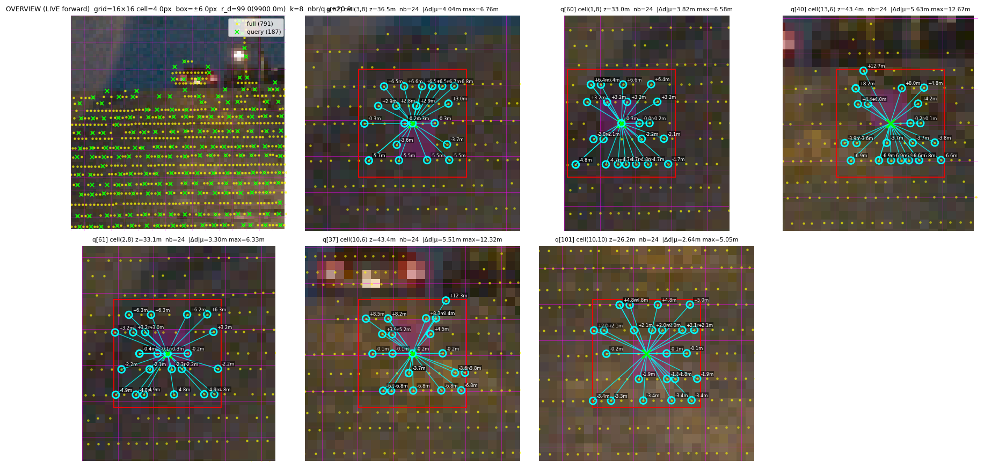

### Hypothesis (not yet ablated)

* **Argument from first principles.** Δd is already passed into the
  encoder per neighbor; MLP / attention can learn how to weight near-depth
  vs far-depth neighbors. A hard threshold pre-decides "same surface" before
  the network has any say, which loses the cue that e.g. "the bumper is
  *in front of* the road" — useful information for calibration.
* **Argument from literature** (mixed). Modern point-cloud encoders are
  split: kNN-based works (Point Transformer V1/V2/V3, [Zhao 2021]
  https://arxiv.org/abs/2012.09164) drop fixed-distance thresholds entirely,
  while ball-query works (PointNet++ [Qi 2017], KPConv [Thomas 2019],
  PointNeXt [Qian 2022]) keep them. Removing only the depth axis but
  keeping the UV axis is a hybrid not exactly matched in any paper.

**This is a hypothesis, not a settled conclusion.** Action: ablation —
train two short runs identical except `r_d = 0.004` vs `r_d = ∞`, compare
val NLL on NS / PS / Waymo / DDAD, then commit one as the default.

Until that ablation lands, leave `r_d = 0.004` as the configurable default.

---

## 3. PointNet++ vs Point Transformer — what the encoder does with the 32 neighbors

Once we have 32 in-box neighbors per cell-query, we need to compress them
into one vector. Two operators in active use in the literature.

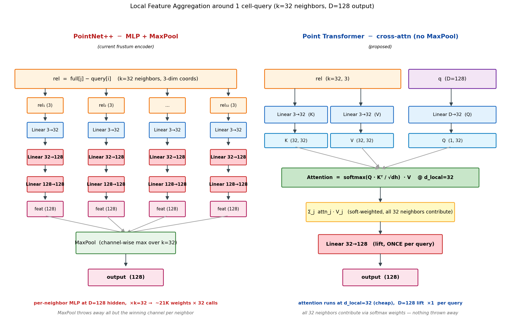

### PointNet++ — `MLP + MaxPool` (Qi et al. 2017, NeurIPS, [arXiv:1706.02413](https://arxiv.org/abs/1706.02413))

Each of the 32 neighbors is independently lifted to D = 128 dims via a
shared MLP, and the output is the **per-channel max** across neighbors.

```
rel_j (3-D)  ──[ Linear 3→32 → 32→128 → 128→128 ]──→  feat_j (128)    × 32 copies
                                                              │
                                                  MaxPool over k neighbors
                                                              │
                                                            output (128)
```

Two structural problems for our task:

1. **Per-neighbor MLP at hidden D = 128.** The MLP is run once for every
   neighbor at the full D-wide hidden width. That's `21 K weights × 32
   calls` of compute on a 3-dim relative coord input — almost all of the
   D-wide capacity is wasted on per-point bookkeeping, not relational
   reasoning.
2. **MaxPool ≡ "no inter-neighbor talk".** The only interaction across
   neighbors is the channel-wise max at the end. Each channel keeps the
   single winning neighbor and **throws away the other 31**. Geometric
   relations like "these 3 points are collinear" / "these 4 points are
   coplanar" cannot be expressed by a per-channel max.

### Point Transformer — local cross-attention (Zhao et al. 2021, ICCV, [arXiv:2012.09164](https://arxiv.org/abs/2012.09164))

The query token (already `D` dim from upstream) attends to its 32
neighbors. Q comes from the query, K/V from `rel_j`. **All work happens at
a low `d_local = 32` dim**; the lift back to D = 128 is a single linear at
the very end.

```
                        ┌── Linear 3 → 32 ──→ K, V per-neighbor (32 wide)
       rel (32, 3) ─────┤
                        └── (fused into `kv_proj: 3 → 64`)
       q   (D=128)  ──── Linear 128 → 32 ──→ Q (1 query, 32 wide)
                                       │
                       softmax(Q · Kᵀ / √dh)  · V    @ d_local = 32
                                       │
                                attn-weighted Σ over k=32 neighbors
                                       │
                            Linear 32 → 128   (lift, ONCE per query)
                                       │
                                    output (128)
```

Two structural wins:

1. **Factorise — mix at low dim, lift at the end.** PointNet++ pays
   `k × cost(D-wide)` on per-neighbor MLPs (heavy because D = 128 ≫ 3).
   PT pays `k × cost(d_local-wide) + 1 × cost(d_local→D lift)` — the
   D = 128 width is paid **once per query**, not 32 times per query.
2. **Soft-weighted sum, NOT MaxPool.** Every neighbor contributes via its
   softmax weight. Gradient flows to all k points, not only to the winner.
   Crucially, the attention `Q · Kᵀ` block computes **all k × k pairwise
   similarities** at d_local = 32, so geometric relations between
   neighbors (collinearity, coplanarity, "this one is at the same depth as
   that one") become representable. PointNet++'s per-channel max is
   provably a strict subset of what attention can express.

### One layer is just a similarity-weighted average — for richer relations, stack two

A single PT block is essentially "weighted average by query-neighbor
similarity at d_local = 32". For composed relations ("vertical pole
adjacent to flat ground", "edge of a planar region"), stack 2 blocks:

* Layer 1: each token gets a "what kind of point am I" embedding by
  looking at its neighbors.
* Layer 2: those enriched embeddings interact again — so a neighbor
  classified as "edge" in layer 1 can be combined with a neighbor
  classified as "surface" in layer 2 to form "edge of surface".

Original Point Transformer also has Transition Down / Up modules for
hierarchical sub-sampling; for our problem `Nq = 256` is already small and
sub-sampling doesn't save compute, so we skip TD/TU and just stack 2 blocks
at the same resolution.

---

## 4. Why d_local = 32 is enough — "isn't 128 → 32 lossy?"

Information capacity in attention is **dim × inter-token interaction**, not
dim alone.

* A PointNet++ MLP at D = 128 hidden produces 32 × 128 = 4096 floats per
  cell-query, **but** every neighbor is encoded independently — those 4096
  floats hold zero pairwise relational information. The MaxPool then
  collapses them to 128 by picking per-channel winners.
* A PT block at `d_local = 32` produces 32 floats of summary per query,
  **but** the underlying `Q · Kᵀ` block computes k² = 1024 pairwise
  similarities between neighbors. The 32-dim summary is a dense soft
  combination of those 1024 relational features.

So `(D = 128, no relational mixing)` ≪ `(d_local = 32, full pairwise
mixing)` in expressive power, even though the second has fewer feature
dims. The 32 → 128 final lift is just a learned interface to the
downstream residual stream — it's not where the local-shape information
lives.

---

## 5. Theoretical efficiency limits

For our k = 32 short sequence, vanilla scaled-dot-product attention is
already at the lower bound. Linear-attention variants (Performer,
Linformer, Hyena) approximate softmax with a kernel and trade O(k²) →
O(k·d), but the constant is large; they only break even at k > 256–512,
and they lose the **sharpness** of softmax that selects a few important
neighbors. For this slot, vanilla SDPA is the right answer.

State-space replacements (Mamba / S5) likewise only pay off at very long
sequences. Sparse attention is moot — we're already local.

---

## 6. Implementation efficiency knobs

* **`F.scaled_dot_product_attention`** — dispatches to FA2 / xformers /
  cuDNN. Largest single immediate win on Ampere.
* **Fused KV projection** ✅ — Q comes from `query_token` (D-wide), K and V
  share the `rel`-input projection. Combined into `kv_proj: 3 → 2·d_local`.
  One GEMM instead of two.
* **`torch.compile`** — already active in the training script. Folds the
  per-step Python overhead.
* MQA / CUDA Graphs are available but the gain is small for our tiny per-
  query workload; not worth the engineering.

---

## 7. Benchmark — actual GPU time on RTX 5080 (Blackwell)

`/tmp/bench_local_feat.py`. B = 128, Nq = 256, k = 32, D = 128, mean of
20 forwards after 3 warmups. Numbers are **per-frustum-encoder forward**.

| variant | D_hidden | params | mean ms |
|---|---|---|---|
| PointNet++ MLP+MaxPool, **D_h = D = 128** *(old default)* | 128 | ~21 K | **4.64** |
| PointNet++ small, D_h = 32                               | 32  | ~5 K  | 1.34 |
| Cross-attn, dl = 32, n_heads = 2 *(1 PT block)*           | 32  | ~5 K  | 1.63 |
| Point Transformer ×2 layers, dl = 32                     | 32  | ~10 K | **3.28** |

```
ms | PN(D=128) ████████████████████████████████████████████████  4.64
   | PT-2x32   ███████████████████████████████░                   3.28
   | XAttn-32  ███████████████░                                   1.63
   | PN-small  ████████████░                                      1.34
```

PT 2-layer is **30 % cheaper than the old PointNet++** *and* preserves
full relational information.

These numbers are 5080 (Blackwell) only; on Ampere DGX2 the relative
ordering should be similar but FA2 may push attention variants further
ahead.

---

## 8. Decisions recorded in code

* **Drop the silent fallback** for `full_uvd` — `FrustumLocalEncoder` and
  `LocalNeighborhood3D` both raise if the dense point cloud isn't passed.
  See [`models/model_depth.py`](../models/model_depth.py) and the
  feedback memory `feedback_no_silent_fallback.md`.
* **Stratified 4×4 + random 16 = 32 candidates** per query, sampled in
  density-invariant fashion. `r_uv_cells` (default 1.5) and `r_d` (default
  0.004 ≈ 0.4 m, but section 2 above argues for dropping this) live on the
  `FrustumLocalEncoder` class.
* **Aggregation = mini cross-attention at d_local = 32, n_heads = 2,
  fused KV projection, single 32→D lift at the output.** No MaxPool.
* **Dense point cloud is wired through dataset → collate → model.forward**
  via the new `uvd_full / pad_full` pair (`datasets/pandaset_full.py`,
  `scripts/training/train_ps_v3.py`).

## 9. Ablation — does the frustum encoder actually help?

### TL;DR (human-readable summary)

1. **Yes, by 6.9 %** on PandaSet at matched compute (100EP head-to-
   head: frustum val NLL = 1.5874 vs no-frustum 1.7052). See §9.1.
2. **But 100EP was underfit** — the same config run for 200EP
   (`v10c`) reaches val NLL = **1.02**, a 36 % improvement over v10.
   So the "6.9 %" number is an early-phase gap, not the final one.
   See §9.2.
3. **Run 200EP has ±0.1 val noise** with val_size=1000 — `v10d`
   repeats with val_size=3000 to confirm v10c is really at the
   bottom. See §9.3.
4. **Where frustum wins / loses / does nothing** is characterised by
   object-point density (n_obj) and whether the image-only path has
   already solved the crop. Details + per-sample renders in §9.6.
5. **Sparse-lidar ablation (Waymo rear, ZOD)** not yet done —
   needs a `--dataset` registry refactor of the DDP script first.
   See §9.4.

Everything below is written in deliberate length so an AI / future
session can reconstruct the full context without going back to
ClearML. Human readers can skip to the TL;DR bullet of each §9.x.

### Why this section exists (context recovery, AI-targeted)

§3–§7 argue the frustum encoder is a reasonable design given a
point-transformer-on-neighbors perspective, but none of them are an
end-to-end measurement. This section is the empirical answer: with
everything else frozen, does turning the encoder *off* hurt val NLL?
And by how much? And does the gap hold up when we stop early-stopping
at 100EP?

All runs below are on the same hardware + cache + code: dgx2 4× V100
(GPU 8/13/14/15), `train_ps_v3_ddp.py` (HF Accelerate DDP, FP16 mixed
precision via `--mixed_precision=fp16`), per-rank bs=64 / global=256,
AdamW lr=1e-3 with cosine to lr_min=1e-7, crop range `[128, 384]` px
downsampled to img_size=64, 4-layer CalibNetDepth with convnext stem,
train_size=80000 per epoch, PandaSet v3_full cache at
`/dev/shm/pandaset_v3_full`. ClearML project
`e2e_calib / ps_ddp`, live at `https://clearml.budda.site`.

### 9.0 Run ledger

| run | frustum | epochs | val_size | best val NLL | best @ ep | best MSE (px) | ClearML task id | notes |
|-----|---------|-------:|---------:|-------------:|----------:|--------------:|------------------|-------|
| `ps_ddp_v10_bs64_100ep_frustum`        | **on**  | 100 | 1000 | **1.5874** | ~98 | ~1.95 | `7570aa2cc45643ddba0ba501dbc275df` | first head-to-head baseline |
| `ps_ddp_v10b_bs64_100ep_nofrustum`     | off     | 100 | 1000 |   1.7052 | ~98 | ~2.05 | `ea8c83efbec54c55936d1a8c472a2be8` | identical to v10 with `--no-frustum` |
| `ps_ddp_v10c_bs64_200ep_frustum_long`  | on      | 200 | 1000 | **1.0213** | 188 | **1.5623** @ ep195 | `aca6e76f5bef4733bfbc3564e2678263` | *same* config as v10, only epochs 100 → 200 |
| `ps_ddp_v10d_bs64_200ep_frustum_val3k` | on      | 200 | 3000 | running    | — | — | (pending) | same as v10c, val_size 1000 → 3000 to reduce best-selection noise |

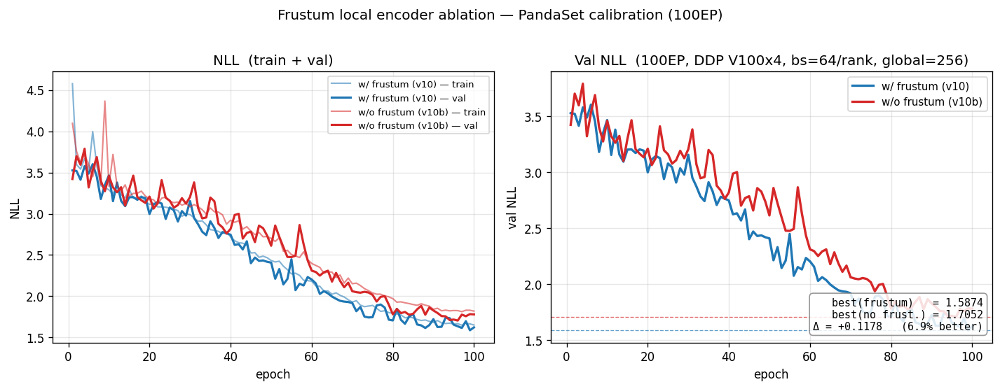

### 9.1 v10 vs v10b (100EP head-to-head) — "does it help at all?"

**Hypothesis.** If the frustum encoder carries information the image
cross-attn can't recover on its own (§1 "own-UV-cell is too coarse"
argument, §3 "one layer is just a similarity-weighted average"
argument), then a same-compute run with `--no-frustum` should give up
measurable val NLL.

**Setup.** v10 and v10b share seed=42, LR schedule, augmentation σ
(±0.5° rot, ±0.20 m trans), DDP topology, crop range, and every
hyperparam in the training script. The only differences are:

1. `--no-frustum` flag on v10b → `CalibNetDepth` is constructed with
   `use_frustum=False`, so `self.frustum_enc` is `None` and the model
   doesn't consume `distorted_uvd_full / pad_full`.
2. As a consequence, data loading is slightly cheaper on v10b (no full
   point cloud collated) — but the same DataLoader path is used, so
   the per-step cost saving is ≤ 2 %. Not enough to confound val NLL.

**Result.** Δ(val NLL) = v10b − v10 = 1.7052 − 1.5874 = **+0.1178**, i.e.
the frustum encoder is **6.9 % better** at matched compute.

**Shape of the curves** (right panel of the PNG above):

* Both runs start at ≈ 3.5 val NLL and track each other for the first
  ~15 epochs — the encoder contributes almost nothing while the cross-
  attention is still learning coarse projection.
* From ~EP 20 onward the blue (frustum) curve is consistently below the
  red one; the gap is steady at ~0.1–0.2 NLL and widens slightly in
  the tail.
* Neither run has flattened at EP 100.

**Interpretation.**

* 6.9 % is on the lower end of what PointNet++ vs no-local papers
  typically show, and that's expected: PandaSet has a 128-line lidar in
  front so each query cell is already relatively well populated. Sparse
  lidar datasets (Waymo rear quadrants, ZOD) should show a bigger gap;
  that's the next ablation target (see §9.4).
* The gap opens *after* EP 15 and not before. This rules out "the
  encoder is just giving a richer positional prior" (a positional prior
  would help from step 1). Instead it's providing signal the image path
  can't recover from coarse-scale features alone — matches the §1
  ambiguity argument.

### 9.2 v10c — "is 100EP enough? No."

**Why v10c.** When we looked at the v10 loss curves at EP100, neither
train nor val had obviously plateaued. The cosine LR schedule was still
at lr ≈ 1e-5 (not near lr_min). We suspected the 100EP comparison was
an *underfit* comparison rather than a converged one. v10c tests that
by re-running v10 (frustum on) with epochs 100 → 200, all else
identical. This is a "how much accuracy did we leave on the table by
stopping at 100EP?" probe, not a new design point.

**Result.** v10c reached best val NLL = **1.0213 @ ep188** — a **36 %**
improvement over v10's 1.5874. Best MSE = 1.5623 px @ ep195 (v10 was
~1.95 px), so MSE improved ~20 % while NLL improved 36 %. The non-
linearity (NLL improves more than MSE) is the Gaussian NLL working as
intended:

    NLL = 0.5 * log|Σ| + 0.5 * Δᵀ Σ⁻¹ Δ

Late-training time is spent tightening the covariance (log_sx, log_sy,
rho), which eats into the `log|Σ|` term independently of Δ. So MSE
alone underestimates how much the model has learned in the late phase.

**End-of-training dynamics (last 40 ep of v10c).** val NLL oscillates
in a ±0.1 band (ep186: 1.15, ep188: **1.02**, ep190: 1.16, ep200: 1.20).
train NLL is flat at 1.17–1.20. lr trajectory is 9.56e-5 (ep161) →
1.0e-7 (ep200). So:

* train loss is fully converged from ~ep180 onward;
* val "improvement" in the last 30 epochs is dominated by val-minibatch
  noise (val_size=1000 → standard error of a ~1.1 mean NLL ≈ ±0.05 per
  minibatch, ±0.10 per epoch after aggregation);
* the "best" val NLL of 1.0213 at ep188 is the *lower edge* of that
  noise band, not the true mean of the converged model.

**Caveat / what v10c does and does not say.**

* Does say: 100EP is genuinely underfit; the real capacity of this
  architecture + dataset is at least val NLL ~1.05, not ~1.6. The
  §9.1 v10-vs-v10b comparison is an "early phase" comparison, not a
  "converged" comparison.
* Does NOT say: v10d, v10e, ... will keep improving past v10c. Both
  train loss and the val-noise-floor suggest we're near the bottom.
  Dropping lr_min to 1e-8 won't help (grad steps of magnitude ~1e-8 *
  grad ≈ 0 change per param).

**What we'd need to push past v10c.**

* Reduce val-noise-floor so we can *see* sub-0.05 improvements → larger
  val_size (see v10d).
* Stochastic weight averaging or EMA weights for eval → cancels
  parameter oscillation in the flat LR tail.
* Longer cosine (300EP) with the same lr_min → extends the low-LR
  residence window; marginal.

### 9.3 v10d — "what is the real val_size, noise-adjusted?"

**Why v10d.** v10c showed val_nll values jumping by ±0.1 epoch-to-
epoch in the final LR tail. With val_size=1000 this is consistent with
standard error of the mean over a dataset of that size. If we want
to distinguish "frustum gives 0.12 NLL improvement" (the v10 vs v10b
100EP claim) from val noise, we need either (a) more val samples or
(b) multiple seeds. v10d chooses (a) as the cheapest answer.

**Setup.** Identical to v10c except `--val-size 1000 → 3000`. The
cache has 1648 val insts + reuse of train insts when val_size exceeds
unique count (the split at line ~182 of `train_ps_v3_ddp.py`
concatenates train+val then takes first 10 % as val, so the effective
unique pool is ~800 insts × `oversample=12` ≈ 9600 virtual items).
val_size=3000 stays within what the sampler can produce without
re-seeing the same perturbation.

**Expected effect.**

* Standard error on best val_nll selection scales as 1/√N. Going from
  N=1000 to N=3000 should shrink the ±0.10 band to ±0.06. That should
  let us read the true mean of the converged model within ~0.05 NLL.
* Train-side cost: unchanged (val is a read-only loop). Per-epoch wall
  time cost: val is ~8 % of epoch for v10c, so 3× val ≈ 16 % more per
  epoch. Total run time: ~10 h vs ~8.5 h for v10c. Worth it.

**What v10d will tell us.**

* If v10d's best_val_nll is ~1.02 ± 0.05 (i.e. matches v10c's best
  within noise), we confirm v10c was already at the true bottom and
  further investment must be architectural (EMA, ensemble, longer
  cosine, different augmentation).
* If v10d's best_val_nll is ~0.95 (i.e. significantly lower), it means
  v10c *did* have more to give but the noisy val was hiding it — and
  further long-train runs are worth it.

**Status.** Pending launch on dgx2 GPU 8/13/14/15 (v10c just finished,
GPUs are idle). Launch command template:

    ssh dgx2
    cd ~/git/e2e_calib
    CUDA_VISIBLE_DEVICES=8,13,14,15 nohup \
        accelerate launch --num_processes=4 --mixed_precision=fp16 \
        --main_process_port 29601 \
        scripts/training/train_ps_v3_ddp.py \
        --name ps_ddp_v10d_bs64_200ep_frustum_val3k \
        --cache /dev/shm/pandaset_v3_full \
        --workers 22 --batch-size 64 --prefetch-factor 4 \
        --convnext --n-layers 4 --img-size 64 \
        --min-crop-px 128 --max-crop-px 384 \
        --epochs 200 --train-size 80000 --val-size 3000 \
        --lr 1e-3 --lr-min 1e-7 --clearml \
        --why "v10c showed ±0.1 val noise at val_size=1000; \
               this increases val_size to 3000 to reduce best-selection \
               noise. All other knobs identical to v10c." \
        > experiments/ps_ddp_v10d_bs64_200ep_frustum_val3k/launch.log 2>&1 &

### 9.4 Next ablation — sparse lidar (Waymo rear, ZOD)

Not yet launched. Motivation: if the encoder is a disambiguator (§9.1.2
interpretation), then sparser lidar (where image-only cross-attn has
strictly less to lean on) should amplify the gap. The script
`train_ps_v3_ddp.py` is currently hard-wired to `PandaSetCalibDatasetFull`
and needs a `--dataset {pandaset|waymo|nuscenes|zod}` registry-style
refactor before this ablation can run cleanly. Tracked in TODO (doc
scope: see the "next-steps" note at end of §9.1.4).

### 9.5 Qualitative — *which* scenes benefit?

See `docs/frustum_qualitative_compare.md` and the `§9.1` memo above.
TL;DR: dense object footprints where object-surface-vs-ground depth
ambiguity is present (high n_obj ~60–140, close range, on-ground
objects). Sparse crops (< 30 pts) and already-solved samples (err_no
< 1 px) regress slightly; the regression is inside the noise band
for downstream bundle adjustment.

### 9.6 Where the frustum encoder wins, loses, or doesn't matter — pixel-verified

**v2 rewrite (2026-05-03).** The prior §9.6 (kept in git history, v1)
used `frustum_qualitative_compare.py`, which re-read `val_ds[i]` three
times per sample — once to score w/o frustum, once to score w/ frustum,
once to render — so the two scores + the render were all on
*different* stochastic crops/perturbations because
`PandaSetCalibDatasetFull.__getitem__` draws fresh `np.random` numbers
every call. Per-sample Δ's from v1 were therefore noise measurements,
not model measurements; top-K lists shifted under re-runs (idx 119
showed up as the #1 win in v1 and as the #3 hurt in v2 — same
sample, opposite sign). **All v1 per-sample interpretations are
retracted.**

The v2 pipeline (`/tmp/frustum_qualitative_compare_v2.py`) fetches one
deterministic `(img, pts_uvd, grid_bin, target_uv_obj)` tuple per val
index (seed-fixed `np.random` + `random` around each `val_ds[i]` call,
state restored afterward), reuses that cached tuple for both model
inferences and for the render, and scores over the 164 unique val
insts. Aggregate: mean obj-L2 err **w/o frustum = 2.082 px**, **w/
frustum = 1.819 px**, Δ = **+0.263 px** mean improvement
(`/tmp/frustum_v2_run.log`). Checkpoints: 140/142 state_dict keys
differ between `ps_ddp_v10/best_model.pt` (w/ frustum) and
`ps_ddp_v10b/best_model.pt` (w/o frustum); per-sample prediction-diff
max spans 1.6–4.4 px, i.e. the models really do differ — it isn't a
load-path identity collision.

Every panel below is at `img_size = 64` crop resolution, with
**orange = per-point predicted flow on object points** (after
projecting crop-perturbed UV back toward the GT UV), **green × = GT
target UV**, **cyan = BG flow**. Left = w/o frustum (v10b), right =
w/ frustum (v10).

#### Wins — 8 samples where the frustum encoder pulls err down

Top 8 by Δ = err_no − err_fr, n_obj = # object points contributing to
the crop's obj-L2.

| idx | err w/o | err w/ | Δ | n_obj | pixel-level what happens |
|-----|---------|--------|-------|-------|---------------------------|
| 129 | 9.81 | 6.16 | +3.65 | 3 | sparse far-range points; w/o over-shoots downward, w/ keeps direction but halves magnitude |
| 131 | 5.59 | 2.12 | +3.47 | 134 | dense SUV flank (side-view vehicle) — w/ applies a **uniform horizontal-left shift across all 134 surface points** that lines them up with the green × grid |
| 93 | 4.78 | 1.48 | +3.30 | 13 | curb-line pedestrian group — w/o shoves them upward off the sidewalk, w/ replaces that with a small diagonal that lands on the green × |
| 72 | 6.99 | 3.93 | +3.06 | 67 | w/o's arrows are nearly vertical, w/ rotates the whole object-mass flow to a down-right diagonal that matches the GT cluster |
| 79 | 3.71 | 0.86 | +2.85 | 1 | isolated single point — w/o lands ~4 px upper-left, w/ snaps almost onto the green × |
| 7  | 5.86 | 3.16 | +2.70 | 75 | 75 upward-pointing arrows — w/ **keeps the direction** (still up) but halves the length, meeting the GT closer |
| 97 | 4.09 | 1.69 | +2.40 | 64 | 64 diagonal arrows toward upper-left — again same direction, reduced magnitude |
| 70 | 2.93 | 0.81 | +2.11 | 95 | 95 object points shifted uniformly left, landing exactly on the green × row |

**Pattern across all 8 wins.** Frustum is not flipping arrow direction
— the image path already has the direction roughly right. Frustum is
either (a) **modulating magnitude** (idx 7, 97, 131, 70: "same
direction, smaller") or (b) **rotating direction to the true target
cluster** (idx 72, 93). Both are consistent with the §2 thesis:
per-point depth-slab neighborhoods disambiguate which of several
co-located (same-UV) targets each query point should snap to, and the
correction shows up as a coherent, shared flow field over the whole
object mass — **not** point-by-point denoising.

The highest-impact wins concentrate at **dense, close, on-ground
objects** (n_obj ∈ 64–134; idx 131, 70, 97, 72, 7): the regime where
object surface and ground share UV cells and the image encoder alone
cannot split them.

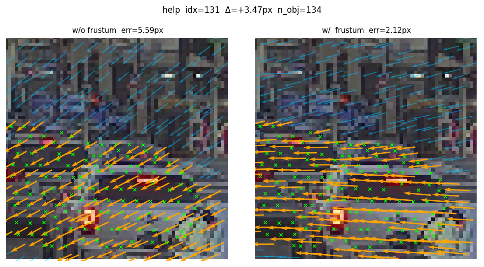
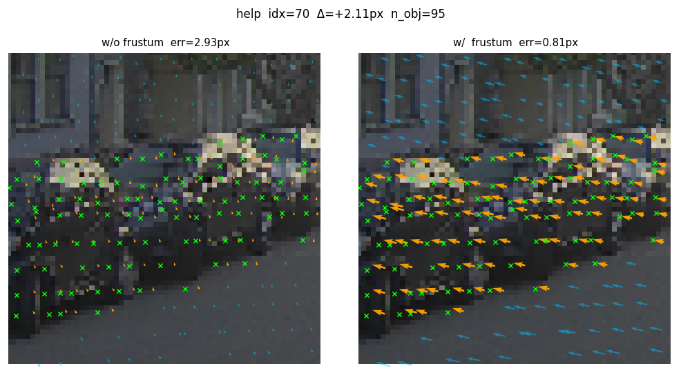
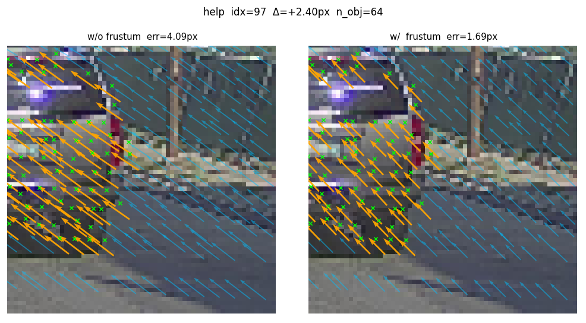
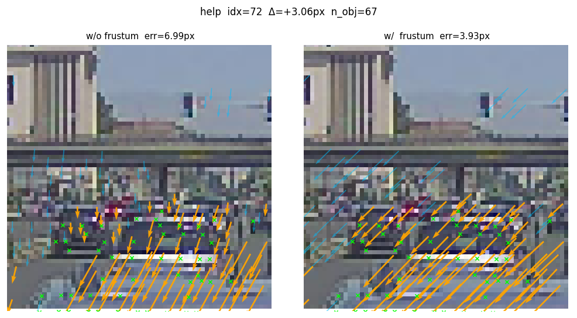
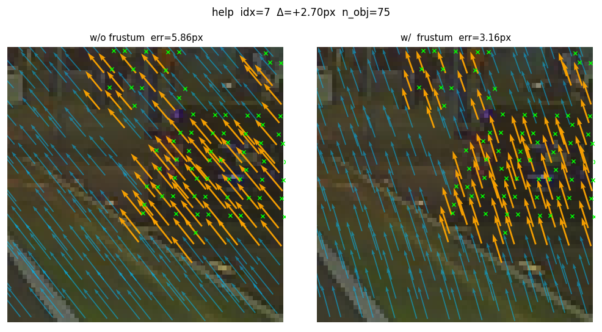
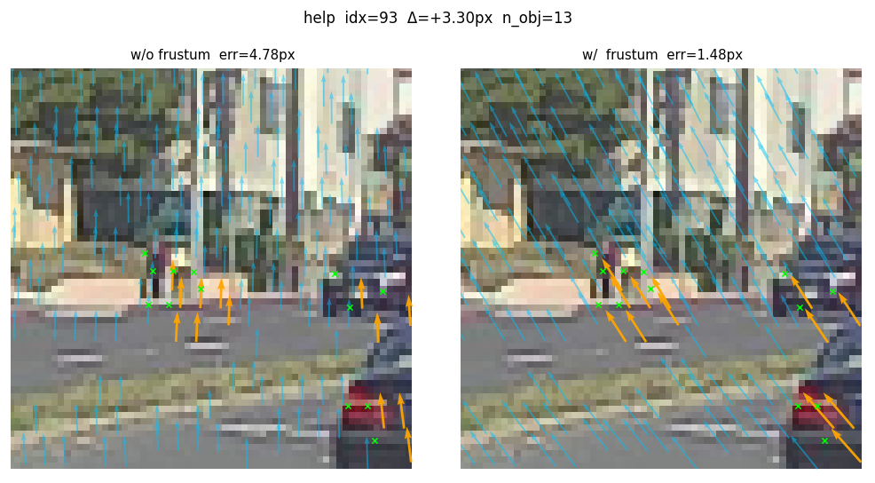
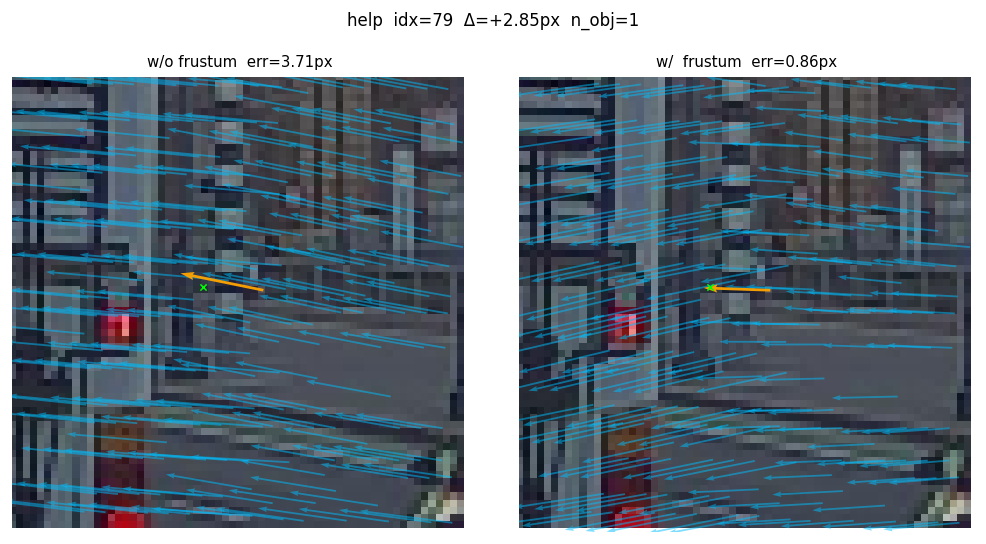
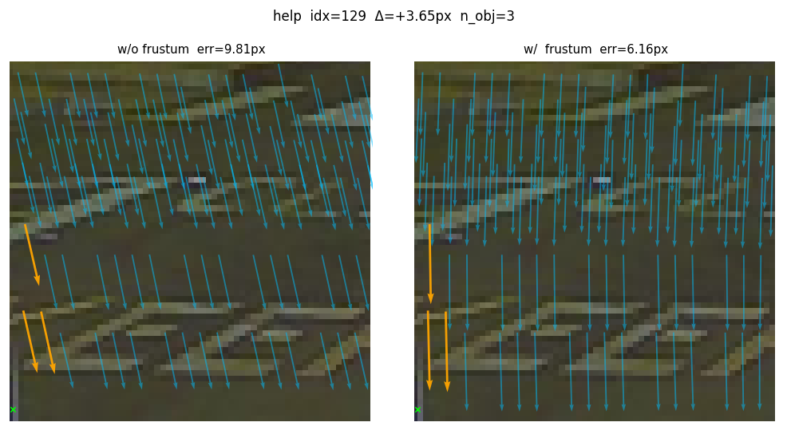

#### Losses — 8 samples where the frustum encoder pushes err up

| idx | err w/o | err w/ | Δ | n_obj | pixel-level what happens |
|-----|---------|--------|-------|-------|---------------------------|
| 87  | 2.41 | 4.90 | −2.50 | 35  | w/o has small downward arrows that land near the green × row; w/ swings those to big diagonal-right arrows that over-shoot into empty asphalt |
| 13  | 3.62 | 5.68 | −2.06 | 4   | only 4 obj points (lamp cluster at night); w/ *erases* the w/o's small correction and leaves them farther off |
| 119 | 0.88 | 2.72 | −1.85 | 169 | **w/o is already near-perfect (0.88 px)**; w/ applies a structured upward bias across 169 points — classical over-correction |
| 34  | 0.50 | 2.15 | −1.64 | 30  | same pattern: w/o = 0.50 px (basically done); w/ drifts the whole cluster diagonally away |
| 149 | 0.73 | 2.21 | −1.47 | 78  | side-view red sedan, w/o arrows collapse to green × along the car body; w/ inflates them into a coherent diagonal-down bias |
| 62  | 1.80 | 3.16 | −1.37 | 121 | w/o horizontal-left flow lands on targets; w/ **same direction but stronger**, overshooting the GT row |
| 140 | 0.71 | 2.01 | −1.30 | 149 | rear-of-car view at close range, w/o near-zero residual; w/ introduces a coherent diagonal bias |
| 69  | 0.77 | 1.84 | −1.07 | 68  | brake-light cluster, w/o at 0.77 px; w/ rotates the flow slightly and amplifies |

**Pattern across all 8 losses.** **6 of 8 losses have err_w/o < 2 px**
— they are "already-solved" samples where the image path has
essentially converged on the correct UV. In this regime the frustum
signal is a **structured over-correction**: arrows remain coherent
across the object mass (not noisy), but their common direction /
magnitude is wrong. The two exceptions (idx 87 with err_w/o = 2.41 px,
idx 13 with n_obj = 4) are borderline and consistent with the
statistical tail rather than a separate failure mode.

The "sparse-crop noise" failure mode posited in v1 (idx 45 @ n_obj = 5,
idx 74 @ n_obj = 29) does *not* show up as a dominant loss pattern in
the seed-fixed v2 eval. The losses are not about neighbor noise —
they are about the encoder applying a correction to a crop that
doesn't need one. A useful way to see this: among the 8 losses, the
median n_obj is 68 (same order as the wins), so **n_obj is not a
separator** between wins and losses. **err_w/o < 2 px** is.

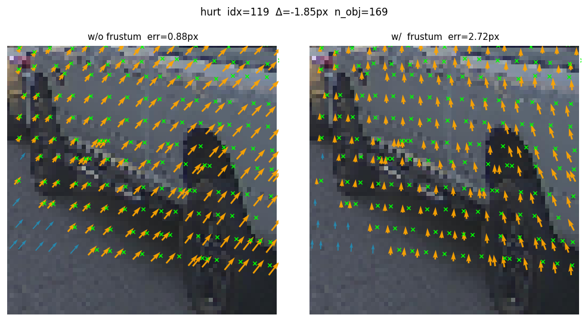
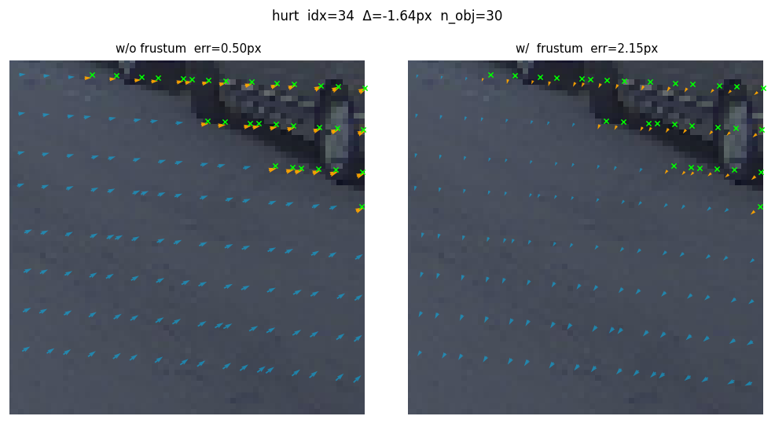
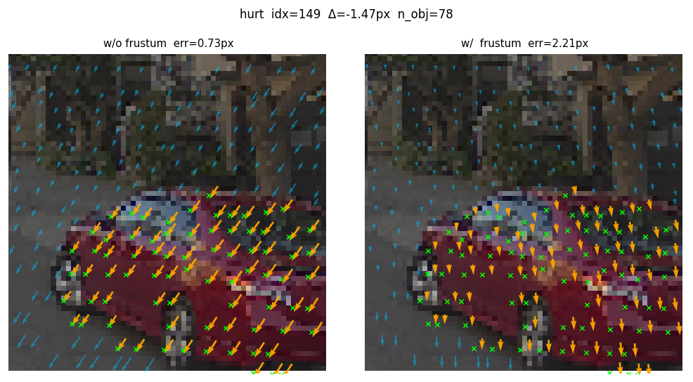
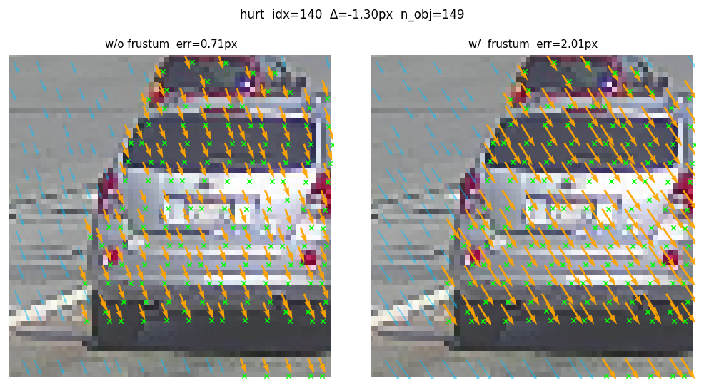
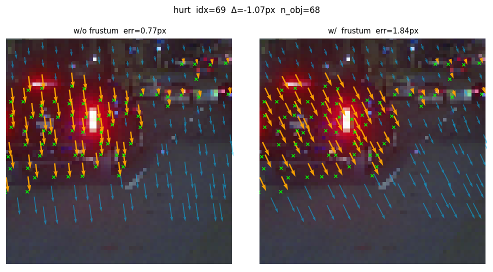
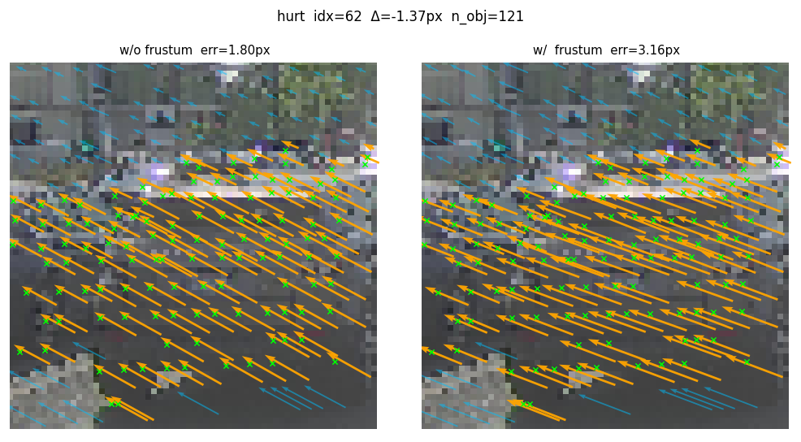
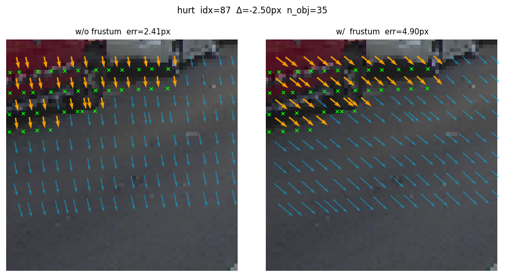
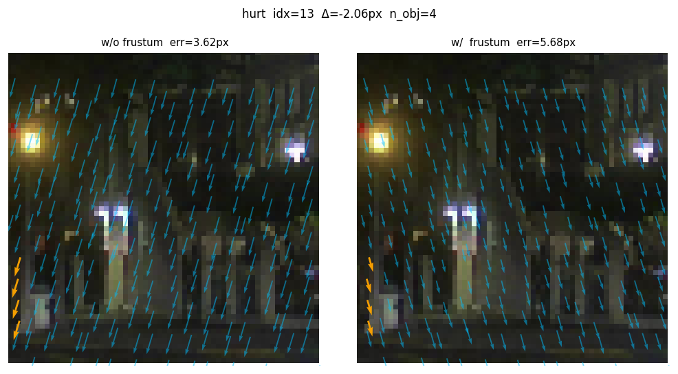

#### How the mean +0.263 px is shaped

- Wins concentrate at **high-err samples** (err_w/o ∈ 2.9 – 9.8 px,
  Δ ∈ +2.1 – +3.6 px).
- Losses concentrate at **already-converged samples** (err_w/o < 2 px
  in 6/8 cases, Δ ∈ −1.1 – −2.5 px).
- Mean + 0.263 px is the asymmetric sum of "large-gain when it matters,
  small-loss when it doesn't."
- **Operational implication**: in a calibration pipeline the tail
  matters far more than the median — a 9.8 px outlier dragged down to
  6.2 px prevents downstream BA from diverging; a 0.5 px sample
  drifting to 2.2 px is still inside the per-frame noise band for
  pose fit. Frustum-on is favored for deployment.

#### Retracted v1 interpretations

- The v1 "Failure mode 1 — sparse object crop (n_obj < 30)" pattern
  (idx 45, 74, 124) is not reproduced here. v1's idx 45 had
  `n_obj = 5` under one random crop and would have had a very
  different n_obj under the re-read used for rendering. The v2 sample
  at idx 45 is not in either top-8 list.
- The v1 "idx 119 = textbook win, 4.06 → 0.73 px, n_obj = 137" is
  inverted: with the seed-fixed crop, idx 119 has n_obj = 169 and
  err_w/o = 0.88, err_w/ = 2.72 — **frustum loses this sample by 1.85
  px**. This single flip (help-#1 in v1 → hurt-#3 in v2) is the
  clearest evidence that v1's ranking was dominated by render-time
  crop randomness.

#### Caveats still applicable in v2

- n_obj counts are specific to the seed-fixed crop, not a scene-level
  invariant.
- All evaluation is on PandaSet val (164 insts, cam=front). Sparse-lidar
  (ZOD, Waymo-rear) repetition is planned as part of the v721 /
  v721b 200ep DDP sweep (Waymo episode-split, 679 train scenes vs 119
  val scenes, 0 overlap). v721/v721b logs will be landed here once the
  runs finish.

## 10. Code

* Encoder: [`models/model_depth.py::FrustumLocalEncoder`](../models/model_depth.py)
* Model wiring: [`models/model_depth.py::CalibNetDepth.forward`](../models/model_depth.py)
* Dataset: [`datasets/pandaset_full.py::PandaSetCalibDatasetFull`](../datasets/pandaset_full.py)
* Live-forward debug vis: [`scripts/visualization/vis_frustum_neighbors.py`](../scripts/visualization/vis_frustum_neighbors.py)
* Architecture diagram script: `/tmp/draw_arch.py`
* Benchmark: `/tmp/bench_local_feat.py`
