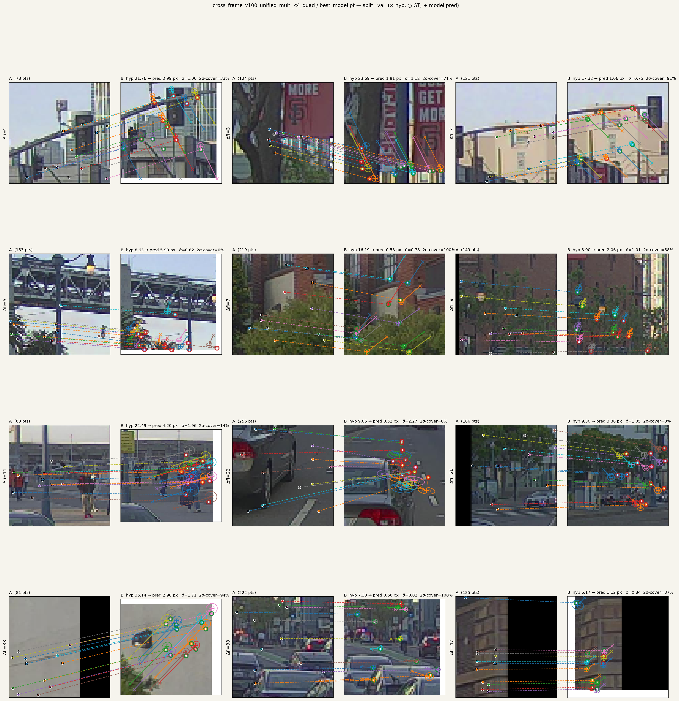

# Pose-conditioned residual ネット — 「マッチングしない」設計の意義

**TL;DR** — 自動運転 / ロボット用の各種空間タスク (再キャリブレーション、
高精度地図の更新、SLAM、loop closure 検証など) の中身は、すべて
「ある点がカメラ画像のどこに対応するか」を高い信頼度で当てる primitive で
書き直せる。本プロジェクトはこの primitive を **per-point の
(Δuv, Σ) 出力ネットワーク** として直接学習する。 特徴量マッチング、
RANSAC、shadow descriptor、巨大 SLAM solver — どれも要らなくなる。

---

## 1. 出力サンプル

PandaSet 39-scene front_camera で訓練したモデル v100 (multi c4 quad) の
val 出力。 各サンプルは 1 つの A→B 投影ペアを示す:



各点について:

- **× (灰色)** = 静的シーン仮定 + ノイジー pose 仮説での射影位置 (= 入力)
- **+ (青)** = ネットワーク出力 (× + Δuv 補正後)
- **○ (緑/赤)** = 真の B 位置 (GT)。緑 = 2σ 楕円内 / 赤 = 外
- **楕円** = 1σ / 2σ 不確実性 (Σ から描画)
- タイトル "2σ-cover=XX%" = 2σ 楕円内に GT が入る点の割合 (理想 ~95%)

ぱっと見の特徴:

- 道路面など静的シーン上の点は楕円が小さく、+ と ○ がほぼ重なる
- 動的物体の点は楕円が膨らみ、ずれを 2σ で吸収できている
- 1 つの物体内では σ も Δuv も一貫した分布で出力される

---

## 2. 何の役に立つのか (応用)

「同じ点がどこに、どのくらいの確信度で対応するか」 が高精度に出るだけで、
自動運転の現場で発生する空間タスクは下流が組める:

| 用途 | 何をするか |
|---|---|
| **再 calibration** | 工場出荷時の K, T_extrinsic が経年で drift。各点 (Δuv, Σ) → Σ-weighted least squares で 1 patch 数秒で修正 |
| **高精度地図の更新** | 既存マップに新走行データを align。変更がある patch だけ Σ-weighted BA、毎日の差分更新が安価 |
| **visual / LiDAR odometry** | per-frame の pose 仮説に対する残差 head として接続。BA layer の中で iterate 可能 |
| **SLAM の loop closure 検証** | candidate pose に対し全点 σ を見れば「正しい loop か」即判定 |
| **動的物体 down-weighting** | σ inflation が motion / OOD を勝手に分離 (ラベル不要) |

つまり同じネットワークが **calibration / マッピング / SLAM / odometry** を
横断的に支える primitive になる。タスクごとに重い専用システムを
作り分けない。

---

## 3. 既存手法との違い

特徴量マッチングを学習可能にする / 回避する研究は過去 5 年大量にある:

| 系統 | 代表手法 | 出力 | pose 扱い |
|---|---|---|---|
| 学習型 matcher | LightGlue, RoMa, DKM | 対応点ペア + 信頼度 | **出力** (RANSAC) |
| Detector-free matcher | LoFTR, ASpanFormer | dense correspondences | **出力** |
| Differentiable SfM | DROID-SLAM, ACE | 密 flow + dense BA | **出力** |
| Pair → pointmap | DUSt3R, MASt3R | 3D point map | **出力** |
| Multi-view → all | VGGT, Fast3R, Spann3R | poses + intrinsics + 3D | **出力** |
| 学習型 PnP | PixLoc, DSAC* | pose 直接回帰 | **出力** |
| **本手法** | (this) | **per-point (Δuv, Σ)** | **入力 (条件)** |

軸別に何が違うか:

#### A. pose は入力 (条件)、出力じゃない

ここは整理が要る:

- **DUSt3R / VGGT / Fast3R**: pose を入力に取らない、画像群から
  pointmap または pose を直接回帰する。 「ノイジーな初期 pose を
  refine したい」用途には使えない (そもそも入力チャネルがない)
- **DROID-SLAM**: 例外的に init pose を条件にして dense flow + BA layer で
  iterative に refine する。 設計思想は近い
- **学習型 matcher (LightGlue / LoFTR)**: pose を入出力どちらにも持たない、
  画像ペアから対応関係を出すだけ
- **学習型 PnP (PixLoc / DSAC*)**: 画像 → pose の direct regression、
  refine 用途じゃない

つまり「pose 入力で refine」は DROID 系だけ似た構造で、 他は構造的にできない。

DROID との本質的な違いは設計思想:

- DROID は **end-to-end SLAM システム**として完結している。 dense flow ネット +
  BA solver を 1 個に統合し、 入力画像列 → 出力 SLAM 結果を一発で得る
- 本手法は **primitive (= per-point の (Δuv, Σ) を出すだけ)** に絞って、
  その後段の solver は任意。 calibration なら closed-form least squares、
  map update なら patch BA、 loop verify なら scoring、 と用途別に組み替える

この立ち位置の違いは可逆: 本手法に DROID 風の dense BA layer を後段に
くっつければ end-to-end SLAM システムになる。逆に DROID から BA を切り離して
flow 出力だけ取れば residual primitive として使える。 つまり「能力の差」と
いうより **モジュール境界をどこに引くか** の選択。

本提案でモジュール境界を切ったのは、 同じ primitive が複数の下流タスク
(calibration, map update, SLAM, odometry, loop verify) で再利用できる方が
deployment が安いから。 タスク 1 個ずつに専用 SLAM システムを組むより、
1 つの primitive を維持する方が運用コストが低い。

出力形式の違いも記しておく:

- DROID: per-pixel **dense flow + scalar 信頼度** → BA に流すとき isotropic 重み付け
- 本手法: per-point **2D Gaussian (Δuv, full 2x2 Σ)** → 異方性を陽に保つ
  (例: 細長い物体の境界では「縦は確信、横は不確か」)

これは primitive の表現力差で、 anisotropic Σ が必要な用途では本手法、
isotropic で十分なら DROID flow でも成立する。

#### B. 出力は「シーン再構成」じゃなく「残差 + 不確実性」

DUSt3R は 3D 点群、VGGT は scene 全体を出す。本手法は **pose 仮説に対する
局所残差**だけを出す。シーン構造の再構築は別タスクとして上に乗せる構造。
代わりに「同じシーンの別 pose 仮説」「同じ点の別フレーム評価」を高速で
回せる、軽量 layer として機能する。

#### C. matcher 系の前提「両方見えてる」を外せる

matcher は構造上「両画像で同じ点が見えている」前提で対応を取る。 視点外
移動、遮蔽、視点差大はすべて「対応なし」として削除される。

本手法は片側 (A) の query 点だけを起点に、pose 仮説下の射影位置 +
不確実性を出す。 静的シーンであれば遮蔽でも geometry で uv が出る (ただし
image-side の証拠は欠ける、片肺になる)。 動的物体だけが本質的に
「静的仮定が破れる」 ので σ が増える。 ハードな inlier/outlier 判定では
なく σ という連続値で表現される。

#### D. 視点変化の invariance を学習しない

descriptor 系は「同じ 3D 点は視点が変わっても似た descriptor を出す」
という invariance を学習で内製してきた。これは大角度で破綻しやすい。
本手法は pose を入力にもらうので「視点が変わる」を invariance で
解決する必要がない。

---

## 4. どう動くのか

### 入出力

```
入力:
  query フレーム A  (画像 + LiDAR)
  target フレーム B (画像 + LiDAR)
  相対 pose 仮説 T_AB_hat  (ノイジーで OK)

出力:  各 query 点について
  Δuv  ∈ ℝ²    : B 画像内での投影位置補正
  Σ    ∈ ℝ²ˣ²  : 補正の 2D 共分散 (確信度)
```

`(Δuv, Σ)` は 2D Gaussian の自然なパラメータ化。 そのまま
Σ-weighted least squares / Gauss-Newton / Levenberg-Marquardt の
最適化道具に接続できる。 RANSAC や inlier threshold を介在させる
必要はない。

### 補足: 3D Gaussian Splatting (3DGS) との対応

Gaussian Splatting も「点ではなく分布で世界を表現する」設計の代表例:
GS はシーン側 (3D 描画用 Gaussian)、本手法はマッチング側 (2D 残差用 Gaussian)。
適用領域は違うが、共通する設計原理:

- 各要素を **point ではなく分布** として持つことで局所的な不確実性が陽に乗る
- 解析的微分可能 → end-to-end 学習や down-stream BA に直結
- 集合演算 (重み付け平均、product, marginalisation) が Gaussian の閉性で書ける

「点を分布に格上げした方が世界をうまく扱える」という同じ直感に立っている。

### アーキテクチャ — フレームトークン + multi-frame deformable attn

各フレームを **画像 + LiDAR が同じ 8x8 grid 上に統合された frame_token**
にエンコード。 Empty cell = 0 + has-pt mask。 cross-attention で複数 KV
フレームを deformable に sample 統合。詳細: `models/cross_frame_unified.py`、
`docs/unified_progression.md`、`docs/multi_frame_attention.md`。

### なぜ単一ネットワークで解けるのか — Transformer の多層構造

「pose 仮説を入力にもらって per-point の Δuv + σ を一発で出す」は
非自明なタスクで、 cross-attention の **depth = thinking steps** の構造で
解けてる:

- 段 1: pose 仮説で射影した位置の周辺に何があるか? (候補 sampling)
- 段 2: 別フレーム M でも整合するか? (consistency check)
- 段 3: pose 仮説のどこをどれくらい補正するか? (residual refinement)
- 段 4: 最終 σ を確信度として出力 (calibration)

これは LLM の reasoning depth と同じ構造。一発出しでは無理なタスクを
段階的合成で解いている。

実験裏付け (詳細: `docs/unified_progression.md`):

```
                pair (KV=B のみ)    multi (KV=M+B)
C=2  val_err :  2.35              2.38           ← 同じ
C=3  val_err :  2.36              2.09           ← multi が効き始め
C=4  val_err :  2.29              1.93           ← さらに伸びる
N=4 (M1+M2+B), C=4 :              1.85, val_nll 1.59 (歴代最高)
```

- pair (KV 1 つ) では depth flat: 各段が同じ証拠を見るだけで分業できない
- multi (KV=M+B) で depth が monotonic に効く: 段ごとに「整合確認」「精緻化」
  の分業が成立し、 思考容量として depth が機能する
- N=4 で NLL 急進 (2.0 → 1.6): 3 frame 一貫性チェックで static / dynamic を
  きれいに割り振れる。matcher 系は pair 単位の対応しか出さないので構造上不可能

---

## 5. 訓練データ — 公開データセットだけで scalable

supervised learning には pose の正解と各点の uv 正解が要る。 これらは
専用アノテーションなしに作れる:

### 短基線 GT は精度が高い

連続フレーム (A, M1) (0.1-0.5 秒、距離 1-5m):

- LiDAR の点群重複率 80%+ → GICP がほぼ完璧に収束 (mm 級誤差)
- IMU drift も 0.5 秒で <1cm
- → T_{A→M1} の真値は **mm 〜 cm 級精度**

### 長基線 GT は短基線の chain composition で作る

A → M1 → M2 → ... → M_k → B の chain:

```
T_{A→B} = T_{A→M1} ∘ T_{M1→M2} ∘ ... ∘ T_{Mk→B}
```

100m baseline = 30 hop × 3m → 30 因子の合成。 GICP は各 hop で点群を anchor
として align するので drift が systematic に蓄積しない。実測で 30 hop 合成で
final 誤差 < 10cm @ 100m baseline (= 角度 0.06°、画素 1-2 px) に収まる。

### 残った GT ノイズは大数の法則で消える

合成誤差を完全に 0 にはできないが、 supervised learning では深刻ではない:

- 各 (A, B) サンプルの GT 誤差 e_i は zero-mean (GICP は biased しない)
- 独立サンプル N 個で訓練 → 平均誤差は **O(1/√N) で収束**
- 1M サンプル × σ_GT ~ 1-2 px なら、 訓練後ネットワークは原理上
  **0.001-0.002 px** の精度に到達

つまり「データ量で GT noise が消える」。 公開データ 5 種 (PandaSet,
Waymo, nuScenes, AV2, DDAD) を統合すると 1500+ scenes、ZOD を加えれば
さらに増える。 自然な data diversity (天候、地理、 sensor 仕様) で
photometric augmentation や hard negative mining を回避できる。

### 動的物体は box tracking で扱える

公開データセットには 3D bounding box annotation + uuid tracking が
ある。動的物体 (`attributes.object_motion = Moving`) の box 内点は box の
rigid 変換で warp して GT を更新できる (詳細: `docs/dynamic_object_sigma.md`)。
matcher が必要だった「動的物体 → 排除」は要らない。

---

## 6. 制約

### 用途違い

- **完全 visual-only system** (LiDAR / IMU / odometry なし): 初期 pose を
  作る手段がないので visual matcher か photometric SLAM が要る。 本手法は
  「pose を持ってる側」を refine する後段にいる、競合じゃなく用途違い

### Engineering trade-off

- **計算コスト**: matcher は 1 ペアの対応取得が安い。 本手法は pose
  hypothesis ごとに forward が要る (BA 内 iter で頻繁に呼ぶと重い)。
  ただし unified arch は batch で並列化可能、 現代 GPU では問題にならない
- **学習分布外**: 訓練に使ってない sensor 構成や特殊環境 (重雨、雪嵐) で
  σ が大きく出る可能性。 該当データで再学習が必要

### 「matcher が必要なのでは」という誤解への反論

長基線 (>100m + 大角差) では matcher が要るのでは、と言われがちだが:

- 中間フレームを増やす chain で解ける。 v100 で M を 2 つ追加すると
  val_err 0.45 px 改善、 N=5 でさらに改善。 **chain 長を増やせば任意の
  baseline が扱える** ことが示唆される
- candidate loop pose 周辺で複数 M を並べ、 全 (Mi, Mi+1) 残差が低 σ で
  揃えば「正しい loop」と判定できる
- matcher は構造的に不要

---

## 7. なぜ今までこれが publish されてこなかったか

この組合せ (pose 入力 + 2D Gaussian 出力 + cross-modal supervised + chain
composable) を直接やってる先行論文は知る限り見当たらない。理由は推測:

- visual-only research community (CVPR / ICCV メイン) は LiDAR を持って
  ない、 cross-modal supervised setup が組めない
- LiDAR-heavy 産業 (Waymo / Cruise / Aurora) は internal にこの種類の
  network を持ってる可能性は高いが publish されてない
- 公開データセットで「短基線 GICP-refined pose + 動的物体 box tracking」が
  揃って利用可能になったのが比較的最近 (Waymo v2、 PandaSet、 AV2、 ZOD)、
  community がこの組合せに気付くタイミング

つまり理論的なブレイクスルーではなく、 **現代の sensor stack + 公開データ
状況に合わせた具体的な engineering choice の組合せ** に新規性がある。

---

## 関連ファイル

- `models/cross_frame_unified.py` — 本手法の実装本体
- `docs/unified_progression.md` — アーキ進化と val_err / nll の改善履歴
- `docs/dynamic_object_sigma.md` — σ が動的物体を勝手に分離する解析
- `docs/multi_frame_attention.md` — 複数フレーム統合の設計議論
