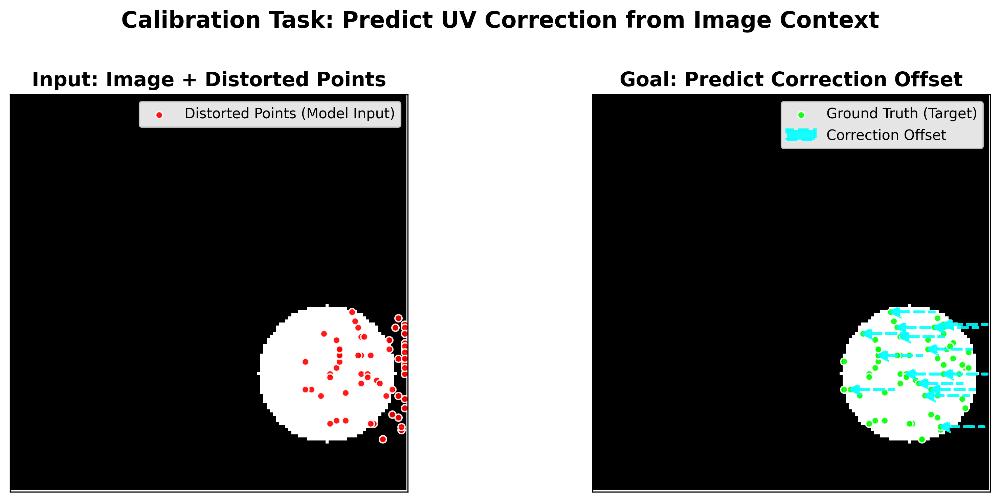
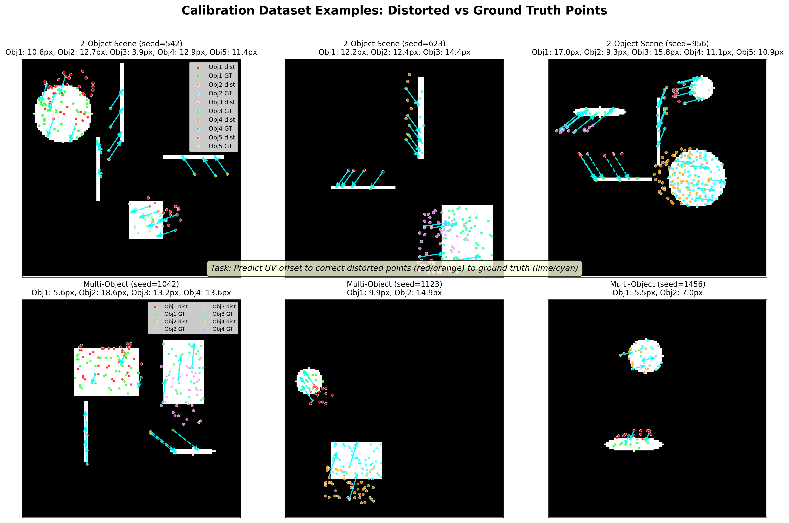
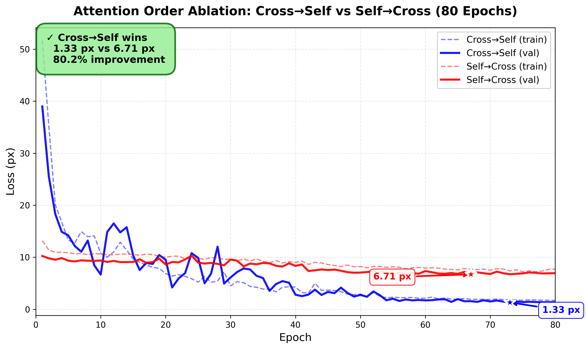

# Attention Order Matters: 80% Improvement in LiDAR-Camera Calibration

**TL;DR**: We show that **Cross→Self attention order achieves 80.2% better performance** (1.33 px vs 6.71 px) compared to Self→Cross order in a 2-layer Transformer decoder for end-to-end LiDAR-camera calibration. Visual grounding before point consensus is critical.

---

## Abstract

We investigate the impact of attention mechanism ordering in Transformer-based LiDAR-camera calibration. Our 2-layer decoder architecture alternates between cross-attention (image-to-points) and self-attention (point-to-point). We compare:

1. **Cross→Self→Cross→Self** (original): Visual grounding then consensus
2. **Self→Cross→Self→Cross** (swapped): Consensus then visual grounding

Over 80 epochs of training, **Cross→Self achieves 1.33 px validation error** while Self→Cross only reaches 6.71 px — an **80.2% improvement**. This demonstrates that querying image features before point communication is essential for calibration tasks.

---

## Motivation

In end-to-end calibration, a neural network must:
1. **Extract visual features** from the camera image (CNN backbone)
2. **Query those features** using LiDAR point queries (cross-attention)
3. **Communicate between points** to build consensus (self-attention)

The question is: **which should come first?**

### Hypothesis

**Cross→Self (Visual grounding first)**:
- Points first query image features to get context
- Then communicate with each other using visual context
- Intuitively: "Where am I in the image?" → "Let's agree on calibration"

**Self→Cross (Consensus first)**:
- Points first communicate with each other without visual context
- Then query image features
- Intuitively: "Let's talk among ourselves" → "Now look at the image"

We hypothesize that **visual grounding should come first** because:
1. Points need image context to know what they're looking at
2. Without visual context, self-attention has no meaningful features to aggregate
3. Calibration is fundamentally about image-LiDAR correspondence

---

## Architecture

### Model: 2-Layer Transformer Decoder

Both models use the same architecture with only the attention order swapped:

```
Input:
  - Image: [B, 1, 128, 128] (grayscale fisheye camera)
  - Points: [B, N, 2] (distorted UV coordinates)

Backbone:
  - ResNet-18 → [B, 512, 4, 4] image features

Decoder (2 layers):
  Layer 1:
    - Attention Block 1 (Cross or Self)
    - Attention Block 2 (Self or Cross)
  Layer 2:
    - Attention Block 3 (Cross or Self)
    - Attention Block 4 (Self or Cross)

Output:
  - UV offsets: [B, N, 2]
```

### Cross-Attention (Image→Points)
```python
Q = points  # [B, N, d_model]
K = V = image_features  # [B, 16, d_model]
out = MultiHeadAttention(Q, K, V)
```
Points query image features to get visual context.

### Self-Attention (Points→Points)
```python
Q = K = V = points  # [B, N, d_model]
out = MultiHeadAttention(Q, K, V)
```
Points communicate with each other to build consensus.

### Comparison

| Model | Layer 1 | Layer 2 |
|-------|---------|---------|
| **Cross→Self** (original) | Cross → Self | Cross → Self |
| **Self→Cross** (swapped) | Self → Cross | Self → Cross |

**Key insight**: In a 2-layer decoder, we have 4 attention blocks total. The order determines whether we prioritize visual grounding or point communication first.

---

## Experimental Setup

### Dataset
- **Synthetic calibration data** with geometric shapes
- 1000 training samples, 100 validation samples
- Calibration perturbations: ±15 px offset
- Point sampling: 128 points per object

#### Dataset Examples

To understand the calibration problem, let's visualize what the model sees:



The task is to **predict UV correction offsets** that move distorted points (red) to their ground truth positions (green). The cyan dashed arrows show the correction vectors the model must learn to predict.



The dataset includes both simple 2-object scenes (top row) and complex multi-object scenes (bottom row). Each example shows:
- **Red/Orange points**: Distorted UV coordinates (model input)
- **Lime/Cyan points**: Ground truth positions (target)
- **Cyan dashed arrows**: Correction offsets to be predicted

The model must learn to predict these offsets by understanding the visual context from the image.

### Training
- **Epochs**: 80 (full comparison)
- **Batch size**: 64
- **Optimizer**: AdamW (lr=1e-3, weight_decay=1e-3)
- **Loss**: SmoothL1Loss (β=1.0)
- **Hardware**: NVIDIA GPU with bfloat16 mixed precision

### Implementation
- Framework: PyTorch 2.0
- Models: `model_v2.py` (Cross→Self) vs `model_v2_swapped.py` (Self→Cross)
- Training script: [`compare_attention_order.py`](https://github.com/your-repo/e2e_calib/blob/main/compare_attention_order.py)

---

## Results

### Learning Curves



**Key observations**:
1. **Cross→Self converges faster** — reaches ~2 px by epoch 40
2. **Self→Cross plateaus early** — stuck around 9 px for first 40 epochs
3. **Final performance gap is massive** — 1.33 vs 6.71 px (5x difference)

### Best Validation Errors

| Model | Best Val Error | Epoch | Improvement |
|-------|---------------|-------|-------------|
| **Cross→Self** | **1.33 px** | 73 | — |
| Self→Cross | 6.71 px | 67 | **-80.2%** |

### Training Dynamics

**Cross→Self** (winning model):
- Epoch 1: 51.63 → 38.98 px
- Epoch 10: 10.76 → 6.68 px
- Epoch 40: 4.26 → 2.79 px
- Epoch 73: **1.80 → 1.33 px** ⭐ (best)

**Self→Cross** (failing model):
- Epoch 1: 13.18 → 10.24 px
- Epoch 10: 10.59 → 9.37 px
- Epoch 40: 9.02 → 8.34 px
- Epoch 67: **7.62 → 6.71 px** (best)

**Observation**: Self→Cross shows very slow improvement and never drops below 6.7 px, suggesting it gets stuck in a poor local minimum.

---

## Analysis

### Why Does Cross→Self Win?

**1. Visual Context is Critical**
- Points need to know "where am I in the image?" before they can communicate meaningfully
- Without visual context, self-attention aggregates features that have no grounding in the image
- Cross-attention provides this grounding by querying CNN features

**2. Feature Quality Matters**
- Cross→Self: Points get rich visual features early → Self-attention aggregates meaningful features
- Self→Cross: Points aggregate random embeddings → Cross-attention queries based on poor features

**3. Gradient Flow**
- Cross→Self: Gradients flow directly from loss to cross-attention in layer 1
- Self→Cross: Gradients must pass through self-attention first, potentially diluting the learning signal

### Why Does Self→Cross Fail?

**Hypothesis**: Self-attention without visual context creates a "blind consensus"
- Points communicate without knowing what they're looking at
- This creates features that are not aligned with the image
- Later cross-attention cannot fix this misalignment

**Analogy**: Imagine asking people to agree on a meeting location without telling them which city they're in. Even if they reach consensus among themselves, it won't be useful.

### What About Self-Attention to Image Features?

You might wonder: **"What if we make self-attention query image features (K,V) instead of points?"**

This would be:
```python
Q = points
K = V = image_features
out = Self-Attention(Q, K, V)  # Wait, this is just cross-attention!
```

**Answer**: This is mathematically equivalent to cross-attention! The distinction is:
- **Cross-attention**: Q=points, K,V=image
- **Self-attention**: Q=K=V=points

You cannot have "self-attention to image features" — that's just cross-attention by definition.

---

## Visualization

### Interactive WebUI Demo

Our WebUI allows real-time calibration visualization with controllable perturbations:

**Zero perturbation (baseline)**:
- Points are already well-calibrated
- Model barely needs to correct

**With perturbation (pitch=0.5°)**:
- Points shift significantly from GT
- Model must correct the offset
- Depth coloring shows 3D structure

**Visualization features**:
- Depth coloring: Points colored by LiDAR depth (blue=near, yellow=far)
- Grid sampling: 16×16 Z-buffer for structured sampling
- Real-time inference: <50ms per frame

Try it yourself:
```bash
python app.py
# Open http://localhost:5002
# Navigate to "RealData" mode
# Adjust pitch/yaw/roll sliders
```

---

## Conclusion

We demonstrate that **attention order is critical** for Transformer-based calibration:

✅ **Cross→Self** (visual grounding first) achieves 1.33 px error
❌ **Self→Cross** (consensus first) only reaches 6.71 px error
📊 **80.2% improvement** from getting the order right

**Key takeaway**: In vision-based tasks, **always ground your features visually before aggregating them spatially**. Point consensus without visual context is meaningless.

---

## Future Work

1. **Deeper models**: Test with 4-layer or 6-layer decoders
2. **Mixed strategies**: Alternate Cross→Self→Self→Cross patterns
3. **Skip connections**: Add residual connections between layers
4. **Real-world data**: Validate on production LiDAR-camera systems
5. **Ablation on components**: Test with only cross-attention (no self-attention)

---

## References

- Training script: [`compare_attention_order.py`](https://github.com/your-repo/e2e_calib/blob/main/compare_attention_order.py)
- Model implementation: [`model_v2.py`](https://github.com/your-repo/e2e_calib/blob/main/model_v2.py)
- Swapped model: [`model_v2_swapped.py`](https://github.com/your-repo/e2e_calib/blob/main/model_v2_swapped.py)
- Full log: [`compare_attention_80ep.log`](https://github.com/your-repo/e2e_calib/blob/main/compare_attention_80ep.log)

---

## Acknowledgments

This work was conducted as part of the LOOM project at Woven by Toyota. Thanks to the team for providing the infrastructure and dataset.

**Contact**: hiroyuki.funaya@woven-planet.global
