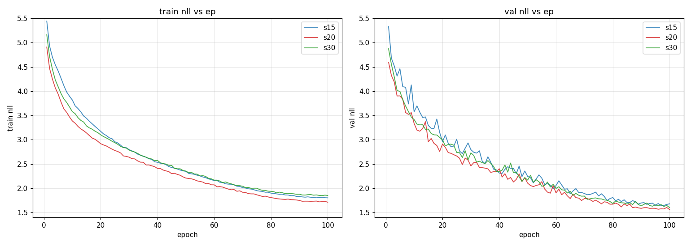
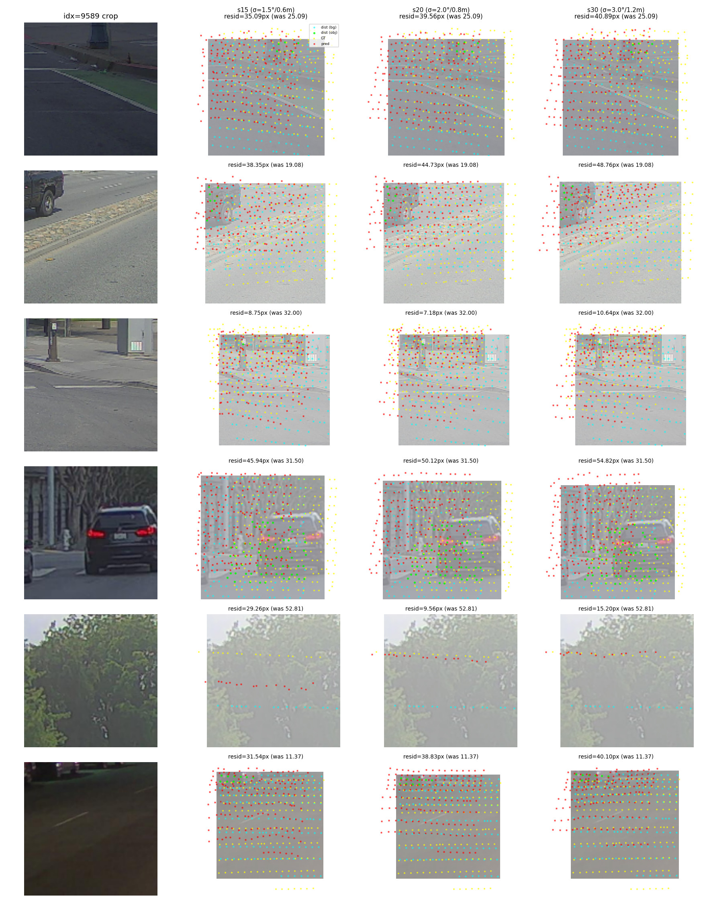

# PandaSet σ-sweep — 100ep tile baseline (deform_sl, frustum on)

**実験条件 (共通):**
- cache: `/mnt/nvme6t/e2e_calib_cache/pandaset_v3_tiled` (PS 103 scenes, front cam, 5×2 tile)
- arch: ConvNeXt + frustum (PT 2-layer @ d_local=32) + **deform_sl** + n_layers=4
- training: 100 ep, lr=3e-4 → 1e-7 cosine, batch=128, oversample=1, max_crop=384, img_size=128
- sigma sweep の差は `--rot-deg / --t-m` のみ:
  - s15 → ±1.5° / ±0.6 m
  - s20 → ±2.0° / ±0.8 m
  - s30 → ±3.0° / ±1.2 m

**ClearML (3 runs all completed):**
- s15: id `2fc3c978`
- s20: id `89e0ced2`
- s30: id `6ab5564b`

## val_nll 推移 (100ep 完走)

| ep | s15 | s20 | s30 |
|---:|---:|---:|---:|
|  1 | 5.330 | 4.597 | 4.874 |
|  5 | 4.462 | 3.902 | 3.996 |
| 10 | 3.574 | 3.335 | 3.416 |
| 20 | 2.958 | 2.910 | 2.998 |
| 30 | 2.794 | 2.460 | 2.728 |
| 40 | 2.313 | 2.402 | 2.346 |
| 50 | 2.243 | 2.104 | 2.167 |
| 60 | 2.055 | 1.904 | 1.995 |
| 70 | 1.891 | 1.786 | 1.838 |
| 80 | 1.808 | 1.671 | 1.685 |
| 90 | 1.696 | 1.585 | 1.637 |
| **100** | **1.678** | **1.562** | **1.602** |

## MSE-px 内訳 (last epoch)

| | nll | mse_all | obj_mean | obj_med | obj_p95 | bg_med |
|---|---:|---:|---:|---:|---:|---:|
| s15 100ep | 1.643 | 2.265 | 1.757 | 1.221 | 5.004 | 1.714 |
| **s20 100ep** | **1.562** | 2.254 | 1.783 | **1.183** | 5.258 | **1.571** |
| s30 100ep | 1.602 | 2.302 | 1.799 | 1.198 | 5.538 | 1.570 |

best val_nll は s20 で **1.562**、s30 が **1.602** で 2.5% 後退、s15 は **1.643** で最低。

## 学習曲線

- 訓練・val 両方で **s20 (赤) が一貫してリード**、特に ep30+ で他の 2 σ から離れる
- s15 (青) と s30 (緑) は ep70+ でほぼ重なる軌道 — **σ 不足 (s15)** と **σ 過剰 (s30)** が同程度の cost
- val 後半の oscillation は σ=1.5/3.0 の方が大きい (perturbation 範囲の広さで variance 増)

## サンプル比較 (同 val idx に各 σ best モデルを推論)

col1 = crop、col2-4 = s15/s20/s30 の予測。
- cyan = distorted (perturbation 後 LiDAR uv)
- lime = obj-distorted
- yellow+ = GT (perturbation 無し LiDAR uv)
- red× = model 予測

各 panel の "resid (was)" は予測後の平均残差 / 摂動直後の残差 [px]。

## 考察

1. **σ=2.0 が sweet spot**:
   - val_nll: s20 (1.562) < s30 (1.602) < s15 (1.643)
   - σ aug が effective dataset variation を増やす効果と、σ が過剰になると optimization 難化の trade-off
   - s15 (under-perturb) → easy regime に偏って汎化弱、s30 (over-perturb) → tail 暴れて calibration 緩む

2. **NLL の差は σ-calibration 由来** (MSE はほぼ tied):
   - mse_all: s15 2.265 / s20 2.254 / s30 2.302 — 差 ≤2%
   - bg_med: s20=s30=1.57、s15=1.71 → bg は **σ≥2.0 で同質**、s15 だけ undertrained
   - σ aug の主効果は **bg calibration 締め**

3. **obj は σ 増で tail が伸びる**:
   - obj_p95: s15 5.004 < s20 5.258 < s30 5.538
   - 動的物体 + 大摂動で残差 outlier が伸びる cost、s30 で最も顕著
   - obj_med は σ で改善 (s15 1.221 → s20 1.183 → s30 1.198)、median は OK だが p95 で痛む

4. **arch は σ=1.5-3.0 で robust**:
   - val_best 1.56-1.64 の狭いレンジに収束
   - perturbation magnitude の絶対値より、bg calibration の改善幅 (σ aug ボーナス) が支配的
   - σ ablation は **σ=2.0 を baseline 確定** で終了

## 次

- **stage 1 hybrid KV (`--frustum-dense`) を σ=2.0 で 100ep**: dense LiDAR-map + UV emb + DA/regular hybrid CA を s20 baseline (1.562) と比較、frame token 移行への必須前提
- frame token / cross-frame の curriculum は `project_uvemb_query_curriculum` (memory) 参照
