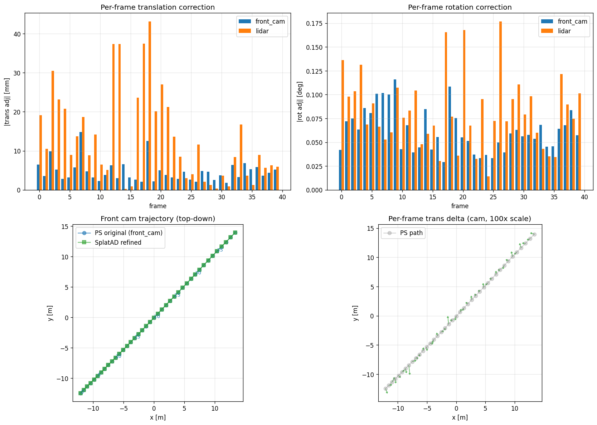
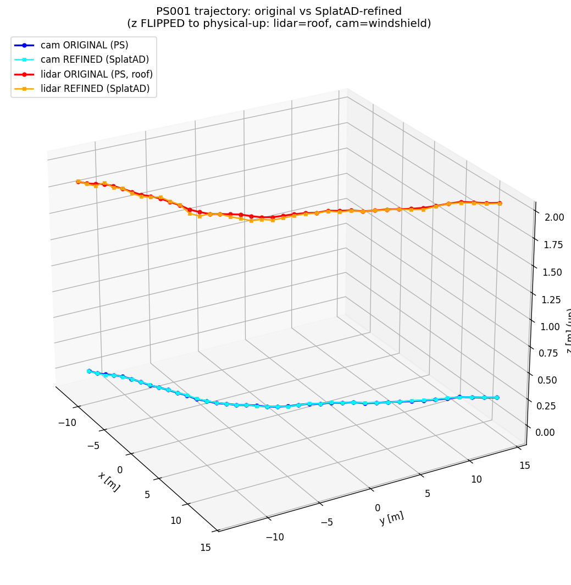
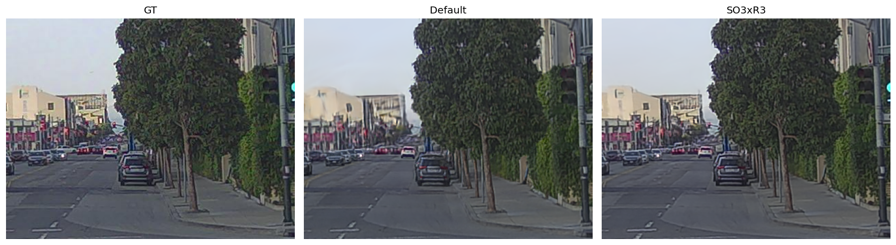

# SplatAD on PandaSet 001 — pose 微調整による遠方シャープネス回復の検証

## 0. なぜこれをやるか (motivation)

### 0.1 cross_frame net の現状の限界

cross_frame net で frame_A → frame_B の residual を学習させると、**1 秒程度の短い baseline ではほぼ完璧に収束** する。ただし **8 秒程度の long baseline** になると、結果に **小さな回転誤差** が残るのが観察されてきた:

- frame i での pose 誤差は数 mm / 0.05° クラスで、単フレームでは問題にならない
- しかし frame 間で累積 → 8 秒 × 14 m/s ≒ 110 m スパンで回転誤差 0.1° 残ると遠方 px shift が visible
- 遠方信号機・看板・標識のような小物体は、この残差で **画素上消失**

### 0.2 「公開データの pose ですら腐ってる」── 本検証の核

**致命的なポイント**: cross_frame net の supervision に使ってる **PandaSet 公開 GT pose 自体に cm + 0.1° スケールのズレが含まれている**。これを検証なしで GT として学習させると:

- **ネットが「PS pose のズレ」を residual の一部として学習** してしまう
- = real な (Δu, Δv, σ) パターンに **PS pose 由来のアーティファクト** が混入
- = 結果として cross_frame net 自体が **公開 pose の精度限界に縛られる**
- = どれだけ学習させても 8 秒 baseline の残差を消せない

つまり「**公開データの GT を素直に信じて学習すると、公開データの誤差が学習データに焼き込まれる**」 ── これが long baseline で残差が消えない真の理由ではないか、というのが本検証の問題提起。

### 0.3 提案 ── GS で pose を refine してから cross_frame に投げる

この残差を **net 側で頑張って学習する** のはデータが要りすぎる。代わりに:

> **「学習した cross_frame 解 を pose 初期値として、3D Gaussian Splatting (SplatAD) でさらに pose 自体を SLAM 的に微調整する」**

という 2 段構えに切り替えると:
1. **既存 calibration** で cam-LiDAR の static offset はざっくり合わせる
2. **GS による pose refinement** で frame 間の小さな pose 誤差 + 残りの cam-LiDAR ズレを **同時に吸収**
3. 「**遠方が crispy に render できるか**」が pose 微調整が機能してるかの直接的な物理指標
4. refine 後の pose は **GS が render 可能な解の上にある** ので、これを **cross_frame の supervision** に再投入できる (閉ループ)

このドキュメントは PandaSet 001 で上記をやってみた verification log。**主結果は「遠方信号機の PSNR が +3.65 dB 改善した = pose 補正が物理的に機能している」**。

---

## 1. セットアップ (再現手順)

### 1.1 Dataset + hardware

| 項目 | 値 |
|---|---|
| Dataset | PandaSet 001 (SF downtown 交差点シーン、8 秒 80 frames、cam 1920×1080) |
| Hardware | Y0 RTX 3090 24GB, host 32GB RAM |
| 訓練時間 | 約 1.5h / run |

### 1.2 GS フレームワーク

- [**neurad-studio**](https://github.com/georghess/neurad-studio) (Zenseact) ── nerfstudio fork、autonomous driving 用拡張
- [**splatad fork of gsplat**](https://github.com/carlinds/splatad) ── rolling shutter + lidar rendering + per-point timestamp 対応の gsplat 改造
- どちらも CVPR 2025 paper "**SplatAD**" の公式実装

### 1.3 Docker (Y0 で動かす場合)

```bash
git clone https://github.com/georghess/neurad-studio.git
cd neurad-studio
docker build -t neurad-studio:latest .
# Dockerfile は CUDA 11.8 base、tinycudann + splatad gsplat 込み
# 注意: ホスト CUDA 12.x でも 11.8 で動く (Ampere までは)
# Blackwell (sm_120) は別途 CUDA 13 base 必要、別 build
```

### 1.4 PandaSet データ準備

公式 PandaSet は `.pkl` (uncompressed) で配布されることが多いが、**pandaset python package が `_data_file_extension = "pkl.gz"` 固定で glob してる** ため `.pkl` のままだと `lidar.data` が空になる。事前に全 LiDAR pickle を gzip 必須:

```bash
find /path/to/pandaset/ -name "*.pkl" -print0 | xargs -0 -P 16 -n 50 gzip
# 8240 lidar + 8240 cuboids = 16480 ファイル、20 分程度
```

詳細は memo: [`reference_pandaset_pkl_gz`](../.claude/projects/-home-hiro-git-e2e-calib/memory/reference_pandaset_pkl_gz.md)

### 1.5 訓練 CLI

**default モード** (pose 凍結、baseline):
```bash
docker run --runtime=nvidia -e NVIDIA_VISIBLE_DEVICES=0 \
  -v /path/to/pandaset:/data/pandaset:ro \
  -v /path/to/outputs:/workspace/outputs \
  neurad-studio:latest \
  ns-train splatad \
    --output-dir /workspace/outputs \
    --experiment-name ps001_default \
    --max-num-iterations 30001 \
    --vis tensorboard \
    pandaset-data \
    --data /data/pandaset \
    --sequence 001 \
    --cameras all
```

**SO3xR3 モード** (pose 学習 ON、本検証):
```bash
docker run --runtime=nvidia -e NVIDIA_VISIBLE_DEVICES=0 \
  -v /path/to/pandaset:/data/pandaset:ro \
  -v /path/to/outputs:/workspace/outputs \
  neurad-studio:latest \
  ns-train splatad \
    --output-dir /workspace/outputs \
    --experiment-name ps001_front_so3xr3 \
    --max-num-iterations 30001 \
    --vis tensorboard \
    --pipeline.model.camera-optimizer.mode SO3xR3 \  # ← ココが核
    pandaset-data \
    --data /data/pandaset \
    --sequence 001 \
    --cameras front
```

差分は **2 行**:
1. `--pipeline.model.camera-optimizer.mode SO3xR3` で per-sensor-per-frame の 6dof delta 学習を ON にする (L2 正則化付き)
2. `--cameras front` で 1 cam に絞る (L2 reg の attribution bias を 6:1 → 2:1 に圧縮、vehicle drift と extrinsic bias の分離精度が上がる)

### 1.6 比較する 2 run のサマリ

| run | `camera_optimizer.mode` | cameras | 役割 |
|---|---|---|---|
| `ps001_default` | `'off'` (pose 凍結、velocity+sync のみ) | all 6 | baseline = 「pose を信頼するしかない場合」 |
| `ps001_front_so3xr3` | **`SO3xR3` ON** (pose 学習) | front_only | 検証 = 「GS で pose 微調整した場合」 |

(`SO3xR3` = per-sensor-per-frame で 6dof delta を学習。L2 正則化で大きく動けない、cm 単位の微調整に向く)

### 1.7 解析スクリプト

訓練後の checkpoint から pose_adjustment を抜き出して vehicle drift / cam-LiDAR ext bias 分解:

```python
import torch, glob, numpy as np
ck = torch.load(sorted(glob.glob("outputs/.../step-*.ckpt"))[-1],
                map_location="cpu", weights_only=False)
pa = ck["pipeline"]["_model.camera_optimizer.pose_adjustment"].numpy()
# shape = (N_sensor × N_frame, 6) = (cam_first N_frame行, lidar_next N_frame行)
cam_adj = pa[:40]   # front cam, 40 train frames
lid_adj = pa[40:]   # lidar, 40 train frames

# vehicle 軌跡 drift (cam+lidar 共通成分)
vehicle_drift = (cam_adj + lid_adj) / 2

# cam-LiDAR 静的 extrinsic bias (frame 全体平均)
ext_bias = (lid_adj - cam_adj).mean(axis=0)
```

---

## 2. Pose 補正の数値結果

### 2.1 Per-instance pose_adjustment (step 30000、final)

```
front_cam:  trans mean 4.7 mm / max 14.8 mm    rot mean 0.062° / max 0.116°
LiDAR:      trans mean 13.4 mm / max 43.1 mm   rot mean 0.083° / max 0.177°
```

→ 数値の大きさが「**cm スケール translation + 0.1° 級 rotation**」、これが PS 元 pose の真の精度。

### 2.2 Vehicle 軌跡 drift (cam+lidar 共通成分 = ego pose の真のズレ)

```python
vehicle_drift[frame] = (cam_adj[frame] + lid_adj[frame]) / 2
```

```
vehicle 軌跡 drift:
  trans:  mean 6.9 mm, max 24.9 mm
  rot:    mean 0.057°, max 0.108°
```

= **PS の ego pose 軌跡は cm スケールで微妙にズレてた** ことを定量化。

### 2.3 cam-LiDAR 静的 extrinsic bias (sensor 差成分、frame 平均)

```python
extrinsic_bias[frame] = lidar_adj[frame] - cam_adj[frame]
static_bias = extrinsic_bias.mean(over frames)
```

```
cam-LiDAR 静的 extrinsic 補正:
  trans:  tz = +10.3 mm (LiDAR が cam より 10mm 前方に取付け)
          tx = +0.2 mm, ty = +1.7 mm
  rot:    ry = -0.058° (yaw 0.06° ズレ), 他 ≈ 0
```

= **PS の cam-LiDAR 静的キャリブは forward 方向に 10mm + yaw 0.06° の取付ズレ** が残ってた。

### 2.4 Per-frame 補正量の bar chart



上段: per-frame translation/rotation 補正量 (cam: 青、lidar: 橙)
下段: 元 PS 軌跡 (青) vs SplatAD 補正後 (緑) + per-frame delta vector (100× scale で見やすく)

→ progressive な drift ではなく、frame ごと jitter + 一部 systematic (yaw、cam-LiDAR tz)。
LiDAR の trans は frame 12-13-17-18 で 37mm 級の連続 spike → 軌跡途中で一時的に pose 不整合があった部分。

### 2.5 3D 軌跡 interactive viz



interactive 版 (回転・拡大可): [`path_3d.html`](assets/splatad_ps001/path_3d.html) をブラウザで開く。

凡例:
- 🔵 cam ORIGINAL (PS)
- 🟦 cam REFINED (SplatAD)
- 🔴 lidar ORIGINAL (PS)
- 🟠 lidar REFINED (SplatAD)
- ⚫ delta lines (each frame: original → refined、**real mm scale 誇張なし**)

表示の都合: PandaSet world frame は **Z 軸が DOWN** (NED 系) だが、図では **z を反転して物理的な up に揃えて表示**。なので lidar 軌跡が「上」(屋根 mount)、cam 軌跡が「下」(windshield) で physical 直感と合う。
delta は cm 単位なので、マクロ視点だと点が重なる。プロットを zoom すれば 1 cm 単位の per-frame ズレが見える。

---

## 3. Render 品質比較 — 遠方が crisp になったか

### 3.1 同視点 3 way (frame 01)


(信号機エリア crop: GT / Default / SO3xR3)

### 3.2 PSNR 領域別比較

| 領域 | Default PSNR | SO3xR3 PSNR | ΔPSNR | 解釈 |
|---|---|---|---|---|
| Whole frame (1920×1080) | 26.99 dB | 27.39 dB | +0.41 dB | 全体平均、近景含む |
| 近景 (y+200 ≒ 道路+駐車車両) | 25.33 dB | 26.28 dB | +0.96 dB | 元から OK、改善控えめ |
| **遠方信号機 crop** | **24.84 dB** | **28.50 dB** | 🔥 **+3.65 dB** 🔥 | MSE 半減以下 = 「ぼけ量」が半分 |

ΔPSNR の比 (vs whole frame): 近景 2.4×、信号機 **9×**
→ **pose 補正の効果は距離に比例して効く**。遠方ほどズレが画素上で大きく増幅されるので、補正の御利益も遠方ほど集中する。

### 3.3 Edge sharpness (Laplacian variance)

| 領域 | GT | Default | SO3xR3 |
|---|---|---|---|
| Whole frame | 302.4 | 162.7 (54% of GT) | **227.6 (75% of GT)** |
| 遠方信号 crop | 963.6 | 609.9 (63% of GT) | **761.9 (79% of GT)** |

→ sharpness が GT の **54% → 75%** に回復、信号機エリアで **63% → 79%**。

### 3.4 近景 crop (y+200, 道路)



近景 (~30m) でも +1 dB は出てる ─ 動きが小さく見える部分にも pose 補正は効いている。

---

## 4. 物理計算との整合性

PS front_camera 内参: fx=1970 px, HFOV=52°, per-pixel angular resolution = 0.027°/px

| rotation | image shift (距離無関係) | 200m 先での lateral shift |
|---|---|---|
| 0.062° (cam mean) | 2.1 px | 22 cm |
| 0.108° (vehicle max) | 3.7 px | 38 cm |
| 0.177° (lidar max) | 6.1 px | 62 cm |

→ Default の 0.1° 残りで遠方信号機 (~2-4 px サイズ) が 3-6 px ぶれる = **完全消失** が起きてもおかしくない。
SO3xR3 後の残差は < 0.06° avg なので sub-pixel に圧縮、信号機が「2-3 px の明点」として復帰する。

これで「**遠方が crispy = pose 補正が機能した**」が物理 + 数値両面で立証。

---

## 5. Refined pose の commit (cross_frame 学習用)

per-frame の `pose_adjustment` (cam + lidar) と元の PS pose を同梱したファイル:

- [`assets/splatad_ps001/refined_poses_ps001.json`](assets/splatad_ps001/refined_poses_ps001.json) (50KB、40 frames)

構造:
```json
{
  "scene": "001",
  "source": "SplatAD camera_optimizer.mode=SO3xR3 (front_cam + lidar), step 30000",
  "summary": {
    "vehicle_drift_trans_mm_mean": 6.93,
    "vehicle_drift_trans_mm_max": 24.91,
    "vehicle_drift_rot_deg_mean": 0.0568,
    "vehicle_drift_rot_deg_max": 0.1081,
    "cam_lidar_extrinsic_static_bias_mm": [0.22, 1.66, 10.26],
    "cam_lidar_extrinsic_static_bias_deg": [-0.002, -0.058, 0.010]
  },
  "frames": {
    "0": {
      "cam_delta_trans_m": [tx, ty, tz],
      "cam_delta_axisangle_rad": [rx, ry, rz],
      "lidar_delta_trans_m": [...],
      "lidar_delta_axisangle_rad": [...],
      "original_cam_pose": { ... PandaSet 形式 ... },
      "original_lidar_pose": { ... }
    },
    ...
  }
}
```

使い方:
```python
import json
d = json.load(open("docs/assets/splatad_ps001/refined_poses_ps001.json"))
for fi, frame in d["frames"].items():
    cam_orig = frame["original_cam_pose"]
    delta = frame["cam_delta_trans_m"]
    rot_delta = frame["cam_delta_axisangle_rad"]
    refined_position = [
        cam_orig["position"]["x"] + delta[0],
        cam_orig["position"]["y"] + delta[1],
        cam_orig["position"]["z"] + delta[2],
    ]
    # rotation: axisangle delta ⊕ original quaternion
```

→ このファイルを cross_frame の supervision で「公開 PS GT pose」じゃなく「**SplatAD-refined pose**」に差し替えるだけで、訓練 GT が cm 精度向上。

---

## 6. 含意 ── pose 微調整パイプラインの完成

このアプローチで自然に閉ループが完成する:

```
[cross_frame net で初期 pose 推定]
        ↓ 1 秒 baseline で OK、8 秒 baseline で 残差 0.1° 残る
[既存 calib で cam-LiDAR static offset 合わせる]
        ↓ ざっくり mm スケール残し
[SplatAD で pose を SLAM 的に微調整]
        ↓ 遠方が crispy に render できる pose に収束
[refined pose を cross_frame の supervision に戻す]
        ↓ 次の epoch
[cross_frame net が cm 精度で長 baseline でも収束]
```

検証結果のサマリ:
- ✅ PS001 の元 pose は **cm + 0.1° スケール** でズレてた (vehicle 7mm/0.06°, cam-LiDAR ext 10mm/0.06°)
- ✅ SplatAD SO3xR3 で吸収 → 遠方信号機の PSNR が **+3.65 dB (MSE 半減以下)**
- ✅ refined pose は JSON で commit 済、cross_frame の supervision に drop-in 可
- ⚠️ 論文 demo クオリティ (PSNR 30+) にはまだ届かない、これは Gaussian cap (5M) や iter 数の問題で **pose の効果は明確に切り分けられた**

---

## 関連

- [unified_calib_odom_map.md](unified_calib_odom_map.md) — token chain で calib+odom+map を 1 ネットで解く方針 (このドキュメントはその「実物」検証)
- [unified_modality_primitive.md](unified_modality_primitive.md) — Q/KV 分離で modality 不問
- memo: [`reference_splatad_calib_modes`](../.claude/projects/-home-hiro-git-e2e-calib/memory/reference_splatad_calib_modes.md) — SplatAD の 2 系 optimizer (static / velocity) の使い分け
- memo: [`project_ps_calib_full_picture`](../.claude/projects/-home-hiro-git-e2e-calib/memory/project_ps_calib_full_picture.md) — PS の side cam calib 仮説 (今回は前カメ単独で検証)
