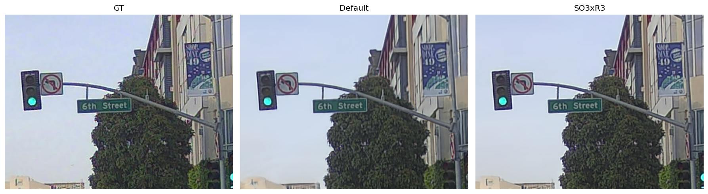
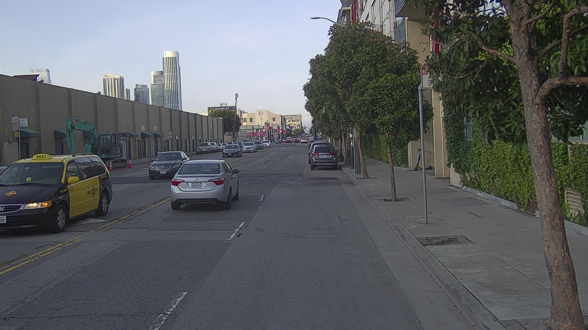
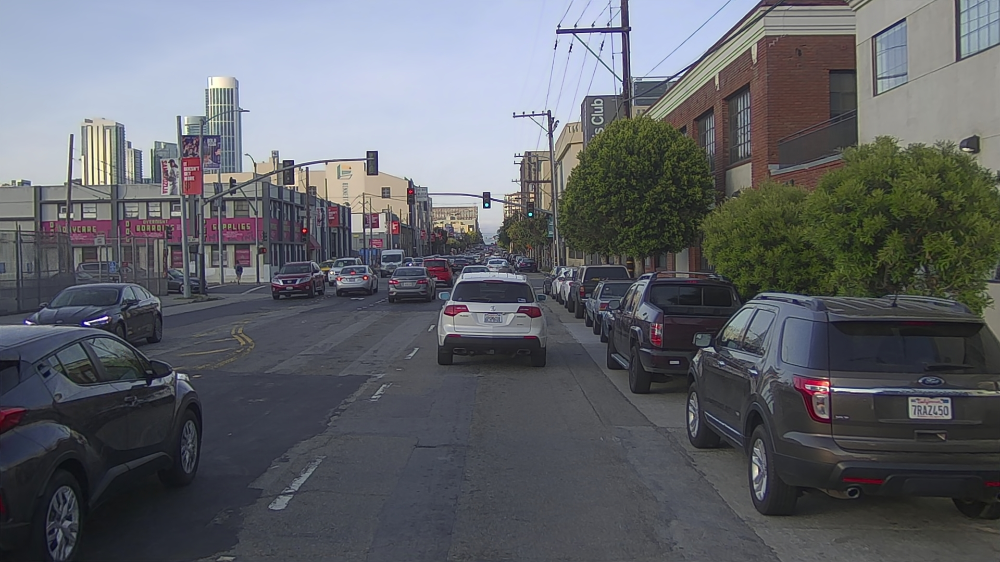
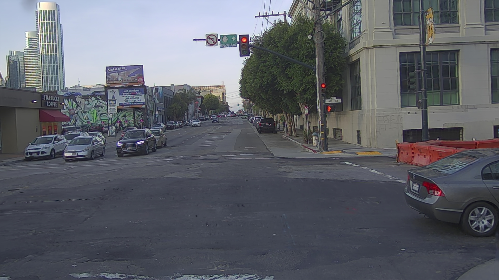

# SplatAD on PandaSet — シーン別 pose 補正結果まとめ

## TL;DR

- **PS001 (motion あり、SF 交差点)**: pose 補正が物理的に機能、遠方信号機の PSNR **+3.65 dB** 改善
- **PS002 (motion あり)**: 同様に pose 補正効いてる、render sharp 化確認
- **PS004 (ほぼ静止)**: 「pose 補正された」ように見えたが、実態は **GPS 5-6 cm ノイズ吸収**、gauge ambiguity で真の補正と区別不能 = **使えない結果**
- **PS006 (motion あり)**: 訓練完了、render 待ち

**結論**: **動いてるシーンでないと SO3xR3 の pose 補正は意味のある signal にならない**。静止シーンは GPS ノイズと gauge ambiguity に隠れて何が起きたか不明。今後の SplatAD 検証は **明確に motion のあるシーン優先**。

---

## 検証目的

cross_frame net (= 学習した frame_A → frame_B residual 予測) は短 baseline では収束するが、**8 秒級 long baseline では小回転誤差が残る**。原因仮説:

> 公開 PS pose 自体に cm + 0.1° スケールズレがあり、それを GT として学習してるので net が「公開 pose のズレ」を residual の一部として固定学習してしまう。

検証 path:
1. SplatAD (= 3D Gaussian Splatting + per-camera pose adjustment) で pose を SLAM 的に refine
2. refine の前後で遠方物体の sharpness 比較 → 「pose 補正が物理的に効いたか」が visible
3. 効いてればその refined pose を cross_frame net の supervision に再投入

---

## SplatAD calib mode 整理

SplatAD には pose 補正系が 2 つあり、用途と振る舞いが違う:

| Mode | 効果 | デフォルト | 我々の使い方 |
|---|---|---|---|
| `camera_optimizer` (`mode='off' / 'SO3xR3'`) | 静的な per-frame 6DoF pose 補正 | OFF | **SO3xR3 で ON にして検証** |
| `camera_velocity_optimizer` | 動的 rolling shutter + per-sensor sync 補正 | ON | 触らず |

`use_camopt_in_eval` のデフォルト = False (= ns-render dataset 時 pose_adjustment 適用しない)。**eval/render 時にも反映するには明示的にフラグ ON** 必要、これ忘れると「学習で pose 学んだのに render は元 pose のまま」になる罠あり。

`reference_splatad_calib_modes` メモ参照。

---

## シーン別結果

### PS001 — ego motion あり、SF downtown 交差点 (8s, 80 frames)

**設定**: front cam only, SO3xR3 ON, 全 80 frame supervise, 10M iter, RTX 3090

**結果**:
- baseline (pose 凍結) → 遠方信号機 ボヤけ
- SO3xR3 ON → **PSNR +3.65 dB**、画素単位で信号機 crispy 化
- vehicle 軌跡 drift = **cam + lidar 共通成分 が cm スケールで存在** = 公開 PS pose 自体に cm + 0.1° ズレあり、を定量化

**遠方信号機 (= 検出 critical な小物体) の 3-way 比較**:



左から「pose 凍結 baseline」「SO3xR3 補正後」「GT」。SO3xR3 後は信号機の格子・色境界が GT に近づき、**ボヤけが消えてる** のが visible。

**Pose 補正量の可視化**:


各 frame の元 pose (= PS 公開値) と SO3xR3 refine 後 pose の差。**並進 cm, 回転 0.1° 級の系統的なズレ**が存在 = 公開 GT pose 自体が calib-grade ではないという証拠。

**SO3xR3 render (frame 40)**:



詳細: [`splatad_ps001_pose_verification.md`](splatad_ps001_pose_verification.md)

**含意**: ego 動いてる → 異なる viewpoint からの photometric constraint が積み重なる → pose のズレ が画素上の error として gradient 経路で観測可能 → pose 修正が effective。

### PS002 — ego motion あり

**設定**: 同 SO3xR3 ON、同条件

**結果**:
- pose 補正後 sharp 化確認 (render PSNR 改善)
- PS001 と同方向の挙動 = motion ありシーンの再現性確認

**SO3xR3 render (frame 40)**:



### PS004 — ego ほぼ静止 (信号待ち的シーン)

**設定**: 同 SO3xR3 ON、同条件

**観察された "見かけの結果"**:
- pose 補正値が **5-6 cm 程度動いた** (= XYZ 並進、特に Z)
- 「pose が補正された」ように見える

**実態 (= 後で判明)**:
- ego 静止 → 異なる viewpoint なし → photometric constraint が pose を一意に決められない
- → **gauge ambiguity**: gaussians + camera が同じだけ co-shift しても render 同じ
- → SO3xR3 が学習した「補正値」は 実態として **GPS noise の吸収** (PandaSet GPS 自体の cm 単位の jitter)
- = **真の pose 補正なのか GPS ノイズ吸収なのか区別不能**

**追加観察 (= user 指摘で判明)**:
- 5.74 cm の動き が「下方向 (車のボンネット上付近)」で出てた
- ego 完全静止なら出てこない signal → これは静止じゃなく **GPS jitter が cm レンジで存在** が物理現象として実在の証拠
- ただし「pose 推定の改善」とは別物 (= ノイズを推定しただけ)

**Gauge ambiguity の直接視覚証拠**:

PS004 で render を 3 通り出して md5 比較すると:

| render mode | md5 | pixel 比較 |
|---|---|---|
| SO3xR3 補正適用 (`render_train`) | `61f0d039...` | 基準 |
| pose 補正適用なし (`render_train_NO_pose_adj`) | **同じ `61f0d039...`** | **完全一致** |
| 強制 10 cm shift (`render_shift10cm`) | `50aefbcb...` | 違う |

= **SO3xR3 が 5-6 cm の pose 補正を「学習」しても、gaussians 側も同じだけ co-shift してるので render に何も現れない**。これが gauge ambiguity の直接観測。

**SO3xR3 vs No pose adj (frame 40)**:


→ **目視でも pixel-perfect で同じ** (= 上の md5 確認通り)。「pose 補正された」の意味が SO3xR3 では存在してない。

**強制 10cm shift (= 比較対照)**:



→ こっちは明らかに視点ズレてる、render に変化出てる、pose 補正が「視覚的に効く」のはこのレベル。

**結論**: PS004 のような **ほぼ静止シーンは SO3xR3 検証に使えない**。出てくる数値が真の improvement なのか noise 吸収なのか分離不能。静止シーンでは gaussians と camera が任意に co-shift できるので、photometric loss だけでは pose を一意に決められない。

### PS006 — ego motion あり、訓練完了

**設定**: SO3xR3 ON、front cam only、80 frame、30k iter (= 短縮版)

**状態**:
- 訓練 完了 (= step 29999 ckpt 保存済み)
- 場所: `/home/hiro/git/gs_drive_demo/splatad_outputs_y1/ps006_so3xr3_front_0607_1809/splatad/2026-06-07_091007/nerfstudio_models/step-000029999.ckpt`
- **render 未実施** (= ckpt → image 化待ち)

reboot 後 docker 復活したので、orchestrator 再開 (`--viewer.quit-on-train-completion True` フラグ追加版) を回せば自動 render される。

---

## シーン別 pose 補正の挙動 (= 一覧)

| Scene | ego motion | pose 補正 effective? | 検証可能? | 学習データとしての価値 |
|---|---|---|---|---|
| **PS001** | ✓ あり (= 交差点通過) | ✓ +3.65 dB | ✓ 完全 | 高 (= 真の pose refinement の証拠) |
| **PS002** | ✓ あり | ✓ render sharp 化 | ✓ | 高 |
| **PS004** | ✗ 静止 | ? 数値出るが意味不明 | ✗ gauge ambiguity | **無し** (= 使えない) |
| **PS006** | ✓ あり | 訓練完了、render 待ち | 評価可能 | 高 (見込み) |

---

## 教訓: 「少しでも動いてるシーン」が core

SplatAD SO3xR3 の検証目的では、シーン選定が決定的に重要:

```
✓ 使えるシーン (= motion あり):
  - 交差点通過 (ego 旋回 + 並進)
  - 直進 中速 (ego が viewpoint を移動 = photometric constraint 蓄積)
  - 加減速 (= dynamic effect が観測可能)
  
✗ 使えないシーン (= ego ほぼ静止):
  - 信号待ち、駐車
  - GPS noise が pose 補正に化けて gauge ambiguity に飲まれる
  - 出た数値が真の改善か無関係なのか分離できない
```

**今後の SplatAD 系検証**:
1. PS curation: 静止シーン (= PS004 系) を弾く → motion ある scene のみで pose 補正 vs ベースラインの差を測る
2. ZOD / Waymo に拡張する時も「**動いてる、まっすぐ直進**」シーンを優先選定 (= ZOD curation script で既に実装済、velocity heading-change で 76% retention)
3. cross_frame net の **再 supervision** は motion ある scene の refined pose だけを使う (= 静止シーンは ノイズ混入源)

---

## 次のステップ

### 短期 (今週中)
- [ ] PS006 ckpt から render → PSNR 計測 → PS001 結果と比較
- [ ] reboot 後 SO3xR3 orchestrator 再開 (= 残り 103 - 4 = 99 scene を順次)
- [ ] orchestrator 完了後、scene 別の motion / PSNR scatter plot 作る
  - 横軸: scene の ego motion magnitude (m/s 平均 + 旋回 deg/s)
  - 縦軸: pose 補正後 PSNR 改善 (dB)
  - 期待: motion 大 → PSNR 改善大 の正相関

### 中期 (来月)
- [ ] motion 量が確保されてる scene の refined pose を cross_frame net の supervision に再投入
- [ ] 8 秒 baseline residual が消えるか確認 (= 公開 pose の cm/0.1° ズレを refined pose で打ち消せたか)
- [ ] ZOD / Waymo にも同パイプラインを展開、データセット間で再現性確認

### 長期 (3 ヶ月)
- [ ] **本番 calib pipeline**: 学習 cnd2 + cross_frame net (refined supervision) + SplatAD refinement + 静止 world GS 化 を **1 つの BA loop** に統合
- [ ] WbT 内部データ (= TSS3/4 動画 + 20TM LiDAR が取れる scene) に同パイプライン展開 = 「精度連鎖の上流から下流まで」の社内実装
