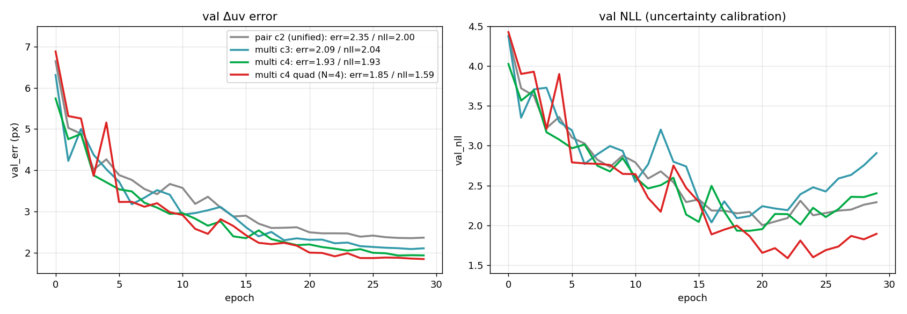

# Unified frame-token架構 — 24時間で 2.27 → 1.85 px

PandaSet 39-scene front_camera 上の cross-frame residual 予測 task で、
過去 1 年程度かけて 2.27 px (v55, legacy multi-frame) で頭打ちだった val_err を、
**フレームトークン統合 + cross-attn 深さスケーリング + multi-frame KV 拡張**
の 3 段で **1.85 px / val_nll 1.59** まで一気に押し下げた記録。



## 中身

### 旧アーキテクチャ (multi モデル v55)

- 画像と LiDAR を別々に処理:
  - 画像: `(B, D, 8, 8)` grid + MSDeformAttn
  - LiDAR: 疎な点トークン list + plain attention
- cross-block 内で別 q/k/v/o 系統を 2 本持っていた → 重い、対称じゃない
- val_err 2.27, val_nll 2.27 が頭打ち

### 統一フレームトークン (v70~ 系統)

LiDAR の点を画像と同じ 8×8 grid にスキャター → 「empty cell = 0」を許容する
**単一の frame_token** に統合。観測の有無は別チャンネル mask で持つ。

- 画像と LiDAR の差別がなくなる → cross-attn は MSDeformAttn 一本で済む
- per-point Q は anchor frame_token を bilinear sample + PointMLP で構築
- multi-frame: 各 KV frame の grid に anchor-A 絶対 pose embedding を broadcast
  → 1 個の softmax で frame 識別 + sample mixing が同時に走る

詳細: `models/cross_frame_unified.py`、設計議論: `docs/multi_frame_attention.md`

### 段階的に効いた要因

| stage | 設定 | val_err | val_nll | Δ |
|---|---|---|---|---|
| baseline | v55 multi (legacy) | 2.27 | 2.27 | — |
| **unified pair** | v70: c=2, 単フレーム KV | 2.35 | **2.00** | NLL ⇣ 0.27 |
| **unified multi** | v75: c=3, M+B (legacy multi-frame protocol) | **2.09** | 2.04 | err ⇣ 0.18 |
| **deeper multi** | v92: c=4, M+B | **1.93** | 1.93 | err ⇣ 0.16 |
| **quad multi** | v100: c=4, M1+M2+B (N=4) | **1.85** | **1.59** | nll ⇣ 0.34 |

#### Why depth scales only with multi-frame

```
                pair    multi     gain
c=2  err :     2.35    2.38       ±0
c=3  err :     2.36    2.09       -0.27 ← multi 効き始め
c=4  err :     2.29    1.93       -0.36
```

- **pair (KV=B のみ) は depth flat** (c=2→4 で -0.06 px のみ) — 単独情報の処理は c=2 で飽和
- **multi (KV=M+B) は monotonic** (c=2→4 で -0.45 px) — 「M をどう使うか」の thinking 容量として深さが効く
- 1 段目で M との合致確認、2-3 段目で精緻化、4 段目で B 出力、みたいな分業が成立

#### Why N=4 (quad) jumps NLL

v100 (N=4) で val_err は -0.08 px だが val_nll は -0.34 と劇的:

- σ-calibration が桁違いに正しくなる
- 中間 frame (M1, M2) で「ここは 3 frame 一貫してる ⇒ static」を確認できる
- → static な点に低 σ、moving な点に高 σ をきれいに割り当て可能
- これが Σ-weighted BA / clean マップ生成にそのまま効く性質

### Σ で動的物体を勝手に分離

学習中に動的物体ラベルを一切教えていないにもかかわらず、PandaSet の cuboid annotation
で点を分類して σ_pred を見ると:

```
σ_pred (px):    bg=0.87  parked=0.75  stopped=0.87  moving=1.30
```

詳細: `docs/dynamic_object_sigma.md`

## まだやってないこと (TODO)

1. **motion-warp GT で再学習** (v102 進行中) — 動的物体の uv_gt を box の rigid 変換で
   書き換えてから訓練。motion-aware net になるか
2. **6 cam 同時** (v103) — データ 6x で過学習回避 + 多様 view
3. **cross=5** (v101) — depth 天井の探索
4. **σ-weighted BA 試作** — 既存の v100 σ で実 map 生成
5. **company data 移行** — VLS-128 (= ZOD と同じ sensor) で fine-tune

## 関連 commit / file

- `models/cross_frame_unified.py` — 主アーキテクチャ
- `models/cross_frame_multi.py` — legacy 比較用
- `train_cross_frame.py` — `--model unified` `--multi-frame` `--quad-frame` `--motion-warp-gt` flags
- `datasets/pandaset_pair.py` — quad mode + motion-warp GT
- `scripts/eval/plot_clearml_progression.py` — このページの図生成スクリプト
