# 自動運転事業における垂直統合と情報インテグレーション

## 1. 問い

> 既存自動車メーカー、デジタル企業、新興 EV メーカーが乱立する中、自社 (WbT) はどの層で価値を出すべきか?

「車を売る」「データを売る」「シミュレーションを売る」のいずれかに留まる事業者は、長期的に「車・地図・情報・センサー・運用」のすべてを **自前で繋いだ垂直統合プレイヤー** に上流からも下流からも侵食される。垂直統合の本質は「全部やる」ではなく、**データから自動化された価値創出までの間で、外部依存になっている層が無いこと** である。

### 上流 / 下流 とは

```
上流 = 「車を販売 / 運用する側」 = Waymo, Tesla, Cruise, BYD
       ↑ 統合された商品 (= ロボタクシー、自動運転車) を最終 顧客に提供
       ↑ データ・地図・センサー・モデルすべてを自社で繋いで「動く車」として 売る
       ↑ ここに到達してない事業者は「車にならない部品の供給者」で終わる

垂直統合プレイヤーの本体 (= "車・地図・情報・センサー・運用" 全層)

下流 = 「自動運転開発部隊に売る側」 = Velodyne, Innoviz, Scale.ai, Argo Verse
       ↓ 開発工程の 1 層 (= LiDAR、annotation, シミュレータ) を切り売り
       ↓ 顧客は完成車メーカーや AD 開発部隊
       ↓ 上流の垂直統合プレイヤーが「自前で作る」と決めた瞬間に消える
```

**侵食のメカニズム**:

- 上流からの侵食: Waymo のように地図 / annotation / シミュレータを自前化すると、外注先が不要になる
  → 部分しか売ってない事業者は「主要顧客が自社で作り始めた」時点で売上消失
- 下流からの侵食: Scale.ai / Innoviz が独自に車を出すか、メーカーと深く JV すると、独自地図・独自データ流通網を握る
  → 上流側でも「データ層を握られた」状態になり交渉力低下
- **結局、両方の中間にいる事業者 (= 完成車作らず、データ層も持たない) が真っ先に消える**

WbT の現位置: **両方の中間**。車は持ってる (= Toyota brand) が AD は他社依存、データ層 (= 地図 / annotation pipeline) は外注 (= Scale.ai)、シミュレーションは独自部隊あるが商品化されてない。**上流 (Waymo, Tesla) からも下流 (LiDAR + annotation 系ベンチャー) からも侵食受ける構造的弱点**。

### 1.1 「今からスタートアップを作るならどう設計するか」という視点

経営判断は **既存事業を守る** ではなく **「ゼロから始めるなら何に張るか」** で逆算するのが健全。

#### 何が今ホットで、何が本当に重要か

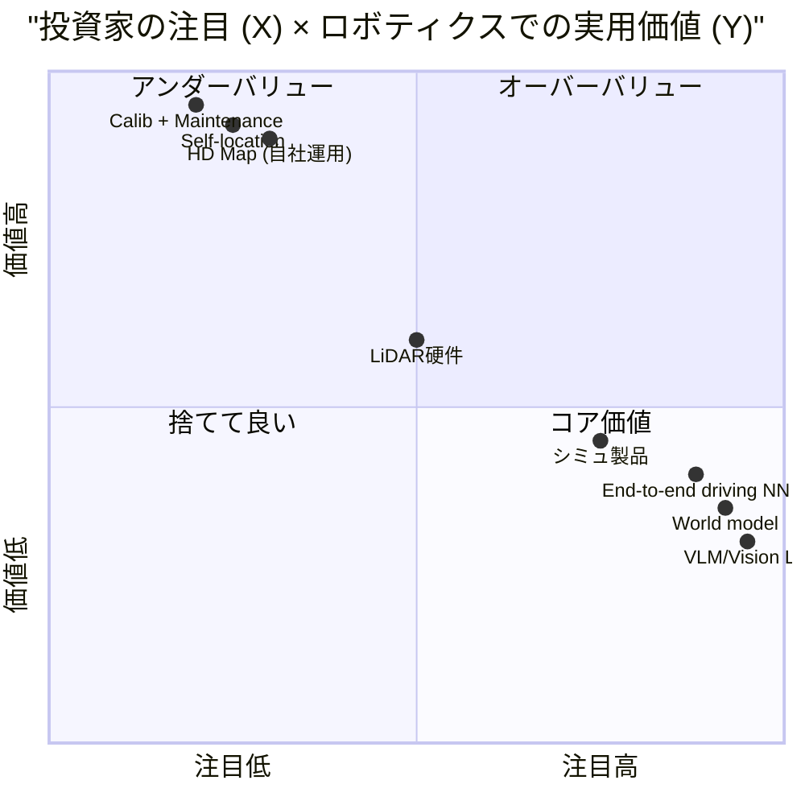

- **VLM / 世界モデル / E2E driving NN**: 投資家の関心は高いが、実用 production 価値は劣後。データ整備の問題を「巨大モデルが万能」と勘違いさせる構造
- **Calib + 地図 + 自己位置**: 派手じゃないが、ロボティクス全体の実用価値の支配項。これが真に整備されていないと VLM も世界モデルも価値を出せない

**経営層が VLM 系出身 / 投資家対応モデル偏重** の組織が多いが、これは技術 risk が最大化する選択である。本当の risk 最小化は **「キャリブを正しく行い、保持する仕組みを運用し、それを基に地図を作り、出来るだけ多くの情報を持った状態」** に至ること。

#### Waymo の真の learning

Waymo が**自社の軟化**で確立したのは **モデルではなく、上記のキャリブ・地図・自己位置の運用基盤**。13 年かけて磨いたのはこの「地味な基盤」であり、これが結果として E2E や VLM を後付けしても効くベースになっている。「Waymo の真似」=「VLM を頑張る」ではなく「**まず基盤を 6 ヶ月で再現する**」が正解。

### 1.2 自動運転の外側への拡張視点

自己位置 + 地図 + キャリブの基盤は **ロボティクス全般 + ロジスティクス** へ転用可能。これが事業展開の真の起点になる。

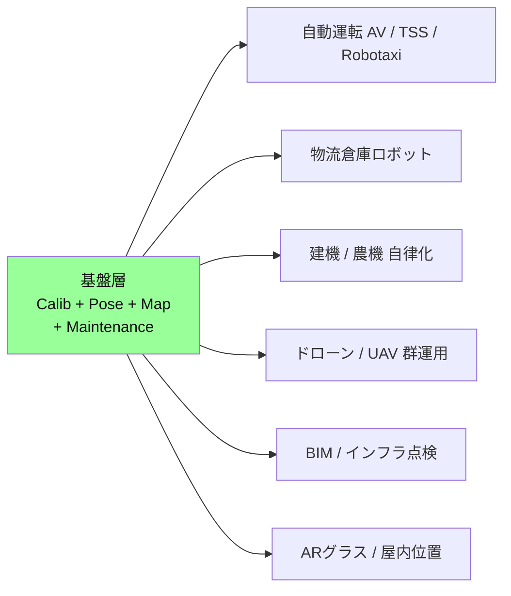

- 物流倉庫: Amazon Robotics / KIVA 系の壁は「**変動環境での再キャリブ運用**」、まさに自動運転で確立する技術と直結
- 建機 / 農機: Komatsu / Caterpillar が自律化を進めるが、地図と自己位置精度の天井に当たっている。トヨタの cm 精度基盤を OEM 提供で抜本解決可能
- ドローン群運用 / インフラ点検: 既存 SfM ベースは精度天井あり。GS + Calib 連鎖で高精度 BIM 生成
- AR / 屋内位置: cm 精度な「世界の表現」が出力できると消費者向け AR の基盤になる

**自動運転は最初の application、しかしその基盤技術は他産業への拡張で一回り大きな事業に育つ。これが、startup として再設計するときの戦略選択。**

### 1.3 HERE / TomTom の技術的限界

既存の地図ベンダ (HERE Technologies, TomTom, Mapbox など) が抱える構造的問題:

- **アプリ層への垂直統合ができない**: 地図 SDK 提供までで止まり、車載 AI や自律走行へ直接統合する組織能力を持っていない
- **地図更新の頻度・密度が低い**: cm 級ではなく dm/m 級が業界水準、自動運転の要求精度に届かない
- **calib / 自己位置との連結が薄い**: 地図と運用パイプラインが分離してるので「車載の calib 状態が地図にフィードバックされない」 → 結局単発データを売り続けるしかない

→ WbT が cm 精度 + 連結運用 + 自社車載との垂直統合まで一気に到達すれば、**HERE / TomTom が決して到達できないレベル**の地図ベンダかつ AI 提供者になれる。

これは「自動車メーカー」ではなく「**ロボティクス精度基盤を提供する会社**」への業態転換そのもの。

## 2. 価値の連鎖の全体像

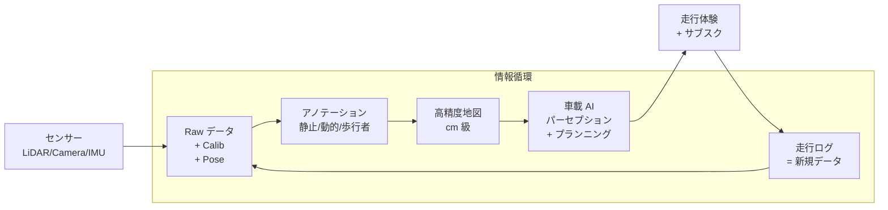

途中の 1 層でも外部依存すると、データ品質か速度かコストのどれかで負ける。

## 3. 業界の死角: 「垂直統合された精度連鎖」は論文では取れない

地図を作る技術論文は山ほどある。しかし **キャリブレーション + 動的センサ補償 + マップ生成 + アノテ転用** を**統合した「精度連鎖」全体**を扱った論文は一本も存在しない。

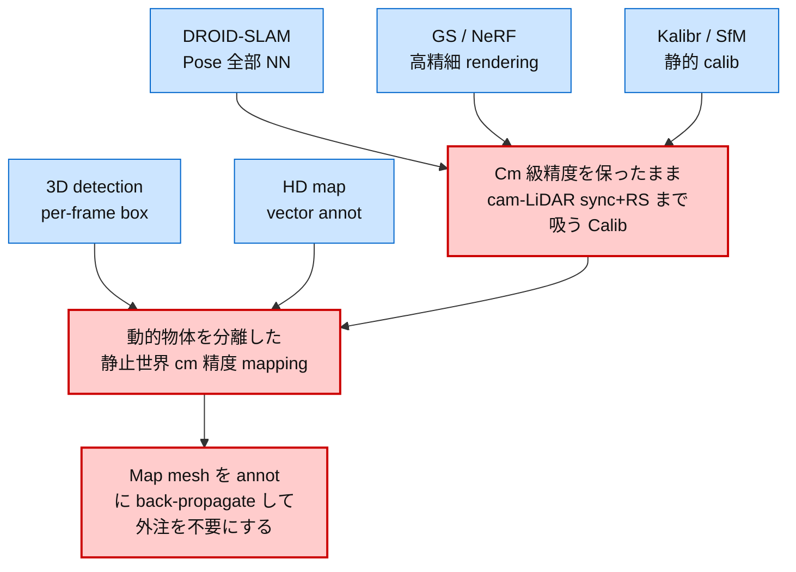

- **DROID-SLAM** は概念上最も近い (NN で pose 全部解く) が、calib 誤差・動的物体・cm 精度 mapping までは扱わない
- **Gaussian Splatting** は「cam 動かしても calib がある程度合ってれば」綺麗に走る = 逆に言うと **calib が崩れた瞬間に破綻**。しかも 1 シーン 30 分〜時間単位の計算量で実用 production には重すぎる
- → GS は **「pose を綺麗にするための高負荷な道具」** と位置づけるべき。そしてその出力 (pose) を annotation pipeline に転用するアイデアは業界で共有されていない

業界の各論文・各製品は **「一つのレイヤーの最適化」** しか扱っていない。レイヤー間の連鎖を **「正の循環として」**設計した提案は、論文・OSS・特許のいずれにも存在しない。

## 4. これは作って見せるしかない

外注の精度・速度を圧倒的に上回ることを **実物 (demo + 数字)** で見せる以外、組織内・業界外への説得は成立しない。

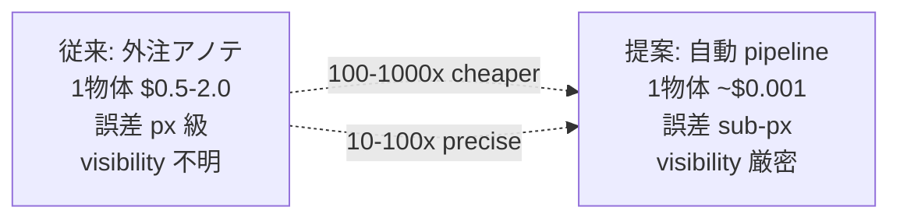

「論文として書ける単位」ではなく、**「外注より 100-1000 倍安く、10-100 倍精度高く作れる」** という **粗くて分かりやすい数字** が必要。これを実物で示すことが、組織として垂直統合を選び取る合意形成の唯一の手段になる。

## 5. 主要プレイヤーの戦略マップ (startup 視点で再評価)

「**今からスタートアップを作るなら誰を真似るか、誰を反面教師にするか**」の観点で並べる。

```mermaid
quadrantChart
    title "垂直統合 (X) × 開示度 (Y)"
    x-axis "外注依存高" --> "全層内製"
    y-axis "閉鎖" --> "オープン"
    quadrant-1 "オープン+統合"
    quadrant-2 "オープン+外注"
    quadrant-3 "閉鎖+外注"
    quadrant-4 "閉鎖+統合"
    Waymo: [0.85, 0.55]
    Tesla: [0.92, 0.30]
    BYD: [0.78, 0.20]
    華為 (Huawei): [0.80, 0.25]
    NVIDIA: [0.45, 0.70]
    WbT現状: [0.55, 0.50]
    WbT理想: [0.90, 0.50]
```

### 5.1 Waymo: 時間を買った垂直統合 (もはや moat ではない)

- 13 年累積 calib + 多 LiDAR + 5 cam + map で世界最高水準
- 公開 v2.0.1 でも per-segment 0.2° yaw 残るが業界水準で最も clean
- 累積赤字、技術蓄積を直接事業価値に変換する手段を持たない
- **教訓: 垂直統合だけでは儲からない、価値変換手段が必要**

#### 致命的に重要な再評価: 13 年の moat は AI で半年に圧縮できる

Waymo の優位の核は **「calib + 多センサー + map quality」だけ** だった。これは 13 年かけて人手と classical pipeline で磨いた成果。

しかし NN 系の **pixel residual learner / 多モダリティ統合モデル** の登場で、同等品質を **6 ヶ月レベルで再現できる時代** に入っている:

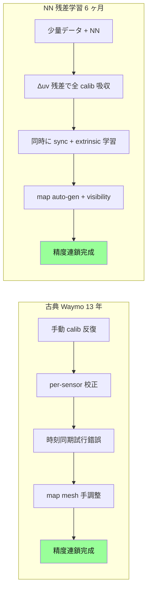

つまり Waymo の優位は **「先行投資の時間」だけ**であり、AI で時間軸が圧縮された今、**後発でも数ヶ月で同等品質に到達できる**。これが冷静な再評価。

WbT は「Waymo の 13 年を追いかける」のではなく、**「Waymo の 13 年を 6 ヶ月で再生産する」** が現実的目標になる。

### 5.2 Tesla: 販売 integrity の覇者

- カメラ only + Vision stack を「LiDAR 不要」narrative で売り切る
- 真の cm 精度には届かないが「届く」と消費者に信じさせ続ける販売技術
- 走行ログ収集量で圧倒的優位 (数百万台 × 数年)
- **教訓: 垂直統合の最も重要な層は「物語」のレイヤーかもしれない**

### 5.3 中華勢 (BYD, Huawei, Hesai, RoboSense)

- Hesai/RoboSense が VLS-128 相当を **$200-500 まで価格破壊** → Tesla の「カメラ only」narrative の技術的根拠が消滅
- BYD/Huawei は車 + センサー + AI + 地図 + クラウドを数年で内製化
- 政府支援 + ローカル EV 補助金 + 大量データで巨額の AD 投資が許容される
- **教訓: 垂直統合は時間ではなく「投資量と国内市場の大きさ」でも実現可能**

### 5.4 NVIDIA: 横断レイヤー販売

- Omniverse + DriveSim + GPU rental で「全 OEM に最終層を売る」
- 客は dataset を NVIDIA に預けて推論時間を借りる構造 → **calib 補正のためのモデル学習権限が客側に残らない**
- **教訓: 垂直統合を阻害するベンダー固定化のリスク。買ってはいけない層は何か?**

### 5.5 startup として誰を真似るか

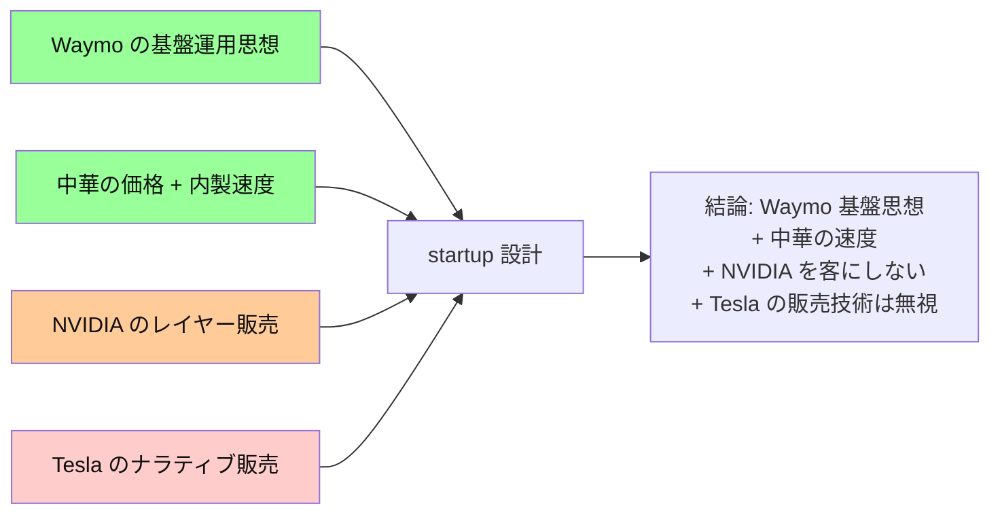

- **Waymo**: 基盤運用思想は真似る (calib + map + 自己位置の内製運用)、ただし 13 年もかけない (AI で 6 ヶ月)
- **中華**: 価格 + 内製速度の感覚を取り入れる、ただし国家戦略部分は真似不可
- **NVIDIA**: **顧客にしてはいけない**。彼らの製品を買えば基盤の学習権限を失う。GPU は買うが、Omniverse / DriveSim は触らない
- **Tesla**: ナラティブ販売は無視。**製品の事実だけで戦う**戦略を取る (= cm 精度 demo で勝つ)

### 5.6 「VLM / 世界モデルに張る」startup を反面教師に

近年 (2023-2026) 大量に登場してる **VLM 駆動 AD startup** (Wayve, Imagination, Helm.ai, Phantom AI など) の構造的問題:

- 大規模モデル → 大量データ前提 → データ生成コスト爆発 → calib + 地図軽視
- **「キャリブちゃんとしてないけどモデルが解いてくれる」幻想**でラウンドを回す
- 数年後に「データの品質が天井で精度伸びない」と気付くが手遅れ

→ startup として **反面教師にすべき**。VLM や世界モデルは「精度連鎖が整った上に乗せる差分品質」であって、それ単体で価値を出せる時代ではない (Tesla すらこれで苦戦中)。

## 6. 自社系譜: 失敗と蓄積を冷静に並べる

外資との比較だけでは決断は出ない。自社の歴史を**「何を学んだか」**で並べると見えてくるものがある。

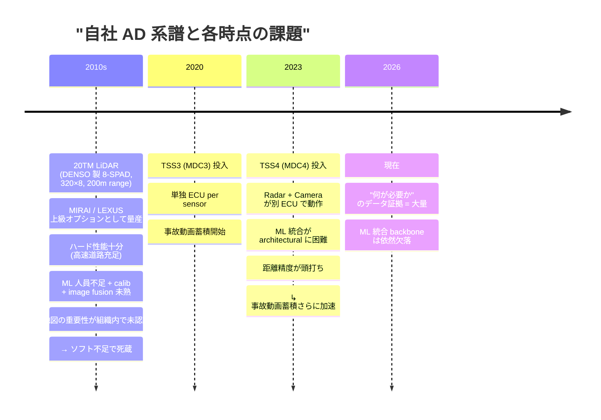

### 失敗分析: 何が無かったから商品化しなかったか

| 時期 | 投資した部分 | 欠けていた部分 | 結果 |
|---|---|---|---|
| 20TM LiDAR (DENSO 8-SPAD, 320×8, 200m, MIRAI/LEXUS 上級 OP) | ハード量産済 + 高速道路要件充足 | ML / calib / map / pipeline (= ソフト統合層) | ハード十分でもソフト無しで死蔵 |
| TSS3 | sensor + 単機能 perception | 多 sensor fusion + map | per-frame 単発精度のみ |
| TSS4 | sensor + ECU + 個別 ML | ECU 跨ぎ統合 + cm map | 距離精度頭打ち |

**共通の構造的欠落 = 「精度連鎖の上流から下流まで繋ぐ engineering backbone」**。これがあれば営団 LiDAR は地図化に転用できたし、TSS4 の事故動画は static box 教師に転用できた。

### 蓄積の存在を直視する

一方、組織内には **議論しなくても全員が認めている資産** が積まれている:
- **事故動画 (MDC3/MDC4)**: どのシナリオで AD が失敗するかの実証データ。Tesla や Waymo の比ではない、車載人間ドライバー視点の故障モード集。
- **TSS 開発で出てきた issue 集**: 真の need と問題点の証拠。「センサー数」「FOV 重複」「夜間性能」「フリーズ路面」など、机上では出てこない優先度の証拠。
- **量産経験**: 何百万台が走った後の現実問題。Waymo の Robotaxi 数百台、Tesla の数百万台と比べても、Toyota TSS 搭載車は**桁違いに多い**。

これらは**「需要、問題点、解くべき優先度」の証拠**として揃ってる。失敗は engineering 統合の欠落であって、データ・需要の欠落ではない。

→ **結論**: 「6 ヶ月で Waymo を再生産」の前提となる **「何を作ればいいか」のデータ** は既に内部に揃ってる。欠けてるのは backbone だけ。これがあれば営団 → TSS4 の 15 年の蓄積が初めて活きる。

## 7. 技術スタック比較

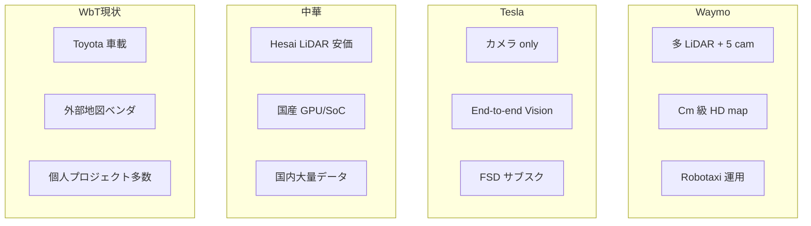

WbT の構造的弱点は **「個人プロジェクト多数」** が「部分内製」を支えてるところ。各個人の暗黙知でしか繋がってない層を、組織として明示化・量産化できないと、Waymo (時間)、Tesla (販売技術)、中華 (投資量) のどれにも追いつけない。

## 8. WbT (= startup として再設計) が取るべき差別化 path

### 8.0 起業視点でのコア仮説

> **「ロボティクスの精度基盤 (Calib + Pose + Map + Maintenance) を内製運用できる組織が、今後の AV / 自律ロボット / 自律物流 / インフラ点検の支配層になる」**

WbT が startup として再設計するときの差別化軸:
1. **基盤技術** を Waymo の 13 年に縛られず、AI で 6 ヶ月で再現
2. **VLM / 世界モデルに張らない**。それらは基盤の上に後付けする差分
3. **自動車に限定しない**。基盤を物流 / 建機 / ドローン / インフラ点検へ転用できる構造で設計
4. **HERE / TomTom が届かない cm 精度 + 連結運用 + アプリ層統合** で地図業界も同時に取りに行く

### 8.0.1 AD ≠ モデル学習。AD = データインテグリティのループ

```mermaid
graph LR
    classDef small fill:#fcc,color:#111
    classDef core fill:#9f9,stroke:#080,stroke-width:2px,color:#111

    A[ML 学習]:::small
    B[学習したモデルが<br/>データを補償する]:::core
    C[補償でデータ<br/>インテグリティが上がる]:::core
    D[静止 / 動的<br/>物体の分離]:::core
    E[Underlying な<br/>特徴量の獲得]:::core
    F[特徴量の<br/>正しさ評価]:::core

    A --> B
    B --> C
    C --> D
    C --> E
    E --> F
    F -.. 次の補償に戻る .-> B
```

**自動運転において、ML 学習自体が占める割合は非常に小さい**。学習は補完的な部品であって、本体は **「学習済みモデルがデータを補償することでインテグリティを高める仕組み」全体** である。

具体的には:
- **モデル → データ補償**: 学習したキャリブ補正 NN・動的補償 NN が、生データのズレを吸収して下流の入力品質を上げる
- **インテグリティ → 静止 / 動的物体分離**: 補償されたデータの上で、動かない構造 (建物 / 標識 / 路面) と動く実体 (車 / 歩行者) を **物理的に正しく** 分離できる
- **分離 → Underlying な特徴量獲得**: シーンの不変構造 (= 静止物体) と変化構造 (= 動的物体軌跡) という **AD の本質特徴量** を取り出す
- **特徴量 → 正誤評価メカニズム**: 取り出した特徴量が物理的に妥当か (例: 静止物が時間方向に動いてない / 動的軌跡が運動方程式に従う) を自動で測る

論文・OSS が見せるのは A (= ML 学習) だけだが、AD として価値を出す仕組みは B-F の **データインテグリティのループ全体**。「モデルさえ学習すれば AD」「VLM スケールで AD」と思ってる組織は、本質を取り違えている。

ループ全体を回せる仕組みを持った組織だけが、データから自動で価値を生成し続けられる。これが「**精度連鎖の垂直統合**」の物理的内容。

### 8.1 戦略思想: 「精度の垂直統合」

技術スタックを **calib + pose + 地図 + 検出 = 1 つの精度連鎖** として扱う。各層を分離して別チームが請け負う組織構造は、結果として cm 精度を維持できない。

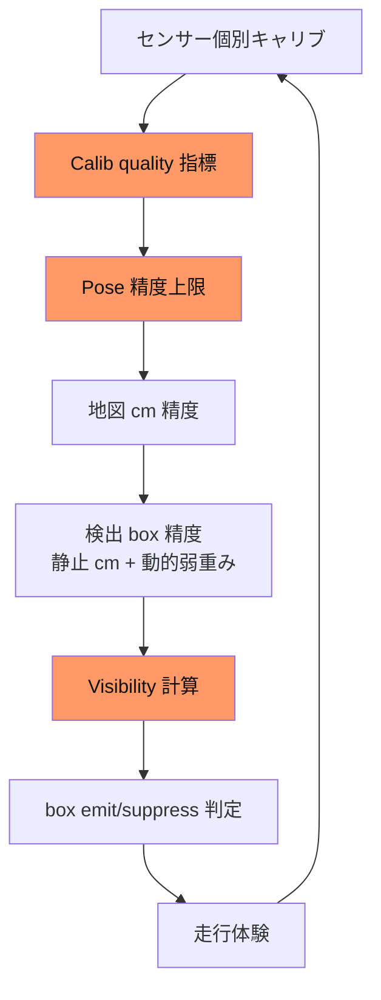

橙色は「**今、業界全体で未解決のレイヤー**」。ここを最初に押さえれば、Tesla/Waymo/中華に対する 1-2 年の独自性が出る。

### 8.2 競合との真の差別化軸

| 軸 | Waymo | Tesla | 中華 | WbT が取るべき道 |
|---|---|---|---|---|
| データ量 | 中 | 圧倒的 | 大 | **量で勝つのは無理**。質で勝つ |
| センサー | 高品質多種 | カメラ only | 価格破壊 | **既存トヨタ車載 + 内製 LiDAR 統合** |
| 地図精度 | cm 級 | なし (E2E) | dm 級 | **cm 精度地図を高速生成** で差別化 |
| アノテ | 内製 | 内製 | 半外注 | **静止 box 完璧 + 動的弱重み** の二層化 |
| ベンダー固定 | 自社 | 自社 | 自国 | **NVIDIA/外部 SaaS 依存を最小化** |
| Story | 控えめ | 圧倒的 | 国家戦略 | **Toyota ブランドで日本的 integrity 戦略** |

### 8.3 短期 3 ヶ月の出発点

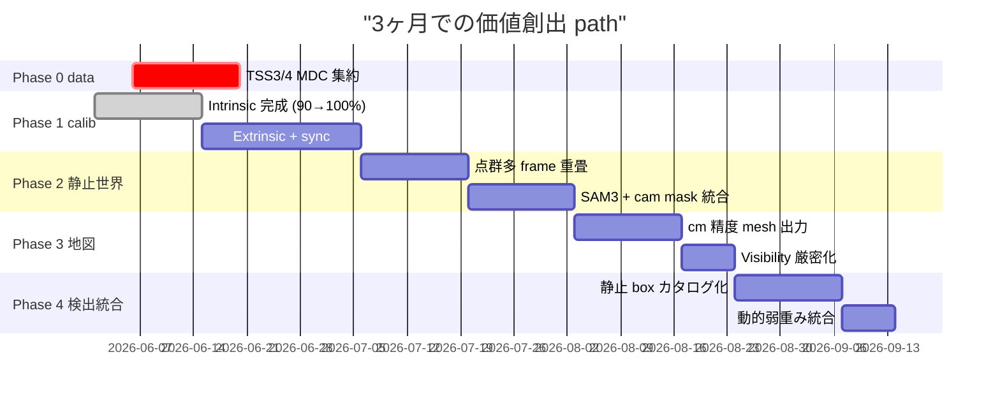

### 8.3.1 Phase 0: TSS3 / TSS4 MDC データ集約 (critical path)

**今すぐ着手する単一の最重要 action item**。

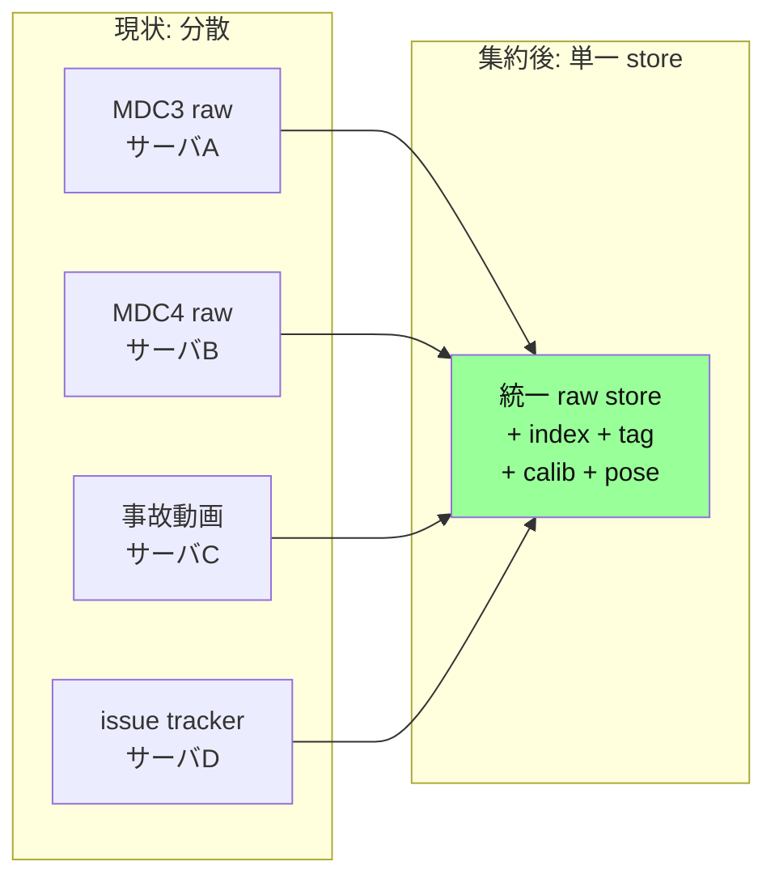

**なぜこれが最初か**:
1. 「MDC データに何が入ってるか」 が組織として把握されていない = 探索コストが各エンジニアごとに発生
2. 集約しない限り Phase 1-4 の各処理が **「どこから取ってくるか」 で詰まる**
3. 集約 = 単に物理的に移すだけでなく、**(scene, frame, cam_id, sensor_meta, calib version, ego_pose, issue_tag)** の **canonical index** を貼ること
4. これがあれば 1 人が走らせる NN pipeline が、組織として「あの故障シナリオで再学習」のような **task 単位の query** を発行できるようになる

**Phase 0 が完成しない限り Phase 1 以降の outputs は使い物にならない**。これを 2 週間で完了することが垂直統合の物理的前提。

**3 ヶ月の作業 = 「精度連鎖の上流 3 層を 1 人で実装」**。完成すれば業界初の「**cm 精度自動地図 + 静止 box 自動取得 + 動的弱重み**」を実現する。

### 8.4 物体カテゴリ別の mesh 化戦略

カテゴリ別に処理コストを分けて、無駄に GS まで重い手段を取らない。

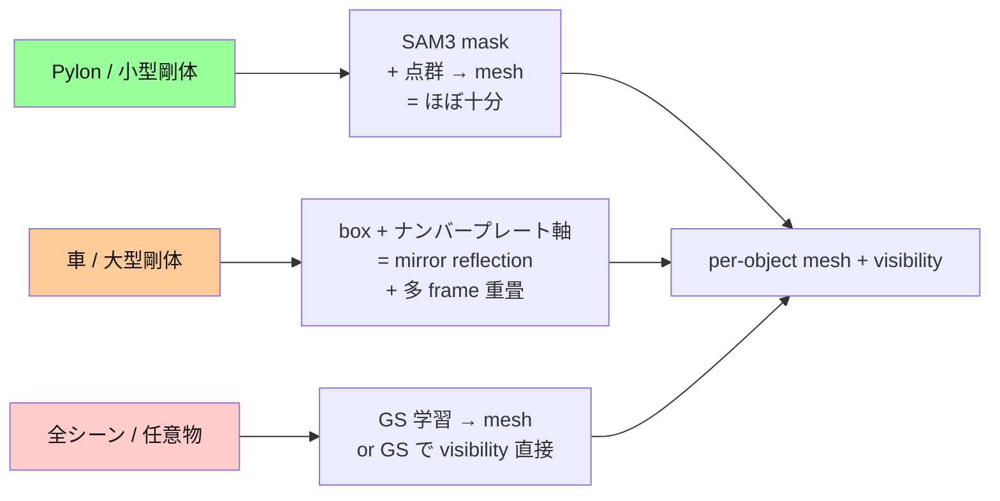

| カテゴリ | コスト | 必要処理 |
|---|---|---|
| pylon / 小型剛体 (信号、サイン、ポール) | **低** | SAM3 mask + 点群整合だけで十分。遠近感シビアじゃない |
| 車 / 大型剛体 | **中** | box 6 DoF + ナンバープレート対称軸 + mirror 補完 + 多 frame 重畳 |
| 任意シーン (建物、樹木、地表) | **高** | GS 学習 → 内部に "綺麗な点群表現" + marching cubes mesh |

そして本質: **mesh が必要ない用途 (visibility / occlusion 判定) なら GS 表現のままで十分**。GS が completed surface 表現を持ってるので、cam ray 撃って occlusion 計算するだけ。完全 mesh 化は **annotation 教師 / 量産 asset / シミュ用** の時のみ。

→ Pipeline 設計の含意: **「GS を visibility engine として使う」** が垂直統合の隠れた要諦。

### 8.4.1 なぜ visibility が「学習データの core」か

visibility が必要な根本理由は **「学習データとして与えるかどうかの判定」** であって、可視部分があれば教師として有効、無ければ teach すると model が間違いを学ぶ。

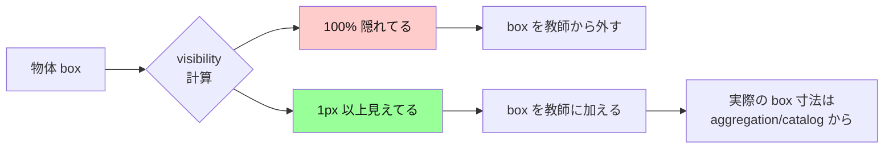

具体例:
- pylon が完全に車に隠れてる frame で「box 教師あり」とすると → model は「見えなくても pylon を予測しろ」を学ぶ → 過剰検出
- 同 pylon が次 frame で 50 px だけ見えてる → 教師ありに切り替え → model は「見えてる部分から箱を予測しろ」を学ぶ → 正しい学習

つまり **box の有無自体じゃなく「教師として使うか」が visibility 関数** で決まる。これは既存 dataset の box label が一律 (見えてようが隠れてようが label 付ける) で、production-grade model にとって noise になっている根本原因。

### 8.4.2 visibility 閾値の自動化

visibility = `visible_px / projected_box_px` を per-frame で計算 → 閾値 (例: > 5%) で emit/suppress。

これが**「外注の visibility 判定が単発 LiDAR で曖昧」問題への解答**。GS の dense surface + occlusion 計算で px 単位の visibility が自動で出る → 教師付与判定が物理量で決まる → annotation quality が桁違いに上がる。

### 8.4.3 4D GS で「隠れた物体」も完全把握

3D GS は単 frame の occlusion しか扱えないが、**4D GS (時間軸付き Gaussian Splatting)** なら時間を跨いだ visibility 集約ができる。これが本当の差別化。

例: トラックの荷台の隙間から少しずつ見えてる向こう側の車
- 単 frame: トラックでほぼ完全に隠れてる → 単発判定では「教師から外す」
- 多 frame (4D GS): トラックの動きで隙間からの可視 px が時間積分で 100 px 以上 → 物体存在 + 概形 + 位置が確定 → **教師に加える**
- 結果: model は「**隙間から見えてる物体も予測できる**」を学ぶ → 遠距離 + 部分可視物体の検出率が桁違い

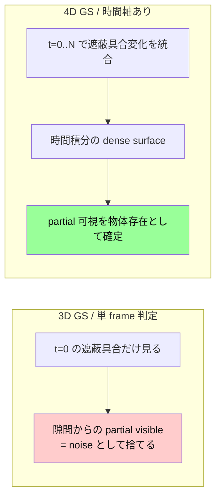

業界の遠距離検出 (small-px object) が死ぬのも、視点が動的物体 (前車) で頻繁に遮断される long-tail シナリオで「**部分可視物体を学習に入れるか」判定** ができないから。4D GS で時間軸を入れれば、これも自動で解ける。

→ **4D GS = visibility engine + temporal aggregation** が垂直統合 pipeline の中で **annotation quality の天井を上げる最重要 component**。これがあるとないとで、annotation 品質が production grade か外注品質かに分かれる。

### 8.4.4 GS = 最強の SLAM + pixel 表現

GS の本質は単なる「綺麗な rendering 手段」ではなく:
- **SLAM の出力 (pose / map)** を持つ
- **pixel level の dense surface 表現** を持つ
- **時間軸 (4D) を入れれば dynamic も含む全シーン記述子** になる
- **可微分** = 下流の loss から逆伝播できる

これは事実上 **「SLAM + 高密度 pixel 表現」を統一した最強のフォーマット**。SfM / NeRF / 古典 voxel map / TSDF などの過去フォーマットを全部置き換える可能性を持つ。

### 8.4.5 段階的な GS 拡張 path

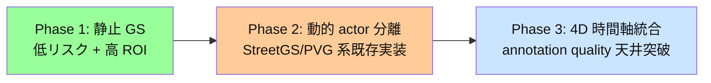

#### Phase 1: 静止 GS から始める (今やる)
- LiDAR + multi-cam で静止世界を綺麗に GS 化
- バリ取れた dense surface = visibility engine の基盤
- 既に PS001/PS002 で動かしてる範囲

#### Phase 2: 動的物体を GS に取り込む (3-6 ヶ月後)
- **StreetGaussians**, **PVG (Periodic Vibration Gaussian)**, **OmniRe**, **SplatAD** 等が静止+動的分離済の参照実装を提供
- 動的物体は per-actor の GS track として持つ (box track と同期)
- これでフル scene の 4D 表現が成立

#### Phase 3: 4D temporal aggregation
- 時間軸を入れた完全な scene 記述子
- 隠れた物体の partial visibility 累積 = 遠距離検出の天井突破
- annotation pipeline の終着点

**重要な構造**: Phase 1 の静止 GS をしっかりやれば、Phase 2-3 は既存研究の組合せでスムーズに到達できる。**今やってる calib + 静止 GS の作業は、4D 全シーン記述子という最終形態への 1 段目** で、迷う余地はない方向性。

### 8.5 製品ラインナップ: 低価格 vs 高付加価値の二極化

「全車種同じ AD ハード」は誤り。同一ソフト backbone を基盤に、**ハード構成で価格・性能 を二極化する**:

```
低価格ライン (= マス層、年 数百万台規模):
  ハード: カメラ + radar のみ (LiDAR 無し)
  ソフト: 静止 GS 地図 + 動的物体推定 + 自社 cnd2 calib
  目標性能: TSS5 相当 + 都市道
  価格目標: BYD/Tesla model Y と同等、または下回る
  ↑ ここをカメラ+radar だけで成立させる事が「中華勢に潰されない」唯一の道
  ↑ 高品質 GS 地図がカメラだけの低解像情報を補完 (= 地図 prior)

高付加価値ライン (= プレミアム、フラッグシップ):
  ハード: 20TM 後継 LiDAR (DENSO 系) + マルチカメラ + radar
  ソフト: 同じ backbone + LiDAR fusion 拡張
  目標性能: highway 完全自動 + 都市道 robotaxi 級
  価格目標: LEXUS LM クラス、~2000 万円
  ↑ Waymo / Mercedes Drive Pilot と直接競合する層
  ↑ ここで「LiDAR + 自社地図」の差別化が決定打になる
```

**戦略的含意**:

- ソフト backbone は **1 つ**、ハード構成で性能/価格を分ける
  → 開発リソースを 2 倍に割らない (= 同じ pipeline で全車種カバー)
- LiDAR 搭載車 = **データ収集機 + フィードバック源** も兼ねる
  → 高付加価値 ↑ で取った高精度データが 低価格ライン 学習データに循環
  → "車を売る = データを取得する" の閉ループが Tesla 越え品質で動く
- カメラ + radar だけで成立させる為に **地図 prior が決定的**
  → 高 GS 地図 (= 高付加価値ライン搭載車が収集) を低価格ライン車に配布
  → 「LiDAR 無いから精度落ちる」を「地図補完」で打ち消す
  → これが垂直統合プレイヤーだけが取れる戦略 (= 単品売りでは成立しない)

**過去の失敗パターンとの対比**:

```
TSS3/4 = 全車種で同じ妥協 (= radar+camera のみ、地図無し)
  → "全車に乗るが、どの車でも highway しか動かない"
  → 性能差別化ない、価格競争に巻き込まれる

20TM LiDAR = 高級車 オプションだけ
  → ソフト backbone なく死蔵
  → "LiDAR 載せたが TSS3/4 と同じ機能"

我々の path = 同じソフト + ハードで階層化
  → 低価格層は地図 prior、高付加価値層は LiDAR + 自社地図
  → 性能と価格 両方で差別化、ソフト開発は一本化
```

= **「LiDAR か / radar か」の二者択一じゃなく、「両方をソフト統合した上でハードで階層化」が答え**。WbT は MIRAI / LEXUS の 20TM 量産経験 + TSS の大量データ + 全車種カバーの量産網、全部既に持ってる。Backbone (= 地図 + cnd2 + GS pipeline) さえあれば即実現可能。

## 9. 統合可能スケールが激変した

垂直統合という戦略選択が、過去 5 年で **「数千人で初めて成立」から「1-5 人で十分」へ** 圧縮された。これが今動くべき本当の理由。

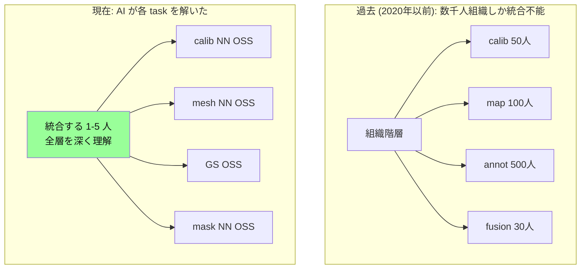

### 何が変わったか

- **過去**: calib 50 人 / 地図 100 人 / annot 500 人 / sensor fusion 30 人 / map 60 人 の協調が必要 → 統合可能な組織は Waymo / Tesla / 中華の数社のみ
- **現在**: 各 task (calib NN / mesh NN / GS / mask) は **OSS + 数行コード + 1 GPU** で動く → 統合する人間が「**全層を一通り深く理解できる 1-5 人**」あれば十分

### Waymo の moat の実態

Waymo の 13 年 moat は「累積技術」ではなく、**「全層 understanding が組織内に蓄積した暗黙知」**。だがその暗黙知も今や **1-5 人の頭の中にあれば再現可能** な規模に圧縮された。

**「統合する人間がいるかどうか」が会社の競争力を決める時代** に入った。これが「Waymo の 13 年を 6 ヶ月で再生産」の物理的根拠であり、本論文の事実上の中心命題。

### 歴史的アンカー: Otto (2016) は現代 AI 無しで $680M 評価された

**公開記録の事実**:
- Anthony Levandowski (Waymo 出身) が **2016 年 5 月** に Otto を Lior Ron (Google Maps 出身) / Don Burnette / Claire Delaunay と設立
- **2016 年 8 月** に Uber が **約 $680M (Uber 株 1% 相当 + 現金)** で買収
- 設立から買収まで **わずか 3-4 ヶ月**
- 買収時 Otto 従業員 ~91 人、ただし **コア技術判断はコア 4-5 人** に集中
- 訴訟記録 (Waymo v. Uber 2017-2018) で Waymo が窃取主張した内容 = **LiDAR 設計図 + calib spec 14000 ファイル** → 価値の置き所が「ハード + calib」だったことの間接証拠
- Burnette / Ron は Google Maps + Waymo マッピング出身 → **チーム構成自体が map-making 暗黙知の証拠**

#### 何が "AI" だったか

2016 年時点の状況:
- **CNN perception は既に普通** (NVIDIA PilotNet 2016 April、Mobileye SoC 既に量産、Tesla Autopilot v1 出荷)
- ただし **Transformer / VLM / GS / Diffusion / E2E driving モデルは存在しない**
- SLAM は古典 (LOAM, Cartographer, ORB-SLAM2)
- Calib は **静的ボード + 手作業 BA**、NN-based calib は研究段階

つまり「AI 無し」ではなく、**「現代 (2026) AI 無し」**。当時できたのは静的 CNN perception + 古典 SLAM + 手作業 calib のみ。

| 層 | Otto 2016 | 評価された価値 |
|---|---|---|
| 駆動 / 操舵 | トラック既製 | 価値ゼロ (OEM 標準) |
| Planning | 古典 PID + lattice planner クラス (詳細非公開) | 評価対象外 (当時 SOTA = 古典) |
| Perception | 既存 CNN + LiDAR clustering | 当時の標準実装 |
| **Calib pipeline** | **手作業 + Waymo 流の calib 経験** | **★ 買われた本体** |
| **HD map 製造** | **多 LiDAR 重畳 + 手調整 mesh** | **★ 買われた本体** |
| **Localization** | **GPS + 多 LiDAR map matching** | **★ 買われた本体** |
| Transformer / GS / VLM | **存在しない (2016 はまだ無い)** | 価値ゼロ (そもそも無い) |

つまり Uber が $680M 払ったのは **「精度連鎖 (Calib + Pose + Map) を整備する暗黙知」のみ**。現代 AI 道具を使わずに、3-4 ヶ月 + 90 人で $680M 評価に到達した precedent。

#### 重要: Otto は sub-pixel 精度に到達していない

**2016 年の cam-LiDAR calib 実態**:

| 項目 | Otto 時代 (2016) | WbT 現在 (2026) |
|---|---|---|
| Calib 手法 | チェッカーボード + 手動 ICP + 手動 BA | NN residual learner (Δuv 直接学習) |
| 達成精度 (cam-LiDAR 投影) | **1-3 px** (良い時)、現場 5-10 px | **sub-pixel (≤ 0.5 px)** が射程 |
| 動的補償 (RS + sync) | ほぼ無視 (中央時刻で代表) | per-pixel velocity + 学習 sync 補正 |
| Map 製造の精度 | dm 級 (10-20 cm) | **cm 級 (1 cm 以内)** |
| Visibility 判定 | 単 frame ray-cast | **4D GS temporal aggregation** |

**つまり Otto は不完全な精度連鎖 (pixel 級)** で $680M に到達した。WbT が狙ってるのは **sub-pixel + 動的補償 + 4D visibility**、これは **categorically 1 段上のレイヤー**。

Sub-pixel cam-LiDAR が実用に乗ったのは ~2020 以降:
- CalibNet (2018, ICRA) = NN residual learning の始祖、研究段階
- LCCNet (2020), RegNet, NeuralCalib などで sub-pixel が出始める
- GS / NeRF-based calib refinement = 2023+ (Bundle-Adjusted GS など)
- per-pixel RS + sync を NN で吸う = 2024+ (本リポでやってる cnd2 系)

#### 命題のさらなる強化

| 比較軸 | Otto 2016 | WbT 2026 |
|---|---|---|
| 期間 | 3-4 ヶ月 | 6 ヶ月 |
| 人員 | ~90 人組織、コア 4-5 人 | コア 1-5 人 |
| 精度 | **pixel 級 calib** | **sub-pixel calib + 動的補償** |
| Map 精度 | **dm 級** | **cm 級 + 4D 時系列** |
| Annotation 自動化 | 無し (人手) | **visibility engine による自動 emit/suppress** |
| AI 道具 | 古典 + 初期 CNN | Transformer + GS + 残差 NN |
| 評価額 | $680M | (達成すれば桁違いに上、参照: HERE 2015 買収 $3B / TomTom 時価 ~ €1.5B) |

「Otto が pixel 級でできたことを、WbT は **sub-pixel + cm 級 map + 自動 annotation** でやる」 = 命題は強化される方向であり、弱まる方向は存在しない。

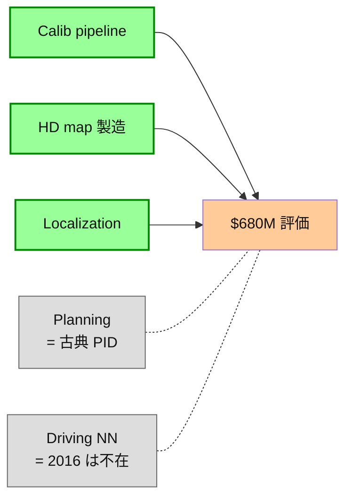

#### 2026 年の意味

2016 年に **AI 無しで** 1 人 + 数十人で 8 ヶ月で出せたものが $680M。
2026 年は **GS + 残差 NN + auto-calib NN + 多モダリティ統合モデル** が揃ってる:

- Calib pipeline → **NN で Δuv 残差として学習**、手作業 calib の暗黙知を学習データで置き換え
- HD map 製造 → **GS + 4D temporal aggregation** で 1 シーン数十分で cm 精度 map
- Localization → **学習済み GS map に対する画像照合** で IMU 補助なしでも cm 級

つまり Otto 2016 が要した **「人 + 時間 + 暗黙知」を、2026 年の AI 道具で 1-3 人 × 数ヶ月** で再現できる。Otto の歴史的 precedent は本論文の中心命題の **存在証明** であり、AI が無かった時代の足元で既に「**1 人 + 古典 pipeline + 8 ヶ月**」で $680M 評価が成立していたことを思い出すべき。

これに反論する組織は「AI が来る前にできてたことを、AI が来た後にできない」と主張していることになり、技術的に成立しない。

### WbT の実装条件

- 統合 1-5 人 = 全層 (calib / pose / GS / mesh / catalog / annotation pipeline / クラウドインフラ / data ops) を深く理解している人材
- 1 人で動ける環境 = OSS + 1 GPU + 自由なコード変更権限 + データアクセス権

これらを揃えれば 6 ヶ月で完成する。揃わなければ、Waymo / Tesla / 中華に永遠に追いつかない。

## 10. 必要な組織変更

### 10.1 「個人プロジェクト」を「組織機能」に格上げ

現状: calib 改善 / ZMQ distributed dataloader / クラウド training / アノテパイプライン = すべて個人タスク。

変革: これらを **「精度連鎖を支える基盤エンジニアリング」** として組織機能化。専任 4-6 名の小チームに移管 (現状 ~10 名外注/重複している作業を集約する)。

### 10.2 ベンダー固定の見直し

NVIDIA Omniverse / 外部地図ベンダ依存を外す決断。代わりに:
- **内製シミュレーション** (CARLA 系既存 + 自社走行ログ shift)
- **内製地図** = cm 精度自動生成パイプラインで内部閉ループ

### 10.3 成功条件 = 「作れた地図」だけで判定する

人事評価 / プレゼン / 論文本数 はすべて noise。判定軸は **物として残った地図の質** だけ:

```mermaid
graph LR
    classDef artifact fill:#9f9,stroke:#080,stroke-width:2px,color:#111
    classDef gate fill:#fc9,color:#111
    A[Calib 完成<br/>残差 ≤ 1 px]:::gate
    B[Cam-LiDAR 動的補償<br/>RS + sync<br/>残差 ≤ 1 px]:::gate
    A --> C[1 cm 以内で<br/>くっきり見える GS 地図<br/>= 物理的 artifact]:::artifact
    B --> C
    C --> D[300 m 走行で<br/>センサ間齟齬ゼロの地図]:::artifact
    D --> E[累積 km² / シーン数<br/>= 唯一の KPI]:::artifact
```

#### 唯一の成功指標

| 指標 | 定義 | なぜこれだけで十分か |
|---|---|---|
| **1 cm GS map area** | GS rendering で sub-pixel に建物 edge / 看板文字が読める領域の累積 km² | これが作れる = calib + 静的 sync + 点群整合がすべて成立してる証拠 |
| **300 m baseline coherence** | 同一シーン 300 m 走行間で、cam 像 / LiDAR 点群 / GS surface が ≤ 1 px / ≤ 3 cm でズレない地図数 | これが作れる = 動的補償 (RS + cam-LiDAR sync + ego motion) がすべて成立してる証拠 |

**これらの artifact が出れば、それ以外の評価はすべて不要**。

#### なぜ「キャリブ + 動的補償だけで解ける」か

```mermaid
graph LR
    classDef solved fill:#9f9,color:#111
    classDef hard fill:#fcc,color:#111
    A[Calib<br/>= 静的歪み除去]:::solved
    B[Cam-LiDAR 動的補償<br/>= 時間ズレ除去]:::solved
    A --> Z[1 cm GS 地図<br/>+ 300 m coherence]:::solved
    B --> Z

    X[動的物体検出]:::hard -.必要ない.-> Z
    Y[VLM / 世界モデル]:::hard -.必要ない.-> Z
    W[end-to-end driving]:::hard -.必要ない.-> Z
```

業界は「VLM が解く」「end-to-end が解く」と難しく見せてるが、本質は **静的地図問題** であって:
- センサ歪みを静的にゼロにする (calib)
- 時間方向の sensor 間ズレをゼロにする (動的補償)

の 2 つさえ成立すれば、点群が GS で 1 cm 以内に収束する。これは数学的にほぼ自明な問題で、業界がここに集中してないのは「**派手じゃないから**」だけ。WbT が 6 ヶ月で取りに行くのは、まさにこの「地味だが本質的な 2 層」。

### 10.4 アノテーション外注 = AD 開発の放棄

```mermaid
graph TD
    classDef root fill:#fc9,stroke:#c80,stroke-width:2px,color:#111
    classDef derived fill:#cce5ff,color:#111
    classDef out fill:#fcc,color:#111

    R1[Pose 精度]:::root
    R2[Sensor calib]:::root
    D1[静止物体アノテ<br/>= 多 frame 重畳の幾何]:::derived
    D2[動的物体アノテ<br/>= track + pose 補正]:::derived
    D3[Visibility 判定]:::derived
    D4[Occlusion / 重なり]:::derived

    R1 --> D1
    R1 --> D2
    R2 --> D1
    R2 --> D2
    R1 --> D3
    R2 --> D3
    D1 --> D4
    D2 --> D4

    OUT[外注に出す部分]:::out -.-> D1
    OUT -.-> D2
    OUT -.-> D3
    OUT -.-> D4

    style OUT stroke-dasharray: 5 5
```

**静止物体アノテも動的物体アノテも、その品質は本質的に pose + calib が握っている**。box の頂点 6 個を人が clicker でクリックしてる動作は、pose / calib が壊れてる限り、どれだけ熟練しても sub-pixel 精度は出ない。逆に pose / calib が完全なら、box 寸法は **多 frame 重畳の幾何で自動決定** する (= 人がクリックする必要が無い)。

つまり、**「アノテーション外注」という構造そのものが、AD 技術開発の本丸を外側に明け渡す行為**。発注側に残るのは:
- 外注会社が納品した box label の品質チェック
- 納品形式のスキーマ管理
- 価格交渉

これは **アノテ会社の顧客** という業態であって、**AD 技術開発** ではない。Waymo / Tesla / 中華が外注を使わない (使ってもごく一部) のは正にこの構造を理解してるから。

#### 帰結

- アノテパイプラインを内製しない時点で、その会社は「AD を作っている」と主張できない
- アノテパイプラインを内製する = calib + pose 精度連鎖を握る = **本論文 Section 8 で語る垂直統合そのもの**
- すなわち、アノテーション内製化は組織判断ではなく、**AD 事業として存続するための物理的前提条件**

これを外部委託することと、「AD 技術開発をしてる会社です」と名乗ることは両立しない。

## 11. 結論

WbT は時間 (Waymo) でも投資量 (中華) でも販売技術 (Tesla) でも勝てない。残る戦場は **精度連鎖の橙色レイヤーの実装速度** 。1 人で実装可能なレベルまで技術を圧縮できた稀有な人材を中心に、**「日本的精度 integrity の垂直統合」** を 1-2 年で構築できるかが今後の競争力を決める。

そしてそれは **論文・SaaS・外注では絶対に手に入らない**。**作って見せる以外に道はない**。コストと精度の数字で外注を圧倒する demo を示せた瞬間に、業界内・社内の論理は反転する。

これは「会社を辞めるか残るか」ではなく、**「会社を価値の連鎖を提供できる存在にできるか」** という問題である。
